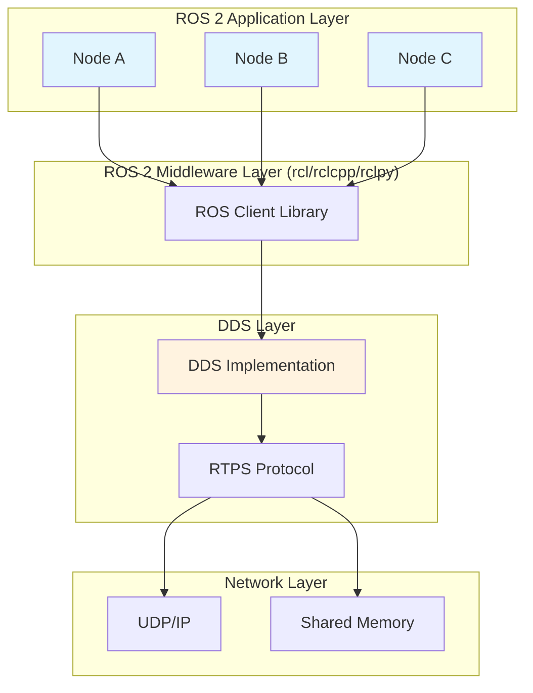
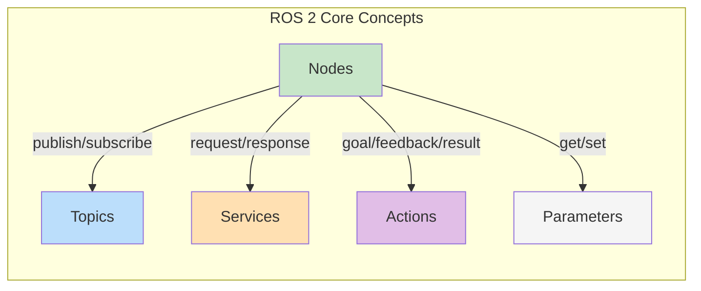
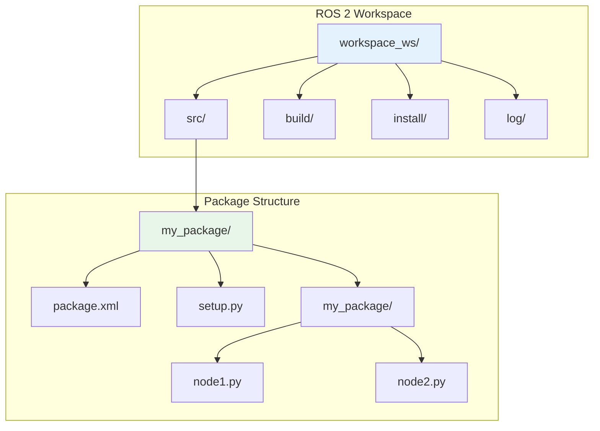

# Chapter 1: Introduction to ROS 2 - The Robot Operating System

**Week 3 of 13 | Estimated Time: 4-6 hours**

Welcome to the world of ROS 2! In this chapter, you will learn the fundamentals of the Robot Operating System 2 (ROS 2), the middleware that powers modern robots from industrial arms to humanoid assistants.

## Learning Objectives

By the end of this chapter, you will be able to:

1. **Explain** what ROS 2 is and why it matters for robotics development
2. **Describe** the ROS 2 architecture including nodes, topics, services, and actions
3. **Install** ROS 2 Jazzy on Ubuntu 22.04 or via WSL2 on Windows
4. **Create** and build a ROS 2 workspace using colcon
5. **Use** basic ROS 2 command-line tools for introspection and debugging

---

## 1. What is ROS 2?

### The Robot Operating System

Despite its name, ROS 2 is not actually an operating system. Instead, it is a **robotics middleware** - a collection of software libraries and tools that help you build robot applications. Think of it as a framework that provides:

- **Communication infrastructure** between different parts of your robot
- **Hardware abstraction** so your code works across different robots
- **Developer tools** for visualization, debugging, and simulation
- **A rich ecosystem** of reusable packages and community support

### Why ROS 2 Matters for Humanoid Robotics

Humanoid robots are among the most complex robotic systems, requiring coordination of:

- Multiple sensors (cameras, LiDARs, IMUs, force/torque sensors)
- Many actuators (30+ degrees of freedom in a typical humanoid)
- High-level reasoning and planning
- Real-time control and safety systems

ROS 2 provides the "nervous system" that connects all these components, allowing them to communicate reliably and efficiently.

### Evolution from ROS 1 to ROS 2

ROS 1 was created in 2007 at Willow Garage and became the de facto standard for robotics research. However, it had limitations:

| Limitation in ROS 1 | Solution in ROS 2 |
|---------------------|-------------------|
| Single-master architecture | Distributed, peer-to-peer communication |
| No real-time support | Real-time capable with DDS middleware |
| Limited security | Built-in authentication and encryption |
| Linux-only | Cross-platform (Linux, Windows, macOS) |
| Research-focused | Production-ready with quality tiers |

ROS 2 was built from the ground up to address these limitations while maintaining the core concepts that made ROS 1 successful.

### DDS: The Communication Backbone

ROS 2 uses the **Data Distribution Service (DDS)** as its underlying communication middleware. DDS is an industry standard used in aerospace, defense, and financial systems where reliability is critical.



**Figure 1.1**: ROS 2 Architecture showing the layered communication stack

Key benefits of DDS for robotics:

- **Quality of Service (QoS)**: Control reliability, latency, and resource usage
- **Discovery**: Nodes automatically find each other without central coordination
- **Scalability**: Supports systems from single robots to large fleets

---

## 2. ROS 2 Architecture Overview

### Core Concepts

ROS 2 applications are built from these fundamental building blocks:



**Figure 1.2**: ROS 2 Core Concepts and their relationships

#### Nodes

A **node** is an executable that performs a specific task. In a humanoid robot, you might have:

- A `camera_driver` node that reads images from cameras
- A `perception` node that detects objects in images
- A `planner` node that decides what actions to take
- A `motor_controller` node that sends commands to joints

Nodes are designed to be modular and reusable. Good ROS 2 design follows the principle: "Do one thing and do it well."

#### Topics

**Topics** provide publish-subscribe communication. A node can:

- **Publish** messages to a topic (broadcast data)
- **Subscribe** to a topic (receive data)

Multiple publishers and subscribers can share a topic. This is ideal for streaming data like sensor readings.

```
Camera Node --[/camera/image]--> Perception Node
                              --> Recording Node
                              --> Display Node
```

#### Services

**Services** provide request-response communication. A client sends a request and waits for a response. This is ideal for:

- Triggering actions ("start recording", "calibrate sensor")
- Querying state ("get robot pose", "check battery level")

#### Actions

**Actions** are for long-running tasks that need feedback. They provide:

- **Goal**: What to achieve ("navigate to point A")
- **Feedback**: Progress updates ("50% complete, 3 meters to go")
- **Result**: Final outcome ("reached goal" or "failed - obstacle")
- **Cancellation**: Ability to abort mid-execution

Actions are essential for humanoid behaviors like walking to a location or picking up an object.

#### Parameters

**Parameters** are configuration values that can be changed at runtime:

- Camera resolution
- Control gains
- Safety thresholds

### Workspace and Package Structure

ROS 2 code is organized into:



**Figure 1.3**: ROS 2 Workspace and Package Structure

- **Workspace**: Contains all your packages and build artifacts
- **Package**: A collection of related nodes, messages, and resources
- **`package.xml`**: Package metadata and dependencies
- **`setup.py`**: Python package configuration (for Python packages)

---

## 3. Installation Guide

### Option A: Ubuntu 22.04 Native Installation (Recommended)

This is the recommended installation method for the best performance and compatibility.

#### Step 1: Set Up Locale

```bash
# Ensure UTF-8 locale is configured
sudo apt update && sudo apt install locales
sudo locale-gen en_US en_US.UTF-8
sudo update-locale LC_ALL=en_US.UTF-8 LANG=en_US.UTF-8
export LANG=en_US.UTF-8
```

#### Step 2: Enable Required Repositories

```bash
# Enable universe repository
sudo apt install software-properties-common
sudo add-apt-repository universe

# Add ROS 2 GPG key
sudo apt update && sudo apt install curl -y
sudo curl -sSL https://raw.githubusercontent.com/ros/rosdistro/master/ros.key -o /usr/share/keyrings/ros-archive-keyring.gpg

# Add ROS 2 repository
echo "deb [arch=$(dpkg --print-architecture) signed-by=/usr/share/keyrings/ros-archive-keyring.gpg] http://packages.ros.org/ros2/ubuntu $(. /etc/os-release && echo $UBUNTU_CODENAME) main" | sudo tee /etc/apt/sources.list.d/ros2.list > /dev/null
```

#### Step 3: Install ROS 2 Jazzy

```bash
# Update package index
sudo apt update

# Install ROS 2 Jazzy Desktop (includes RViz, demos, tutorials)
sudo apt install ros-jazzy-desktop

# Install development tools
sudo apt install ros-dev-tools
```

#### Step 4: Set Up Environment

Add the following to your `~/.bashrc`:

```bash
# Source ROS 2 Jazzy
source /opt/ros/jazzy/setup.bash

# Optional: Set default ROS domain (for multi-machine setups)
export ROS_DOMAIN_ID=0
```

Apply the changes:

```bash
source ~/.bashrc
```

#### Step 5: Verify Installation

```bash
# Check ROS 2 version
ros2 --version
```

**Expected Output:**
```
ros2 0.32.x
```

```bash
# Run the demo talker-listener
# Terminal 1:
ros2 run demo_nodes_cpp talker

# Terminal 2:
ros2 run demo_nodes_cpp listener
```

**Expected Output (Talker):**
```
[INFO] [talker]: Publishing: 'Hello World: 1'
[INFO] [talker]: Publishing: 'Hello World: 2'
...
```

**Expected Output (Listener):**
```
[INFO] [listener]: I heard: [Hello World: 1]
[INFO] [listener]: I heard: [Hello World: 2]
...
```

### Option B: WSL2 Installation (Windows Users)

Windows Subsystem for Linux 2 (WSL2) allows you to run ROS 2 on Windows with near-native Linux performance.

#### Prerequisites

- Windows 10 version 2004 or higher (Build 19041+)
- Windows 11

#### Step 1: Install WSL2

Open PowerShell as Administrator:

```powershell
# Install WSL with Ubuntu 22.04
wsl --install -d Ubuntu-22.04
```

Restart your computer when prompted.

#### Step 2: Configure WSL2

Launch Ubuntu from the Start menu and create your username/password.

```bash
# Update Ubuntu
sudo apt update && sudo apt upgrade -y
```

#### Step 3: Install ROS 2

Follow the same steps as Option A (Ubuntu 22.04 Native Installation).

#### Step 4: Set Up GUI Support (for RViz2)

WSL2 with Windows 11 includes WSLg for native GUI support. For Windows 10, install an X server:

```bash
# Windows 10: Install VcXsrv and add to ~/.bashrc:
export DISPLAY=$(cat /etc/resolv.conf | grep nameserver | awk '{print $2}'):0
export LIBGL_ALWAYS_INDIRECT=0
```

### Option C: Docker Installation (All Platforms)

Docker provides an isolated, reproducible environment.

#### Step 1: Install Docker

Download and install Docker Desktop from [docker.com](https://www.docker.com/products/docker-desktop).

#### Step 2: Run ROS 2 Container

```bash
# Pull the official ROS 2 Jazzy image
docker pull ros:jazzy

# Run interactive container with GUI support
docker run -it --rm \
    --env="DISPLAY" \
    --env="QT_X11_NO_MITSHM=1" \
    --volume="/tmp/.X11-unix:/tmp/.X11-unix:rw" \
    --name ros2_jazzy \
    ros:jazzy \
    bash
```

#### Step 3: Inside the Container

```bash
# Source ROS 2
source /opt/ros/jazzy/setup.bash

# Test installation
ros2 run demo_nodes_cpp talker
```

---

## 4. Your First ROS 2 Workspace

### Creating a Workspace

```bash
# Create workspace directory
mkdir -p ~/ros2_ws/src
cd ~/ros2_ws

# Build the empty workspace (creates build, install, log directories)
colcon build

# Source the workspace
source install/setup.bash
```

### Creating Your First Package

```bash
# Navigate to source directory
cd ~/ros2_ws/src

# Create a Python package
ros2 pkg create --build-type ament_python my_first_package --dependencies rclpy

# View the package structure
tree my_first_package/
```

**Expected Output:**
```
my_first_package/
├── my_first_package/
│   └── __init__.py
├── package.xml
├── resource/
│   └── my_first_package
├── setup.cfg
├── setup.py
└── test/
    ├── test_copyright.py
    ├── test_flake8.py
    └── test_pep257.py
```

### Building and Sourcing

```bash
# Return to workspace root
cd ~/ros2_ws

# Build all packages
colcon build

# Source the workspace overlay
source install/setup.bash
```

**Pro Tip**: Add `source ~/ros2_ws/install/setup.bash` to your `~/.bashrc` for automatic sourcing.

---

## 5. ROS 2 Command-Line Tools

ROS 2 provides powerful CLI tools for introspection and debugging.

### Node Commands

```bash
# List all running nodes
ros2 node list

# Get information about a node
ros2 node info /talker
```

### Topic Commands

```bash
# List all topics
ros2 topic list

# Show topic type
ros2 topic type /chatter

# Echo messages on a topic
ros2 topic echo /chatter

# Get topic statistics
ros2 topic hz /chatter

# Publish a message manually
ros2 topic pub /chatter std_msgs/msg/String "data: 'Hello from CLI'"
```

### Service Commands

```bash
# List all services
ros2 service list

# Show service type
ros2 service type /node_name/describe_parameters

# Call a service
ros2 service call /node_name/list_parameters rcl_interfaces/srv/ListParameters
```

### Parameter Commands

```bash
# List parameters of a node
ros2 param list /talker

# Get a parameter value
ros2 param get /talker use_sim_time

# Set a parameter
ros2 param set /talker use_sim_time true
```

### System Diagnostics

```bash
# Check ROS 2 environment
ros2 doctor

# View the computation graph
ros2 run rqt_graph rqt_graph
```

---

## 6. Common Errors and Solutions

### Error: "ros2: command not found"

**Cause**: ROS 2 environment not sourced.

**Solution**:
```bash
source /opt/ros/jazzy/setup.bash
```

Add to `~/.bashrc` for persistence.

### Error: "Package 'xyz' not found"

**Cause**: Workspace not sourced or package not built.

**Solution**:
```bash
cd ~/ros2_ws
colcon build
source install/setup.bash
```

### Error: "Unable to connect to ROS Master"

**Cause**: This is a ROS 1 error message. In ROS 2, there is no master.

**Solution**: Ensure you are using ROS 2 commands (`ros2 ...`) not ROS 1 commands (`rosrun`, `roslaunch`).

### Error: Nodes can't communicate

**Cause**: Different ROS_DOMAIN_ID or network issues.

**Solution**:
```bash
# Check domain ID
echo $ROS_DOMAIN_ID

# Set same domain ID on all machines
export ROS_DOMAIN_ID=42
```

### Error: WSL2 GUI not working

**Cause**: X server not configured (Windows 10) or WSLg issue (Windows 11).

**Solution for Windows 10**:
```bash
export DISPLAY=$(cat /etc/resolv.conf | grep nameserver | awk '{print $2}'):0
```

**Solution for Windows 11**:
```bash
# Ensure WSLg is enabled
wsl --update
```

---

## 7. Exercises

### Exercise 1.1: Install ROS 2 and Verify (Difficulty: Basic)

**Objective**: Successfully install ROS 2 Jazzy and verify the installation.

**Prerequisites**: Ubuntu 22.04, WSL2, or Docker

**Instructions**:
1. Follow the installation guide for your platform (Section 3)
2. Run `ros2 doctor` and ensure no critical errors
3. Run the talker-listener demo
4. Take a screenshot of both terminals running

**Expected Outcome**: Both talker and listener nodes running and communicating.

<details>
<summary>Solution</summary>

After installation, your terminals should show:

**Terminal 1 (Talker):**
```
[INFO] [1234567890.123456789] [talker]: Publishing: 'Hello World: 1'
[INFO] [1234567890.223456789] [talker]: Publishing: 'Hello World: 2'
```

**Terminal 2 (Listener):**
```
[INFO] [1234567890.123456789] [listener]: I heard: [Hello World: 1]
[INFO] [1234567890.223456789] [listener]: I heard: [Hello World: 2]
```

Run `ros2 doctor --report` to see a detailed system report.

</details>

---

### Exercise 1.2: Create a Custom Workspace (Difficulty: Intermediate)

**Objective**: Create a ROS 2 workspace with a custom package.

**Prerequisites**: Completed Exercise 1.1

**Instructions**:
1. Create a new workspace at `~/humanoid_ws`
2. Create a Python package named `humanoid_basics` with dependency on `rclpy`
3. Build the workspace using `colcon build`
4. Verify the package is recognized: `ros2 pkg list | grep humanoid`

**Expected Outcome**: The package appears in the package list.

<details>
<summary>Solution</summary>

```bash
# Create workspace
mkdir -p ~/humanoid_ws/src
cd ~/humanoid_ws/src

# Create package
ros2 pkg create --build-type ament_python humanoid_basics --dependencies rclpy

# Build
cd ~/humanoid_ws
colcon build

# Source and verify
source install/setup.bash
ros2 pkg list | grep humanoid
```

Output: `humanoid_basics`

</details>

---

### Exercise 1.3: Explore Turtlesim (Difficulty: Advanced)

**Objective**: Use ROS 2 CLI tools to explore a running system.

**Prerequisites**: Completed Exercise 1.2

**Instructions**:
1. Install turtlesim: `sudo apt install ros-jazzy-turtlesim`
2. Run the turtlesim node: `ros2 run turtlesim turtlesim_node`
3. In another terminal, run teleop: `ros2 run turtlesim turtle_teleop_key`
4. Use CLI tools to answer:
   - What topics does turtlesim publish?
   - What services does it provide?
   - What is the message type for `/turtle1/cmd_vel`?
5. Use `ros2 topic pub` to move the turtle in a square pattern

**Expected Outcome**: Turtle moves in a square pattern using CLI commands.

<details>
<summary>Solution</summary>

```bash
# List topics
ros2 topic list
# Output includes: /turtle1/cmd_vel, /turtle1/pose, etc.

# List services
ros2 service list
# Output includes: /turtle1/set_pen, /spawn, /kill, etc.

# Get message type
ros2 topic type /turtle1/cmd_vel
# Output: geometry_msgs/msg/Twist

# Move forward
ros2 topic pub --once /turtle1/cmd_vel geometry_msgs/msg/Twist "{linear: {x: 2.0}, angular: {z: 0.0}}"

# Turn 90 degrees (angular.z is in radians/sec)
ros2 topic pub --once /turtle1/cmd_vel geometry_msgs/msg/Twist "{linear: {x: 0.0}, angular: {z: 1.57}}"

# Repeat 4 times to make a square
```

</details>

---

## Summary

In this chapter, you learned:

- **ROS 2** is a robotics middleware that provides communication infrastructure, hardware abstraction, and developer tools
- The evolution from ROS 1 to ROS 2 brought improvements in distributed systems, real-time support, and security
- **DDS** is the underlying communication standard that enables reliable, scalable messaging
- ROS 2 applications are built from **nodes** that communicate via **topics**, **services**, and **actions**
- Code is organized into **workspaces** and **packages**
- The **colcon** build system compiles and installs packages
- CLI tools like `ros2 topic`, `ros2 node`, and `ros2 service` help with debugging

### Key Terms

| Term | Definition |
|------|------------|
| **Node** | An executable process that performs a specific task |
| **Topic** | A named bus for publish-subscribe communication |
| **Service** | A synchronous request-response communication pattern |
| **Action** | An asynchronous pattern for long-running tasks with feedback |
| **DDS** | Data Distribution Service, the middleware standard used by ROS 2 |
| **Workspace** | A directory containing ROS 2 packages and build artifacts |
| **Package** | A collection of related nodes, messages, and resources |
| **colcon** | The build tool used for ROS 2 workspaces |

### What's Next

In **Chapter 2**, you will dive deeper into ROS 2 communication patterns. You will write your own publisher and subscriber nodes, create services, and implement action servers - the building blocks for humanoid robot behaviors.

---

*Physical AI & Humanoid Robotics Textbook - Module 1, Chapter 1*
*ROS 2 Jazzy | Ubuntu 22.04 | Python 3.10+*
