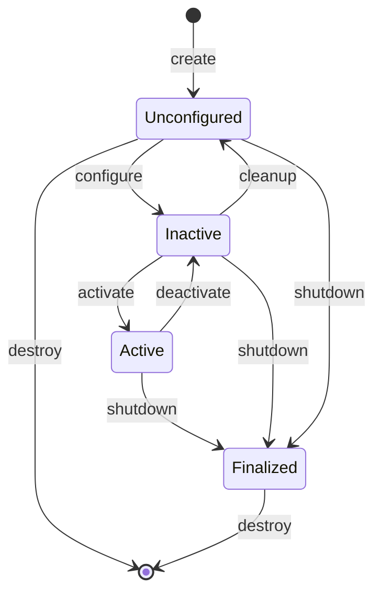
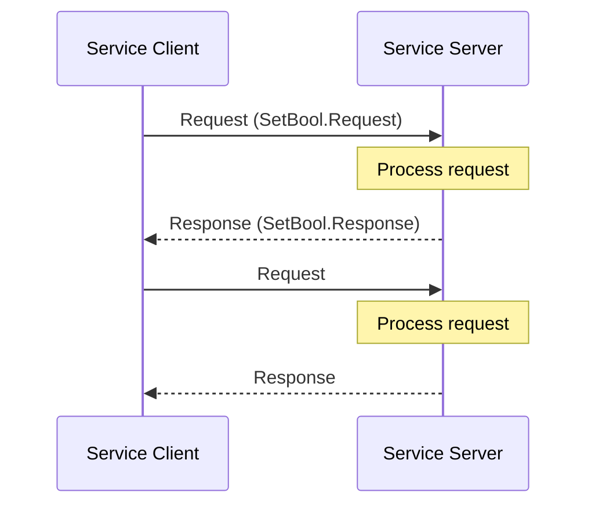
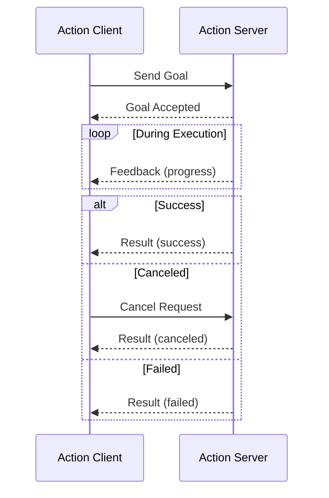
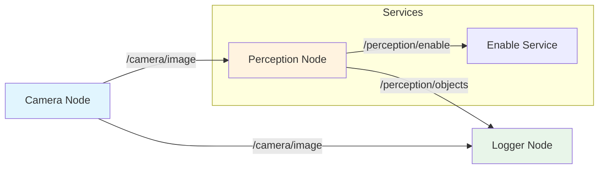

# Chapter 2: Nodes, Topics, Services, and Actions

**Week 4 of 13 | Estimated Time: 5-7 hours**

In this chapter, you will master the three fundamental communication patterns in ROS 2. By the end, you will be able to build complex robot systems where multiple nodes work together seamlessly.

## Learning Objectives

By the end of this chapter, you will be able to:

1. **Create** ROS 2 nodes using rclpy (Python client library)
2. **Implement** publisher and subscriber nodes for topic-based communication
3. **Build** service servers and clients for request-response patterns
4. **Design** action servers and clients for long-running tasks with feedback
5. **Use** launch files to orchestrate multiple nodes

---

## 1. ROS 2 Nodes Deep Dive

### What Makes a Node?

A ROS 2 node is an independent process that:
- Performs a specific computational task
- Communicates with other nodes via topics, services, and actions
- Has a unique name within the ROS graph
- Can run on the same machine or across a network

### Node Lifecycle



**Figure 2.1**: ROS 2 Managed Node Lifecycle States

For most applications, you will use regular nodes that are immediately active. Managed (lifecycle) nodes are used when you need fine-grained control over startup and shutdown sequences.

### Executors and Callbacks

When you call `rclpy.spin(node)`, an **executor** processes incoming messages and triggers your **callbacks**:

- **Timer callbacks**: Called at regular intervals
- **Subscription callbacks**: Called when messages arrive on topics
- **Service callbacks**: Called when service requests arrive
- **Action callbacks**: Called for action goals, cancellations, and feedback

```python
# Example: Multiple callbacks in one node
class MultiCallbackNode(Node):
    def __init__(self):
        super().__init__('multi_callback')

        # Timer callback - runs every 0.1 seconds
        self.timer = self.create_timer(0.1, self.timer_callback)

        # Subscription callback - runs when message received
        self.subscription = self.create_subscription(
            String, '/topic', self.subscription_callback, 10)

    def timer_callback(self):
        pass  # Called by timer

    def subscription_callback(self, msg):
        pass  # Called when message arrives
```

---

## 2. Topic Communication

Topics provide **publish-subscribe** communication - the most common pattern in ROS 2.

### How Topics Work

```mermaid
graph LR
    subgraph Publishers
        P1[Camera Node]
        P2[LiDAR Node]
    end

    subgraph Topic
        T[/sensor_data]
    end

    subgraph Subscribers
        S1[Perception Node]
        S2[Recording Node]
        S3[Display Node]
    end

    P1 -->|publish| T
    P2 -->|publish| T
    T -->|deliver| S1
    T -->|deliver| S2
    T -->|deliver| S3

    style T fill:#bbdefb
```

**Figure 2.2**: Topic-based publish-subscribe communication

Key characteristics:
- **Anonymous**: Publishers don't know who subscribes
- **Asynchronous**: Publishers don't wait for subscribers
- **Many-to-many**: Multiple publishers and subscribers per topic
- **Typed**: Each topic has a specific message type

### Creating a Publisher

```python
#!/usr/bin/env python3
"""
Physical AI & Humanoid Robotics Textbook
Module 1, Chapter 2: Publisher Example
Description: Publishes simulated joint state data
"""

import rclpy
from rclpy.node import Node
from sensor_msgs.msg import JointState
import math


class JointStatePublisher(Node):
    """Publishes simulated humanoid joint states."""

    def __init__(self):
        super().__init__('joint_state_publisher')

        # Create publisher
        # Arguments: message type, topic name, queue size
        self.publisher = self.create_publisher(
            JointState,           # Message type
            '/joint_states',      # Topic name
            10                    # Queue size (QoS depth)
        )

        # Timer to publish at 50 Hz
        self.timer = self.create_timer(0.02, self.publish_joint_states)
        self.time = 0.0

        self.get_logger().info('Joint state publisher started')

    def publish_joint_states(self):
        """Publish simulated joint positions."""
        msg = JointState()
        msg.header.stamp = self.get_clock().now().to_msg()

        # Define joint names for a simple humanoid arm
        msg.name = ['shoulder_pan', 'shoulder_lift', 'elbow', 'wrist']

        # Simulate sinusoidal motion
        msg.position = [
            math.sin(self.time) * 0.5,           # shoulder_pan
            math.sin(self.time * 0.5) * 0.3,     # shoulder_lift
            math.sin(self.time * 0.7) * 0.8,     # elbow
            math.sin(self.time * 1.2) * 0.4,     # wrist
        ]

        # Publish the message
        self.publisher.publish(msg)
        self.time += 0.02


def main(args=None):
    rclpy.init(args=args)
    node = JointStatePublisher()

    try:
        rclpy.spin(node)
    except KeyboardInterrupt:
        pass
    finally:
        node.destroy_node()
        rclpy.shutdown()


if __name__ == '__main__':
    main()
```

### Creating a Subscriber

```python
#!/usr/bin/env python3
"""
Physical AI & Humanoid Robotics Textbook
Module 1, Chapter 2: Subscriber Example
Description: Subscribes to joint states and processes them
"""

import rclpy
from rclpy.node import Node
from sensor_msgs.msg import JointState


class JointStateSubscriber(Node):
    """Subscribes to joint states and logs them."""

    def __init__(self):
        super().__init__('joint_state_subscriber')

        # Create subscription
        self.subscription = self.create_subscription(
            JointState,              # Message type
            '/joint_states',         # Topic name
            self.joint_state_callback,  # Callback function
            10                       # Queue size
        )

        self.get_logger().info('Joint state subscriber started')

    def joint_state_callback(self, msg: JointState):
        """Process received joint states."""
        # Log joint positions
        for name, position in zip(msg.name, msg.position):
            self.get_logger().info(
                f'Joint {name}: {position:.3f} rad'
            )


def main(args=None):
    rclpy.init(args=args)
    node = JointStateSubscriber()

    try:
        rclpy.spin(node)
    except KeyboardInterrupt:
        pass
    finally:
        node.destroy_node()
        rclpy.shutdown()


if __name__ == '__main__':
    main()
```

### Quality of Service (QoS)

QoS settings control reliability and behavior:

```python
from rclpy.qos import QoSProfile, ReliabilityPolicy, HistoryPolicy

# Reliable QoS - for important data that must arrive
reliable_qos = QoSProfile(
    reliability=ReliabilityPolicy.RELIABLE,
    history=HistoryPolicy.KEEP_LAST,
    depth=10
)

# Best-effort QoS - for high-frequency sensor data
sensor_qos = QoSProfile(
    reliability=ReliabilityPolicy.BEST_EFFORT,
    history=HistoryPolicy.KEEP_LAST,
    depth=1
)

# Use in publisher/subscriber
self.publisher = self.create_publisher(JointState, '/joint_states', reliable_qos)
```

---

## 3. Service Communication

Services provide **synchronous request-response** communication.

### How Services Work



**Figure 2.3**: Service request-response pattern

Key characteristics:
- **Synchronous**: Client waits for response
- **One-to-one**: Each request goes to one server
- **Typed**: Request and response have specific types

### Creating a Service Server

```python
#!/usr/bin/env python3
"""
Physical AI & Humanoid Robotics Textbook
Module 1, Chapter 2: Service Server Example
Description: Service to enable/disable robot motors
"""

import rclpy
from rclpy.node import Node
from std_srvs.srv import SetBool


class MotorControlService(Node):
    """Service server that controls motor enable state."""

    def __init__(self):
        super().__init__('motor_control_service')

        # Track motor state
        self.motors_enabled = False

        # Create service server
        self.service = self.create_service(
            SetBool,                    # Service type
            '/enable_motors',           # Service name
            self.enable_motors_callback # Callback function
        )

        self.get_logger().info('Motor control service ready')

    def enable_motors_callback(self, request, response):
        """Handle motor enable/disable requests."""
        self.motors_enabled = request.data

        if request.data:
            response.success = True
            response.message = 'Motors enabled successfully'
            self.get_logger().info('Motors ENABLED')
        else:
            response.success = True
            response.message = 'Motors disabled successfully'
            self.get_logger().info('Motors DISABLED')

        return response


def main(args=None):
    rclpy.init(args=args)
    node = MotorControlService()

    try:
        rclpy.spin(node)
    except KeyboardInterrupt:
        pass
    finally:
        node.destroy_node()
        rclpy.shutdown()


if __name__ == '__main__':
    main()
```

### Creating a Service Client

```python
#!/usr/bin/env python3
"""
Physical AI & Humanoid Robotics Textbook
Module 1, Chapter 2: Service Client Example
Description: Client that calls the motor control service
"""

import rclpy
from rclpy.node import Node
from std_srvs.srv import SetBool


class MotorControlClient(Node):
    """Service client that enables/disables motors."""

    def __init__(self):
        super().__init__('motor_control_client')

        # Create service client
        self.client = self.create_client(SetBool, '/enable_motors')

        # Wait for service to be available
        while not self.client.wait_for_service(timeout_sec=1.0):
            self.get_logger().info('Waiting for motor service...')

        self.get_logger().info('Motor control client ready')

    def send_request(self, enable: bool):
        """Send enable/disable request to motor service."""
        request = SetBool.Request()
        request.data = enable

        # Call service asynchronously
        future = self.client.call_async(request)

        # Wait for result
        rclpy.spin_until_future_complete(self, future)

        return future.result()


def main(args=None):
    rclpy.init(args=args)
    client = MotorControlClient()

    # Enable motors
    response = client.send_request(True)
    print(f'Result: {response.message}')

    # Disable motors
    response = client.send_request(False)
    print(f'Result: {response.message}')

    client.destroy_node()
    rclpy.shutdown()


if __name__ == '__main__':
    main()
```

---

## 4. Action Communication

Actions are for **long-running tasks** that need feedback and can be canceled.

### How Actions Work



**Figure 2.4**: Action communication pattern with feedback and cancellation

Key characteristics:
- **Asynchronous**: Client doesn't block
- **Feedback**: Progress updates during execution
- **Cancelable**: Goals can be aborted
- **Result**: Final outcome when complete

### Action Definition

Actions are defined in `.action` files with three parts:

```
# Goal (what to achieve)
float32 target_distance
---
# Result (final outcome)
float32 final_distance
bool success
---
# Feedback (progress updates)
float32 current_distance
float32 progress_percent
```

### Creating an Action Server

```python
#!/usr/bin/env python3
"""
Physical AI & Humanoid Robotics Textbook
Module 1, Chapter 2: Action Server Example
Description: Action server for humanoid walking
"""

import time
import rclpy
from rclpy.node import Node
from rclpy.action import ActionServer, GoalResponse, CancelResponse
from example_interfaces.action import Fibonacci  # Using built-in action for demo


class WalkActionServer(Node):
    """Action server that simulates humanoid walking."""

    def __init__(self):
        super().__init__('walk_action_server')

        self._action_server = ActionServer(
            self,
            Fibonacci,  # Action type (using Fibonacci as example)
            'walk',     # Action name
            execute_callback=self.execute_callback,
            goal_callback=self.goal_callback,
            cancel_callback=self.cancel_callback
        )

        self.get_logger().info('Walk action server ready')

    def goal_callback(self, goal_request):
        """Accept or reject incoming goals."""
        self.get_logger().info(f'Received goal: {goal_request.order} steps')
        return GoalResponse.ACCEPT

    def cancel_callback(self, goal_handle):
        """Accept or reject cancel requests."""
        self.get_logger().info('Received cancel request')
        return CancelResponse.ACCEPT

    def execute_callback(self, goal_handle):
        """Execute the walking action."""
        self.get_logger().info('Executing walk...')

        # Create feedback message
        feedback_msg = Fibonacci.Feedback()
        feedback_msg.partial_sequence = [0, 1]

        # Simulate walking with progress updates
        for i in range(1, goal_handle.request.order):
            # Check for cancellation
            if goal_handle.is_cancel_requested:
                goal_handle.canceled()
                self.get_logger().info('Walk canceled')
                result = Fibonacci.Result()
                result.sequence = feedback_msg.partial_sequence
                return result

            # Simulate step execution
            time.sleep(0.5)

            # Update feedback
            feedback_msg.partial_sequence.append(
                feedback_msg.partial_sequence[-1] +
                feedback_msg.partial_sequence[-2]
            )

            # Publish feedback
            goal_handle.publish_feedback(feedback_msg)
            self.get_logger().info(f'Step {i} complete')

        # Mark goal as succeeded
        goal_handle.succeed()

        # Return result
        result = Fibonacci.Result()
        result.sequence = feedback_msg.partial_sequence
        return result


def main(args=None):
    rclpy.init(args=args)
    node = WalkActionServer()

    try:
        rclpy.spin(node)
    except KeyboardInterrupt:
        pass
    finally:
        node.destroy_node()
        rclpy.shutdown()


if __name__ == '__main__':
    main()
```

### Creating an Action Client

```python
#!/usr/bin/env python3
"""
Physical AI & Humanoid Robotics Textbook
Module 1, Chapter 2: Action Client Example
Description: Client that sends walking goals to humanoid
"""

import rclpy
from rclpy.node import Node
from rclpy.action import ActionClient
from example_interfaces.action import Fibonacci


class WalkActionClient(Node):
    """Action client that commands humanoid to walk."""

    def __init__(self):
        super().__init__('walk_action_client')

        self._action_client = ActionClient(
            self,
            Fibonacci,
            'walk'
        )

        self.get_logger().info('Walk action client ready')

    def send_goal(self, steps):
        """Send walking goal."""
        goal_msg = Fibonacci.Goal()
        goal_msg.order = steps

        # Wait for action server
        self._action_client.wait_for_server()

        # Send goal with callbacks
        self._send_goal_future = self._action_client.send_goal_async(
            goal_msg,
            feedback_callback=self.feedback_callback
        )
        self._send_goal_future.add_done_callback(self.goal_response_callback)

    def goal_response_callback(self, future):
        """Handle goal acceptance/rejection."""
        goal_handle = future.result()

        if not goal_handle.accepted:
            self.get_logger().info('Goal rejected')
            return

        self.get_logger().info('Goal accepted')

        # Get result
        self._get_result_future = goal_handle.get_result_async()
        self._get_result_future.add_done_callback(self.get_result_callback)

    def feedback_callback(self, feedback_msg):
        """Handle feedback during execution."""
        feedback = feedback_msg.feedback
        self.get_logger().info(
            f'Progress: {len(feedback.partial_sequence)} steps taken'
        )

    def get_result_callback(self, future):
        """Handle final result."""
        result = future.result().result
        self.get_logger().info(f'Walk complete! Sequence: {result.sequence}')
        rclpy.shutdown()


def main(args=None):
    rclpy.init(args=args)
    client = WalkActionClient()

    # Send goal to walk 10 steps
    client.send_goal(10)

    rclpy.spin(client)


if __name__ == '__main__':
    main()
```

---

## 5. Launch Files

Launch files orchestrate multiple nodes and configure the ROS 2 system.

### Python Launch File

```python
#!/usr/bin/env python3
"""
Physical AI & Humanoid Robotics Textbook
Module 1, Chapter 2: Launch File Example
Description: Launches a complete sensor pipeline
"""

from launch import LaunchDescription
from launch_ros.actions import Node
from launch.actions import DeclareLaunchArgument
from launch.substitutions import LaunchConfiguration


def generate_launch_description():
    """Generate launch description for sensor pipeline."""

    # Declare launch arguments
    log_level_arg = DeclareLaunchArgument(
        'log_level',
        default_value='info',
        description='Logging level'
    )

    # Joint state publisher node
    joint_publisher = Node(
        package='humanoid_basics',
        executable='joint_state_publisher',
        name='joint_publisher',
        output='screen',
        parameters=[{
            'publish_rate': 50.0
        }]
    )

    # Joint state subscriber node
    joint_subscriber = Node(
        package='humanoid_basics',
        executable='joint_state_subscriber',
        name='joint_subscriber',
        output='screen'
    )

    # Motor control service
    motor_service = Node(
        package='humanoid_basics',
        executable='motor_control_service',
        name='motor_control',
        output='screen'
    )

    return LaunchDescription([
        log_level_arg,
        joint_publisher,
        joint_subscriber,
        motor_service
    ])
```

### Running Launch Files

```bash
# Run the launch file
ros2 launch humanoid_basics sensor_pipeline.launch.py

# With arguments
ros2 launch humanoid_basics sensor_pipeline.launch.py log_level:=debug

# View running nodes
ros2 node list
```

```mermaid
graph TB
    subgraph "Launch: sensor_pipeline.launch.py"
        JP[joint_publisher]
        JS[joint_subscriber]
        MC[motor_control]
    end

    subgraph Topics
        JT[/joint_states]
    end

    subgraph Services
        MS[/enable_motors]
    end

    JP -->|publish| JT
    JT -->|subscribe| JS
    MC -->|provide| MS

    style JP fill:#c8e6c9
    style JS fill:#c8e6c9
    style MC fill:#ffe0b2
    style JT fill:#bbdefb
    style MS fill:#e1bee7
```

**Figure 2.5**: Node graph created by the launch file

---

## 6. Hands-on: Building a Sensor Processing Pipeline

Let's build a complete sensor pipeline for a humanoid robot:

1. **Camera node**: Simulates camera data
2. **Perception node**: Processes camera data
3. **Logger node**: Records all data

This demonstrates topics, services, and how nodes work together.

### Architecture



The complete code for this pipeline is available in the `code-examples/module-1/chapter-02/` directory.

---

## 7. Common Errors and Solutions

### Error: "Topic type mismatch"

**Cause**: Publisher and subscriber using different message types.

**Solution**: Ensure both use the same type:
```python
# Both must match!
publisher = self.create_publisher(String, '/topic', 10)
subscription = self.create_subscription(String, '/topic', callback, 10)
```

### Error: "Service not available"

**Cause**: Service server not running or different name.

**Solution**:
```bash
# List available services
ros2 service list

# Check service name matches in code
```

### Error: "Action goal rejected"

**Cause**: Server's `goal_callback` returned `REJECT`.

**Solution**: Check goal validation logic in server.

### Error: "Multiple nodes with same name"

**Cause**: Two nodes have identical names.

**Solution**: Use unique names or namespaces:
```python
super().__init__('my_node', namespace='robot1')
```

### Error: "QoS incompatibility"

**Cause**: Publisher and subscriber have incompatible QoS settings.

**Solution**: Match QoS profiles:
```bash
# Check QoS on a topic
ros2 topic info /topic --verbose
```

---

## 8. Exercises

### Exercise 2.1: Create a Publisher (Difficulty: Basic)

**Objective**: Create a node that publishes simulated IMU data.

**Instructions**:
1. Create a new Python node called `imu_publisher`
2. Publish to topic `/imu/data` using `sensor_msgs/msg/Imu`
3. Simulate acceleration and angular velocity data
4. Publish at 100 Hz

**Expected Outcome**: Data visible with `ros2 topic echo /imu/data`

<details>
<summary>Solution</summary>

See `code-examples/module-1/chapter-02/imu_publisher.py`

</details>

---

### Exercise 2.2: Create a Subscriber (Difficulty: Basic)

**Objective**: Create a node that processes IMU data.

**Instructions**:
1. Subscribe to `/imu/data`
2. Calculate the magnitude of linear acceleration
3. Log a warning if acceleration exceeds 15 m/s²

**Expected Outcome**: Warnings appear when acceleration is high.

---

### Exercise 2.3: Build a Robot Command Service (Difficulty: Intermediate)

**Objective**: Create a service that accepts robot commands.

**Instructions**:
1. Create a custom service type `RobotCommand.srv`:
   ```
   string command
   float32[] parameters
   ---
   bool success
   string message
   ```
2. Implement a server that handles "move", "stop", "wave" commands
3. Create a client that sends test commands

**Expected Outcome**: Server executes commands and returns results.

---

### Exercise 2.4: Action Server for Navigation (Difficulty: Advanced)

**Objective**: Create an action server for point-to-point navigation.

**Instructions**:
1. Define action type `NavigateTo.action`:
   ```
   # Goal
   float32 target_x
   float32 target_y
   ---
   # Result
   float32 final_x
   float32 final_y
   bool success
   ---
   # Feedback
   float32 current_x
   float32 current_y
   float32 distance_remaining
   ```
2. Server simulates movement toward target
3. Publish feedback every 0.5 seconds
4. Handle cancellation requests

**Expected Outcome**: Client receives feedback during navigation.

---

## Summary

In this chapter, you learned:

- **Nodes** are the computational units in ROS 2, processing data and communicating via the DDS middleware
- **Topics** provide publish-subscribe communication for streaming data like sensor readings
- **Services** provide synchronous request-response for quick queries and commands
- **Actions** handle long-running tasks with feedback and cancellation support
- **Launch files** orchestrate multiple nodes and configure the system
- **QoS settings** control reliability, history, and durability of communication

### Key Terms

| Term | Definition |
|------|------------|
| **Publisher** | A node that sends messages to a topic |
| **Subscriber** | A node that receives messages from a topic |
| **Service Server** | A node that provides a request-response service |
| **Service Client** | A node that calls a service |
| **Action Server** | A node that handles long-running goals with feedback |
| **Action Client** | A node that sends goals to an action server |
| **QoS** | Quality of Service settings controlling communication reliability |
| **Launch File** | A Python script that starts and configures multiple nodes |

### What's Next

In **Chapter 3**, you will learn to describe humanoid robot bodies using URDF (Unified Robot Description Format). You will build a complete humanoid model with torso, arms, legs, and sensors that can be visualized in RViz2.

---

*Physical AI & Humanoid Robotics Textbook - Module 1, Chapter 2*
*ROS 2 Jazzy | Ubuntu 22.04 | Python 3.10+*
