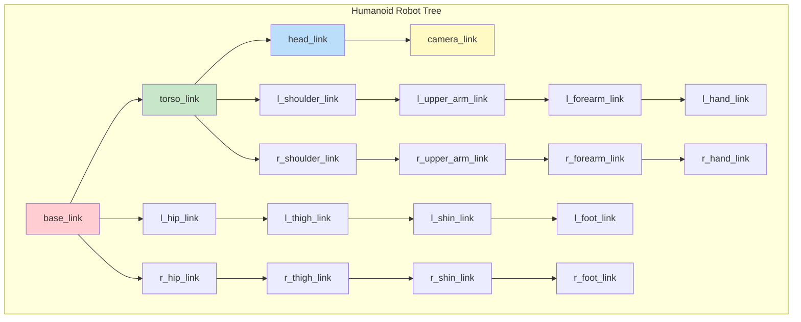
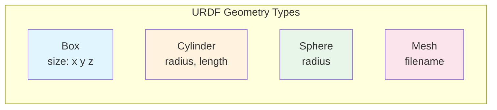
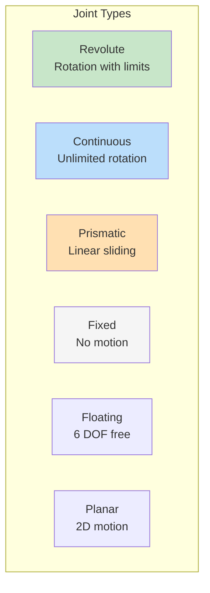

# Chapter 3: URDF - Describing Humanoid Robot Bodies

**Week 5, Part 1 of 13 | Estimated Time: 5-7 hours**

In this chapter, you will learn to describe humanoid robot bodies using URDF (Unified Robot Description Format). By the end, you will have created a complete humanoid robot model that can be visualized in RViz2 and simulated in Gazebo.

## Learning Objectives

By the end of this chapter, you will be able to:

1. **Understand** the structure and syntax of URDF files
2. **Define** links with visual and collision geometries
3. **Specify** joints (revolute, prismatic, fixed, continuous)
4. **Model** a simplified humanoid robot (torso, arms, legs, head)
5. **Visualize** URDF models in RViz2 with joint controls
6. **Add** sensor frames (camera, IMU mounting points)

---

## 1. Introduction to Robot Description Formats

### What is URDF?

**URDF** (Unified Robot Description Format) is an XML format for describing robot structures. It defines:

- **Links**: The rigid bodies (torso, arms, legs, head)
- **Joints**: How links connect and move relative to each other
- **Visual geometry**: What the robot looks like
- **Collision geometry**: Simplified shapes for physics simulation
- **Inertial properties**: Mass and moments of inertia

### URDF vs SDF

| Feature | URDF | SDF |
|---------|------|-----|
| **Primary Use** | ROS robot descriptions | Gazebo simulation |
| **Closed Loops** | Not supported | Supported |
| **Sensors** | Limited (via Gazebo plugins) | Native support |
| **World Description** | Robot only | Robot + environment |
| **Format** | Single XML file | Multiple files, includes |

For this textbook, we use URDF because:
- It's the standard for ROS 2 robot descriptions
- Works with robot_state_publisher
- Can be converted to SDF for Gazebo simulation

### The Link-Joint Tree



**Figure 3.1**: Link-joint tree structure of a humanoid robot

---

## 2. URDF Fundamentals

### Basic URDF Structure

```xml
<?xml version="1.0"?>
<robot name="my_robot">
  <!-- Materials (colors) -->
  <material name="blue">
    <color rgba="0.0 0.0 0.8 1.0"/>
  </material>

  <!-- Links -->
  <link name="base_link">
    <visual>...</visual>
    <collision>...</collision>
    <inertial>...</inertial>
  </link>

  <!-- Joints -->
  <joint name="joint1" type="revolute">
    <parent link="base_link"/>
    <child link="child_link"/>
    <origin xyz="0 0 0.1" rpy="0 0 0"/>
    <axis xyz="0 0 1"/>
    <limit lower="-1.57" upper="1.57" effort="10" velocity="1.0"/>
  </joint>

</robot>
```

### Link Elements

A link describes a rigid body:

```xml
<link name="torso_link">
  <!-- What the robot looks like (for visualization) -->
  <visual>
    <origin xyz="0 0 0.25" rpy="0 0 0"/>
    <geometry>
      <box size="0.3 0.2 0.5"/>
    </geometry>
    <material name="blue"/>
  </visual>

  <!-- Simplified shape for collision detection -->
  <collision>
    <origin xyz="0 0 0.25" rpy="0 0 0"/>
    <geometry>
      <box size="0.3 0.2 0.5"/>
    </geometry>
  </collision>

  <!-- Physical properties for dynamics -->
  <inertial>
    <origin xyz="0 0 0.25" rpy="0 0 0"/>
    <mass value="10.0"/>
    <inertia ixx="0.1" ixy="0" ixz="0" iyy="0.1" iyz="0" izz="0.05"/>
  </inertial>
</link>
```

### Geometry Types



```xml
<!-- Box: rectangular prism -->
<geometry>
  <box size="0.3 0.2 0.5"/>  <!-- width, depth, height -->
</geometry>

<!-- Cylinder: circular cross-section -->
<geometry>
  <cylinder radius="0.05" length="0.3"/>
</geometry>

<!-- Sphere: ball shape -->
<geometry>
  <sphere radius="0.1"/>
</geometry>

<!-- Mesh: custom 3D model -->
<geometry>
  <mesh filename="package://humanoid_description/meshes/torso.stl" scale="1 1 1"/>
</geometry>
```

### Joint Types



**Figure 3.2**: URDF joint types

```xml
<!-- Revolute: rotation with limits (most common) -->
<joint name="shoulder_pan" type="revolute">
  <parent link="torso_link"/>
  <child link="upper_arm_link"/>
  <origin xyz="0.15 0 0.4" rpy="0 0 0"/>
  <axis xyz="0 0 1"/>  <!-- Rotation axis -->
  <limit lower="-3.14" upper="3.14" effort="100" velocity="1.0"/>
</joint>

<!-- Continuous: unlimited rotation (wheels) -->
<joint name="wheel_joint" type="continuous">
  <parent link="base_link"/>
  <child link="wheel_link"/>
  <axis xyz="0 1 0"/>
</joint>

<!-- Prismatic: linear sliding -->
<joint name="gripper_slide" type="prismatic">
  <parent link="hand_link"/>
  <child link="finger_link"/>
  <axis xyz="1 0 0"/>
  <limit lower="0" upper="0.05" effort="10" velocity="0.1"/>
</joint>

<!-- Fixed: no relative motion -->
<joint name="camera_mount" type="fixed">
  <parent link="head_link"/>
  <child link="camera_link"/>
  <origin xyz="0.05 0 0.05" rpy="0 0 0"/>
</joint>
```

---

## 3. Building a Humanoid Torso and Arms

Let's build our humanoid robot step by step, starting with the torso and arms.

### The Base and Torso

```xml
<?xml version="1.0"?>
<robot name="humanoid" xmlns:xacro="http://www.ros.org/wiki/xacro">

  <!-- Materials -->
  <material name="blue">
    <color rgba="0.2 0.2 0.8 1.0"/>
  </material>
  <material name="gray">
    <color rgba="0.5 0.5 0.5 1.0"/>
  </material>
  <material name="white">
    <color rgba="0.9 0.9 0.9 1.0"/>
  </material>

  <!-- Base Link (pelvis) -->
  <link name="base_link">
    <visual>
      <origin xyz="0 0 0" rpy="0 0 0"/>
      <geometry>
        <box size="0.25 0.3 0.15"/>
      </geometry>
      <material name="gray"/>
    </visual>
    <collision>
      <origin xyz="0 0 0" rpy="0 0 0"/>
      <geometry>
        <box size="0.25 0.3 0.15"/>
      </geometry>
    </collision>
    <inertial>
      <mass value="5.0"/>
      <inertia ixx="0.05" ixy="0" ixz="0" iyy="0.05" iyz="0" izz="0.03"/>
    </inertial>
  </link>

  <!-- Torso Link -->
  <link name="torso_link">
    <visual>
      <origin xyz="0 0 0.2" rpy="0 0 0"/>
      <geometry>
        <box size="0.3 0.25 0.4"/>
      </geometry>
      <material name="blue"/>
    </visual>
    <collision>
      <origin xyz="0 0 0.2" rpy="0 0 0"/>
      <geometry>
        <box size="0.3 0.25 0.4"/>
      </geometry>
    </collision>
    <inertial>
      <origin xyz="0 0 0.2" rpy="0 0 0"/>
      <mass value="15.0"/>
      <inertia ixx="0.3" ixy="0" ixz="0" iyy="0.3" iyz="0" izz="0.15"/>
    </inertial>
  </link>

  <!-- Torso Joint (connects base to torso) -->
  <joint name="torso_joint" type="fixed">
    <parent link="base_link"/>
    <child link="torso_link"/>
    <origin xyz="0 0 0.075" rpy="0 0 0"/>
  </joint>
```

### Adding Arms

```xml
  <!-- ========== LEFT ARM ========== -->

  <!-- Left Shoulder Link -->
  <link name="l_shoulder_link">
    <visual>
      <geometry>
        <sphere radius="0.05"/>
      </geometry>
      <material name="gray"/>
    </visual>
    <collision>
      <geometry>
        <sphere radius="0.05"/>
      </geometry>
    </collision>
    <inertial>
      <mass value="0.5"/>
      <inertia ixx="0.001" ixy="0" ixz="0" iyy="0.001" iyz="0" izz="0.001"/>
    </inertial>
  </link>

  <!-- Left Shoulder Pan Joint -->
  <joint name="l_shoulder_pan_joint" type="revolute">
    <parent link="torso_link"/>
    <child link="l_shoulder_link"/>
    <origin xyz="0.17 0 0.35" rpy="0 0 0"/>
    <axis xyz="0 0 1"/>
    <limit lower="-2.0" upper="2.0" effort="50" velocity="2.0"/>
  </joint>

  <!-- Left Upper Arm Link -->
  <link name="l_upper_arm_link">
    <visual>
      <origin xyz="0.1 0 0" rpy="0 1.5708 0"/>
      <geometry>
        <cylinder radius="0.04" length="0.2"/>
      </geometry>
      <material name="blue"/>
    </visual>
    <collision>
      <origin xyz="0.1 0 0" rpy="0 1.5708 0"/>
      <geometry>
        <cylinder radius="0.04" length="0.2"/>
      </geometry>
    </collision>
    <inertial>
      <origin xyz="0.1 0 0" rpy="0 0 0"/>
      <mass value="2.0"/>
      <inertia ixx="0.01" ixy="0" ixz="0" iyy="0.01" iyz="0" izz="0.005"/>
    </inertial>
  </link>

  <!-- Left Shoulder Lift Joint -->
  <joint name="l_shoulder_lift_joint" type="revolute">
    <parent link="l_shoulder_link"/>
    <child link="l_upper_arm_link"/>
    <origin xyz="0 0 0" rpy="0 0 0"/>
    <axis xyz="0 1 0"/>
    <limit lower="-1.5" upper="1.5" effort="50" velocity="2.0"/>
  </joint>

  <!-- Left Forearm Link -->
  <link name="l_forearm_link">
    <visual>
      <origin xyz="0.1 0 0" rpy="0 1.5708 0"/>
      <geometry>
        <cylinder radius="0.035" length="0.2"/>
      </geometry>
      <material name="blue"/>
    </visual>
    <collision>
      <origin xyz="0.1 0 0" rpy="0 1.5708 0"/>
      <geometry>
        <cylinder radius="0.035" length="0.2"/>
      </geometry>
    </collision>
    <inertial>
      <origin xyz="0.1 0 0" rpy="0 0 0"/>
      <mass value="1.5"/>
      <inertia ixx="0.008" ixy="0" ixz="0" iyy="0.008" iyz="0" izz="0.004"/>
    </inertial>
  </link>

  <!-- Left Elbow Joint -->
  <joint name="l_elbow_joint" type="revolute">
    <parent link="l_upper_arm_link"/>
    <child link="l_forearm_link"/>
    <origin xyz="0.2 0 0" rpy="0 0 0"/>
    <axis xyz="0 1 0"/>
    <limit lower="0" upper="2.5" effort="30" velocity="2.0"/>
  </joint>

  <!-- Left Hand Link -->
  <link name="l_hand_link">
    <visual>
      <origin xyz="0.04 0 0" rpy="0 0 0"/>
      <geometry>
        <box size="0.08 0.06 0.03"/>
      </geometry>
      <material name="white"/>
    </visual>
    <collision>
      <origin xyz="0.04 0 0" rpy="0 0 0"/>
      <geometry>
        <box size="0.08 0.06 0.03"/>
      </geometry>
    </collision>
    <inertial>
      <origin xyz="0.04 0 0" rpy="0 0 0"/>
      <mass value="0.5"/>
      <inertia ixx="0.001" ixy="0" ixz="0" iyy="0.001" iyz="0" izz="0.001"/>
    </inertial>
  </link>

  <!-- Left Wrist Joint -->
  <joint name="l_wrist_joint" type="revolute">
    <parent link="l_forearm_link"/>
    <child link="l_hand_link"/>
    <origin xyz="0.2 0 0" rpy="0 0 0"/>
    <axis xyz="1 0 0"/>
    <limit lower="-1.5" upper="1.5" effort="10" velocity="2.0"/>
  </joint>

  <!-- Right arm is similar but mirrored (y-axis negated) -->
```

---

## 4. Building Bipedal Legs with Joint Limits

### Leg Structure

Humanoid legs require careful attention to:
- **Joint limits**: Prevent impossible poses
- **Joint axes**: Match human biomechanics
- **Inertial properties**: Affect balance in simulation

```xml
  <!-- ========== LEFT LEG ========== -->

  <!-- Left Hip Link -->
  <link name="l_hip_link">
    <visual>
      <geometry>
        <sphere radius="0.05"/>
      </geometry>
      <material name="gray"/>
    </visual>
    <collision>
      <geometry>
        <sphere radius="0.05"/>
      </geometry>
    </collision>
    <inertial>
      <mass value="1.0"/>
      <inertia ixx="0.002" ixy="0" ixz="0" iyy="0.002" iyz="0" izz="0.002"/>
    </inertial>
  </link>

  <!-- Left Hip Yaw Joint -->
  <joint name="l_hip_yaw_joint" type="revolute">
    <parent link="base_link"/>
    <child link="l_hip_link"/>
    <origin xyz="0 0.1 -0.075" rpy="0 0 0"/>
    <axis xyz="0 0 1"/>
    <limit lower="-0.5" upper="0.5" effort="100" velocity="2.0"/>
  </joint>

  <!-- Left Thigh Link -->
  <link name="l_thigh_link">
    <visual>
      <origin xyz="0 0 -0.175" rpy="0 0 0"/>
      <geometry>
        <cylinder radius="0.05" length="0.35"/>
      </geometry>
      <material name="blue"/>
    </visual>
    <collision>
      <origin xyz="0 0 -0.175" rpy="0 0 0"/>
      <geometry>
        <cylinder radius="0.05" length="0.35"/>
      </geometry>
    </collision>
    <inertial>
      <origin xyz="0 0 -0.175" rpy="0 0 0"/>
      <mass value="5.0"/>
      <inertia ixx="0.06" ixy="0" ixz="0" iyy="0.06" iyz="0" izz="0.02"/>
    </inertial>
  </link>

  <!-- Left Hip Pitch Joint -->
  <joint name="l_hip_pitch_joint" type="revolute">
    <parent link="l_hip_link"/>
    <child link="l_thigh_link"/>
    <origin xyz="0 0 0" rpy="0 0 0"/>
    <axis xyz="0 1 0"/>
    <limit lower="-1.5" upper="0.5" effort="150" velocity="2.0"/>
  </joint>

  <!-- Left Shin Link -->
  <link name="l_shin_link">
    <visual>
      <origin xyz="0 0 -0.175" rpy="0 0 0"/>
      <geometry>
        <cylinder radius="0.04" length="0.35"/>
      </geometry>
      <material name="blue"/>
    </visual>
    <collision>
      <origin xyz="0 0 -0.175" rpy="0 0 0"/>
      <geometry>
        <cylinder radius="0.04" length="0.35"/>
      </geometry>
    </collision>
    <inertial>
      <origin xyz="0 0 -0.175" rpy="0 0 0"/>
      <mass value="3.0"/>
      <inertia ixx="0.04" ixy="0" ixz="0" iyy="0.04" iyz="0" izz="0.01"/>
    </inertial>
  </link>

  <!-- Left Knee Joint -->
  <joint name="l_knee_joint" type="revolute">
    <parent link="l_thigh_link"/>
    <child link="l_shin_link"/>
    <origin xyz="0 0 -0.35" rpy="0 0 0"/>
    <axis xyz="0 1 0"/>
    <limit lower="0" upper="2.5" effort="100" velocity="2.0"/>
    <!-- Knee only bends backward! -->
  </joint>

  <!-- Left Foot Link -->
  <link name="l_foot_link">
    <visual>
      <origin xyz="0.05 0 -0.025" rpy="0 0 0"/>
      <geometry>
        <box size="0.2 0.1 0.05"/>
      </geometry>
      <material name="white"/>
    </visual>
    <collision>
      <origin xyz="0.05 0 -0.025" rpy="0 0 0"/>
      <geometry>
        <box size="0.2 0.1 0.05"/>
      </geometry>
    </collision>
    <inertial>
      <origin xyz="0.05 0 -0.025" rpy="0 0 0"/>
      <mass value="1.0"/>
      <inertia ixx="0.002" ixy="0" ixz="0" iyy="0.004" iyz="0" izz="0.005"/>
    </inertial>
  </link>

  <!-- Left Ankle Joint -->
  <joint name="l_ankle_joint" type="revolute">
    <parent link="l_shin_link"/>
    <child link="l_foot_link"/>
    <origin xyz="0 0 -0.35" rpy="0 0 0"/>
    <axis xyz="0 1 0"/>
    <limit lower="-0.8" upper="0.8" effort="50" velocity="2.0"/>
  </joint>
```

### Joint Limit Guidelines for Humanoids

| Joint | Typical Range | Notes |
|-------|---------------|-------|
| Hip Yaw | ±30° | Internal/external rotation |
| Hip Pitch | -90° to +30° | Flexion/extension |
| Hip Roll | ±30° | Abduction/adduction |
| Knee | 0° to +150° | Only bends backward |
| Ankle Pitch | ±45° | Dorsiflexion/plantarflexion |
| Ankle Roll | ±30° | Inversion/eversion |
| Shoulder Pan | ±120° | Horizontal swing |
| Shoulder Lift | ±90° | Raise/lower |
| Elbow | 0° to +150° | Only bends one way |
| Wrist | ±90° | Rotation |

---

## 5. Adding a Sensor Head

### Head with Camera and IMU Frames

```xml
  <!-- ========== HEAD ========== -->

  <!-- Head Link -->
  <link name="head_link">
    <visual>
      <origin xyz="0 0 0.075" rpy="0 0 0"/>
      <geometry>
        <sphere radius="0.1"/>
      </geometry>
      <material name="white"/>
    </visual>
    <collision>
      <origin xyz="0 0 0.075" rpy="0 0 0"/>
      <geometry>
        <sphere radius="0.1"/>
      </geometry>
    </collision>
    <inertial>
      <origin xyz="0 0 0.075" rpy="0 0 0"/>
      <mass value="3.0"/>
      <inertia ixx="0.015" ixy="0" ixz="0" iyy="0.015" iyz="0" izz="0.015"/>
    </inertial>
  </link>

  <!-- Neck Joint -->
  <joint name="neck_pan_joint" type="revolute">
    <parent link="torso_link"/>
    <child link="head_link"/>
    <origin xyz="0 0 0.425" rpy="0 0 0"/>
    <axis xyz="0 0 1"/>
    <limit lower="-1.5" upper="1.5" effort="20" velocity="2.0"/>
  </joint>

  <!-- Camera Link -->
  <link name="camera_link">
    <visual>
      <geometry>
        <box size="0.03 0.08 0.02"/>
      </geometry>
      <material name="gray"/>
    </visual>
    <collision>
      <geometry>
        <box size="0.03 0.08 0.02"/>
      </geometry>
    </collision>
    <inertial>
      <mass value="0.1"/>
      <inertia ixx="0.0001" ixy="0" ixz="0" iyy="0.0001" iyz="0" izz="0.0001"/>
    </inertial>
  </link>

  <!-- Camera Mount (fixed) -->
  <joint name="camera_joint" type="fixed">
    <parent link="head_link"/>
    <child link="camera_link"/>
    <origin xyz="0.08 0 0.1" rpy="0 0 0"/>
  </joint>

  <!-- Camera Optical Frame (for image data) -->
  <link name="camera_optical_link"/>

  <joint name="camera_optical_joint" type="fixed">
    <parent link="camera_link"/>
    <child link="camera_optical_link"/>
    <!-- Rotate to match ROS optical frame convention (Z forward, X right, Y down) -->
    <origin xyz="0 0 0" rpy="-1.5708 0 -1.5708"/>
  </joint>

  <!-- IMU Link -->
  <link name="imu_link">
    <visual>
      <geometry>
        <box size="0.02 0.02 0.01"/>
      </geometry>
      <material name="gray"/>
    </visual>
    <inertial>
      <mass value="0.05"/>
      <inertia ixx="0.00001" ixy="0" ixz="0" iyy="0.00001" iyz="0" izz="0.00001"/>
    </inertial>
  </link>

  <!-- IMU Mount (in torso) -->
  <joint name="imu_joint" type="fixed">
    <parent link="torso_link"/>
    <child link="imu_link"/>
    <origin xyz="0 0 0.2" rpy="0 0 0"/>
  </joint>

</robot>
```

---

## 6. Visualization with RViz2

### Launch File for Visualization

```python
#!/usr/bin/env python3
"""
Physical AI & Humanoid Robotics Textbook
Module 1, Chapter 3: URDF Visualization Launch
"""

import os
from launch import LaunchDescription
from launch_ros.actions import Node
from launch.substitutions import Command
from ament_index_python.packages import get_package_share_directory


def generate_launch_description():
    # Get URDF file path
    urdf_file = os.path.join(
        get_package_share_directory('humanoid_description'),
        'urdf',
        'humanoid.urdf'
    )

    # Read URDF content
    with open(urdf_file, 'r') as f:
        robot_description = f.read()

    # Robot State Publisher
    robot_state_publisher = Node(
        package='robot_state_publisher',
        executable='robot_state_publisher',
        parameters=[{'robot_description': robot_description}],
        output='screen'
    )

    # Joint State Publisher GUI
    joint_state_publisher_gui = Node(
        package='joint_state_publisher_gui',
        executable='joint_state_publisher_gui',
        name='joint_state_publisher_gui'
    )

    # RViz2
    rviz_config = os.path.join(
        get_package_share_directory('humanoid_description'),
        'rviz',
        'display.rviz'
    )

    rviz = Node(
        package='rviz2',
        executable='rviz2',
        arguments=['-d', rviz_config],
        output='screen'
    )

    return LaunchDescription([
        robot_state_publisher,
        joint_state_publisher_gui,
        rviz
    ])
```

### Running the Visualization

```bash
# Install dependencies
sudo apt install ros-jazzy-joint-state-publisher-gui ros-jazzy-robot-state-publisher

# Launch visualization
ros2 launch humanoid_description display.launch.py
```

You should see:
1. **RViz2** window with the humanoid robot model
2. **Joint State Publisher GUI** with sliders for each joint
3. Moving the sliders updates the robot pose in real-time

---

## 7. URDF Best Practices for Simulation

### Inertial Properties

For stable physics simulation:

1. **Always include `<inertial>` elements** - Required for Gazebo
2. **Use realistic mass values** - Affects dynamics
3. **Calculate moments of inertia** - Use formulas or estimation tools

```python
# Calculating inertia for a box (Python)
def box_inertia(mass, x, y, z):
    """Calculate inertia tensor for a box."""
    ixx = (1/12) * mass * (y**2 + z**2)
    iyy = (1/12) * mass * (x**2 + z**2)
    izz = (1/12) * mass * (x**2 + y**2)
    return ixx, iyy, izz

# Example: 10 kg box, 0.3 x 0.2 x 0.5 meters
ixx, iyy, izz = box_inertia(10.0, 0.3, 0.2, 0.5)
# ixx=0.242, iyy=0.283, izz=0.108
```

### Collision Geometry

- Use **simpler shapes** than visual geometry
- Convex hulls are faster than meshes
- Box > Cylinder > Sphere > Mesh (in computational cost)

```xml
<!-- Visual: detailed mesh -->
<visual>
  <geometry>
    <mesh filename="package://humanoid/meshes/hand_detailed.stl"/>
  </geometry>
</visual>

<!-- Collision: simple box approximation -->
<collision>
  <geometry>
    <box size="0.08 0.06 0.03"/>
  </geometry>
</collision>
```

### Joint Configuration

```xml
<!-- Good: explicit limits and dynamics -->
<joint name="elbow_joint" type="revolute">
  <parent link="upper_arm"/>
  <child link="forearm"/>
  <origin xyz="0.25 0 0" rpy="0 0 0"/>
  <axis xyz="0 1 0"/>
  <limit lower="0" upper="2.5" effort="30" velocity="2.0"/>
  <dynamics damping="0.5" friction="0.1"/>
</joint>
```

---

## 8. Common Errors and Solutions

### Error: "Link has no collision geometry"

**Cause**: Missing collision element in link.

**Solution**: Add collision geometry to all links:
```xml
<link name="my_link">
  <visual>...</visual>
  <collision>  <!-- Add this! -->
    <geometry>
      <box size="0.1 0.1 0.1"/>
    </geometry>
  </collision>
</link>
```

### Error: "Inertia matrix not positive definite"

**Cause**: Invalid inertia values (often zeros or negatives).

**Solution**: Use realistic inertia values:
```xml
<inertial>
  <mass value="1.0"/>
  <inertia ixx="0.01" ixy="0" ixz="0" iyy="0.01" iyz="0" izz="0.01"/>
</inertial>
```

### Error: "Robot model not showing in RViz"

**Cause**: Fixed frame not set or TF not being published.

**Solution**:
1. Set "Fixed Frame" to `base_link` in RViz
2. Ensure `robot_state_publisher` is running
3. Check URDF is valid: `check_urdf humanoid.urdf`

### Error: "Joint moves in wrong direction"

**Cause**: Incorrect axis definition.

**Solution**: Verify axis matches intended rotation:
```xml
<axis xyz="0 1 0"/>  <!-- Rotates around Y axis -->
```

### Error: "Model explodes in Gazebo"

**Cause**: Unrealistic mass/inertia or missing collision geometry.

**Solution**:
- Verify all links have proper inertial elements
- Check joint limits are set
- Add damping to joints
- Use smaller simulation timesteps

---

## 9. Exercises

### Exercise 3.1: Build a Simple Robot Arm (Difficulty: Basic)

**Objective**: Create a 3-DOF robot arm URDF.

**Instructions**:
1. Create a new URDF file `robot_arm.urdf`
2. Define links: base, link1, link2, link3, end_effector
3. Use revolute joints between links
4. Add visual geometry (cylinders for links)
5. Visualize in RViz2

**Expected Outcome**: 3-joint arm visible in RViz with working joint controls.

---

### Exercise 3.2: Add Sensor Frames (Difficulty: Intermediate)

**Objective**: Add LiDAR and depth camera frames to the humanoid.

**Instructions**:
1. Add a LiDAR link mounted on the torso
2. Add a depth camera link on the head (beside the existing camera)
3. Use fixed joints for mounting
4. Define appropriate optical frames
5. Verify frame relationships with `ros2 run tf2_tools view_frames`

**Expected Outcome**: TF tree shows sensor frames correctly attached.

---

### Exercise 3.3: Complete Humanoid with 10+ Links (Difficulty: Advanced)

**Objective**: Complete the humanoid URDF with both arms and legs.

**Instructions**:
1. Start with the torso and head from Section 3
2. Add left arm (shoulder, upper arm, forearm, hand)
3. Add right arm (mirrored from left)
4. Add left leg (hip, thigh, shin, foot)
5. Add right leg (mirrored from left)
6. Set realistic joint limits
7. Add proper inertial properties
8. Test in RViz2 and verify all joints work

**Expected Outcome**: Full humanoid with 15+ links and 12+ movable joints.

---

## Summary

In this chapter, you learned:

- **URDF** is an XML format for describing robot structures with links and joints
- **Links** define rigid bodies with visual, collision, and inertial properties
- **Joints** connect links and define their relative motion (revolute, prismatic, fixed, continuous)
- **Humanoid robots** require careful attention to joint limits matching human biomechanics
- **Sensor frames** are attached using fixed joints with proper optical frame conventions
- **RViz2** with robot_state_publisher and joint_state_publisher_gui allows interactive visualization
- **Best practices** for simulation include realistic inertia, simple collision geometry, and joint dynamics

### Key Terms

| Term | Definition |
|------|------------|
| **URDF** | Unified Robot Description Format - XML format for robot structure |
| **Link** | A rigid body in the robot kinematic tree |
| **Joint** | Connection between two links defining their relative motion |
| **Visual Geometry** | 3D shape used for rendering the robot |
| **Collision Geometry** | Simplified shape for physics collision detection |
| **Inertial** | Mass and moment of inertia properties for dynamics |
| **TF** | Transform library - tracks coordinate frame relationships |
| **robot_state_publisher** | Node that publishes TF transforms from joint states |

### What's Next

In **Chapter 4**, you will learn to bridge AI systems with ROS 2 control. You will create custom messages, build action servers for complex behaviors, and implement a command interpreter that prepares you for the VLA systems in Module 4.

---

*Physical AI & Humanoid Robotics Textbook - Module 1, Chapter 3*
*ROS 2 Jazzy | Ubuntu 22.04 | Python 3.10+*
