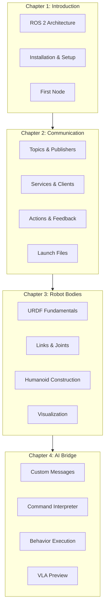
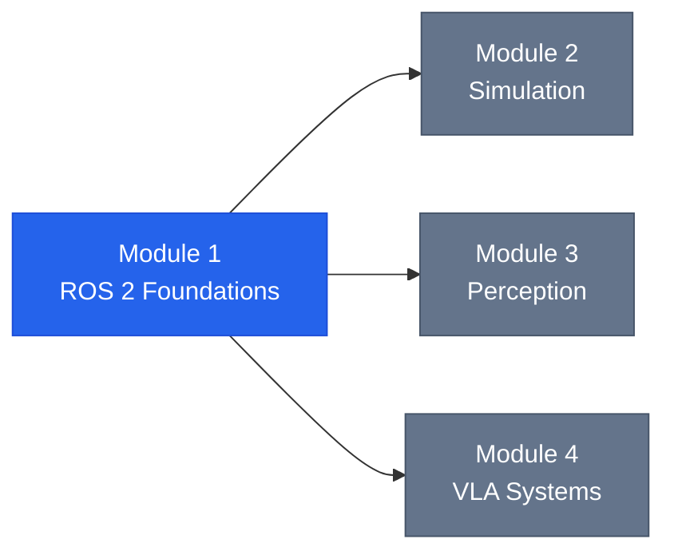

# Module 1: ROS 2 Foundations for Humanoid Robotics

Welcome to Module 1 of the Physical AI & Humanoid Robotics curriculum. This module provides a comprehensive introduction to ROS 2 (Robot Operating System 2), the industry-standard middleware for building sophisticated robot applications.

## Module Overview

By the end of this module, you will be able to:

- Set up and configure a complete ROS 2 development environment
- Create and manage ROS 2 packages for humanoid robot applications
- Implement communication patterns using topics, services, and actions
- Define robot bodies using URDF (Unified Robot Description Format)
- Bridge AI systems with robot control through custom interfaces

## Prerequisites

Before starting this module, you should have:

- **Programming**: Intermediate Python skills (classes, async, decorators)
- **Linux**: Basic command-line familiarity (navigation, file operations)
- **Math**: Understanding of 3D coordinate systems and transformations
- **Hardware**: Computer capable of running Ubuntu 24.04 or WSL2

## Module Structure



## Chapters

### [Chapter 1: Introduction to ROS 2](./chapter-01-intro)

Understand the fundamental architecture of ROS 2 and set up your development environment.

**Key Topics:**
- ROS 2 design philosophy and DDS middleware
- Installation on Ubuntu 24.04 (native, WSL2, Docker)
- Workspace creation with colcon
- Your first ROS 2 node

**Time Estimate:** 2-3 hours

---

### [Chapter 2: Nodes, Topics, Services, and Actions](./chapter-02-comms)

Master ROS 2's powerful communication patterns for building modular robot systems.

**Key Topics:**
- Publishers and Subscribers for streaming data
- Services for synchronous request-response
- Actions for long-running tasks with feedback
- Launch files for multi-node systems

**Time Estimate:** 4-5 hours

---

### [Chapter 3: URDF for Humanoid Robot Bodies](./chapter-03-urdf)

Define and visualize humanoid robot physical structures using URDF.

**Key Topics:**
- URDF file format and XML structure
- Links (bodies) and their visual/collision/inertial properties
- Joints (connections) and motion constraints
- Building a complete humanoid model
- RViz2 visualization and joint control

**Time Estimate:** 3-4 hours

---

### [Chapter 4: Bridging AI and ROS 2 Control](./chapter-04-ai-bridge)

Connect AI systems to robot control through custom interfaces and command interpretation.

**Key Topics:**
- Custom message, service, and action definitions
- Command interpreter architecture
- Behavior action servers
- State machines for complex behaviors
- Introduction to Module 4 VLA integration

**Time Estimate:** 4-5 hours

---

## Code Examples

All code examples for this module are available in the repository:

```
docs/code-examples/module-1/
├── chapter-01/
│   └── hello_ros2.py              # First ROS 2 node
├── chapter-02/
│   ├── publisher_node.py          # Topic publisher
│   ├── subscriber_node.py         # Topic subscriber
│   ├── service_server.py          # Service server
│   ├── service_client.py          # Service client
│   ├── action_server.py           # Action server
│   ├── action_client.py           # Action client
│   └── sensor_pipeline.launch.py  # Launch file example
├── chapter-03/
│   ├── humanoid_urdf/
│   │   └── humanoid.urdf          # Complete humanoid model
│   └── launch/
│       └── display.launch.py      # URDF visualization
└── chapter-04/
    ├── custom_msgs/               # Message definitions
    │   ├── msg/
    │   ├── srv/
    │   └── action/
    ├── command_interpreter.py     # NL command parsing
    └── behavior_action_server.py  # Behavior execution
```

## Learning Path

### Recommended Order

1. **Week 1**: Chapters 1-2 (ROS 2 basics and communication)
2. **Week 2**: Chapter 3 (URDF and visualization)
3. **Week 3**: Chapter 4 (AI integration patterns)

### Hands-On Exercises

Each chapter includes exercises at three difficulty levels:

- **Basic**: Reinforce core concepts (~30 minutes)
- **Intermediate**: Apply knowledge to new scenarios (~1 hour)
- **Advanced**: Extend and innovate (~2+ hours)

Complete at least the Basic and Intermediate exercises before moving to the next chapter.

## Connection to Other Modules



- **Module 2**: Uses ROS 2 for Gazebo simulation integration
- **Module 3**: Builds perception pipelines using ROS 2 topics and services
- **Module 4**: Deploys VLA models through the AI-ROS bridge from Chapter 4

## Resources

### Official Documentation

- [ROS 2 Jazzy Documentation](https://docs.ros.org/en/jazzy/)
- [ROS 2 Tutorials](https://docs.ros.org/en/jazzy/Tutorials.html)
- [URDF Specification](https://wiki.ros.org/urdf/XML)

### Community

- [ROS Discourse](https://discourse.ros.org/)
- [ROS Answers](https://answers.ros.org/)
- [ROS 2 GitHub](https://github.com/ros2)

### Books

- *A Gentle Introduction to ROS* by Jason O'Kane
- *Programming Robots with ROS* by Morgan Quigley et al.
- *Robot Operating System (ROS): The Complete Reference* by Anis Koubaa

## Assessment

After completing this module, you should be able to:

| Skill | Assessment Criteria |
|-------|---------------------|
| Environment Setup | Create and build ROS 2 workspace |
| Node Development | Create nodes with proper lifecycle |
| Communication | Implement pub/sub, services, and actions |
| URDF | Define robot with correct joint/link structure |
| AI Integration | Create custom interfaces for AI systems |

## Next Steps

After completing Module 1:

1. **Review**: Ensure all exercises are completed
2. **Practice**: Build a simple robot application combining all concepts
3. **Proceed**: Move to Module 2 (Simulation) or Module 3 (Perception)

---

Ready to begin? Start with [Chapter 1: Introduction to ROS 2](./chapter-01-intro)!
