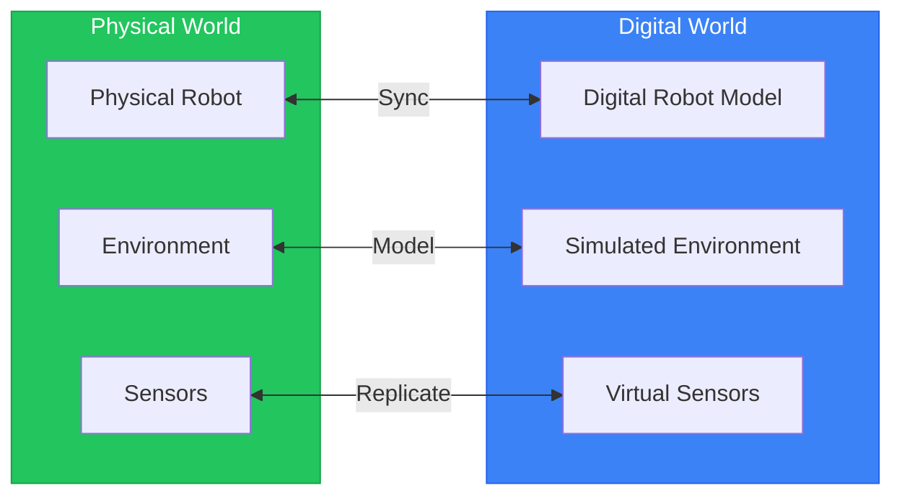
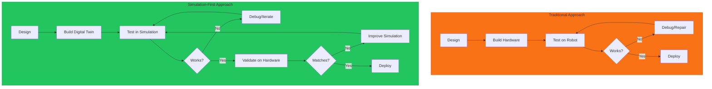
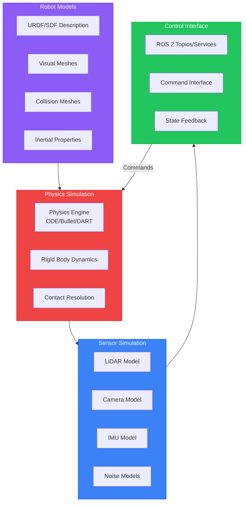
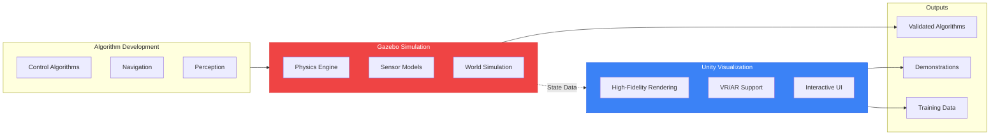
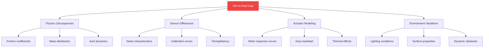

# Chapter 5: Introduction to Digital Twins

## Learning Objectives

By the end of this chapter, you will be able to:

- Define what a digital twin is and explain its value for robotics development
- Describe the simulation pipeline from model to deployment
- Compare physics simulation (Gazebo) vs. visualization (Unity) use cases
- Identify when to use simulation vs. real-world testing
- Explain the sim-to-real transfer challenge and its implications

## Prerequisites

- Completed Module 1 (ROS 2 Foundations)
- Working humanoid URDF from Chapter 3
- Basic understanding of 3D coordinate systems

---

## 5.1 What is a Digital Twin?

A **digital twin** is a virtual representation of a physical system that mirrors its structure, behavior, and sensor capabilities in real-time or near-real-time. For humanoid robotics, a digital twin enables us to develop, test, and refine robot behaviors without risking damage to expensive hardware or causing safety incidents.



### Historical Context

The concept of digital twins emerged from NASA's Apollo program in the 1960s, where engineers maintained physical replicas of spacecraft to simulate and troubleshoot issues. The modern digital twin concept, coined by Dr. Michael Grieves in 2002, extends this to virtual models synchronized with their physical counterparts.

### Key Characteristics of Robotics Digital Twins

| Characteristic | Description | Example |
|----------------|-------------|---------|
| **Structural Fidelity** | Accurate representation of physical geometry | URDF matching real robot dimensions |
| **Behavioral Fidelity** | Realistic response to inputs | Joint motors responding to commands |
| **Sensor Fidelity** | Virtual sensors matching real sensor behavior | Simulated LiDAR with realistic noise |
| **Environmental Fidelity** | Simulated world reflecting real conditions | Gravity, friction, obstacles |

### Why Digital Twins Matter for Humanoids

Humanoid robots present unique challenges that make digital twins essential:

1. **High Cost of Failure**: A falling humanoid can cause thousands of dollars in damage
2. **Safety Concerns**: Testing locomotion near humans is risky without verification
3. **Complex Dynamics**: 20+ joints interacting requires extensive testing
4. **Slow Physical Testing**: Real-world tests are time-consuming and weather-dependent

---

## 5.2 The Case for Simulation-First Robotics

Modern robotics development follows a **simulation-first** paradigm: develop and validate in simulation before deploying to hardware.



### Benefits of Simulation-First Development

#### Cost Reduction

| Activity | Physical Testing | Simulation |
|----------|-----------------|------------|
| Hardware wear | $100-1000/day | $0 |
| Failure repairs | $500-10000/incident | $0 |
| Environment setup | Hours to days | Minutes |
| Test parallelization | 1 robot | Unlimited |

#### Safety Enhancement

Simulation allows testing of:
- **Edge cases**: What happens if a joint fails mid-step?
- **Extreme conditions**: Behavior on ice, steep slopes, high winds
- **Human interaction**: Close-proximity operation scenarios
- **Failure modes**: Graceful degradation strategies

#### Iteration Speed

```
Traditional: Design → Build → Test → Fix → Rebuild → Test
             [2 weeks] [1 week] [1 day] [3 days] [1 week]

Sim-First:   Design → Simulate → Fix → Re-simulate → Validate
             [2 weeks] [minutes] [hours] [minutes] [1 day]
```

### When Physical Testing is Still Essential

Simulation cannot fully replace hardware testing:

- **Final validation**: Confirming real-world performance
- **Sensor calibration**: Tuning to actual sensor characteristics
- **Environmental factors**: Temperature, humidity effects
- **Human factors**: User interaction studies
- **Regulatory compliance**: Certifications often require physical tests

---

## 5.3 Anatomy of a Robotics Simulation Pipeline

A complete robotics simulation pipeline connects multiple components:



### Pipeline Components

#### 1. Robot Models

The foundation of any simulation is an accurate robot description:

- **URDF (Unified Robot Description Format)**: ROS-native format from Module 1
- **SDF (Simulation Description Format)**: Gazebo-native format with more features
- **Visual meshes**: Detailed appearance (STL, DAE, OBJ)
- **Collision meshes**: Simplified geometry for physics
- **Inertial properties**: Mass, center of mass, moments of inertia

#### 2. Physics Engine

The physics engine computes:

- **Rigid body dynamics**: How bodies move under forces
- **Joint constraints**: Enforcing kinematic limits
- **Contact detection**: Finding collisions
- **Contact resolution**: Computing reaction forces

#### 3. Sensor Simulation

Virtual sensors generate data mimicking real sensors:

- **Geometric computation**: Ray casting for LiDAR, projection for cameras
- **Noise models**: Gaussian noise, bias drift, quantization
- **Rate limiting**: Realistic update frequencies

#### 4. Control Interface

The bridge between simulation and control code:

- **ROS 2 integration**: Topics, services, actions
- **Command input**: Joint commands, velocity targets
- **State output**: Joint states, sensor data

---

## 5.4 Gazebo vs. Unity: Complementary Tools

Two dominant platforms serve different roles in robotics simulation:

| Aspect | Gazebo | Unity |
|--------|--------|-------|
| **Primary Purpose** | Physics simulation | Visualization & interaction |
| **Physics Accuracy** | High (ODE, Bullet, DART) | Moderate (PhysX) |
| **Visual Quality** | Functional | Photorealistic capable |
| **ROS Integration** | Native (gz-ros2) | Via ROS-TCP-Connector |
| **Sensor Simulation** | Comprehensive | Limited |
| **Learning Curve** | Moderate | Steeper |
| **Cost** | Free/Open Source | Free tier + paid |
| **Use Case** | Algorithm development | Demos, VR/AR, training data |



### When to Use Gazebo

Choose Gazebo for:

- **Physics-critical testing**: Walking, manipulation, balance
- **Sensor algorithm development**: Perception pipelines
- **ROS 2 integration**: Native support
- **Batch simulation**: Running many tests automatically
- **Research**: Reproducible experiments

### When to Use Unity

Choose Unity for:

- **Visual demonstrations**: Stakeholder presentations
- **Human-robot interaction**: UI/UX studies
- **VR/AR applications**: Immersive experiences
- **Synthetic data generation**: Training vision models
- **Game-like environments**: Complex visual scenes

### Using Both Together

Many projects use both:

1. **Develop in Gazebo**: Test algorithms with accurate physics
2. **Validate in Gazebo**: Confirm correct behavior
3. **Visualize in Unity**: Create impressive demonstrations
4. **Generate data in Unity**: Synthetic training data

---

## 5.5 The Sim-to-Real Challenge

The **sim-to-real gap** refers to differences between simulated and real-world robot behavior. Understanding and minimizing this gap is critical for successful deployment.

### Sources of Sim-to-Real Gap



### Physics Discrepancies

Real-world physics is complex:

- **Friction**: Varies with surface, temperature, wear
- **Mass**: Manufacturing tolerances, cable routing
- **Joints**: Backlash, friction, compliance
- **Contact**: Deformable surfaces, micro-geometry

### Sensor Differences

Simulated sensors are idealized:

- **Noise**: Real sensors have complex noise patterns
- **Calibration**: Intrinsic/extrinsic parameters drift
- **Artifacts**: Reflections, occlusions, interference
- **Timing**: Variable latency in real systems

### Actuator Modeling

Motor behavior is nonlinear:

- **Response curves**: Torque vs. speed relationships
- **Heating**: Performance degrades with temperature
- **Wear**: Characteristics change over time
- **Power limits**: Battery voltage affects performance

### Strategies for Minimizing Sim-to-Real Gap

| Strategy | Description | Implementation |
|----------|-------------|----------------|
| **System Identification** | Measure real parameters | Calibrate friction, mass, inertia |
| **Domain Randomization** | Train across variations | Randomize physics in training |
| **Domain Adaptation** | Align distributions | Fine-tune on real data |
| **Robust Control** | Design for uncertainty | Use feedback, not just feedforward |
| **Progressive Transfer** | Gradual real-world exposure | Start with constrained tests |

---

## 5.6 Setting Up Your Simulation Environment

Before diving into Gazebo and Unity, ensure your environment is properly configured.

### Hardware Requirements

| Component | Minimum | Recommended |
|-----------|---------|-------------|
| **CPU** | 4 cores, 2.5 GHz | 8+ cores, 3.0+ GHz |
| **RAM** | 8 GB | 16+ GB |
| **GPU** | Integrated | Discrete (NVIDIA 1060+) |
| **Storage** | 50 GB free | 100+ GB SSD |
| **OS** | Ubuntu 22.04 | Ubuntu 24.04 |

### Software Stack

```bash
# Verify ROS 2 Jazzy installation (from Module 1)
source /opt/ros/jazzy/setup.bash
ros2 --version

# Install Gazebo Harmonic
sudo apt update
sudo apt install ros-jazzy-ros-gz

# Verify Gazebo installation
gz sim --version

# Install additional dependencies
sudo apt install ros-jazzy-ros-gz-bridge \
                 ros-jazzy-ros-gz-sim \
                 ros-jazzy-ros-gz-image
```

### Workspace Organization

```
humanoid_simulation_ws/
├── src/
│   ├── humanoid_description/     # From Module 1
│   │   ├── urdf/
│   │   └── meshes/
│   ├── humanoid_gazebo/          # Gazebo-specific files
│   │   ├── worlds/
│   │   ├── launch/
│   │   └── config/
│   └── humanoid_unity/           # Unity integration
│       └── ros_messages/
└── install/
```

### Version Compatibility

Ensure compatible versions:

| Component | Version | Notes |
|-----------|---------|-------|
| ROS 2 | Jazzy | Primary distribution |
| Gazebo | Harmonic | LTS release |
| Python | 3.10+ | For launch files |
| Unity | 2022 LTS | For visualization |

---

## 5.7 Common Errors and Solutions

### Error: Gazebo Not Found

```
Command 'gz' not found
```

**Solution**: Install ros-gz packages:
```bash
sudo apt install ros-jazzy-ros-gz
source /opt/ros/jazzy/setup.bash
```

### Error: Graphics Driver Issues

```
libGL error: No matching fbConfigs or visuals found
```

**Solution**: Install appropriate GPU drivers:
```bash
# For NVIDIA
sudo apt install nvidia-driver-535
sudo reboot
```

### Error: Model Not Appearing in Gazebo

```
[Err] [Model.cc] Unable to find mesh []
```

**Solution**: Ensure mesh paths are absolute or use proper package:// URIs:
```xml
<mesh>
  <uri>package://humanoid_description/meshes/torso.stl</uri>
</mesh>
```

### Error: ROS-Gazebo Bridge Not Working

```
[WARN] No publishers on topic /joint_states
```

**Solution**: Verify bridge configuration and topic remapping:
```bash
ros2 run ros_gz_bridge parameter_bridge \
  /joint_states@sensor_msgs/msg/JointState@gz.msgs.Model
```

### Error: Insufficient RAM for Simulation

```
Killed (out of memory)
```

**Solution**: Reduce world complexity or increase swap:
```bash
# Add 4GB swap
sudo fallocate -l 4G /swapfile
sudo chmod 600 /swapfile
sudo mkswap /swapfile
sudo swapon /swapfile
```

---

## Exercises

### Exercise 5.1: Simulation Approach Selection (Basic)

**Objective**: Practice identifying appropriate simulation approaches.

For each scenario below, identify whether you should use:
- (A) Gazebo physics simulation
- (B) Unity visualization
- (C) Both
- (D) Real-world testing only

**Scenarios**:

1. Testing a new walking gait algorithm
2. Creating a promotional video for investors
3. Debugging why the robot tips over on slopes
4. Training a neural network to recognize objects
5. Final validation before customer delivery
6. Studying human responses to robot gestures

<details>
<summary>Solutions</summary>

1. **(A) Gazebo** - Physics accuracy needed for locomotion
2. **(B) Unity** - High visual quality for marketing
3. **(A) Gazebo** - Physics debugging requires accurate simulation
4. **(B) Unity** or **(C) Both** - Synthetic data generation
5. **(D) Real-world** - Final validation requires physical testing
6. **(B) Unity** - Human study needs interactive visualization

</details>

---

### Exercise 5.2: Sim-to-Real Gap Analysis (Intermediate)

**Objective**: Identify potential sim-to-real gaps in a given scenario.

**Scenario**: You developed a humanoid walking controller in Gazebo. In simulation, the robot walks smoothly on flat ground. When deployed on the real robot, it stumbles and falls within a few steps.

**Tasks**:

1. List at least 5 potential sources of the sim-to-real gap
2. For each source, explain why it might cause stumbling
3. Propose a mitigation strategy for each source

<details>
<summary>Solution Framework</summary>

**Potential Sources**:

1. **Floor friction** - Simulated friction may be higher than real floor
   - Mitigation: Measure real friction, randomize in training

2. **Mass distribution** - Actual robot may have different CoM
   - Mitigation: Weigh components, update URDF

3. **Motor response** - Real motors may have lag or different torque curves
   - Mitigation: System identification of actuators

4. **Sensor latency** - Real IMU has processing delay
   - Mitigation: Add realistic latency to simulation

5. **Joint backlash** - Real joints have play/slop
   - Mitigation: Model backlash or use robust control

</details>

---

### Exercise 5.3: Simulation Strategy Design (Advanced)

**Objective**: Design a complete simulation strategy for a humanoid robot project.

**Project**: Your team is developing a humanoid robot to assist in warehouse inventory counting. The robot must:
- Navigate autonomously between shelves
- Scan barcodes on products using a camera
- Report inventory counts via wireless communication

**Tasks**:

1. Design the simulation pipeline (diagram recommended)
2. Identify which aspects require Gazebo, Unity, or both
3. List the sensors you need to simulate and their key parameters
4. Describe your sim-to-real transfer strategy
5. Define three milestones where you would transition from simulation to hardware

**Deliverable**: A 1-2 page simulation strategy document.

---

## Summary

In this chapter, you learned:

- **Digital twins** are virtual representations that mirror physical robots
- **Simulation-first development** reduces cost, increases safety, and accelerates iteration
- The **simulation pipeline** connects models, physics, sensors, and control
- **Gazebo** excels at physics simulation; **Unity** excels at visualization
- The **sim-to-real gap** is the difference between simulated and real behavior
- **System identification**, **domain randomization**, and **robust control** help bridge the gap

### Key Takeaways

1. Always start development in simulation before hardware testing
2. Choose your simulation platform based on your primary need (physics vs. visuals)
3. Plan for sim-to-real transfer from the beginning
4. Continuously validate simulation accuracy against real-world data

### What's Next

In Chapter 6, we dive into **Gazebo Harmonic** for physics simulation. You'll load your humanoid URDF, configure physics parameters, and simulate realistic robot dynamics including gravity, friction, and collisions.

---

## Further Reading

- Grieves, M. (2014). "Digital Twin: Manufacturing Excellence through Virtual Factory Replication"
- Collins, J. et al. (2021). "A Review of Physics Simulators for Robotic Applications"
- Tobin, J. et al. (2017). "Domain Randomization for Transferring Deep Neural Networks from Simulation to the Real World"
- [Gazebo Documentation](https://gazebosim.org/docs)
- [ROS 2 Simulation Tutorials](https://docs.ros.org/en/jazzy/Tutorials/Advanced/Simulators.html)
