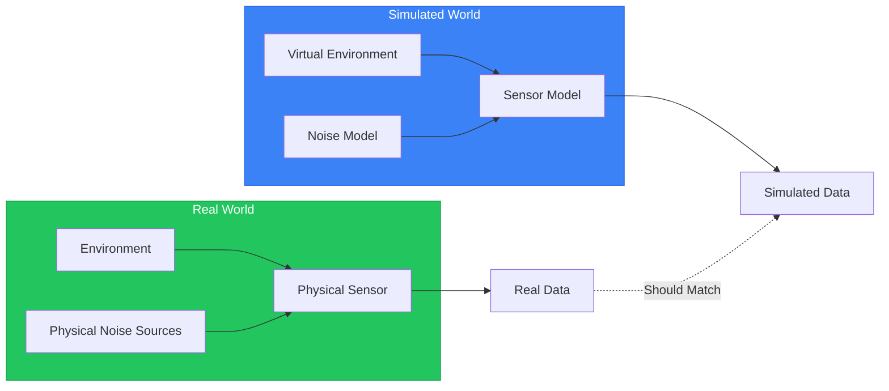
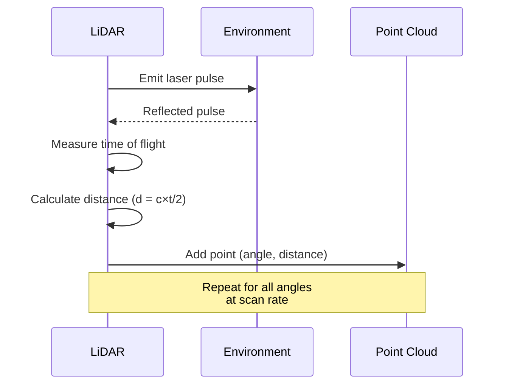
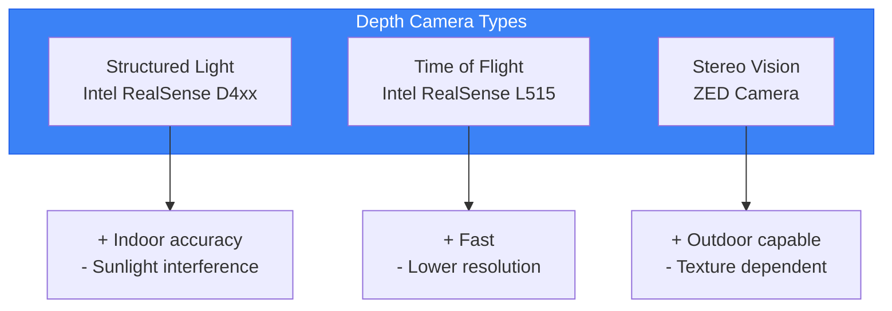
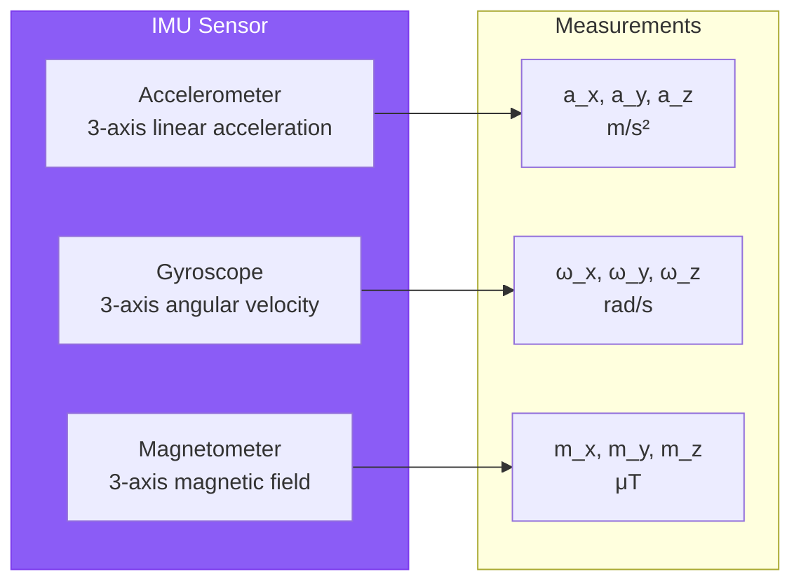
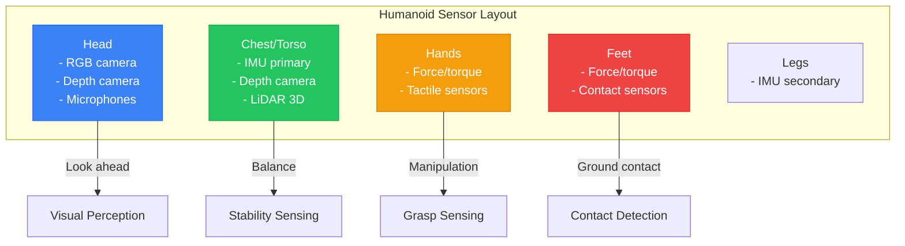

# Chapter 7: Sensor Simulation

## Learning Objectives

By the end of this chapter, you will be able to:

- Understand sensor model components (geometry, noise, rate)
- Configure and simulate LiDAR sensors with realistic scan patterns
- Implement depth camera simulation with appropriate noise models
- Simulate IMU sensors for orientation and acceleration sensing
- Analyze sensor data quality and identify simulation artifacts
- Prepare sensor configurations for perception algorithm testing

## Prerequisites

- Completed Chapter 6 (Gazebo Physics Simulation)
- Humanoid robot spawning in Gazebo
- Basic understanding of sensor principles

---

## 7.1 Sensor Models in Simulation

Sensors bridge the gap between a robot's physical world and its computational decision-making. In simulation, we create **sensor models** that approximate real sensor behavior.



### Ideal vs. Realistic Sensors

| Aspect | Ideal Sensor | Realistic Sensor |
|--------|--------------|------------------|
| **Measurements** | Perfect accuracy | Noise, bias, drift |
| **Timing** | Instant, synchronized | Latency, jitter |
| **Range** | Unlimited | Min/max limits |
| **Resolution** | Infinite | Quantized |
| **Environment** | Any condition | Affected by lighting, weather |

### Key Sensor Model Components

Every sensor model includes:

1. **Geometry**: Where the sensor is mounted, its field of view
2. **Update Rate**: How frequently measurements are produced
3. **Range**: Minimum and maximum detection distances
4. **Resolution**: Angular and depth resolution
5. **Noise Model**: Statistical model of measurement errors

---

## 7.2 LiDAR Simulation

**LiDAR** (Light Detection and Ranging) uses laser pulses to measure distances, creating point clouds of the environment.

### LiDAR Operating Principle



### 2D LiDAR (Planar Scanner)

2D LiDARs scan in a single plane—useful for navigation and obstacle avoidance.

```xml
<!-- File: sensor-configs/lidar_2d.sdf -->
<sensor name="head_lidar_2d" type="gpu_lidar">
  <pose>0 0 0 0 0 0</pose>
  <topic>/humanoid/lidar_2d</topic>
  <update_rate>10</update_rate>

  <lidar>
    <scan>
      <horizontal>
        <samples>720</samples>           <!-- 0.5° resolution -->
        <resolution>1</resolution>
        <min_angle>-3.14159</min_angle>  <!-- -180° -->
        <max_angle>3.14159</max_angle>   <!-- +180° -->
      </horizontal>
    </scan>
    <range>
      <min>0.1</min>     <!-- 10cm minimum -->
      <max>30.0</max>    <!-- 30m maximum -->
      <resolution>0.01</resolution>  <!-- 1cm resolution -->
    </range>
    <noise>
      <type>gaussian</type>
      <mean>0.0</mean>
      <stddev>0.01</stddev>  <!-- 1cm std deviation -->
    </noise>
  </lidar>

  <visualize>true</visualize>
</sensor>
```

### 3D LiDAR (Volumetric Scanner)

3D LiDARs scan multiple planes, creating full point clouds.

```xml
<!-- File: sensor-configs/lidar_3d.sdf -->
<sensor name="head_lidar_3d" type="gpu_lidar">
  <pose>0 0 0.1 0 0 0</pose>
  <topic>/humanoid/lidar_3d</topic>
  <update_rate>10</update_rate>

  <lidar>
    <scan>
      <horizontal>
        <samples>1800</samples>          <!-- 0.2° horizontal resolution -->
        <resolution>1</resolution>
        <min_angle>-3.14159</min_angle>
        <max_angle>3.14159</max_angle>
      </horizontal>
      <vertical>
        <samples>64</samples>            <!-- 64 channels -->
        <resolution>1</resolution>
        <min_angle>-0.436332</min_angle> <!-- -25° -->
        <max_angle>0.261799</max_angle>  <!-- +15° -->
      </vertical>
    </scan>
    <range>
      <min>0.5</min>
      <max>100.0</max>
      <resolution>0.01</resolution>
    </range>
    <noise>
      <type>gaussian</type>
      <mean>0.0</mean>
      <stddev>0.02</stddev>
    </noise>
  </lidar>

  <visualize>true</visualize>
</sensor>
```

### LiDAR Noise Characteristics

Real LiDARs exhibit several noise sources:

| Noise Type | Cause | Simulation |
|------------|-------|------------|
| **Range noise** | Time-of-flight uncertainty | Gaussian noise on distance |
| **Angular jitter** | Mechanical vibration | Gaussian noise on angle |
| **Multipath** | Reflections | Not typically modeled |
| **Intensity variation** | Surface reflectivity | Intensity channel |
| **Edge effects** | Partial beam returns | Filtered in processing |

### Adding LiDAR to Humanoid

Mount a LiDAR on the robot's head:

```xml
<!-- In humanoid URDF, add to head link -->
<link name="head_lidar_link">
  <visual>
    <geometry>
      <cylinder radius="0.03" length="0.04"/>
    </geometry>
    <material name="lidar_material">
      <color rgba="0.2 0.2 0.2 1"/>
    </material>
  </visual>
</link>

<joint name="head_lidar_joint" type="fixed">
  <parent link="head"/>
  <child link="head_lidar_link"/>
  <origin xyz="0.05 0 0.1" rpy="0 0 0"/>
</joint>

<!-- Gazebo sensor plugin -->
<gazebo reference="head_lidar_link">
  <sensor name="head_lidar" type="gpu_lidar">
    <!-- LiDAR configuration from above -->
  </sensor>
</gazebo>
```

---

## 7.3 Depth Camera Simulation

Depth cameras provide per-pixel distance measurements, creating depth images and point clouds.

### Depth Camera Technologies



### Depth Camera Configuration

```xml
<!-- File: sensor-configs/depth_camera.sdf -->
<sensor name="chest_depth_camera" type="depth_camera">
  <pose>0 0 0 0 0 0</pose>
  <topic>/humanoid/depth_camera</topic>
  <update_rate>30</update_rate>

  <camera>
    <!-- Image resolution -->
    <image>
      <width>640</width>
      <height>480</height>
      <format>R_FLOAT32</format>
    </image>

    <!-- Field of view (horizontal) -->
    <horizontal_fov>1.20428</horizontal_fov>  <!-- ~69° like RealSense -->

    <!-- Clipping planes -->
    <clip>
      <near>0.1</near>
      <far>10.0</far>
    </clip>

    <!-- Depth noise model -->
    <noise>
      <type>gaussian</type>
      <mean>0.0</mean>
      <stddev>0.005</stddev>  <!-- 5mm base noise -->
    </noise>

    <!-- Distortion (for realism) -->
    <distortion>
      <k1>0.0</k1>
      <k2>0.0</k2>
      <k3>0.0</k3>
      <p1>0.0</p1>
      <p2>0.0</p2>
    </distortion>
  </camera>

  <visualize>true</visualize>
</sensor>
```

### Depth-Dependent Noise

Real depth cameras have noise that increases with distance:

```python
# Depth-dependent noise model
# Based on Intel RealSense D435 characteristics

import numpy as np

def depth_noise_model(depth: float, base_noise: float = 0.005) -> float:
    """
    Calculate depth measurement noise as a function of distance.

    Real depth cameras have noise proportional to depth squared.

    Args:
        depth: Measured depth in meters
        base_noise: Base noise at 1 meter (default 5mm)

    Returns:
        Standard deviation of noise at given depth
    """
    # Quadratic noise model: sigma = base_noise * depth^2
    return base_noise * (depth ** 2)

# Example: Noise at different depths
depths = [0.5, 1.0, 2.0, 5.0, 10.0]
for d in depths:
    noise = depth_noise_model(d)
    print(f"Depth {d:.1f}m: noise = {noise*1000:.1f}mm")

# Output:
# Depth 0.5m: noise = 1.2mm
# Depth 1.0m: noise = 5.0mm
# Depth 2.0m: noise = 20.0mm
# Depth 5.0m: noise = 125.0mm
# Depth 10.0m: noise = 500.0mm
```

### RGB-D Camera (Color + Depth)

Combine color and depth in one sensor:

```xml
<sensor name="rgbd_camera" type="rgbd_camera">
  <pose>0 0 0 0 0 0</pose>
  <update_rate>30</update_rate>

  <camera>
    <image>
      <width>640</width>
      <height>480</height>
    </image>
    <horizontal_fov>1.20428</horizontal_fov>
    <clip>
      <near>0.1</near>
      <far>10.0</far>
    </clip>
  </camera>

  <!-- Publishes both color and depth images -->
  <gz_frame_id>chest_camera_link</gz_frame_id>
</sensor>
```

---

## 7.4 IMU Simulation

The **IMU** (Inertial Measurement Unit) measures acceleration and angular velocity, essential for balance and orientation estimation.

### IMU Components



### IMU Configuration

```xml
<!-- File: sensor-configs/imu.sdf -->
<sensor name="torso_imu" type="imu">
  <pose>0 0 0 0 0 0</pose>
  <topic>/humanoid/imu</topic>
  <update_rate>200</update_rate>

  <imu>
    <!-- Angular velocity (gyroscope) -->
    <angular_velocity>
      <x>
        <noise type="gaussian">
          <mean>0.0</mean>
          <stddev>0.0017</stddev>  <!-- ~0.1 deg/s -->
          <bias_mean>0.0001</bias_mean>
          <bias_stddev>0.00001</bias_stddev>
        </noise>
      </x>
      <y>
        <noise type="gaussian">
          <mean>0.0</mean>
          <stddev>0.0017</stddev>
          <bias_mean>0.0001</bias_mean>
          <bias_stddev>0.00001</bias_stddev>
        </noise>
      </y>
      <z>
        <noise type="gaussian">
          <mean>0.0</mean>
          <stddev>0.0017</stddev>
          <bias_mean>0.0001</bias_mean>
          <bias_stddev>0.00001</bias_stddev>
        </noise>
      </z>
    </angular_velocity>

    <!-- Linear acceleration (accelerometer) -->
    <linear_acceleration>
      <x>
        <noise type="gaussian">
          <mean>0.0</mean>
          <stddev>0.017</stddev>  <!-- ~1.7 mg -->
          <bias_mean>0.001</bias_mean>
          <bias_stddev>0.0001</bias_stddev>
        </noise>
      </x>
      <y>
        <noise type="gaussian">
          <mean>0.0</mean>
          <stddev>0.017</stddev>
          <bias_mean>0.001</bias_mean>
          <bias_stddev>0.0001</bias_stddev>
        </noise>
      </y>
      <z>
        <noise type="gaussian">
          <mean>0.0</mean>
          <stddev>0.017</stddev>
          <bias_mean>0.001</bias_mean>
          <bias_stddev>0.0001</bias_stddev>
        </noise>
      </z>
    </linear_acceleration>

    <!-- Enable gravity in measurements -->
    <enable_orientation>true</enable_orientation>
  </imu>
</sensor>
```

### IMU Noise Characteristics

IMU sensors exhibit several error types:

| Error Type | Description | Typical Value |
|------------|-------------|---------------|
| **White noise** | Random fluctuations | Gyro: 0.1°/s, Accel: 1.7mg |
| **Bias** | Constant offset | Gyro: 0.1°/s, Accel: 1mg |
| **Bias drift** | Slowly varying bias | Gyro: 0.01°/s/√hr |
| **Scale factor** | Gain error | ~0.5% |
| **Cross-axis** | Coupling between axes | ~0.1% |

### IMU Bias Drift Model

```python
# IMU bias drift simulation
import numpy as np
from dataclasses import dataclass


@dataclass
class IMUNoiseParams:
    """IMU noise parameters based on typical MEMS IMU."""
    # Gyroscope
    gyro_noise_density: float = 0.0017  # rad/s/√Hz
    gyro_bias_stability: float = 0.0001  # rad/s
    gyro_random_walk: float = 0.00001   # rad/s/√s

    # Accelerometer
    accel_noise_density: float = 0.017  # m/s²/√Hz
    accel_bias_stability: float = 0.001 # m/s²
    accel_random_walk: float = 0.0001   # m/s²/√s


class IMUSimulator:
    """Simulate IMU with realistic noise characteristics."""

    def __init__(self, params: IMUNoiseParams, dt: float = 0.005):
        self.params = params
        self.dt = dt

        # Initialize biases
        self.gyro_bias = np.zeros(3)
        self.accel_bias = np.zeros(3)

    def update_biases(self):
        """Update biases with random walk."""
        # Gyro bias random walk
        self.gyro_bias += np.random.normal(
            0, self.params.gyro_random_walk * np.sqrt(self.dt), 3
        )

        # Accel bias random walk
        self.accel_bias += np.random.normal(
            0, self.params.accel_random_walk * np.sqrt(self.dt), 3
        )

    def measure(self, true_angular_vel: np.ndarray,
                true_accel: np.ndarray) -> tuple:
        """
        Generate noisy IMU measurements.

        Args:
            true_angular_vel: True angular velocity [rad/s]
            true_accel: True acceleration [m/s²]

        Returns:
            Tuple of (noisy_angular_vel, noisy_accel)
        """
        self.update_biases()

        # Add noise to gyroscope
        gyro_noise = np.random.normal(
            0, self.params.gyro_noise_density / np.sqrt(self.dt), 3
        )
        noisy_gyro = true_angular_vel + self.gyro_bias + gyro_noise

        # Add noise to accelerometer
        accel_noise = np.random.normal(
            0, self.params.accel_noise_density / np.sqrt(self.dt), 3
        )
        noisy_accel = true_accel + self.accel_bias + accel_noise

        return noisy_gyro, noisy_accel
```

---

## 7.5 Sensor Placement on Humanoid Robots

Strategic sensor placement maximizes perception capability while minimizing interference.

### Common Sensor Locations



### Sensor Placement Guidelines

| Location | Sensor | Purpose | Mounting Notes |
|----------|--------|---------|----------------|
| **Head** | RGB-D camera | Visual perception | Eye-level, centered |
| **Head** | 3D LiDAR | Environmental mapping | Top of head, unobstructed |
| **Chest** | IMU | Balance, orientation | Center of mass, rigid mount |
| **Chest** | Depth camera | Body-level obstacles | Forward-facing |
| **Hands** | Force/torque | Grasp feedback | Wrist joint |
| **Feet** | Contact sensors | Ground detection | Sole of foot |

### Adding Multiple Sensors to URDF

```xml
<!-- Humanoid sensor package URDF extension -->
<robot name="humanoid_sensors">

  <!-- ===== Head Sensors ===== -->
  <link name="head_camera_link">
    <visual>
      <geometry><box size="0.04 0.08 0.02"/></geometry>
      <material name="camera_material">
        <color rgba="0.1 0.1 0.1 1"/>
      </material>
    </visual>
    <collision>
      <geometry><box size="0.04 0.08 0.02"/></geometry>
    </collision>
    <inertial>
      <mass value="0.1"/>
      <inertia ixx="0.0001" iyy="0.0001" izz="0.0001"
               ixy="0" ixz="0" iyz="0"/>
    </inertial>
  </link>

  <joint name="head_camera_joint" type="fixed">
    <parent link="head"/>
    <child link="head_camera_link"/>
    <origin xyz="0.08 0 0.05" rpy="0 0 0"/>
  </joint>

  <!-- ===== Torso IMU ===== -->
  <link name="torso_imu_link">
    <visual>
      <geometry><box size="0.02 0.02 0.01"/></geometry>
      <material name="imu_material">
        <color rgba="0.2 0.5 0.2 1"/>
      </material>
    </visual>
  </link>

  <joint name="torso_imu_joint" type="fixed">
    <parent link="torso"/>
    <child link="torso_imu_link"/>
    <origin xyz="0 0 0.2" rpy="0 0 0"/>
  </joint>

  <!-- ===== Gazebo Sensor Plugins ===== -->
  <gazebo reference="head_camera_link">
    <sensor name="head_rgbd" type="rgbd_camera">
      <update_rate>30</update_rate>
      <camera>
        <horizontal_fov>1.2</horizontal_fov>
        <image>
          <width>640</width>
          <height>480</height>
        </image>
        <clip><near>0.1</near><far>10</far></clip>
      </camera>
    </sensor>
  </gazebo>

  <gazebo reference="torso_imu_link">
    <sensor name="torso_imu" type="imu">
      <update_rate>200</update_rate>
      <imu>
        <!-- IMU configuration -->
      </imu>
    </sensor>
  </gazebo>

</robot>
```

---

## 7.6 Visualizing Sensor Data

RViz2 provides powerful tools for visualizing simulated sensor data.

### LiDAR Visualization

```bash
# Terminal 1: Launch simulation with sensors
ros2 launch humanoid_gazebo humanoid_sensors.launch.py

# Terminal 2: Start RViz2
rviz2

# In RViz2:
# 1. Set Fixed Frame to "base_link"
# 2. Add -> By topic -> /humanoid/lidar_3d/points -> PointCloud2
# 3. Set Color Transformer to "Intensity" or "AxisColor"
```

### Depth Image Visualization

```bash
# View depth image
ros2 run rqt_image_view rqt_image_view /humanoid/depth_camera/depth_image

# View RGB image
ros2 run rqt_image_view rqt_image_view /humanoid/depth_camera/image

# View point cloud in RViz2
# Add -> By topic -> /humanoid/depth_camera/points -> PointCloud2
```

### IMU Data Plotting

```bash
# Plot IMU data with rqt_plot
ros2 run rqt_plot rqt_plot \
  /humanoid/imu/angular_velocity/x \
  /humanoid/imu/angular_velocity/y \
  /humanoid/imu/angular_velocity/z

# Or use PlotJuggler for more advanced analysis
ros2 run plotjuggler plotjuggler
```

---

## 7.7 Sensor Accuracy vs. Performance Tradeoffs

Higher fidelity sensors require more computation. Balance accuracy with performance:

| Setting | Low Fidelity | Medium | High Fidelity |
|---------|-------------|--------|---------------|
| **LiDAR samples** | 360 | 720 | 1800 |
| **LiDAR rate** | 5 Hz | 10 Hz | 20 Hz |
| **Depth resolution** | 320×240 | 640×480 | 1280×720 |
| **IMU rate** | 100 Hz | 200 Hz | 500 Hz |
| **Noise detail** | None | Gaussian | Full model |
| **Simulation speed** | 2-3× RT | 1× RT | 0.5× RT |

### Profiling Sensor Performance

```bash
# Check simulation real-time factor
gz sim --info

# Monitor topic rates
ros2 topic hz /humanoid/lidar_3d/points
ros2 topic hz /humanoid/depth_camera/depth_image
ros2 topic hz /humanoid/imu

# CPU usage per sensor (approximate)
top -p $(pgrep -f gz)
```

---

## 7.8 Hands-on: Building a Perception-Ready Humanoid

Let's add a complete sensor suite to our humanoid.

### Step 1: Create Sensor Configuration File

```xml
<!-- File: config/humanoid_sensors.sdf.xacro -->
<?xml version="1.0"?>
<robot xmlns:xacro="http://ros.org/wiki/xacro">

  <!-- Macro for standard LiDAR -->
  <xacro:macro name="lidar_sensor" params="name parent *origin">
    <link name="${name}_link"/>
    <joint name="${name}_joint" type="fixed">
      <parent link="${parent}"/>
      <child link="${name}_link"/>
      <xacro:insert_block name="origin"/>
    </joint>
    <gazebo reference="${name}_link">
      <sensor name="${name}" type="gpu_lidar">
        <update_rate>10</update_rate>
        <lidar>
          <scan>
            <horizontal>
              <samples>720</samples>
              <min_angle>-3.14159</min_angle>
              <max_angle>3.14159</max_angle>
            </horizontal>
          </scan>
          <range><min>0.1</min><max>30</max></range>
          <noise type="gaussian"><mean>0</mean><stddev>0.01</stddev></noise>
        </lidar>
      </sensor>
    </gazebo>
  </xacro:macro>

  <!-- Macro for RGB-D camera -->
  <xacro:macro name="rgbd_camera" params="name parent *origin">
    <link name="${name}_link"/>
    <joint name="${name}_joint" type="fixed">
      <parent link="${parent}"/>
      <child link="${name}_link"/>
      <xacro:insert_block name="origin"/>
    </joint>
    <gazebo reference="${name}_link">
      <sensor name="${name}" type="rgbd_camera">
        <update_rate>30</update_rate>
        <camera>
          <image><width>640</width><height>480</height></image>
          <horizontal_fov>1.2</horizontal_fov>
          <clip><near>0.1</near><far>10</far></clip>
        </camera>
      </sensor>
    </gazebo>
  </xacro:macro>

  <!-- Macro for IMU -->
  <xacro:macro name="imu_sensor" params="name parent *origin">
    <link name="${name}_link"/>
    <joint name="${name}_joint" type="fixed">
      <parent link="${parent}"/>
      <child link="${name}_link"/>
      <xacro:insert_block name="origin"/>
    </joint>
    <gazebo reference="${name}_link">
      <sensor name="${name}" type="imu">
        <update_rate>200</update_rate>
        <imu>
          <angular_velocity>
            <x><noise type="gaussian"><stddev>0.0017</stddev></noise></x>
            <y><noise type="gaussian"><stddev>0.0017</stddev></noise></y>
            <z><noise type="gaussian"><stddev>0.0017</stddev></noise></z>
          </angular_velocity>
          <linear_acceleration>
            <x><noise type="gaussian"><stddev>0.017</stddev></noise></x>
            <y><noise type="gaussian"><stddev>0.017</stddev></noise></y>
            <z><noise type="gaussian"><stddev>0.017</stddev></noise></z>
          </linear_acceleration>
        </imu>
      </sensor>
    </gazebo>
  </xacro:macro>

</robot>
```

### Step 2: Apply Sensors to Humanoid

```xml
<!-- In humanoid.urdf.xacro, add: -->
<xacro:include filename="humanoid_sensors.sdf.xacro"/>

<!-- Head LiDAR -->
<xacro:lidar_sensor name="head_lidar" parent="head">
  <origin xyz="0 0 0.15" rpy="0 0 0"/>
</xacro:lidar_sensor>

<!-- Chest RGB-D camera -->
<xacro:rgbd_camera name="chest_camera" parent="torso">
  <origin xyz="0.1 0 0.3" rpy="0 0.2 0"/>
</xacro:rgbd_camera>

<!-- Torso IMU -->
<xacro:imu_sensor name="torso_imu" parent="torso">
  <origin xyz="0 0 0.2" rpy="0 0 0"/>
</xacro:imu_sensor>
```

### Step 3: Create Bridge Configuration

```yaml
# File: config/sensor_bridge.yaml
# ROS-Gazebo bridge configuration for sensors

- topic_name: /humanoid/head_lidar/points
  ros_type_name: sensor_msgs/msg/PointCloud2
  gz_type_name: gz.msgs.PointCloudPacked
  direction: GZ_TO_ROS

- topic_name: /humanoid/chest_camera/image
  ros_type_name: sensor_msgs/msg/Image
  gz_type_name: gz.msgs.Image
  direction: GZ_TO_ROS

- topic_name: /humanoid/chest_camera/depth_image
  ros_type_name: sensor_msgs/msg/Image
  gz_type_name: gz.msgs.Image
  direction: GZ_TO_ROS

- topic_name: /humanoid/torso_imu
  ros_type_name: sensor_msgs/msg/Imu
  gz_type_name: gz.msgs.IMU
  direction: GZ_TO_ROS
```

### Step 4: Launch and Verify

```bash
# Launch simulation with sensors
ros2 launch humanoid_gazebo humanoid_sensors.launch.py

# Verify topics are publishing
ros2 topic list | grep humanoid

# Check data rates
ros2 topic hz /humanoid/head_lidar/points
ros2 topic hz /humanoid/chest_camera/depth_image
ros2 topic hz /humanoid/torso_imu

# Visualize in RViz2
rviz2 -d config/humanoid_sensors.rviz
```

---

## 7.9 Common Errors and Solutions

### Error: Sensor Not Publishing Data

```
[WARN] No data on topic /humanoid/lidar_3d/points
```

**Solution**: Verify sensor plugin is loaded and topic name is correct:
```bash
# Check Gazebo topics
gz topic -l | grep lidar

# Verify bridge configuration matches
```

### Error: Point Cloud Frame Mismatch

```
[WARN] Transform from 'base_link' to 'head_lidar_link' not found
```

**Solution**: Ensure sensor frame is published in TF:
```xml
<gazebo reference="head_lidar_link">
  <sensor>
    <!-- Add frame_id -->
    <gz_frame_id>head_lidar_link</gz_frame_id>
  </sensor>
</gazebo>
```

### Error: High CPU Usage from Sensors

**Solution**: Reduce sensor fidelity:
```xml
<update_rate>5</update_rate>  <!-- Reduce from 10 -->
<samples>360</samples>         <!-- Reduce from 720 -->
```

### Error: IMU Shows Only Gravity

```
IMU z-acceleration = -9.81, x/y/angular = 0
```

**Solution**: Ensure robot is actually moving or add motion. Static robots only measure gravity.

### Error: Depth Camera Shows All Zeros

```
All depth values are 0.0
```

**Solution**: Verify objects are within camera range:
```xml
<clip>
  <near>0.1</near>   <!-- Check minimum range -->
  <far>10.0</far>    <!-- Check maximum range -->
</clip>
```

---

## Exercises

### Exercise 7.1: Add LiDAR to Humanoid (Basic)

**Objective**: Mount a 2D LiDAR on the humanoid head.

**Tasks**:
1. Add a LiDAR link and joint to your URDF
2. Configure a 2D LiDAR with 1° resolution
3. Launch simulation and verify data in RViz2

**Success Criteria**:
- LiDAR appears on robot model
- Point cloud visible in RViz2
- Topic publishes at configured rate

---

### Exercise 7.2: Configure Depth Camera Noise (Intermediate)

**Objective**: Model realistic depth camera noise.

**Tasks**:
1. Research Intel RealSense D435 noise characteristics
2. Implement depth-dependent noise (increases with distance)
3. Compare simulated vs. datasheet noise levels
4. Document your noise model parameters

**Deliverable**: Configured depth camera SDF and comparison analysis.

---

### Exercise 7.3: Tune IMU Bias Parameters (Intermediate)

**Objective**: Configure realistic IMU bias drift.

**Tasks**:
1. Research typical MEMS IMU specifications
2. Configure bias and random walk parameters
3. Run 1-minute simulation logging IMU data
4. Plot bias drift over time
5. Compare to datasheet specifications

**Deliverable**: IMU configuration and drift analysis plot.

---

### Exercise 7.4: Multi-Sensor Perception Setup (Advanced)

**Objective**: Create a complete perception suite for navigation.

**Tasks**:
1. Add to your humanoid:
   - Head-mounted 3D LiDAR
   - Chest-mounted RGB-D camera
   - Torso IMU
   - Two 2D LiDARs (front and rear)
2. Configure appropriate noise for each sensor
3. Create ROS-Gazebo bridge configuration
4. Build RViz2 configuration showing all sensor data
5. Document computational requirements

**Deliverable**: Complete sensor URDF, bridge config, RViz config, and performance analysis.

---

## Summary

In this chapter, you learned:

- **Sensor model components**: Geometry, update rate, range, resolution, noise
- **LiDAR simulation**: 2D and 3D configurations, ray-based scanning
- **Depth camera simulation**: Structured light and ToF models, depth-dependent noise
- **IMU simulation**: Accelerometer, gyroscope, bias drift modeling
- **Sensor placement**: Strategic mounting for optimal perception
- **Visualization**: RViz2 configuration for sensor data display
- **Performance tradeoffs**: Balancing fidelity and computational cost

### Key Takeaways

1. **Realistic noise is essential** for developing robust perception algorithms
2. **Depth-dependent noise** is critical for depth cameras
3. **IMU bias drift** accumulates over time—plan for sensor fusion
4. **Balance sensor fidelity** with simulation performance needs
5. **Validate simulated sensors** against real sensor datasheets

### What's Next

In Chapter 8, we'll explore **Unity for visualization and interaction**. You'll learn to create high-fidelity visualizations, build interactive demonstration scenes, and understand Unity-ROS integration patterns.

---

## Further Reading

- [Gazebo Sensor Models Documentation](https://gazebosim.org/docs/harmonic/sensors)
- [ROS 2 sensor_msgs Package](https://docs.ros2.org/latest/api/sensor_msgs/)
- Thrun, S. et al. (2005). "Probabilistic Robotics" - Chapter on Sensor Models
- [Intel RealSense SDK Documentation](https://dev.intelrealsense.com/docs)
- [Velodyne LiDAR Datasheets](https://velodynelidar.com/downloads/)
