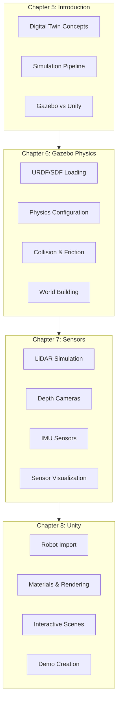
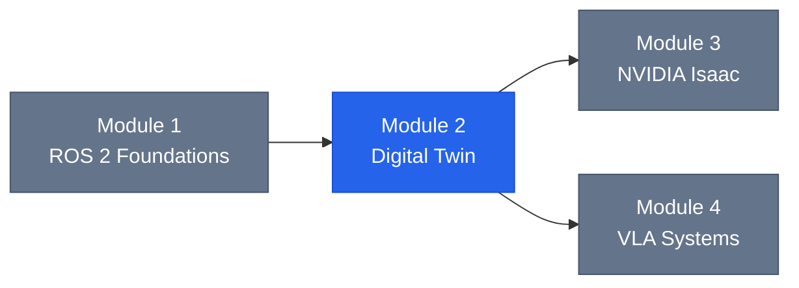

# Module 2: The Digital Twin (Gazebo & Unity)

Welcome to Module 2 of the Physical AI & Humanoid Robotics curriculum. This module teaches you to create digital twins of humanoid robots—virtual representations that mirror physical robots for safe, efficient development.

## Module Overview

By the end of this module, you will be able to:

- Explain digital twin concepts and simulation-first development
- Simulate humanoid robots with accurate physics in Gazebo Harmonic
- Configure realistic sensors (LiDAR, depth cameras, IMUs)
- Create high-fidelity visualizations and demos in Unity
- Understand sim-to-real transfer challenges and solutions

## Prerequisites

Before starting this module, you should have:

- **Completed Module 1**: Working humanoid URDF, ROS 2 basics
- **Hardware**: Ubuntu 24.04, 8GB+ RAM, discrete GPU recommended
- **Software**: ROS 2 Jazzy, Gazebo Harmonic, Unity 2022 LTS

## Module Structure



## Chapters

### [Chapter 5: Introduction to Digital Twins](./chapter-05-intro)

Understand the value of digital twins and simulation-first robotics development.

**Key Topics:**
- What is a digital twin?
- Simulation-first development benefits
- Robotics simulation pipeline
- Gazebo vs Unity comparison
- Sim-to-real transfer challenges

**Time Estimate:** 2-3 hours

---

### [Chapter 6: Physics Simulation with Gazebo](./chapter-06-gazebo)

Master physics-accurate simulation of humanoid robots in Gazebo Harmonic.

**Key Topics:**
- Gazebo Harmonic architecture
- Loading URDF/SDF models
- Physics engine configuration (ODE, Bullet, DART)
- Gravity, friction, and contact modeling
- Building simulation worlds

**Time Estimate:** 4-5 hours

---

### [Chapter 7: Sensor Simulation](./chapter-07-sensors)

Configure realistic sensors for perception algorithm development.

**Key Topics:**
- Sensor model components
- 2D and 3D LiDAR simulation
- Depth camera configuration
- IMU with bias drift modeling
- Sensor placement strategies
- RViz2 visualization

**Time Estimate:** 4-5 hours

---

### [Chapter 8: Unity for Visualization and Interaction](./chapter-08-unity)

Create impressive visualizations and interactive demonstrations.

**Key Topics:**
- URDF import into Unity
- PBR materials and lighting
- Interactive camera controls
- Human-robot interaction scenarios
- Unity-ROS bridge overview
- Building demo environments

**Time Estimate:** 4-5 hours

---

## Code Examples

All code examples for this module are available in the repository:

```
docs/code-examples/module-2/
├── gazebo-worlds/
│   ├── empty_world.sdf           # Basic simulation world
│   └── obstacle_world.sdf        # Obstacle course for testing
├── sensor-configs/
│   ├── lidar_2d.sdf              # 2D LiDAR configuration
│   ├── depth_camera.sdf          # RGB-D camera configuration
│   └── imu.sdf                   # IMU with noise models
├── launch/
│   └── spawn_humanoid.launch.py  # Gazebo spawn launch file
└── unity-project/
    └── (Unity project files)
```

## Learning Path

### Recommended Order

1. **Week 6, Part 1**: Chapter 5 (Digital Twin concepts)
2. **Week 6, Part 2**: Chapter 6 (Gazebo physics)
3. **Week 7, Part 1**: Chapter 7 (Sensor simulation)
4. **Week 7, Part 2**: Chapter 8 (Unity visualization)

### Hands-On Exercises

Each chapter includes exercises at three difficulty levels:

- **Basic**: Core concept reinforcement (~30 minutes)
- **Intermediate**: Applied scenarios (~1 hour)
- **Advanced**: Extended projects (~2+ hours)

## Connection to Other Modules



- **Module 1**: Provides URDF and ROS 2 foundation
- **Module 3**: Builds on simulation concepts with Isaac Sim
- **Module 4**: Uses simulation for VLA training data

## Key Concepts

### Digital Twin

A virtual representation of a physical robot that mirrors its structure, behavior, and sensor capabilities for development and testing.

### Sim-to-Real Gap

The difference between simulated and real-world behavior due to physics approximations, sensor modeling, and environmental variations.

### Physics Engine

Software that computes rigid body dynamics, collision detection, and contact resolution (ODE, Bullet, DART).

### Sensor Model

Mathematical representation of how sensors perceive the environment, including noise characteristics.

## Resources

### Official Documentation

- [Gazebo Documentation](https://gazebosim.org/docs/harmonic)
- [SDF Specification](http://sdformat.org/spec)
- [Unity Robotics Hub](https://github.com/Unity-Technologies/Unity-Robotics-Hub)
- [ROS-Gazebo Integration](https://github.com/gazebosim/ros_gz)

### Community

- [Gazebo Community](https://community.gazebosim.org/)
- [Unity Robotics Forum](https://forum.unity.com/forums/robotics.623/)
- [ROS Discourse - Simulation](https://discourse.ros.org/c/simulation/)

## Assessment

After completing this module, you should be able to:

| Skill | Assessment Criteria |
|-------|---------------------|
| Digital Twin Concepts | Explain simulation pipeline and sim-to-real gap |
| Gazebo Physics | Load robot, configure physics, create worlds |
| Sensor Simulation | Configure LiDAR, camera, IMU with realistic noise |
| Unity Visualization | Import robot, create materials, build interactive demo |

## Next Steps

After completing Module 2:

1. **Review**: Ensure all exercises are completed
2. **Practice**: Build a complete simulation with sensors
3. **Proceed**: Move to Module 3 (NVIDIA Isaac) or Module 4 (VLA Systems)

---

Ready to begin? Start with [Chapter 5: Introduction to Digital Twins](./chapter-05-intro)!
