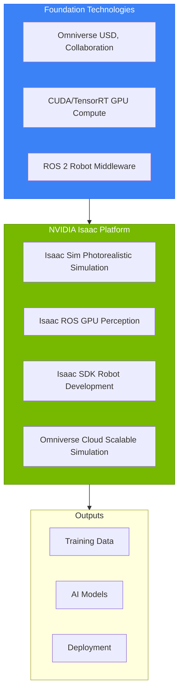
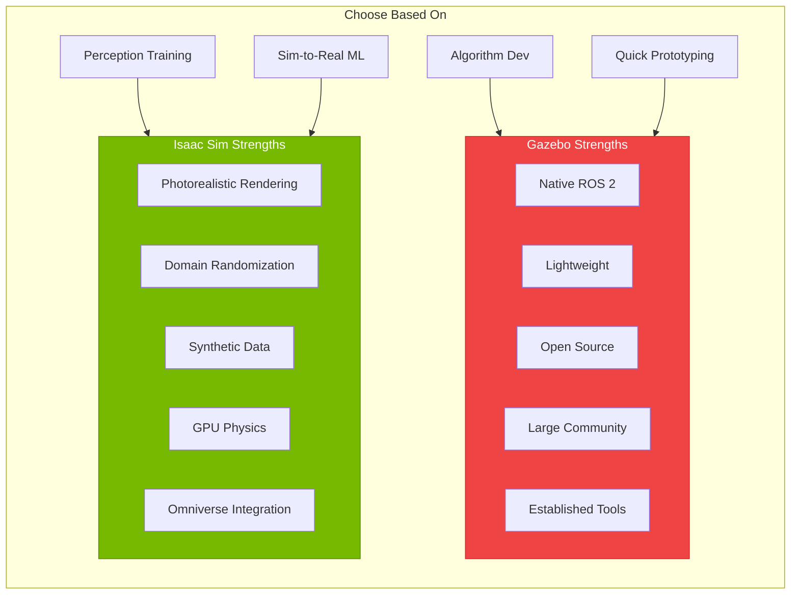
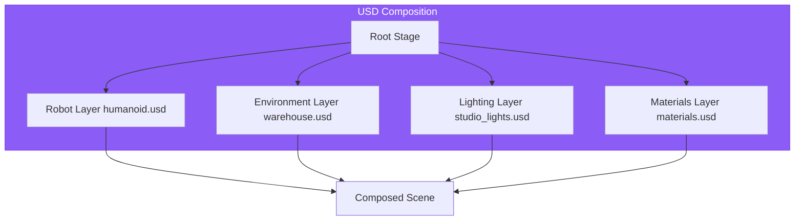
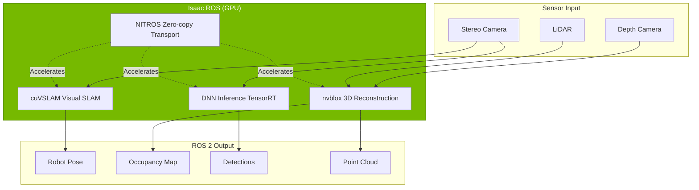

# Chapter 9: The NVIDIA Isaac Platform

## Learning Objectives

By the end of this chapter, you will be able to:

- Describe the NVIDIA Isaac platform components and their purposes
- Explain when to use Isaac Sim vs. Gazebo for simulation
- Understand the role of GPU acceleration in modern robotics
- Configure Isaac Sim installation and system requirements
- Navigate the Omniverse interface for robot simulation
- Identify Isaac ROS packages relevant to humanoid robotics

## Prerequisites

- Completed Modules 1-2 (ROS 2 and Digital Twin)
- Working humanoid URDF from previous modules
- Understanding of simulation concepts from Gazebo

---

## 9.1 Introduction to NVIDIA Isaac

**NVIDIA Isaac** is a comprehensive robotics platform that provides advanced simulation, perception, and AI capabilities powered by GPU acceleration. Built on NVIDIA's expertise in AI and graphics, Isaac represents a paradigm shift in how we develop and deploy intelligent robots.



### NVIDIA's Robotics Vision

NVIDIA's approach to robotics centers on three key principles:

1. **Simulation-First Development**: Train and test in photorealistic simulation before real-world deployment
2. **GPU Acceleration Everywhere**: Leverage GPU compute for perception, planning, and learning
3. **End-to-End Pipelines**: Integrated tools from training to deployment

### Historical Context

| Year | Milestone |
|------|-----------|
| 2018 | Isaac SDK initial release |
| 2020 | Isaac Sim on Omniverse launched |
| 2021 | Isaac ROS introduced for GPU perception |
| 2022 | Isaac Sim 2022.x with improved physics |
| 2023 | Isaac ROS 2.0 with NITROS acceleration |
| 2024 | Isaac Sim 4.0 with enhanced robotics features |

---

## 9.2 Isaac Sim vs. Gazebo: Choosing Your Platform

Both Isaac Sim and Gazebo are powerful simulators, but they serve different primary purposes.



### Detailed Comparison

| Aspect | Gazebo Harmonic | Isaac Sim 4.0 |
|--------|-----------------|---------------|
| **Primary Use** | Algorithm development | Perception training, synthetic data |
| **Rendering** | OpenGL, functional | RTX ray tracing, photorealistic |
| **Physics** | ODE, Bullet, DART | PhysX 5, GPU-accelerated |
| **ROS 2 Integration** | Native (ros_gz) | Via Isaac ROS bridge |
| **Sensor Simulation** | Good | Excellent (ray-traced cameras) |
| **Domain Randomization** | Manual | Built-in, scriptable |
| **Learning Curve** | Moderate | Steeper |
| **Hardware** | Any GPU | NVIDIA RTX GPU required |
| **Cost** | Free, open source | Free for individuals |
| **Best For** | Control algorithms | Vision ML, synthetic data |

### When to Use Gazebo

- **Rapid prototyping** of control algorithms
- **Lightweight simulation** for CI/CD pipelines
- **Non-NVIDIA hardware** environments
- **Teaching fundamentals** of robotics simulation
- **Open-source projects** requiring community support

### When to Use Isaac Sim

- **Perception system training** requiring realistic visuals
- **Synthetic data generation** for deep learning
- **Domain randomization** for robust transfer
- **High-fidelity physics** for manipulation
- **Large-scale simulation** with GPU acceleration
- **Photorealistic demos** for stakeholders

### Using Both Together

Many professional projects use both:


---

## 9.3 The Omniverse Foundation

**NVIDIA Omniverse** is the platform underlying Isaac Sim. Understanding Omniverse is essential for effective use of Isaac Sim.

### USD: The Universal Scene Description

**USD (Universal Scene Description)** is the file format used by Omniverse. Originally developed by Pixar for film production, USD provides:

- **Hierarchical scene composition**
- **Non-destructive layering**
- **Collaboration support**
- **Rich metadata**



### USD vs. URDF/SDF

| Feature | URDF/SDF | USD |
|---------|----------|-----|
| **Purpose** | Robot description | Universal 3D scenes |
| **Robots** | Single robot | Multiple robots + environment |
| **Materials** | Basic | Photorealistic PBR |
| **Composition** | Xacro includes | Layer composition |
| **Animation** | Joint states | Full animation support |
| **Industry** | Robotics | Film, games, architecture |

### Omniverse Extensions

Isaac Sim is built as an Omniverse extension. Key extensions include:

- **omni.isaac.core**: Core robot simulation APIs
- **omni.isaac.sensor**: Sensor simulation (cameras, LiDAR)
- **omni.isaac.robot**: Robot controllers and articulations
- **omni.isaac.ros2_bridge**: ROS 2 integration

---

## 9.4 Isaac ROS Overview

**Isaac ROS** provides GPU-accelerated ROS 2 packages for perception, enabling real-time processing that would be too slow on CPU alone.



### Key Isaac ROS Packages

| Package | Function | GPU Speedup |
|---------|----------|-------------|
| **isaac_ros_visual_slam** | Visual SLAM (cuVSLAM) | 10-50x |
| **isaac_ros_nvblox** | 3D reconstruction | 20-100x |
| **isaac_ros_dnn_inference** | TensorRT inference | 5-20x |
| **isaac_ros_image_pipeline** | Image processing | 10-30x |
| **isaac_ros_apriltag** | Fiducial detection | 5-10x |
| **isaac_ros_freespace_segmentation** | Drivable area detection | 10-50x |

### NITROS: Zero-Copy GPU Transport

**NITROS (NVIDIA Isaac Transport for ROS)** enables GPU-accelerated nodes to pass data without copying to CPU:

```
Traditional ROS 2:
GPU → CPU Memory → ROS Message → CPU Memory → GPU
[Slow: ~10ms per transfer]

NITROS:
GPU Memory → GPU Memory (zero-copy)
[Fast: ~0.1ms per transfer]
```

---

## 9.5 System Requirements and Installation

### Hardware Requirements

| Component | Minimum | Recommended | Optimal |
|-----------|---------|-------------|---------|
| **GPU** | RTX 2070 | RTX 3080 | RTX 4090 |
| **VRAM** | 8 GB | 12 GB | 24 GB |
| **CPU** | 8 cores | 16 cores | 32 cores |
| **RAM** | 32 GB | 64 GB | 128 GB |
| **Storage** | 100 GB SSD | 500 GB NVMe | 1 TB NVMe |
| **OS** | Ubuntu 22.04 | Ubuntu 22.04 | Ubuntu 22.04 |

### Software Prerequisites

```bash
# Check NVIDIA driver
nvidia-smi

# Required driver version: 525+ for Isaac Sim 4.0
# CUDA: 11.8+
# Vulkan: 1.3+

# Install dependencies
sudo apt update
sudo apt install -y \
    libfuse2 \
    libglib2.0-0 \
    build-essential
```

### Installing Isaac Sim

**Option 1: Omniverse Launcher (Recommended)**

1. Download Omniverse Launcher from [nvidia.com/omniverse](https://www.nvidia.com/omniverse)
2. Install and launch Omniverse Launcher
3. Go to Exchange tab
4. Search for "Isaac Sim"
5. Click Install (version 4.0+)
6. Launch from Library tab

**Option 2: Container (For servers/CI)**

```bash
# Pull Isaac Sim container
docker pull nvcr.io/nvidia/isaac-sim:4.0.0

# Run with GPU access
docker run --gpus all -it --rm \
    -v ~/isaac-sim-data:/root/.local/share/ov/data \
    -e ACCEPT_EULA=Y \
    nvcr.io/nvidia/isaac-sim:4.0.0 \
    ./runheadless.native.sh
```

### Installing Isaac ROS

```bash
# Create Isaac ROS workspace
mkdir -p ~/isaac_ros_ws/src
cd ~/isaac_ros_ws/src

# Clone Isaac ROS common
git clone https://github.com/NVIDIA-ISAAC-ROS/isaac_ros_common.git

# Clone desired packages
git clone https://github.com/NVIDIA-ISAAC-ROS/isaac_ros_visual_slam.git
git clone https://github.com/NVIDIA-ISAAC-ROS/isaac_ros_nvblox.git

# Build (inside Isaac ROS Dev container recommended)
cd ~/isaac_ros_ws
colcon build --symlink-install
```

---

## 9.6 Cloud Alternatives

Not everyone has access to RTX GPUs. NVIDIA provides cloud options:

### NVIDIA Omniverse Cloud

- **Access**: Through NVIDIA NGC
- **Cost**: Pay-per-use GPU instances
- **Pros**: Full Isaac Sim features, no hardware needed
- **Cons**: Latency, cost for extended use

### AWS RoboMaker

- **Access**: AWS Console
- **Isaac Sim**: Available as AMI
- **Pros**: Scalable, CI/CD integration
- **Cons**: AWS learning curve, costs

### Google Cloud + Isaac Sim

- **Access**: GCP Compute Engine
- **GPU**: NVIDIA T4, A100 instances
- **Pros**: Flexible scaling
- **Cons**: Setup complexity

### University/Lab Resources

Many universities provide:
- Shared GPU clusters with Isaac Sim
- Remote desktop access to simulation workstations
- Docker containers on HPC systems

---

## 9.7 First Steps with Isaac Sim

Let's explore the Isaac Sim interface and load a robot.

### Launching Isaac Sim

```bash
# From Omniverse Launcher:
# Click "Launch" on Isaac Sim

# Or from command line:
~/.local/share/ov/pkg/isaac_sim-4.0.0/isaac-sim.sh
```

### Interface Overview

```
┌─────────────────────────────────────────────────────────────┐
│ Menu Bar                                                    │
├─────────────┬───────────────────────────┬──────────────────┤
│             │                           │                   │
│  Stage      │     Viewport              │   Property       │
│  (Hierarchy)│     (3D View)             │   (Inspector)    │
│             │                           │                   │
│             │                           │                   │
├─────────────┴───────────────────────────┴──────────────────┤
│ Content Browser                                             │
├─────────────────────────────────────────────────────────────┤
│ Console / Timeline                                          │
└─────────────────────────────────────────────────────────────┘
```

### Key Panels

| Panel | Purpose |
|-------|---------|
| **Stage** | Scene hierarchy (like Unity Hierarchy) |
| **Viewport** | 3D scene view with camera controls |
| **Property** | Selected object properties |
| **Content** | Asset browser for USD files |
| **Console** | Python scripting, logs |

### Loading a Sample Robot

1. **Open Isaac Sim**
2. **File → New Stage**
3. **Create → Physics → Ground Plane**
4. **Isaac → Robots → Import Robot**
5. Select URDF file or use built-in robot:
   - **Isaac → Robots → Nvidia → Humanoid**
6. **Play** (Spacebar) to start simulation

### Camera Controls

| Control | Action |
|---------|--------|
| **Alt + LMB** | Orbit camera |
| **Alt + MMB** | Pan camera |
| **Alt + RMB** | Zoom |
| **F** | Focus on selection |
| **1-7** | Preset camera views |

### Python Scripting Interface

Isaac Sim supports Python scripting through the Script Editor:

```python
# Access from Window → Script Editor

from omni.isaac.core import World
from omni.isaac.core.robots import Robot
from omni.isaac.core.utils.stage import add_reference_to_stage

# Create world
world = World()

# Add ground plane
world.scene.add_default_ground_plane()

# Add robot from USD
add_reference_to_stage(
    usd_path="/path/to/humanoid.usd",
    prim_path="/World/Humanoid"
)

# Get robot reference
robot = world.scene.add(Robot(prim_path="/World/Humanoid", name="humanoid"))

# Reset world
world.reset()

# Step simulation
for i in range(1000):
    world.step(render=True)
```

---

## 9.8 Common Errors and Solutions

### Error: GPU Not Detected

```
[Error] No NVIDIA GPU detected
```

**Solutions**:
1. Verify NVIDIA driver: `nvidia-smi`
2. Check driver version ≥ 525
3. Ensure no other process is hogging GPU

### Error: Vulkan Initialization Failed

```
[Error] Failed to create Vulkan instance
```

**Solutions**:
```bash
# Install Vulkan
sudo apt install vulkan-tools
vulkaninfo  # Should show device info

# If missing, reinstall NVIDIA driver
sudo apt install nvidia-driver-535
```

### Error: Isaac Sim Crashes on Launch

**Solutions**:
1. Check RAM (need 32GB+)
2. Verify VRAM (need 8GB+)
3. Update NVIDIA driver
4. Try headless mode first:
```bash
./isaac-sim.sh --/app/headless=true
```

### Error: ROS 2 Bridge Not Connecting

```
[Warning] ROS 2 bridge not connected
```

**Solutions**:
```bash
# Ensure ROS 2 is sourced
source /opt/ros/jazzy/setup.bash

# Check ROS_DOMAIN_ID matches
echo $ROS_DOMAIN_ID

# In Isaac Sim, enable bridge:
# Isaac → ROS 2 → ROS2 Bridge → Create Bridge
```

### Error: URDF Import Fails

```
[Error] Failed to parse URDF
```

**Solutions**:
1. Validate URDF first: `check_urdf robot.urdf`
2. Ensure mesh paths are absolute or use `package://`
3. Check for unsupported URDF features
4. Try URDF Importer extension settings

---

## Exercises

### Exercise 9.1: Install and Launch Isaac Sim (Basic)

**Objective**: Successfully install and run Isaac Sim.

**Tasks**:
1. Install NVIDIA driver 525+
2. Download and install Omniverse Launcher
3. Install Isaac Sim 4.0+ from Exchange
4. Launch Isaac Sim and create new stage
5. Add ground plane and verify physics works

**Success Criteria**:
- Isaac Sim launches without errors
- Can create and interact with 3D scene
- Physics simulation runs (objects fall)

---

### Exercise 9.2: Navigate the Omniverse Interface (Intermediate)

**Objective**: Become proficient with Isaac Sim interface.

**Tasks**:
1. Load the sample warehouse environment
2. Practice camera controls (orbit, pan, zoom)
3. Navigate Stage hierarchy and select objects
4. Modify object properties in Property panel
5. Use Content Browser to find and add assets
6. Open Script Editor and run sample code

**Deliverable**: Screenshot of customized scene with annotations.

---

### Exercise 9.3: Compare Isaac Sim vs. Gazebo (Advanced)

**Objective**: Understand practical differences between simulators.

**Scenario**: You need to develop a humanoid robot that:
- Navigates indoor environments
- Detects and picks up objects
- Works in varying lighting conditions

**Tasks**:
1. List 5 aspects of this project
2. For each aspect, determine whether Gazebo or Isaac Sim is better suited
3. Propose a development workflow using both simulators
4. Justify when to use each simulator in the pipeline

**Deliverable**: 1-page analysis document with recommended workflow.

---

## Summary

In this chapter, you learned:

- **NVIDIA Isaac platform** provides simulation, perception, and deployment tools
- **Isaac Sim vs. Gazebo**: Isaac for photorealism and ML training, Gazebo for algorithm development
- **Omniverse and USD**: Foundation technologies enabling collaborative, photorealistic simulation
- **Isaac ROS**: GPU-accelerated perception packages for real-time robotics
- **System requirements**: RTX GPU required; cloud alternatives available
- **Isaac Sim interface**: Stage, Viewport, Property panels with Python scripting

### Key Takeaways

1. **Isaac Sim complements Gazebo**—use both in your workflow
2. **GPU acceleration** is essential for modern perception
3. **USD format** enables rich, collaborative robot scenes
4. **Cloud options** exist for those without RTX hardware
5. **Isaac ROS** dramatically speeds up perception processing

### What's Next

In Chapter 10, we'll dive deep into **Isaac Sim for photorealistic simulation**. You'll import your humanoid URDF, create stunning environments, and implement domain randomization for robust perception training.

---

## Further Reading

- [NVIDIA Isaac Sim Documentation](https://docs.omniverse.nvidia.com/app_isaacsim/)
- [Isaac ROS Documentation](https://nvidia-isaac-ros.github.io/)
- [Omniverse Developer Guide](https://docs.omniverse.nvidia.com/)
- [USD Documentation](https://openusd.org/docs/)
- Nvidia Developer Blog: "Robotics Simulation in Isaac Sim"
