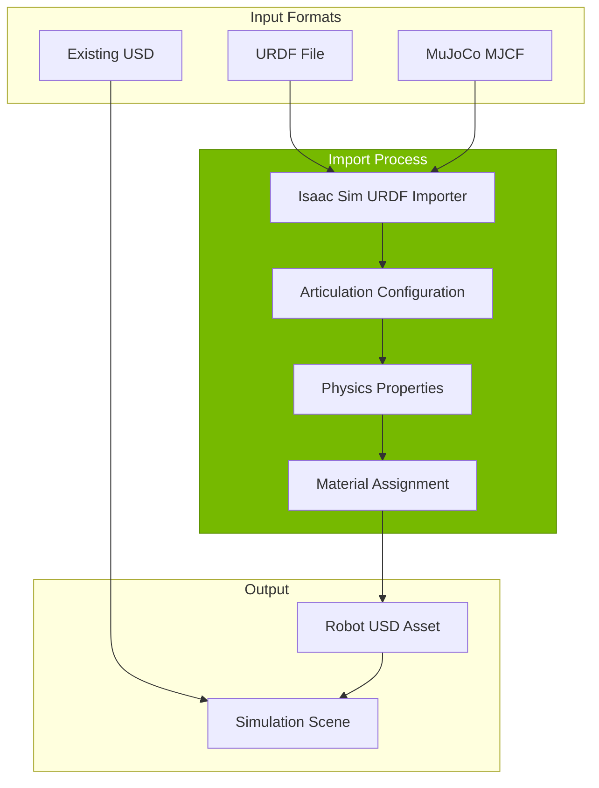
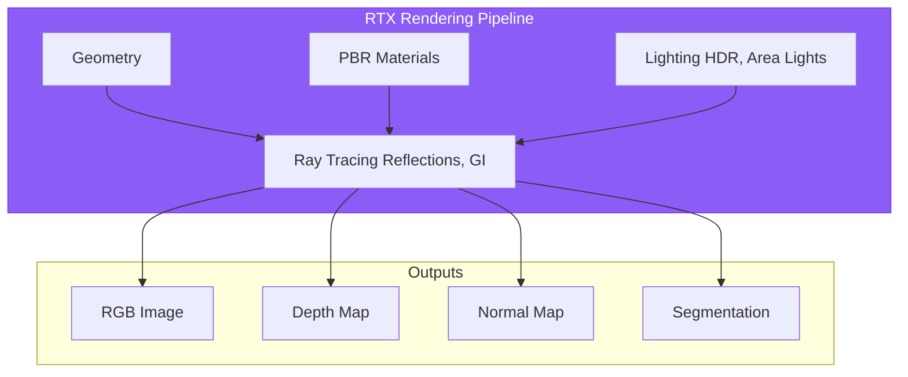
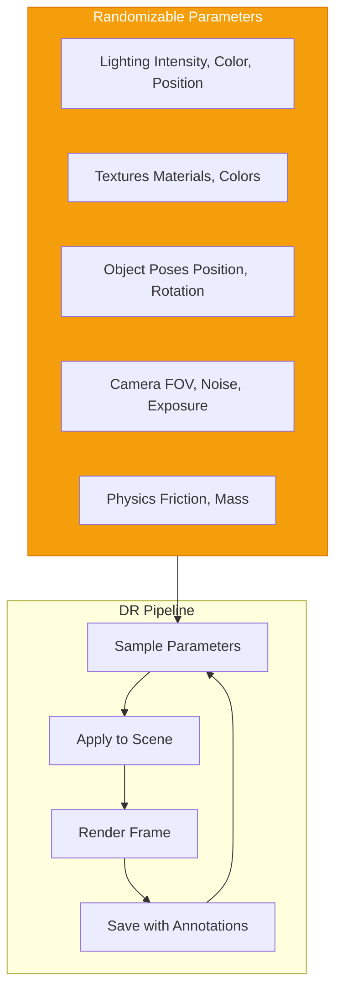

# Chapter 10: Photorealistic Simulation with Isaac Sim

## Learning Objectives

By the end of this chapter, you will be able to:

- Import URDF/USD robot models into Isaac Sim
- Configure photorealistic materials and physically-based rendering
- Create realistic indoor and outdoor environments for humanoid robots
- Implement domain randomization for sim-to-real transfer
- Generate synthetic training data for perception systems
- Understand Isaac Sim's physics engine and articulation handling

## Prerequisites

- Completed Chapter 9 (Isaac Platform Introduction)
- Isaac Sim 4.0+ installed and running
- Humanoid URDF from Module 1

---

## 10.1 Robot Import Workflows

Isaac Sim supports multiple robot import methods. The most common is converting URDF to USD.



### URDF to USD Conversion

The URDF Importer converts ROS robot descriptions to Omniverse USD:

```python
# Python script for URDF import
from omni.isaac.urdf import _urdf
from omni.isaac.core.utils.stage import add_reference_to_stage
import omni.kit.commands

# Configure import settings
import_config = _urdf.ImportConfig()
import_config.merge_fixed_joints = False
import_config.convex_decomp = True
import_config.fix_base = False
import_config.make_default_prim = True
import_config.create_physics_scene = True
import_config.default_drive_type = _urdf.UrdfJointTargetType.JOINT_DRIVE_POSITION
import_config.default_drive_strength = 1000.0
import_config.default_position_drive_damping = 100.0

# Import URDF
urdf_path = "/path/to/humanoid.urdf"
dest_path = "/World/Humanoid"

result, prim_path = omni.kit.commands.execute(
    "URDFParseAndImportFile",
    urdf_path=urdf_path,
    import_config=import_config,
    dest_path=dest_path
)

print(f"Robot imported to: {prim_path}")
```

### Import Configuration Options

| Option | Description | Recommended |
|--------|-------------|-------------|
| `merge_fixed_joints` | Combine fixed links | False (preserve structure) |
| `convex_decomp` | Decompose collision meshes | True (better physics) |
| `fix_base` | Anchor robot base | False (for mobile robots) |
| `default_drive_type` | Joint controller type | POSITION |
| `default_drive_strength` | Joint stiffness | 1000-10000 |
| `default_position_drive_damping` | Joint damping | 100-1000 |

### Articulation Configuration

After import, configure the articulation for proper physics:

```python
from omni.isaac.core.articulations import Articulation
from omni.isaac.core import World

world = World()
robot = Articulation(prim_path="/World/Humanoid")
world.scene.add(robot)

# Get articulation properties
num_dof = robot.num_dof
joint_names = robot.dof_names
print(f"Robot has {num_dof} degrees of freedom")
print(f"Joints: {joint_names}")

# Set initial joint positions
initial_positions = [0.0] * num_dof
robot.set_joint_positions(initial_positions)

# Set joint stiffness/damping
stiffness = [1000.0] * num_dof
damping = [100.0] * num_dof
robot.set_gains(kps=stiffness, kds=damping)
```

---

## 10.2 Photorealistic Materials and Rendering

Isaac Sim's RTX renderer enables photorealistic visualization crucial for perception training.



### PBR Material Setup

```python
from pxr import UsdShade, Sdf
import omni.usd

stage = omni.usd.get_context().get_stage()

# Create material
material_path = "/World/Materials/MetalMaterial"
material = UsdShade.Material.Define(stage, material_path)

# Create shader
shader = UsdShade.Shader.Define(stage, f"{material_path}/Shader")
shader.CreateIdAttr("UsdPreviewSurface")

# Set PBR properties
shader.CreateInput("diffuseColor", Sdf.ValueTypeNames.Color3f).Set((0.8, 0.8, 0.85))
shader.CreateInput("metallic", Sdf.ValueTypeNames.Float).Set(0.9)
shader.CreateInput("roughness", Sdf.ValueTypeNames.Float).Set(0.3)
shader.CreateInput("ior", Sdf.ValueTypeNames.Float).Set(1.5)

# Connect shader to material
material.CreateSurfaceOutput().ConnectToSource(shader.ConnectableAPI(), "surface")
```

### Lighting for Robotics

Professional lighting improves both visuals and perception training:

```python
from pxr import UsdLux

# Create dome light (environment/sky)
dome_light = UsdLux.DomeLight.Define(stage, "/World/Lights/DomeLight")
dome_light.CreateIntensityAttr(1000)
dome_light.CreateTextureFileAttr("omniverse://localhost/NVIDIA/Assets/Skies/Indoor/ZetoCGcom_ExhibitionHall_Interior1.hdr")

# Create rect light (area light)
rect_light = UsdLux.RectLight.Define(stage, "/World/Lights/KeyLight")
rect_light.CreateIntensityAttr(5000)
rect_light.CreateWidthAttr(2.0)
rect_light.CreateHeightAttr(2.0)
rect_light.AddTranslateOp().Set((3.0, 3.0, 4.0))
rect_light.AddRotateXYZOp().Set((-45, 30, 0))
```

### Render Settings for Training

```python
from omni.isaac.core.utils.render_product import create_render_product
from omni.syntheticdata import sensors

# Create render product (camera output)
render_product = create_render_product(
    camera_prim_path="/World/Humanoid/camera_link",
    width=640,
    height=480
)

# Configure synthetic data sensors
rgb_annotator = sensors.get_synthetic_data_interface().create_annotator("rgb")
depth_annotator = sensors.get_synthetic_data_interface().create_annotator("distance_to_camera")
seg_annotator = sensors.get_synthetic_data_interface().create_annotator("semantic_segmentation")

# Attach to render product
rgb_annotator.attach([render_product])
depth_annotator.attach([render_product])
seg_annotator.attach([render_product])
```

---

## 10.3 Building Simulation Environments

Creating realistic environments for humanoid robot testing.

### Indoor Environments

```python
from omni.isaac.core.utils.nucleus import get_assets_root_path
from omni.isaac.core.utils.stage import add_reference_to_stage

# Get NVIDIA assets path
assets_root = get_assets_root_path()

# Add warehouse environment
warehouse_path = f"{assets_root}/Isaac/Environments/Simple_Warehouse/warehouse.usd"
add_reference_to_stage(warehouse_path, "/World/Environment")

# Add furniture from asset library
table_path = f"{assets_root}/Isaac/Props/Furniture/Table.usd"
add_reference_to_stage(table_path, "/World/Props/Table")

# Position furniture
import omni.kit.commands
omni.kit.commands.execute(
    "TransformPrimCommand",
    path="/World/Props/Table",
    new_transform=(
        (1, 0, 0, 2.0),
        (0, 1, 0, 0.0),
        (0, 0, 1, 0.0),
        (0, 0, 0, 1)
    )
)
```

### Environment Composition

```
Scene Hierarchy:
/World
├── Environment
│   └── warehouse (reference)
├── Props
│   ├── Table
│   ├── Chair
│   └── Boxes (multiple)
├── Humanoid
│   └── (robot articulation)
├── Lights
│   ├── DomeLight
│   ├── KeyLight
│   └── FillLights
└── Cameras
    ├── TrackingCamera
    └── OverviewCamera
```

---

## 10.4 Domain Randomization Fundamentals

**Domain randomization** varies simulation parameters to train robust perception systems that transfer to the real world.



### Implementing Domain Randomization

```python
import numpy as np
from omni.isaac.core.utils.prims import get_prim_at_path
from pxr import UsdLux, UsdShade

class DomainRandomizer:
    """Domain randomization for perception training."""

    def __init__(self, stage):
        self.stage = stage
        self.rng = np.random.default_rng()

    def randomize_lighting(self):
        """Randomize scene lighting."""
        # Get dome light
        dome_light = UsdLux.DomeLight(
            get_prim_at_path("/World/Lights/DomeLight")
        )

        # Random intensity (500-2000)
        intensity = self.rng.uniform(500, 2000)
        dome_light.GetIntensityAttr().Set(intensity)

        # Random color temperature (3000K-7000K)
        temp = self.rng.uniform(3000, 7000)
        color = self._kelvin_to_rgb(temp)
        dome_light.GetColorAttr().Set(color)

    def randomize_textures(self, prim_paths: list):
        """Randomize material colors."""
        for path in prim_paths:
            prim = get_prim_at_path(path)
            if prim.IsValid():
                # Random color variation
                base_color = self.rng.uniform(0.3, 1.0, size=3)
                self._set_material_color(prim, base_color)

    def randomize_object_poses(self, prim_paths: list, bounds: dict):
        """Randomize object positions within bounds."""
        for path in prim_paths:
            prim = get_prim_at_path(path)
            if prim.IsValid():
                x = self.rng.uniform(bounds['x_min'], bounds['x_max'])
                y = self.rng.uniform(bounds['y_min'], bounds['y_max'])
                z = bounds.get('z', 0)
                rotation = self.rng.uniform(0, 360)

                # Apply transform
                # ...

    def randomize_camera_noise(self, camera_path: str):
        """Add realistic camera noise."""
        # Gaussian noise simulation
        noise_level = self.rng.uniform(0.01, 0.05)
        # Apply via post-process or annotator

    def randomize_all(self):
        """Apply all randomizations."""
        self.randomize_lighting()
        self.randomize_textures(["/World/Props/Table", "/World/Props/Chair"])
        self.randomize_object_poses(
            ["/World/Props/Box1", "/World/Props/Box2"],
            {'x_min': -2, 'x_max': 2, 'y_min': -2, 'y_max': 2}
        )

    @staticmethod
    def _kelvin_to_rgb(kelvin):
        """Convert color temperature to RGB."""
        # Simplified approximation
        temp = kelvin / 100
        if temp <= 66:
            r = 1.0
            g = max(0, min(1, 0.39 * np.log(temp) - 0.63))
            b = max(0, min(1, 0.54 * np.log(temp - 10) - 1.19)) if temp > 19 else 0
        else:
            r = max(0, min(1, 1.29 * ((temp - 60) ** -0.13)))
            g = max(0, min(1, 1.13 * ((temp - 60) ** -0.08)))
            b = 1.0
        return (r, g, b)
```

### Domain Randomization Parameters

| Parameter | Range | Purpose |
|-----------|-------|---------|
| **Light intensity** | 500-5000 | Exposure variation |
| **Light color** | 3000K-7000K | Color balance |
| **Light position** | ±2m | Shadow variation |
| **Object color** | ±20% | Appearance variation |
| **Object pose** | Scene bounds | Detection robustness |
| **Camera noise** | σ=0.01-0.05 | Sensor realism |
| **Motion blur** | 0-5ms | Dynamic scenes |

---

## 10.5 Synthetic Data Generation

Generate annotated datasets for training perception models.

```mermaid
flowchart LR
    subgraph Scene["Scene Setup"]
        ENV[Environment]
        ROBOT[Robot]
        OBJECTS[Objects]
    end

    subgraph DR["Domain Rand"]
        RAND[Randomize Parameters]
    end

    subgraph Render["Rendering"]
        RGB[RGB Image]
        DEPTH[Depth Map]
        SEG[Segmentation]
        BBOX[Bounding Boxes]
    end

    subgraph Export["Export"]
        COCO[COCO Format]
        KITTI[KITTI Format]
        CUSTOM[Custom Format]
    end

    Scene --> DR
    DR --> Render
    Render --> Export

    style Render fill:#3b82f6,stroke:#2563eb,color:#fff
    style Export fill:#22c55e,stroke:#16a34a,color:#fff
```



### Synthetic Data Writer

```python
from omni.replicator.core import ReplicatorItem
import omni.replicator.core as rep

# Configure writer
writer = rep.WriterRegistry.get("BasicWriter")
writer.initialize(
    output_dir="/path/to/dataset",
    rgb=True,
    bounding_box_2d_tight=True,
    semantic_segmentation=True,
    distance_to_camera=True
)

# Create render product
camera = rep.create.camera(position=(3, 3, 2), look_at=(0, 0, 0.5))
render_product = rep.create.render_product(camera, (640, 480))

# Attach writer
writer.attach([render_product])

# Generate data with randomization
with rep.trigger.on_frame(num_frames=1000):
    # Randomize scene
    rep.randomizer.randomize_lights()
    rep.randomizer.randomize_materials()

    # Render and save
    rep.orchestrator.step()
```

### Dataset Format: COCO

```json
{
  "images": [
    {
      "id": 1,
      "file_name": "rgb_000001.png",
      "width": 640,
      "height": 480
    }
  ],
  "annotations": [
    {
      "id": 1,
      "image_id": 1,
      "category_id": 1,
      "bbox": [100, 200, 50, 80],
      "area": 4000,
      "segmentation": [[...]]
    }
  ],
  "categories": [
    {"id": 1, "name": "robot"},
    {"id": 2, "name": "table"},
    {"id": 3, "name": "box"}
  ]
}
```

---

## 10.6 Physics Configuration for Humanoids

Proper physics setup is critical for realistic humanoid behavior.

### Articulation Physics

```python
from pxr import UsdPhysics, PhysxSchema

# Get robot prim
robot_prim = stage.GetPrimAtPath("/World/Humanoid")

# Configure articulation root
articulation_api = UsdPhysics.ArticulationRootAPI.Apply(robot_prim)

# Set PhysX-specific properties
physx_api = PhysxSchema.PhysxArticulationAPI.Apply(robot_prim)
physx_api.CreateEnabledSelfCollisionsAttr(False)
physx_api.CreateSolverPositionIterationCountAttr(32)
physx_api.CreateSolverVelocityIterationCountAttr(16)
```

### Joint Configuration

```python
# Configure each joint
for joint_name in robot.dof_names:
    joint_prim = stage.GetPrimAtPath(f"/World/Humanoid/{joint_name}")

    # Apply drive API
    drive_api = UsdPhysics.DriveAPI.Apply(joint_prim, "angular")
    drive_api.CreateTypeAttr("force")
    drive_api.CreateStiffnessAttr(1000.0)
    drive_api.CreateDampingAttr(100.0)
    drive_api.CreateMaxForceAttr(1000.0)
```

### Contact and Collision

```python
# Enable contact reporting
from omni.isaac.core.utils.physics import enable_contact_report

enable_contact_report(
    prim_path="/World/Humanoid/left_foot",
    callback=on_foot_contact
)

def on_foot_contact(contact_data):
    """Handle foot contact events."""
    for contact in contact_data:
        print(f"Contact force: {contact.impulse}")
```

---

## 10.7 Hands-on: Creating a Perception Training Environment

Let's build a complete environment for training humanoid perception.

### Step 1: Create the Scene

```python
from omni.isaac.core import World
from omni.isaac.core.utils.stage import add_reference_to_stage
from omni.isaac.core.utils.nucleus import get_assets_root_path

# Initialize world
world = World(stage_units_in_meters=1.0)
world.scene.add_default_ground_plane()

# Add warehouse environment
assets_root = get_assets_root_path()
add_reference_to_stage(
    f"{assets_root}/Isaac/Environments/Simple_Warehouse/warehouse.usd",
    "/World/Environment"
)

# Import humanoid
# (Use URDF importer as shown in 10.1)

world.reset()
```

### Step 2: Configure Domain Randomization

```python
# Initialize randomizer
randomizer = DomainRandomizer(world.stage)

# Define randomization bounds
object_bounds = {
    'x_min': -3, 'x_max': 3,
    'y_min': -3, 'y_max': 3,
    'z': 0.5
}
```

### Step 3: Set Up Data Collection

```python
# Configure synthetic data generation
import omni.replicator.core as rep

# Camera attached to robot head
robot_camera = "/World/Humanoid/head/camera"

# Create render product
rp = rep.create.render_product(robot_camera, (640, 480))

# Configure writer
writer = rep.WriterRegistry.get("BasicWriter")
writer.initialize(
    output_dir="/data/humanoid_perception_dataset",
    rgb=True,
    distance_to_camera=True,
    semantic_segmentation=True,
    bounding_box_2d_tight=True
)
writer.attach([rp])
```

### Step 4: Generate Dataset

```python
# Generate 10,000 training samples
num_samples = 10000

for i in range(num_samples):
    # Apply domain randomization
    randomizer.randomize_all()

    # Step simulation
    world.step(render=True)

    # Capture data
    rep.orchestrator.step()

    if i % 100 == 0:
        print(f"Generated {i}/{num_samples} samples")

print("Dataset generation complete!")
```

---

## 10.8 Common Errors and Solutions

### Error: URDF Import Missing Meshes

```
[Warning] Mesh file not found: package://humanoid_description/meshes/torso.stl
```

**Solution**: Use absolute paths or set up package path:
```python
import_config.import_inertia_tensor = True
import_config.default_mesh_approximation = "convexDecomposition"
# Use absolute paths in URDF before import
```

### Error: Robot Falls Through Ground

**Solution**: Ensure collision enabled:
```python
from pxr import UsdPhysics
collision_api = UsdPhysics.CollisionAPI.Apply(robot_prim)
```

### Error: Joints Not Moving

**Solution**: Check drive configuration:
```python
# Verify drive API is applied
drive_api = UsdPhysics.DriveAPI.Get(joint_prim, "angular")
if not drive_api:
    drive_api = UsdPhysics.DriveAPI.Apply(joint_prim, "angular")
```

### Error: Rendering Artifacts

**Solution**: Adjust ray tracing settings:
```
Render Settings → Path Tracing
- Max Bounces: 4 (increase for transparency)
- Samples Per Pixel: 64+ for quality
```

---

## Exercises

### Exercise 10.1: Import Humanoid URDF to USD (Basic)

**Objective**: Successfully import your humanoid robot into Isaac Sim.

**Tasks**:
1. Open Isaac Sim and create new stage
2. Use URDF Importer to import humanoid.urdf
3. Configure import settings appropriately
4. Verify robot appears and joints work
5. Save as USD file

**Success Criteria**: Robot visible, movable, physics works.

---

### Exercise 10.2: Configure PBR Materials (Basic)

**Objective**: Create realistic materials for robot parts.

**Tasks**:
1. Create metal material (high metallic)
2. Create plastic material (low metallic)
3. Apply to appropriate robot links
4. Add environment lighting
5. Compare visual quality

**Deliverable**: Screenshot comparison before/after materials.

---

### Exercise 10.3: Create Indoor Environment (Intermediate)

**Objective**: Build a realistic environment for humanoid testing.

**Tasks**:
1. Load warehouse or office environment
2. Add furniture (tables, chairs, shelves)
3. Add objects for manipulation (boxes, cups)
4. Configure professional lighting
5. Position humanoid robot in scene

**Deliverable**: Rendered scene image with robot.

---

### Exercise 10.4: Domain Randomization Pipeline (Advanced)

**Objective**: Build a complete synthetic data generation pipeline.

**Tasks**:
1. Implement lighting randomization
2. Implement texture randomization
3. Implement object pose randomization
4. Configure data writer for COCO format
5. Generate 1000 training samples
6. Verify annotations are correct

**Deliverable**: Dataset folder with images and annotations.

---

## Summary

In this chapter, you learned:

- **URDF to USD import**: Converting ROS robots to Omniverse format
- **PBR materials**: Creating photorealistic robot appearance
- **Environment building**: Composing complex scenes from assets
- **Domain randomization**: Varying parameters for robust training
- **Synthetic data generation**: Creating annotated datasets
- **Physics configuration**: Setting up articulated humanoid physics

### Key Takeaways

1. **USD format** enables rich scene composition
2. **Photorealistic rendering** improves perception model transfer
3. **Domain randomization** is essential for sim-to-real
4. **Synthetic data** can train perception without manual labeling
5. **Physics tuning** requires careful articulation configuration

### What's Next

In Chapter 11, we'll use **Isaac ROS** for GPU-accelerated perception, including visual SLAM, 3D reconstruction, and object detection.

---

## Further Reading

- [Isaac Sim Robot Import Guide](https://docs.omniverse.nvidia.com/app_isaacsim/app_isaacsim/tutorial_core_adding_robot.html)
- [Omniverse Replicator Documentation](https://docs.omniverse.nvidia.com/app_isaacsim/app_isaacsim/tutorial_replicator_getting_started.html)
- Tobin et al. (2017). "Domain Randomization for Transferring DNNs from Simulation to Real World"
- [NVIDIA Isaac Sim Tutorials](https://docs.omniverse.nvidia.com/app_isaacsim/app_isaacsim/tutorials_toc.html)
