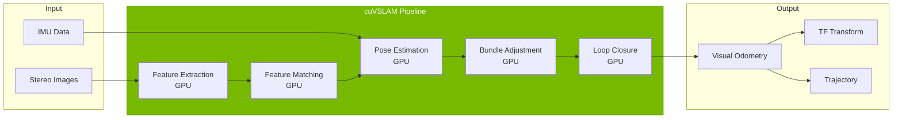
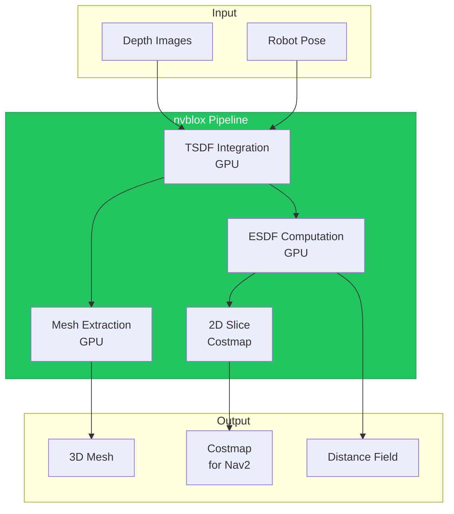
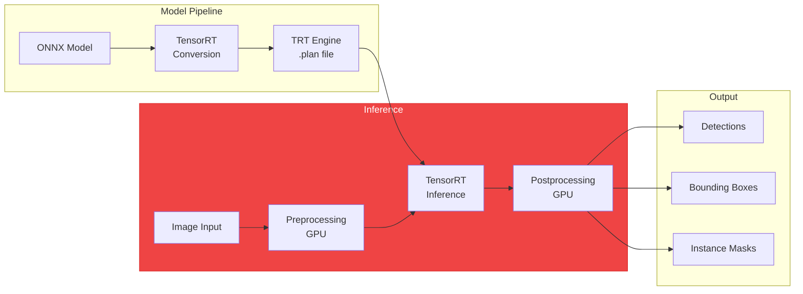

# Chapter 11: Isaac ROS for Robot Perception

## Learning Objectives

By the end of this chapter, you will be able to:

- Understand Isaac ROS architecture and GPU acceleration benefits
- Configure and run Isaac ROS VSLAM for humanoid localization
- Process depth camera data with Isaac ROS depth nodes
- Integrate Isaac ROS object detection into perception pipelines
- Visualize perception outputs in RViz2 and Foxglove
- Optimize perception performance for real-time operation

## Prerequisites

- Completed Chapter 10 (Isaac Sim)
- Isaac ROS packages installed
- Understanding of ROS 2 perception concepts

---

## 11.1 Isaac ROS Architecture

Isaac ROS provides GPU-accelerated ROS 2 packages that dramatically speed up perception tasks.

```mermaid
flowchart TD
    subgraph Sensors["Sensor Input"]
        STEREO[Stereo Camera]
        DEPTH[Depth Camera]
        IMU[IMU]
    end

    subgraph NITROS["NITROS Transport Layer"]
        TYPEAD[Type Adaptation]
        ZEROCOPY[Zero-Copy GPU]
    end

    subgraph Perception["Isaac ROS Perception"]
        VSLAM[cuVSLAM<br/>Visual SLAM]
        NVBLOX[nvblox<br/>3D Reconstruction]
        DNN[DNN Inference<br/>TensorRT]
        DEPTH_PROC[Depth Processing<br/>GPU Accelerated]
    end

    subgraph Output["ROS 2 Output"]
        POSE[/tf, /odom]
        MAP[/costmap]
        DETECT[/detections]
    end

    Sensors --> NITROS
    NITROS --> Perception
    Perception --> Output

    style NITROS fill:#76b900,stroke:#5a8f00,color:#fff
    style Perception fill:#3b82f6,stroke:#2563eb,color:#fff
```

### NITROS: The Speed Advantage

**NITROS (NVIDIA Isaac Transport for ROS)** eliminates CPU-GPU data copies:

| Transfer Type | Traditional ROS 2 | NITROS |
|--------------|------------------|--------|
| GPU → GPU | ~10ms | ~0.1ms |
| Memory Copy | Required | Zero-copy |
| Latency | High | Minimal |
| Throughput | Limited | Full bandwidth |

### Key Isaac ROS Packages

| Package | Function | Speedup |
|---------|----------|---------|
| `isaac_ros_visual_slam` | cuVSLAM odometry | 10-50x |
| `isaac_ros_nvblox` | 3D occupancy mapping | 20-100x |
| `isaac_ros_dnn_inference` | TensorRT inference | 5-20x |
| `isaac_ros_apriltag` | Fiducial detection | 5-10x |
| `isaac_ros_image_pipeline` | Image processing | 10-30x |

---

## 11.2 Visual SLAM with cuVSLAM

**cuVSLAM** is NVIDIA's GPU-accelerated visual SLAM for real-time localization.



### Launching cuVSLAM

```python
# File: launch/vslam_humanoid.launch.py
from launch import LaunchDescription
from launch_ros.actions import Node, ComposableNodeContainer
from launch_ros.descriptions import ComposableNode

def generate_launch_description():
    # cuVSLAM node
    vslam_node = ComposableNode(
        package='isaac_ros_visual_slam',
        plugin='nvidia::isaac_ros::visual_slam::VisualSlamNode',
        name='visual_slam',
        parameters=[{
            'enable_imu_fusion': True,
            'enable_debug_mode': False,
            'debug_dump_path': '/tmp/vslam_debug',
            'input_base_frame': 'base_link',
            'input_left_camera_frame': 'camera_left',
            'input_right_camera_frame': 'camera_right',
            'input_imu_frame': 'imu_link',
            # Performance tuning
            'num_cameras': 2,
            'min_num_landmarks': 25,
            'max_num_landmarks': 1000,
        }],
        remappings=[
            ('stereo_camera/left/image', '/humanoid/camera/left/image_raw'),
            ('stereo_camera/right/image', '/humanoid/camera/right/image_raw'),
            ('stereo_camera/left/camera_info', '/humanoid/camera/left/camera_info'),
            ('stereo_camera/right/camera_info', '/humanoid/camera/right/camera_info'),
            ('visual_slam/imu', '/humanoid/imu'),
        ]
    )

    # Container for NITROS acceleration
    container = ComposableNodeContainer(
        name='vslam_container',
        namespace='',
        package='rclcpp_components',
        executable='component_container_mt',
        composable_node_descriptions=[vslam_node],
        output='screen'
    )

    return LaunchDescription([container])
```

### cuVSLAM Parameters

| Parameter | Description | Recommended |
|-----------|-------------|-------------|
| `enable_imu_fusion` | Use IMU for better accuracy | True |
| `num_cameras` | Number of camera inputs | 2 (stereo) |
| `min_num_landmarks` | Minimum tracked features | 25 |
| `max_num_landmarks` | Maximum tracked features | 1000 |
| `enable_localization_n_mapping` | Full SLAM or odometry only | True |

---

## 11.3 Depth Processing with nvblox

**nvblox** creates 3D occupancy maps and meshes from depth data at GPU speed.



### nvblox Configuration

```yaml
# File: config/nvblox_params.yaml
nvblox_node:
  ros__parameters:
    # Map parameters
    voxel_size: 0.05  # 5cm voxels
    max_tsdf_distance: 4.0  # Max integration distance

    # Performance
    global_frame: "odom"
    esdf_update_rate_hz: 10.0
    mesh_update_rate_hz: 5.0

    # Costmap output
    slice_height: 0.1  # Height for 2D costmap
    costmap_update_rate_hz: 10.0

    # Memory management
    clear_map_outside_radius_m: 10.0
```

### Launching nvblox

```python
nvblox_node = ComposableNode(
    package='isaac_ros_nvblox',
    plugin='nvidia::isaac_ros::nvblox::NvbloxNode',
    name='nvblox_node',
    parameters=[nvblox_config],
    remappings=[
        ('depth/image', '/humanoid/camera/depth'),
        ('depth/camera_info', '/humanoid/camera/depth/camera_info'),
        ('color/image', '/humanoid/camera/rgb'),
        ('color/camera_info', '/humanoid/camera/rgb/camera_info'),
    ]
)
```

---

## 11.4 Object Detection Acceleration

Isaac ROS accelerates DNN inference with TensorRT.



### Detection Node Configuration

```python
detection_node = ComposableNode(
    package='isaac_ros_dnn_inference',
    plugin='nvidia::isaac_ros::dnn_inference::DnnImageEncoderNode',
    name='dnn_encoder',
    parameters=[{
        'input_image_width': 640,
        'input_image_height': 480,
        'network_image_width': 640,
        'network_image_height': 480,
        'image_mean': [0.485, 0.456, 0.406],
        'image_stddev': [0.229, 0.224, 0.225],
    }],
    remappings=[
        ('image', '/humanoid/camera/rgb'),
        ('encoded_tensor', '/tensor_pub')
    ]
)

tensorrt_node = ComposableNode(
    package='isaac_ros_tensor_rt',
    plugin='nvidia::isaac_ros::dnn_inference::TensorRTNode',
    name='tensorrt',
    parameters=[{
        'model_file_path': '/models/ssd_mobilenet.onnx',
        'engine_file_path': '/models/ssd_mobilenet.plan',
        'input_tensor_names': ['input'],
        'input_binding_names': ['input'],
        'output_tensor_names': ['scores', 'boxes'],
        'output_binding_names': ['scores', 'boxes'],
    }]
)
```

---

## 11.5 Integrating Isaac ROS with Standard ROS 2

Isaac ROS nodes work seamlessly with standard ROS 2 pipelines.

```python
# Full perception pipeline launch
def generate_launch_description():
    return LaunchDescription([
        # Isaac ROS VSLAM
        vslam_container,

        # Isaac ROS nvblox
        nvblox_container,

        # Isaac ROS object detection
        detection_container,

        # Standard ROS 2 nodes
        Node(
            package='robot_state_publisher',
            executable='robot_state_publisher',
            parameters=[{'robot_description': robot_description}]
        ),

        # Custom perception aggregator
        Node(
            package='humanoid_perception',
            executable='perception_aggregator',
            parameters=[{
                'use_vslam': True,
                'use_nvblox': True,
                'use_detection': True,
            }]
        ),
    ])
```

---

## 11.6 Perception Data Visualization

### RViz2 Configuration

```yaml
# File: config/perception_rviz.rviz
Visualization Manager:
  Displays:
    - Class: rviz_default_plugins/TF
      Name: TF
      Enabled: true

    - Class: rviz_default_plugins/PointCloud2
      Name: nvblox_pointcloud
      Topic: /nvblox_node/pointcloud
      Size: 0.02

    - Class: rviz_default_plugins/Map
      Name: Costmap
      Topic: /nvblox_node/costmap

    - Class: vision_msgs/Detection2DArray
      Name: Detections
      Topic: /detections

    - Class: nav_msgs/Path
      Name: VSLAM Trajectory
      Topic: /visual_slam/tracking/odometry_path
```

### Foxglove Studio

For advanced visualization, Foxglove provides:
- 3D scene with point clouds
- Image panels with detection overlays
- Real-time plotting of metrics
- Recording and playback

---

## 11.7 Hands-on: Building a Perception Pipeline

Complete perception pipeline for humanoid navigation.

```python
# File: perception_pipeline.py
import rclpy
from rclpy.node import Node
from sensor_msgs.msg import Image, PointCloud2
from geometry_msgs.msg import PoseStamped
from vision_msgs.msg import Detection2DArray

class PerceptionPipeline(Node):
    def __init__(self):
        super().__init__('perception_pipeline')

        # Subscribers
        self.pose_sub = self.create_subscription(
            PoseStamped, '/visual_slam/tracking/pose',
            self.pose_callback, 10)

        self.detection_sub = self.create_subscription(
            Detection2DArray, '/detections',
            self.detection_callback, 10)

        self.costmap_sub = self.create_subscription(
            PointCloud2, '/nvblox_node/pointcloud',
            self.costmap_callback, 10)

        # State
        self.current_pose = None
        self.detected_objects = []

        self.get_logger().info('Perception pipeline initialized')

    def pose_callback(self, msg):
        self.current_pose = msg.pose
        self.get_logger().debug(f'Pose: {msg.pose.position}')

    def detection_callback(self, msg):
        self.detected_objects = msg.detections
        self.get_logger().info(f'Detected {len(msg.detections)} objects')

    def costmap_callback(self, msg):
        # Process costmap updates
        pass

def main():
    rclpy.init()
    node = PerceptionPipeline()
    rclpy.spin(node)
```

---

## 11.8 Common Errors and Solutions

### Error: cuVSLAM Not Tracking

**Solution**: Ensure good feature visibility:
- Check camera calibration
- Verify stereo baseline
- Ensure adequate lighting

### Error: nvblox High Latency

**Solution**: Reduce voxel resolution:
```yaml
voxel_size: 0.1  # Increase from 0.05
```

### Error: TensorRT Conversion Failed

**Solution**: Check ONNX compatibility:
```bash
polygraphy run model.onnx --trt
```

---

## Exercises

### Exercise 11.1: Launch cuVSLAM (Basic)
Configure and run cuVSLAM with stereo cameras in Isaac Sim.

### Exercise 11.2: Configure nvblox (Intermediate)
Set up nvblox occupancy mapping and visualize in RViz2.

### Exercise 11.3: Add Object Detection (Intermediate)
Integrate TensorRT object detection into the pipeline.

### Exercise 11.4: Full Perception Pipeline (Advanced)
Build complete perception pipeline with VSLAM + nvblox + detection.

---

## Summary

- **Isaac ROS** provides GPU-accelerated perception
- **NITROS** enables zero-copy GPU data transfer
- **cuVSLAM** offers real-time visual odometry
- **nvblox** creates 3D maps from depth data
- **TensorRT** accelerates DNN inference

### What's Next

Chapter 12 covers **Nav2 for bipedal humanoid navigation**.
