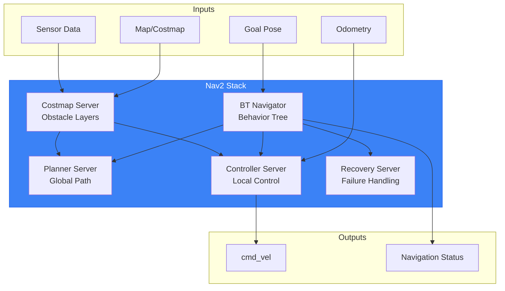
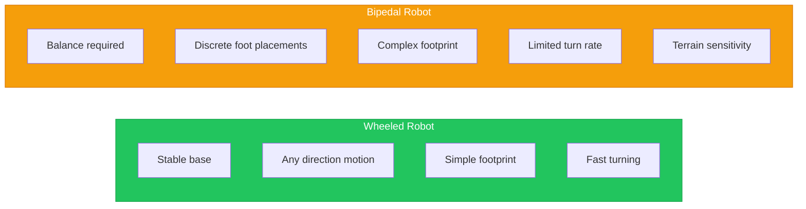
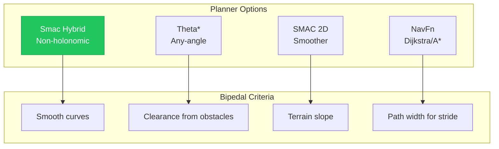
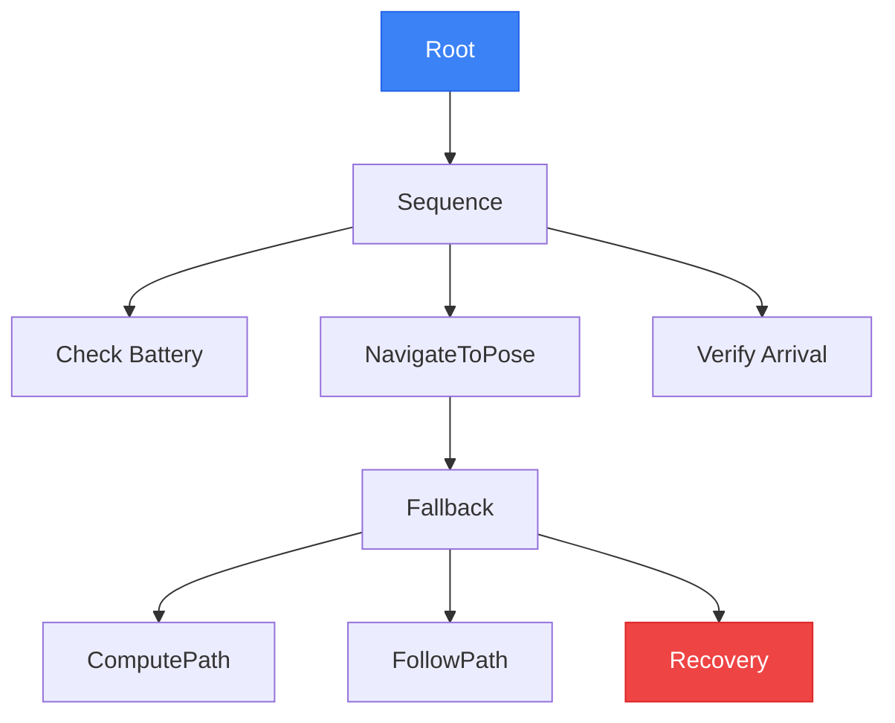

# Chapter 12: Nav2 for Bipedal Humanoid Navigation

## Learning Objectives

By the end of this chapter, you will be able to:

- Understand Nav2 architecture and behavior tree concepts
- Configure Nav2 for bipedal robot constraints (stride, balance, terrain)
- Implement costmaps and planners for humanoid navigation
- Create behavior trees for complex navigation tasks
- Handle recovery behaviors for bipedal-specific failures
- Integrate Nav2 with Isaac ROS perception for complete autonomy

## Prerequisites

- Completed Chapter 11 (Isaac ROS Perception)
- Understanding of ROS 2 navigation concepts
- Working perception pipeline from previous chapter

---

## 12.1 Nav2 Architecture Review

**Nav2** is the ROS 2 navigation stack, providing path planning, obstacle avoidance, and behavior coordination.



### Nav2 Components

| Component | Function | Humanoid Consideration |
|-----------|----------|----------------------|
| **BT Navigator** | Coordinates navigation | Custom BT for bipedal |
| **Planner** | Global path planning | Footstep-aware paths |
| **Controller** | Local trajectory following | Balance-aware control |
| **Costmap** | Obstacle representation | Narrow robot footprint |
| **Recovery** | Failure handling | Balance recovery |

---

## 12.2 Bipedal Navigation Challenges

Humanoid robots face unique navigation challenges compared to wheeled robots.



### Key Bipedal Constraints

| Constraint | Description | Nav2 Impact |
|------------|-------------|-------------|
| **Stride length** | Maximum step size (~0.5m) | Path discretization |
| **Turn radius** | In-place turning limited | Smooth path curves |
| **Step height** | Maximum obstacle step (~0.2m) | Costmap thresholds |
| **Balance time** | Time to stabilize after step | Velocity limits |
| **Slope limit** | Maximum walkable incline (~15°) | Traversability layer |

### Gait Considerations

```python
# Bipedal gait parameters
BIPEDAL_PARAMS = {
    'max_stride_length': 0.4,      # meters
    'nominal_stride_length': 0.3,   # meters
    'stride_width': 0.2,            # meters
    'step_duration': 0.8,           # seconds
    'max_step_height': 0.15,        # meters
    'max_turn_rate': 0.5,           # rad/s
    'balance_time': 0.2,            # seconds
    'max_slope': 0.26,              # radians (~15 degrees)
}
```

---

## 12.3 Configuring Costmaps for Humanoids

Costmaps must account for the unique footprint and traversability of bipedal robots.

### Humanoid Footprint

```yaml
# File: config/nav2_params.yaml
local_costmap:
  local_costmap:
    ros__parameters:
      # Footprint: Standing humanoid
      # Approximate bounding box during walking
      footprint: "[[0.15, 0.1], [0.15, -0.1], [-0.15, -0.1], [-0.15, 0.1]]"

      # Or use radius for simpler planning
      # robot_radius: 0.25

      # Inflation parameters
      inflation_layer:
        inflation_radius: 0.5
        cost_scaling_factor: 3.0

      # Update rates (slower for bipedal stability)
      update_frequency: 5.0
      publish_frequency: 2.0

      # Resolution
      resolution: 0.05

      # Rolling window
      width: 5
      height: 5
      rolling_window: true
```

### Costmap Layers for Bipedal

```yaml
local_costmap:
  local_costmap:
    ros__parameters:
      plugins: ["static_layer", "obstacle_layer", "traversability_layer", "inflation_layer"]

      # Obstacle layer from sensors
      obstacle_layer:
        plugin: "nav2_costmap_2d::ObstacleLayer"
        enabled: True
        observation_sources: scan depth
        scan:
          topic: /humanoid/lidar_2d
          max_obstacle_height: 2.0
          clearing: True
          marking: True
        depth:
          topic: /nvblox_node/costmap
          sensor_frame: camera_link
          clearing: True
          marking: True

      # Custom traversability for steps/slopes
      traversability_layer:
        plugin: "nav2_costmap_2d::TraversabilityLayer"
        enabled: True
        max_step_height: 0.15
        max_slope: 0.26
```

---

## 12.4 Path Planning for Bipedal Robots

Path planners must generate smooth, walkable paths.



### Recommended: SMAC Hybrid-A*

```yaml
planner_server:
  ros__parameters:
    expected_planner_frequency: 1.0
    planner_plugins: ["GridBased"]
    GridBased:
      plugin: "nav2_smac_planner/SmacPlannerHybrid"

      # Bipedal-specific settings
      minimum_turning_radius: 0.3      # Meters
      allow_primitive_interpolation: false
      smooth_path: true

      # Motion primitives for walking
      motion_model_for_search: "DUBIN"
      angle_quantization_bins: 72

      # Cost settings
      cost_travel_multiplier: 2.0
      cost_penalty: 2.0

      # Path optimization
      analytic_expansion_ratio: 3.5
      max_planning_time: 5.0
```

### Controller for Bipedal

```yaml
controller_server:
  ros__parameters:
    controller_frequency: 10.0  # Lower than wheeled (smoother)
    controller_plugins: ["FollowPath"]

    FollowPath:
      plugin: "dwb_core::DWBLocalPlanner"

      # Velocity limits for bipedal
      max_vel_x: 0.3           # Slow walking speed
      min_vel_x: 0.0
      max_vel_theta: 0.5       # Limited rotation
      min_vel_theta: -0.5
      acc_lim_x: 0.5           # Gentle acceleration
      acc_lim_theta: 0.5
      decel_lim_x: -0.5
      decel_lim_theta: -0.5

      # Critics for bipedal
      critics: ["RotateToGoal", "Oscillation", "BaseObstacle", "GoalAlign", "PathAlign", "PathDist", "GoalDist"]

      # Stability-focused scoring
      PathAlign.scale: 32.0
      GoalAlign.scale: 24.0
      PathDist.scale: 32.0
      GoalDist.scale: 24.0
```

---

## 12.5 Behavior Trees for Humanoid Tasks

Behavior trees coordinate complex navigation sequences.



### Custom Behavior Tree for Humanoid

```xml
<!-- File: behavior_tree.xml -->
<root main_tree_to_execute="HumanoidNav">
  <BehaviorTree ID="HumanoidNav">
    <RecoveryNode number_of_retries="3" name="NavigateWithRecovery">
      <PipelineSequence name="NavigateSequence">

        <!-- Check robot is stable before navigation -->
        <Condition ID="IsStable" name="check_stability"/>

        <!-- Rate limit path commands for walking -->
        <RateController hz="2">
          <Sequence name="NavigateAction">

            <!-- Compute global path -->
            <ComputePathToPose goal="{goal}"
                               path="{path}"
                               planner_id="GridBased"/>

            <!-- Follow path with bipedal controller -->
            <FollowPath path="{path}"
                        controller_id="FollowPath"/>

          </Sequence>
        </RateController>

      </PipelineSequence>

      <!-- Recovery actions for bipedal failures -->
      <ReactiveFallback name="RecoveryFallback">
        <AlwaysFailure/>
        <SequenceNode name="RecoverySequence">

          <!-- Try balance recovery first -->
          <Action ID="BalanceRecovery" name="balance_recovery"/>

          <!-- Clear costmap -->
          <ClearEntireCostmap name="ClearCostmaps"
                              service_name="local_costmap/clear_entirely_local_costmap"/>

          <!-- Backup slightly -->
          <BackUp backup_dist="0.1"
                  backup_speed="0.1"
                  name="backup"/>

          <!-- Wait for stability -->
          <Wait wait_duration="2"/>

        </SequenceNode>
      </ReactiveFallback>

    </RecoveryNode>
  </BehaviorTree>
</root>
```

---

## 12.6 Recovery Behaviors for Bipedal Failures

Bipedal robots need specialized recovery behaviors.

### Common Failure Modes

| Failure | Cause | Recovery |
|---------|-------|----------|
| **Loss of balance** | Unexpected obstacle | Balance recovery, wait |
| **Path blocked** | Dynamic obstacle | Replan, backup |
| **Slip detected** | Low friction surface | Reduce speed, stop |
| **Step failed** | Terrain mismatch | Backup, replan |
| **Localization lost** | Visual features lost | Stop, relocalize |

### Custom Recovery Plugin

```cpp
// File: balance_recovery.cpp
#include "nav2_core/recovery.hpp"

class BalanceRecovery : public nav2_core::Recovery {
public:
  void configure(rclcpp_lifecycle::LifecycleNode::WeakPtr parent,
                 const std::string& name,
                 std::shared_ptr<tf2_ros::Buffer> tf,
                 std::shared_ptr<nav2_costmap_2d::CostmapTopicCollisionChecker> cc,
                 std::shared_ptr<nav2_costmap_2d::Costmap2DROS> costmap_ros) override {
    node_ = parent.lock();
    // Configure balance recovery parameters
  }

  Status onRun(const std::shared_ptr<const Action::Goal> command) override {
    RCLCPP_INFO(node_->get_logger(), "Starting balance recovery");

    // 1. Stop all motion
    publishZeroVelocity();

    // 2. Enter balance stance
    enterBalanceStance();

    // 3. Wait for stability
    rclcpp::sleep_for(std::chrono::seconds(2));

    // 4. Check IMU for stability
    if (isStable()) {
      return Status::SUCCEEDED;
    }
    return Status::FAILED;
  }

private:
  void enterBalanceStance() {
    // Command robot to stable standing pose
    // (Implementation depends on robot control interface)
  }

  bool isStable() {
    // Check IMU for stable orientation
    // Return true if within stability bounds
    return true;
  }
};
```

---

## 12.7 Integrating Nav2 with Isaac ROS Perception

Connect Isaac ROS perception to Nav2 for full autonomy.

```mermaid
flowchart LR
    subgraph IsaacROS["Isaac ROS"]
        VSLAM[cuVSLAM]
        NVBLOX[nvblox]
        DETECT[Detection]
    end

    subgraph Bridge["Data Bridge"]
        TF[/tf]
        COSTMAP_TOPIC[/costmap]
        ODOM[/odom]
    end

    subgraph Nav2Stack["Nav2"]
        NAV2[Nav2 Stack]
    end

    VSLAM --> TF
    VSLAM --> ODOM
    NVBLOX --> COSTMAP_TOPIC
    DETECT --> COSTMAP_TOPIC

    TF --> NAV2
    ODOM --> NAV2
    COSTMAP_TOPIC --> NAV2

    style IsaacROS fill:#76b900,stroke:#5a8f00,color:#fff
    style Nav2Stack fill:#3b82f6,stroke:#2563eb,color:#fff
```

### Complete Launch File

```python
# File: launch/humanoid_nav_launch.py
from launch import LaunchDescription
from launch.actions import IncludeLaunchDescription, DeclareLaunchArgument
from launch.launch_description_sources import PythonLaunchDescriptionSource
from launch_ros.actions import Node
from ament_index_python.packages import get_package_share_directory
import os

def generate_launch_description():
    # Paths
    nav2_bringup_dir = get_package_share_directory('nav2_bringup')
    humanoid_nav_dir = get_package_share_directory('humanoid_nav')

    # Parameters
    nav2_params = os.path.join(humanoid_nav_dir, 'config', 'nav2_params.yaml')
    bt_xml = os.path.join(humanoid_nav_dir, 'config', 'behavior_tree.xml')

    return LaunchDescription([
        # Isaac ROS VSLAM (provides tf, odom)
        IncludeLaunchDescription(
            PythonLaunchDescriptionSource([
                get_package_share_directory('isaac_ros_visual_slam'),
                '/launch/isaac_ros_visual_slam.launch.py'
            ])
        ),

        # Isaac ROS nvblox (provides costmap)
        IncludeLaunchDescription(
            PythonLaunchDescriptionSource([
                get_package_share_directory('isaac_ros_nvblox'),
                '/launch/nvblox_nav2.launch.py'
            ])
        ),

        # Nav2 stack
        IncludeLaunchDescription(
            PythonLaunchDescriptionSource([
                nav2_bringup_dir, '/launch/navigation_launch.py'
            ]),
            launch_arguments={
                'params_file': nav2_params,
                'default_bt_xml_filename': bt_xml,
                'use_sim_time': 'True',
            }.items()
        ),

        # Goal sender for testing
        Node(
            package='humanoid_nav',
            executable='goal_sender',
            name='goal_sender',
        ),
    ])
```

---

## 12.8 Hands-on: Autonomous Humanoid Navigation

Complete exercise: Navigate humanoid through Isaac Sim environment.

### Step 1: Start Isaac Sim with Environment

```bash
# Launch Isaac Sim with warehouse
# Configure humanoid robot with sensors
```

### Step 2: Launch Perception

```bash
ros2 launch isaac_ros_visual_slam isaac_ros_visual_slam.launch.py
ros2 launch isaac_ros_nvblox nvblox_nav2.launch.py
```

### Step 3: Launch Navigation

```bash
ros2 launch humanoid_nav humanoid_nav_launch.py
```

### Step 4: Send Navigation Goal

```bash
ros2 topic pub /goal_pose geometry_msgs/PoseStamped '{
  header: {frame_id: "map"},
  pose: {
    position: {x: 5.0, y: 2.0, z: 0.0},
    orientation: {w: 1.0}
  }
}'
```

### Step 5: Monitor Progress

```bash
ros2 topic echo /navigate_to_pose/_action/feedback
```

---

## 12.9 Common Errors and Solutions

### Error: Robot Oscillates

**Solution**: Tune DWB critics:
```yaml
Oscillation.scale: 1.0
Oscillation.oscillation_reset_dist: 0.05
```

### Error: Path Too Close to Obstacles

**Solution**: Increase inflation radius:
```yaml
inflation_radius: 0.7  # Increase from 0.5
```

### Error: Navigation Timeout

**Solution**: Increase planning time and reduce frequency:
```yaml
controller_frequency: 5.0  # Reduce from 10
max_planning_time: 10.0    # Increase from 5
```

### Error: Recovery Loop

**Solution**: Add recovery rate limit:
```xml
<RecoveryNode number_of_retries="2" name="RecoveryWithLimit">
```

---

## Exercises

### Exercise 12.1: Configure Costmaps (Basic)
Set up costmaps with humanoid footprint and appropriate layers.

### Exercise 12.2: Create Behavior Tree (Intermediate)
Build a behavior tree for navigation with bipedal recovery.

### Exercise 12.3: Add Recovery Behaviors (Intermediate)
Implement custom recovery for balance failures.

### Exercise 12.4: Full Perception-Navigation Demo (Advanced)
Complete autonomous navigation in Isaac Sim with Isaac ROS perception.

---

## Summary

- **Nav2** provides complete navigation stack for ROS 2
- **Bipedal constraints** require specific costmap/planner configuration
- **Behavior trees** enable complex navigation sequences
- **Recovery behaviors** handle bipedal-specific failures
- **Isaac ROS integration** provides GPU-accelerated perception for Nav2

### Key Takeaways

1. Configure Nav2 for **slower, more deliberate** bipedal motion
2. Use **Hybrid-A*** for smooth, drivable paths
3. Implement **balance-aware** recovery behaviors
4. Integrate **Isaac ROS** for real-time perception
5. Test thoroughly in **Isaac Sim** before deployment

### Module Complete!

Congratulations! You've completed Module 3. You can now:
- Use Isaac Sim for photorealistic simulation
- Implement GPU-accelerated perception with Isaac ROS
- Configure Nav2 for bipedal humanoid navigation

---

## Further Reading

- [Nav2 Documentation](https://navigation.ros.org/)
- [Nav2 Behavior Trees](https://navigation.ros.org/behavior_trees/)
- [Isaac ROS Nav2 Integration](https://nvidia-isaac-ros.github.io/)
- Vukobratovic, M. (2004). "Zero-Moment Point - Thirty Five Years of its Life"
