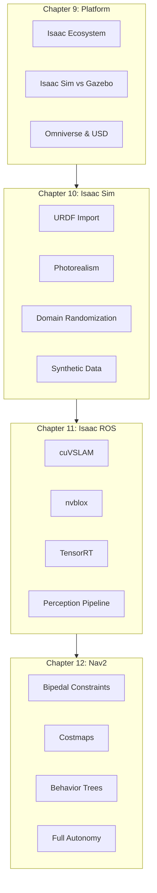
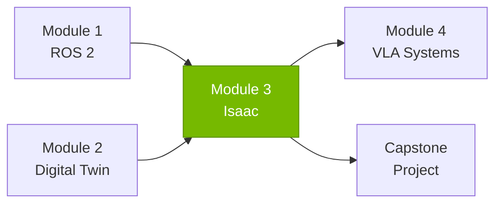

# Module 3: The AI-Robot Brain (NVIDIA Isaac)

Welcome to Module 3 of the Physical AI & Humanoid Robotics curriculum. This module introduces NVIDIA's Isaac platform for advanced simulation, GPU-accelerated perception, and autonomous navigation.

## Module Overview

By the end of this module, you will be able to:

- Understand the NVIDIA Isaac platform and its components
- Create photorealistic simulations with domain randomization
- Implement GPU-accelerated perception with Isaac ROS
- Configure Nav2 for bipedal humanoid navigation
- Build end-to-end perception-navigation pipelines

## Prerequisites

Before starting this module, you should have:

- **Completed Modules 1-2**: ROS 2 and Digital Twin fundamentals
- **Hardware**: NVIDIA RTX GPU (RTX 2070+) or cloud access
- **Software**: Ubuntu 22.04, NVIDIA Driver 525+, Isaac Sim 4.0+

## Module Structure

## Chapters

### [Chapter 9: The NVIDIA Isaac Platform](./chapter-09-platform)

Introduction to the Isaac ecosystem and when to use each component.

**Key Topics:**
- Isaac Sim, Isaac ROS, and Omniverse
- Isaac Sim vs Gazebo comparison
- System requirements and installation
- First steps with Isaac Sim

**Time Estimate:** 3-4 hours

---

### [Chapter 10: Photorealistic Simulation with Isaac Sim](./chapter-10-sim)

Create stunning simulations with domain randomization for robust training.

**Key Topics:**
- URDF to USD import workflow
- PBR materials and ray-traced rendering
- Domain randomization implementation
- Synthetic data generation

**Time Estimate:** 5-6 hours

---

### [Chapter 11: Isaac ROS for Robot Perception](./chapter-11-perception)

GPU-accelerated perception with cuVSLAM, nvblox, and TensorRT.

**Key Topics:**
- NITROS zero-copy GPU transport
- Visual SLAM with cuVSLAM
- 3D reconstruction with nvblox
- DNN inference acceleration

**Time Estimate:** 5-6 hours

---

### [Chapter 12: Nav2 for Bipedal Navigation](./chapter-12-nav2)

Configure Nav2 for the unique constraints of bipedal robots.

**Key Topics:**
- Bipedal navigation challenges
- Costmap configuration for humanoids
- Behavior trees for walking robots
- Perception-navigation integration

**Time Estimate:** 5-6 hours

---

## Hardware Requirements

| Component | Minimum | Recommended |
|-----------|---------|-------------|
| **GPU** | RTX 2070 (8GB) | RTX 3080+ (12GB+) |
| **CPU** | 8 cores | 16+ cores |
| **RAM** | 32 GB | 64 GB |
| **Storage** | 100 GB SSD | 500 GB NVMe |

### Cloud Alternatives

For students without RTX GPUs:
- NVIDIA Omniverse Cloud
- AWS RoboMaker with Isaac Sim
- Google Cloud GPU instances

## Connection to Other Modules

## Key Technologies

| Technology | Purpose | Chapter |
|------------|---------|---------|
| **Isaac Sim** | Photorealistic simulation | 9, 10 |
| **Omniverse** | Collaborative 3D platform | 9 |
| **USD** | Universal scene format | 9, 10 |
| **cuVSLAM** | GPU visual SLAM | 11 |
| **nvblox** | GPU 3D reconstruction | 11 |
| **TensorRT** | DNN inference acceleration | 11 |
| **Nav2** | ROS 2 navigation | 12 |
| **NITROS** | GPU data transport | 11 |

## Assessment

After completing this module, you should be able to:

| Skill | Assessment Criteria |
|-------|---------------------|
| Isaac Platform | Explain components and choose appropriate tool |
| Isaac Sim | Import robot, create environment, generate data |
| Isaac ROS | Configure VSLAM and nvblox for perception |
| Nav2 Bipedal | Configure navigation for humanoid constraints |

## Next Steps

After completing Module 3:

1. **Review**: Ensure all exercises are completed
2. **Integrate**: Combine perception and navigation pipelines
3. **Proceed**: Move to Module 4 (VLA Systems) for AI integration

---

Ready to begin? Start with [Chapter 9: The NVIDIA Isaac Platform](./chapter-09-platform)!
