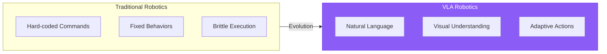
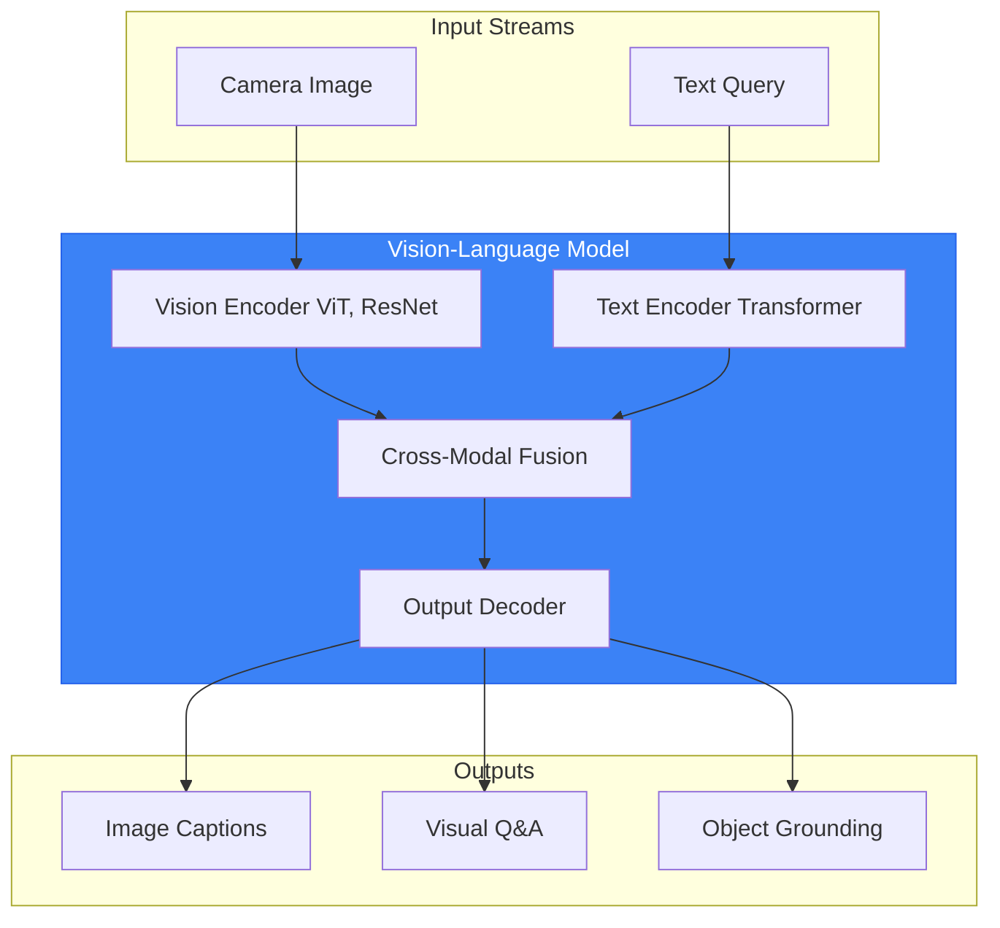
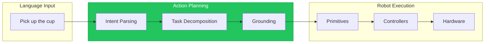
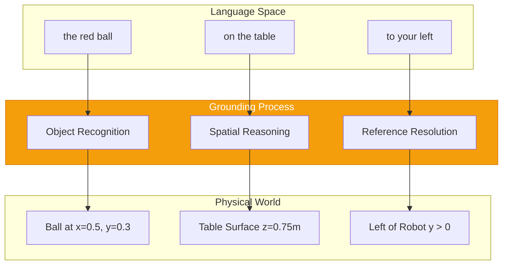
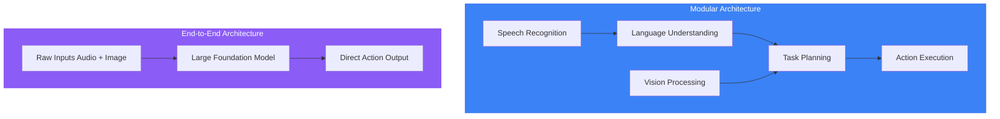
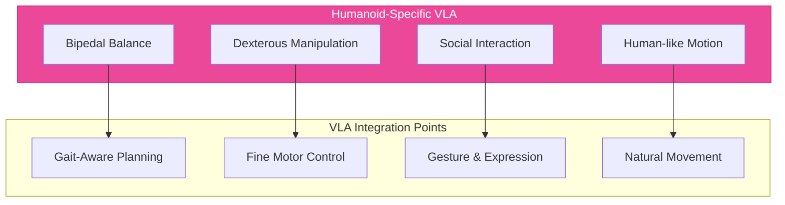

# Chapter 13: Vision-Language-Action Systems Architecture

## Learning Objectives

By the end of this chapter, you will be able to:

- Define VLA systems and explain their significance for robotics
- Describe the architecture of vision-language-action pipelines
- Understand how foundation models enable generalist robot capabilities
- Identify components needed for natural human-robot interaction
- Explain grounding: connecting language to robot capabilities
- Compare different VLA architectures (end-to-end vs. modular)

## Prerequisites

- Completed Modules 1-3 (ROS 2, Digital Twin, Isaac)
- Basic understanding of neural networks and deep learning concepts
- Familiarity with ROS 2 action servers and perception pipelines

---

## 13.1 The VLA Paradigm

**Vision-Language-Action (VLA)** systems represent a paradigm shift in robotics: from narrow, task-specific programs to generalist robots that understand natural human communication.



### From Narrow AI to Generalist Robots

Traditional robots execute pre-programmed behaviors:

```python
# Traditional approach: explicit commands
if command == "pick_red_ball":
    move_to(ball_position)
    grasp()
elif command == "pick_blue_cube":
    move_to(cube_position)
    grasp()
# ... hundreds more specific cases
```

VLA systems understand intent:

```python
# VLA approach: natural language understanding
user_says = "Pick up the red thing on the table"
# System understands:
# - "pick up" -> grasp action
# - "red thing" -> visual grounding to find red object
# - "on the table" -> spatial reasoning to locate table surface
```

### The Three Pillars of VLA

| Component | Function | Example |
|-----------|----------|---------|
| **Vision** | Perceive and understand the environment | Identify objects, read scenes, detect humans |
| **Language** | Understand human communication | Parse commands, maintain dialogue, explain actions |
| **Action** | Execute physical behaviors | Manipulate objects, navigate, gesture |

### Why VLA Matters for Humanoids

Humanoid robots are designed to work alongside humans. VLA enables:

1. **Natural Interaction**: Speak to robots as you would to a human assistant
2. **Flexible Task Execution**: Handle novel requests without reprogramming
3. **Explainable Behavior**: Robots can describe what they're doing and why
4. **Error Recovery**: Understand and respond to corrections

---

## 13.2 Vision-Language Models in Robotics

**Vision-Language Models (VLMs)** connect visual perception to language understanding.



### Key VLM Architectures

#### CLIP (Contrastive Language-Image Pre-training)

CLIP learns to associate images with text descriptions:

```python
# Conceptual CLIP usage for robotics
from transformers import CLIPProcessor, CLIPModel

model = CLIPModel.from_pretrained("openai/clip-vit-base-patch32")
processor = CLIPProcessor.from_pretrained("openai/clip-vit-base-patch32")

# Find the "red ball" in the scene
image = camera.get_image()
candidates = ["red ball", "blue cube", "green cylinder", "wooden table"]

inputs = processor(
    text=candidates,
    images=image,
    return_tensors="pt",
    padding=True
)

outputs = model(**inputs)
probs = outputs.logits_per_image.softmax(dim=1)
# probs[0] gives probability for each candidate
best_match = candidates[probs.argmax()]
```

#### LLaVA (Large Language and Vision Assistant)

LLaVA combines vision encoding with language model reasoning:

```python
# Conceptual LLaVA usage for scene understanding
def describe_scene_for_robot(image, question):
    """Use VLM to understand scene and answer questions."""
    prompt = f"""You are a robot assistant analyzing a scene.
    Question: {question}
    Describe what you see and how it relates to the question."""

    response = llava_model.generate(
        image=image,
        prompt=prompt
    )
    return response
    # Example: "I see a red ball on the wooden table, approximately
    # 0.5 meters from the robot's current position."
```

### VLMs for Robot Perception

| Task | VLM Application | Robot Use Case |
|------|-----------------|----------------|
| **Object Detection** | "Find all graspable objects" | Manipulation planning |
| **Scene Description** | "Describe this room" | Navigation context |
| **Affordance Detection** | "Where can I place this?" | Task planning |
| **Safety Assessment** | "Is this area safe to enter?" | Motion planning |

---

## 13.3 Action Generation from Language

The "Action" in VLA converts language understanding into robot motion.



### Task Decomposition

Complex commands break down into primitive actions:

```python
# High-level command
command = "Make me a cup of coffee"

# Decomposed into primitives
task_plan = [
    {"action": "navigate", "target": "kitchen"},
    {"action": "locate", "object": "coffee_machine"},
    {"action": "grasp", "object": "coffee_cup"},
    {"action": "place", "object": "coffee_cup", "location": "machine_tray"},
    {"action": "press_button", "button": "brew"},
    {"action": "wait", "condition": "brewing_complete"},
    {"action": "grasp", "object": "coffee_cup"},
    {"action": "navigate", "target": "user_location"},
    {"action": "handover", "object": "coffee_cup"}
]
```

### Robot Primitives

Define the atomic actions your robot can execute:

```python
# File: robot_primitives.py
from enum import Enum
from dataclasses import dataclass
from typing import Optional, Tuple

class PrimitiveType(Enum):
    NAVIGATE = "navigate"
    GRASP = "grasp"
    PLACE = "place"
    POINT = "point"
    LOOK_AT = "look_at"
    SAY = "say"
    WAIT = "wait"

@dataclass
class RobotPrimitive:
    """A single executable robot action."""
    action_type: PrimitiveType
    target: Optional[str] = None
    position: Optional[Tuple[float, float, float]] = None
    parameters: Optional[dict] = None

    def to_ros_action(self):
        """Convert to ROS 2 action goal."""
        if self.action_type == PrimitiveType.NAVIGATE:
            return self._create_nav_goal()
        elif self.action_type == PrimitiveType.GRASP:
            return self._create_grasp_goal()
        # ... other conversions
```

### Grounding Actions in Robot State

Actions must account for current robot state and environment:

```python
class ActionGrounder:
    """Ground language commands in physical robot capabilities."""

    def __init__(self, robot_state, scene_understanding):
        self.robot = robot_state
        self.scene = scene_understanding

    def ground_command(self, parsed_command):
        """Convert abstract command to executable action."""
        if parsed_command.verb == "pick_up":
            # Find the target object
            target = self.scene.find_object(parsed_command.object)
            if target is None:
                return GroundingResult(
                    success=False,
                    error=f"Cannot find {parsed_command.object}"
                )

            # Check if reachable
            if not self.robot.can_reach(target.position):
                return GroundingResult(
                    success=False,
                    error=f"{parsed_command.object} is not reachable"
                )

            # Generate executable action
            return GroundingResult(
                success=True,
                action=GraspAction(target=target)
            )
```

---

## 13.4 Grounding Language in Physical Reality

**Grounding** connects abstract language to concrete physical entities.



### Types of Grounding

#### Object Grounding

Map language descriptions to physical objects:

```python
class ObjectGrounder:
    """Ground object references to physical entities."""

    def ground_object(self, description: str, scene: Scene) -> Object:
        """Find object matching natural language description."""
        # Parse attributes from description
        attributes = self.parse_attributes(description)
        # Example: "the red ball" -> {color: red, shape: ball}

        # Find matching objects in scene
        candidates = scene.find_objects_with_attributes(attributes)

        if len(candidates) == 0:
            raise GroundingError(f"No object matches '{description}'")
        elif len(candidates) == 1:
            return candidates[0]
        else:
            # Multiple matches - need disambiguation
            return self.disambiguate(description, candidates)
```

#### Spatial Grounding

Interpret spatial language:

```python
SPATIAL_RELATIONS = {
    "on": lambda obj, ref: obj.z > ref.z and obj.overlaps_xy(ref),
    "under": lambda obj, ref: obj.z < ref.z and obj.overlaps_xy(ref),
    "left_of": lambda obj, ref: obj.y > ref.y,  # Robot frame
    "right_of": lambda obj, ref: obj.y < ref.y,
    "in_front_of": lambda obj, ref: obj.x > ref.x,
    "behind": lambda obj, ref: obj.x < ref.x,
    "near": lambda obj, ref: obj.distance_to(ref) < 0.5,
}

def ground_spatial_reference(target: str, relation: str, reference: str, scene: Scene):
    """Ground 'the ball on the table' style references."""
    ref_object = scene.find_object(reference)
    candidates = scene.find_objects(target)

    relation_fn = SPATIAL_RELATIONS[relation]
    matching = [c for c in candidates if relation_fn(c, ref_object)]

    return matching[0] if len(matching) == 1 else None
```

#### Temporal Grounding

Handle time-based references:

```python
class TemporalGrounder:
    """Ground temporal references in conversation context."""

    def __init__(self):
        self.action_history = []

    def ground_temporal(self, reference: str):
        """Resolve 'the thing I just mentioned' style references."""
        if reference in ["it", "that", "the same"]:
            return self.action_history[-1].target
        elif reference == "the previous one":
            return self.action_history[-2].target
        elif "before" in reference:
            return self._find_before_action(reference)
```

### Grounding Challenges for Humanoids

| Challenge | Example | Solution |
|-----------|---------|----------|
| **Ambiguity** | "Pick up the cup" (multiple cups) | Request clarification |
| **Perspective** | "Your left" vs "my left" | Establish frame of reference |
| **Hidden Objects** | "The keys in the drawer" | Navigate to observe |
| **Abstract References** | "The thing for cutting" | Functional reasoning |

---

## 13.5 Modular vs. End-to-End VLA Architectures

Two approaches exist for building VLA systems:



### Modular Architecture

**Advantages:**
- Interpretable: can inspect each stage
- Debuggable: isolate failures to specific modules
- Customizable: swap components independently
- Lower compute: run appropriate models for each task

**Disadvantages:**
- Error propagation between modules
- Integration complexity
- Potential information loss at boundaries

```python
# Modular VLA pipeline
class ModularVLAPipeline:
    def __init__(self):
        self.speech_recognizer = WhisperASR()
        self.language_model = GPT4Planner()
        self.vision_model = CLIPGrounder()
        self.action_executor = ROS2Executor()

    def process_command(self, audio, image):
        # Stage 1: Speech to text
        text = self.speech_recognizer.transcribe(audio)

        # Stage 2: Visual grounding
        scene_description = self.vision_model.describe(image)

        # Stage 3: Task planning
        plan = self.language_model.plan(text, scene_description)

        # Stage 4: Action execution
        return self.action_executor.execute(plan)
```

### End-to-End Architecture

**Advantages:**
- Unified representation learning
- Can capture subtle cross-modal patterns
- Simpler deployment (single model)

**Disadvantages:**
- Requires massive training data
- Black-box behavior
- Harder to debug and correct
- High compute requirements

```python
# End-to-end VLA (conceptual)
class EndToEndVLA:
    def __init__(self):
        self.model = load_vla_foundation_model("rt-2-x")

    def process_command(self, audio, image):
        # Single forward pass produces actions
        actions = self.model.predict(
            audio=audio,
            image=image,
            robot_state=self.get_robot_state()
        )
        return actions  # Direct motor commands
```

### Current State of the Art

| System | Architecture | Key Innovation |
|--------|--------------|----------------|
| **RT-2** | End-to-end | VLM directly outputs actions |
| **SayCan** | Modular | LLM + affordance grounding |
| **PaLM-E** | Hybrid | Embodied language model |
| **Code as Policies** | Modular | LLM generates code |

### Recommendation for This Course

We use a **modular architecture** because:

1. **Educational**: Understand each component
2. **Debuggable**: Fix issues at specific stages
3. **Practical**: Works with available hardware
4. **Extensible**: Upgrade components independently

---

## 13.6 VLA for Humanoid Robots

Humanoid robots have unique VLA considerations.



### Bipedal Considerations

VLA planning must account for:

```python
class BipedalVLAPlanner:
    """VLA planner aware of bipedal constraints."""

    def plan_with_balance(self, command, robot_state):
        # Parse command
        intent = self.parse_intent(command)

        # Check stability requirements
        if intent.requires_reaching:
            # Ensure CoM stays over support polygon
            reach_limit = self.compute_stable_reach(robot_state)
            if intent.target_distance > reach_limit:
                # Need to step closer first
                return [
                    NavigateAction(closer_to=intent.target),
                    intent.action
                ]

        return [intent.action]
```

### Dexterous Manipulation

Language maps to fine motor commands:

```python
GRASP_VOCABULARY = {
    "pick up": "power_grasp",
    "pinch": "precision_grasp",
    "hold gently": "soft_grasp",
    "grip firmly": "strong_grasp",
    "cradle": "two_hand_support",
}

def map_verb_to_grasp(verb: str, object_properties: dict) -> str:
    """Select appropriate grasp based on language and object."""
    if verb in GRASP_VOCABULARY:
        base_grasp = GRASP_VOCABULARY[verb]
    else:
        base_grasp = "power_grasp"  # default

    # Modify based on object
    if object_properties.get("fragile"):
        return "soft_grasp"
    if object_properties.get("heavy"):
        return "strong_grasp"

    return base_grasp
```

### Social Interaction

Humanoids should communicate naturally:

```python
class SocialVLA:
    """VLA with social awareness for humanoid robots."""

    def respond_to_command(self, command):
        # Acknowledge receipt
        self.say("I understand. Let me help with that.")

        # Execute with progress updates
        for step in self.plan_task(command):
            self.execute_step(step)
            if step.is_milestone:
                self.say(f"I've completed {step.description}")

        # Confirm completion
        self.say("All done! Is there anything else?")

    def handle_failure(self, error):
        # Explain what went wrong
        self.say(f"I encountered a problem: {error.user_message}")
        self.say("Would you like me to try again or do something else?")
```

---

## 13.7 Common Errors and Solutions

### Error: Grounding Failure

**Symptom**: Robot cannot find referenced object.

**Solution**: Implement disambiguation:

```python
def handle_grounding_failure(description, candidates):
    if len(candidates) == 0:
        return "I don't see any object matching that description."
    elif len(candidates) > 1:
        return f"I see {len(candidates)} objects that could match. " \
               f"Could you be more specific? I see: {describe_candidates(candidates)}"
```

### Error: Action Not in Capability Set

**Symptom**: LLM generates impossible actions.

**Solution**: Constrain planning to known primitives:

```python
ROBOT_CAPABILITIES = [
    "navigate", "grasp", "place", "point", "look_at", "say", "wait"
]

def validate_plan(plan):
    for action in plan:
        if action.type not in ROBOT_CAPABILITIES:
            raise InvalidActionError(
                f"Robot cannot perform '{action.type}'. "
                f"Available actions: {ROBOT_CAPABILITIES}"
            )
```

### Error: Unsafe Command

**Symptom**: Command would cause harm.

**Solution**: Safety validation layer:

```python
FORBIDDEN_ACTIONS = ["throw", "hit", "push_person", "move_fast_near_human"]

def safety_check(action, context):
    if action.type in FORBIDDEN_ACTIONS:
        return SafetyResult(safe=False, reason="Action type forbidden")

    if action.target_is_human() and action.involves_contact():
        return SafetyResult(safe=False, reason="Unsafe human contact")

    return SafetyResult(safe=True)
```

---

## Exercises

### Exercise 13.1: Design a VLA Pipeline (Basic)

Draw a diagram of a VLA pipeline for a humanoid robot that can:
- Understand voice commands
- See and identify objects
- Pick up and move objects

Label each component and the data flowing between them.

### Exercise 13.2: Implement Object Grounding (Intermediate)

Create a Python class that grounds object descriptions to scene objects:

```python
class SimpleObjectGrounder:
    def __init__(self, scene_objects: List[Object]):
        """Initialize with list of objects in scene."""
        pass

    def ground(self, description: str) -> Optional[Object]:
        """Find object matching description."""
        pass
```

Test with descriptions like "the red ball", "large box", "cup on table".

### Exercise 13.3: Compare VLA Architectures (Intermediate)

Research and compare two real VLA systems (e.g., SayCan and RT-2):

1. What architecture does each use?
2. What are the training requirements?
3. What tasks can each perform?
4. What are the limitations?

### Exercise 13.4: Design Humanoid-Specific VLA (Advanced)

Design a VLA system specifically for humanoid manipulation that:

1. Accounts for balance during reaching
2. Selects appropriate grasp types
3. Provides verbal feedback during execution
4. Handles failure gracefully

Provide pseudocode for the main planning loop.

---

## Summary

- **VLA systems** integrate Vision, Language, and Action for natural human-robot interaction
- **Vision-Language Models** (VLMs) connect visual perception to language understanding
- **Grounding** connects abstract language to physical robot capabilities
- **Modular architectures** offer interpretability and debuggability
- **End-to-end architectures** learn unified representations but require massive data
- **Humanoid VLA** must account for balance, dexterity, and social interaction

### Key Takeaways

1. VLA represents the evolution from narrow to generalist robotics
2. Grounding is the critical bridge between language and action
3. Modular approaches are more practical for learning and deployment
4. Humanoids require special consideration for social and physical constraints

### What's Next

Chapter 14 covers **Voice-to-Action with Speech Recognition** - the first step in building VLA systems.
