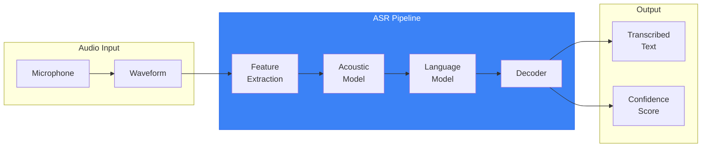
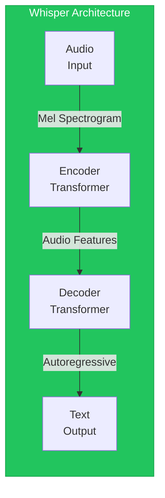
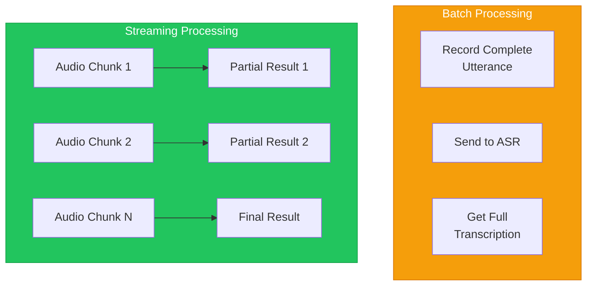
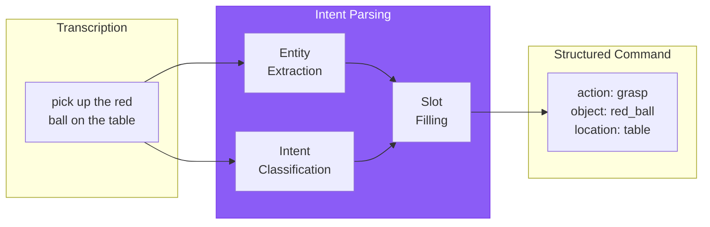
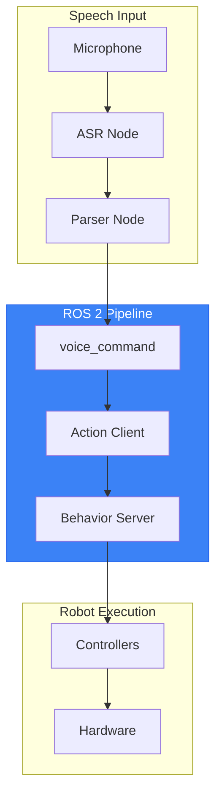

# Chapter 14: Voice-to-Action with Speech Recognition

## Learning Objectives

By the end of this chapter, you will be able to:

- Understand speech recognition fundamentals (ASR, acoustic models, language models)
- Configure speech recognition for robot control applications
- Process audio streams and handle real-time transcription
- Parse transcribed commands into structured intents
- Integrate speech input with ROS 2 control pipelines
- Handle recognition errors and noisy environments gracefully

## Prerequisites

- Completed Chapter 13 (VLA Architecture)
- Microphone hardware for exercises
- Python audio libraries (pyaudio, sounddevice)

---

## 14.1 Speech Recognition Fundamentals

**Automatic Speech Recognition (ASR)** converts audio signals into text.



### ASR Architecture Components

| Component | Function | Example |
|-----------|----------|---------|
| **Feature Extraction** | Convert audio to numerical features | Mel-frequency cepstral coefficients (MFCCs) |
| **Acoustic Model** | Map features to phonemes | Neural network trained on speech |
| **Language Model** | Predict likely word sequences | n-gram or transformer LM |
| **Decoder** | Find best transcription | Beam search, CTC decoding |

### Modern End-to-End ASR

Modern systems like Whisper use end-to-end transformers:



### Key ASR Metrics

| Metric | Definition | Target for Robotics |
|--------|------------|---------------------|
| **WER** (Word Error Rate) | % of words wrong | < 10% |
| **Latency** | Time from speech end to result | < 500ms |
| **RTF** (Real-Time Factor) | Processing time / audio duration | < 0.5 |

---

## 14.2 Speech Recognition Options

Choose the right ASR for your application:

### Cloud-Based Services

**Advantages**: High accuracy, always improving, no local compute
**Disadvantages**: Requires internet, latency, privacy concerns, cost

| Service | Strengths | API Cost |
|---------|-----------|----------|
| **Google Cloud Speech** | Best accuracy, streaming | $0.006/15 sec |
| **Azure Speech** | Custom vocabulary | $1/audio hour |
| **Amazon Transcribe** | AWS integration | $0.024/minute |
| **OpenAI Whisper API** | Multilingual, robust | $0.006/minute |

### Local/Open-Source Options

**Advantages**: Offline, privacy, no recurring cost
**Disadvantages**: Requires GPU, may be less accurate

| System | Model Size | GPU Required | Best For |
|--------|------------|--------------|----------|
| **Whisper** (local) | 39M - 1.5B | Yes (fast) | High accuracy offline |
| **Vosk** | 40M - 1.8G | No | Lightweight, embedded |
| **Coqui STT** | 47M | No | Custom vocabulary |
| **faster-whisper** | Same as Whisper | Yes | Optimized Whisper |

### Recommendation for Robotics

```python
# Development: Use Whisper locally for accuracy
# Production (offline): Use Vosk for low latency
# Production (online): Use Whisper API for best accuracy

SPEECH_CONFIG = {
    "development": {
        "engine": "whisper",
        "model": "base",  # Fast enough for testing
        "device": "cuda"
    },
    "production_offline": {
        "engine": "vosk",
        "model": "vosk-model-small-en-us-0.15",
        "sample_rate": 16000
    },
    "production_online": {
        "engine": "whisper_api",
        "model": "whisper-1"
    }
}
```

---

## 14.3 Audio Capture and Processing

### Microphone Setup

```python
# File: audio_capture.py
import sounddevice as sd
import numpy as np
from dataclasses import dataclass
from typing import Callable, Optional

@dataclass
class AudioConfig:
    sample_rate: int = 16000
    channels: int = 1
    dtype: np.dtype = np.float32
    chunk_duration: float = 0.5  # seconds

class AudioCapture:
    """Capture audio from microphone for speech recognition."""

    def __init__(self, config: AudioConfig = AudioConfig()):
        self.config = config
        self.buffer = []
        self.is_recording = False

    def list_devices(self):
        """List available audio input devices."""
        print(sd.query_devices())

    def start_stream(self, callback: Callable[[np.ndarray], None]):
        """Start continuous audio capture with callback."""
        chunk_size = int(self.config.sample_rate * self.config.chunk_duration)

        def audio_callback(indata, frames, time, status):
            if status:
                print(f"Audio status: {status}")
            callback(indata.copy())

        self.stream = sd.InputStream(
            samplerate=self.config.sample_rate,
            channels=self.config.channels,
            dtype=self.config.dtype,
            blocksize=chunk_size,
            callback=audio_callback
        )
        self.stream.start()
        self.is_recording = True

    def stop_stream(self):
        """Stop audio capture."""
        if hasattr(self, 'stream'):
            self.stream.stop()
            self.stream.close()
        self.is_recording = False

    def record_duration(self, duration: float) -> np.ndarray:
        """Record audio for specified duration."""
        samples = int(self.config.sample_rate * duration)
        recording = sd.rec(
            samples,
            samplerate=self.config.sample_rate,
            channels=self.config.channels,
            dtype=self.config.dtype
        )
        sd.wait()
        return recording.flatten()
```

### Voice Activity Detection (VAD)

Detect when someone is speaking:

```python
# File: voice_activity.py
import numpy as np
from collections import deque

class SimpleVAD:
    """Simple energy-based Voice Activity Detection."""

    def __init__(
        self,
        energy_threshold: float = 0.01,
        silence_duration: float = 0.5,
        sample_rate: int = 16000
    ):
        self.threshold = energy_threshold
        self.silence_samples = int(silence_duration * sample_rate)
        self.sample_rate = sample_rate

        self.is_speaking = False
        self.silence_counter = 0
        self.speech_buffer = []

    def process_chunk(self, audio_chunk: np.ndarray) -> dict:
        """Process audio chunk and detect speech boundaries."""
        energy = np.sqrt(np.mean(audio_chunk ** 2))

        result = {
            "is_speech": energy > self.threshold,
            "energy": energy,
            "speech_started": False,
            "speech_ended": False,
            "audio": None
        }

        if result["is_speech"]:
            if not self.is_speaking:
                # Speech just started
                self.is_speaking = True
                result["speech_started"] = True
                self.speech_buffer = []

            self.speech_buffer.append(audio_chunk)
            self.silence_counter = 0

        else:
            if self.is_speaking:
                self.silence_counter += len(audio_chunk)

                if self.silence_counter > self.silence_samples:
                    # Speech ended
                    self.is_speaking = False
                    result["speech_ended"] = True
                    result["audio"] = np.concatenate(self.speech_buffer)
                    self.speech_buffer = []
                else:
                    # Brief pause, continue buffering
                    self.speech_buffer.append(audio_chunk)

        return result
```

### Noise Handling

```python
# File: noise_reduction.py
import numpy as np
from scipy import signal

class NoiseReducer:
    """Simple noise reduction for speech."""

    def __init__(self, sample_rate: int = 16000):
        self.sample_rate = sample_rate
        self.noise_profile = None

    def calibrate_noise(self, noise_sample: np.ndarray):
        """Record ambient noise for subtraction."""
        # Compute noise spectrum
        _, _, Sxx = signal.spectrogram(noise_sample, self.sample_rate)
        self.noise_profile = np.mean(Sxx, axis=1)

    def reduce_noise(self, audio: np.ndarray) -> np.ndarray:
        """Apply spectral subtraction noise reduction."""
        if self.noise_profile is None:
            return audio

        # Simple high-pass filter to remove low-frequency noise
        b, a = signal.butter(4, 100 / (self.sample_rate / 2), 'high')
        filtered = signal.filtfilt(b, a, audio)

        return filtered

    def apply_agc(self, audio: np.ndarray, target_rms: float = 0.1) -> np.ndarray:
        """Automatic Gain Control - normalize volume."""
        current_rms = np.sqrt(np.mean(audio ** 2))
        if current_rms > 0:
            gain = target_rms / current_rms
            # Limit gain to prevent amplifying noise
            gain = min(gain, 10.0)
            return audio * gain
        return audio
```

---

## 14.4 Real-Time Transcription Pipelines

### Streaming vs. Batch Processing



### Whisper Implementation (Batch)

```python
# File: whisper_transcriber.py
import whisper
import numpy as np
from typing import Optional

class WhisperTranscriber:
    """Transcribe audio using OpenAI Whisper."""

    def __init__(self, model_name: str = "base", device: str = "cuda"):
        self.model = whisper.load_model(model_name, device=device)
        self.device = device

    def transcribe(
        self,
        audio: np.ndarray,
        sample_rate: int = 16000,
        language: str = "en"
    ) -> dict:
        """Transcribe audio array to text."""
        # Whisper expects float32 audio normalized to [-1, 1]
        if audio.dtype != np.float32:
            audio = audio.astype(np.float32)

        # Resample if needed (Whisper expects 16kHz)
        if sample_rate != 16000:
            import librosa
            audio = librosa.resample(audio, orig_sr=sample_rate, target_sr=16000)

        result = self.model.transcribe(
            audio,
            language=language,
            fp16=(self.device == "cuda")
        )

        return {
            "text": result["text"].strip(),
            "language": result["language"],
            "segments": result["segments"]
        }

    def transcribe_with_timestamps(self, audio: np.ndarray) -> list:
        """Get word-level timestamps."""
        result = self.model.transcribe(
            audio,
            word_timestamps=True
        )
        return result["segments"]
```

### Vosk Implementation (Streaming)

```python
# File: vosk_transcriber.py
import json
from vosk import Model, KaldiRecognizer
import numpy as np

class VoskTranscriber:
    """Real-time streaming transcription with Vosk."""

    def __init__(self, model_path: str, sample_rate: int = 16000):
        self.model = Model(model_path)
        self.recognizer = KaldiRecognizer(self.model, sample_rate)
        self.sample_rate = sample_rate

    def process_chunk(self, audio_chunk: np.ndarray) -> dict:
        """Process audio chunk and get partial/final results."""
        # Convert to bytes (int16)
        audio_bytes = (audio_chunk * 32767).astype(np.int16).tobytes()

        result = {
            "partial": "",
            "final": "",
            "is_final": False
        }

        if self.recognizer.AcceptWaveform(audio_bytes):
            # Final result for this utterance
            final_result = json.loads(self.recognizer.Result())
            result["final"] = final_result.get("text", "")
            result["is_final"] = True
        else:
            # Partial result
            partial_result = json.loads(self.recognizer.PartialResult())
            result["partial"] = partial_result.get("partial", "")

        return result

    def reset(self):
        """Reset recognizer for new utterance."""
        self.recognizer = KaldiRecognizer(self.model, self.sample_rate)
```

### Complete Streaming Pipeline

```python
# File: streaming_asr.py
class StreamingASR:
    """Complete streaming speech recognition pipeline."""

    def __init__(self, config: dict):
        self.audio = AudioCapture()
        self.vad = SimpleVAD()
        self.transcriber = VoskTranscriber(config["model_path"])
        self.callbacks = []

    def add_transcription_callback(self, callback):
        """Register callback for transcription results."""
        self.callbacks.append(callback)

    def start(self):
        """Start streaming recognition."""
        def on_audio(chunk):
            # Voice activity detection
            vad_result = self.vad.process_chunk(chunk)

            if vad_result["is_speech"] or self.vad.is_speaking:
                # Process through ASR
                asr_result = self.transcriber.process_chunk(chunk)

                if asr_result["is_final"] and asr_result["final"]:
                    # Notify callbacks
                    for cb in self.callbacks:
                        cb(asr_result["final"])

                    self.transcriber.reset()

        self.audio.start_stream(on_audio)

    def stop(self):
        """Stop streaming recognition."""
        self.audio.stop_stream()
```

---

## 14.5 Command Parsing and Intent Recognition

Transform transcribed text into structured robot commands.



### Rule-Based Command Parser

```python
# File: command_parser.py
import re
from dataclasses import dataclass
from typing import Optional, List

@dataclass
class ParsedCommand:
    intent: str
    action: str
    target_object: Optional[str] = None
    location: Optional[str] = None
    modifiers: Optional[List[str]] = None
    confidence: float = 1.0

class RuleBasedCommandParser:
    """Parse voice commands using pattern matching."""

    INTENTS = {
        "grasp": ["pick up", "grab", "grasp", "get", "take", "fetch"],
        "place": ["put", "place", "set", "drop", "leave"],
        "navigate": ["go to", "move to", "walk to", "navigate to", "come to"],
        "look": ["look at", "find", "locate", "search for", "where is"],
        "stop": ["stop", "halt", "freeze", "cancel"],
        "help": ["help", "what can you do", "commands"],
    }

    COLORS = ["red", "blue", "green", "yellow", "black", "white", "orange"]
    OBJECTS = ["ball", "cube", "box", "cup", "bottle", "book", "pen"]
    LOCATIONS = ["table", "floor", "shelf", "desk", "counter", "chair"]

    def parse(self, text: str) -> ParsedCommand:
        """Parse transcribed text into structured command."""
        text = text.lower().strip()

        # Identify intent
        intent, action = self._extract_intent(text)

        # Extract object with modifiers
        target, modifiers = self._extract_object(text)

        # Extract location
        location = self._extract_location(text)

        return ParsedCommand(
            intent=intent,
            action=action,
            target_object=target,
            location=location,
            modifiers=modifiers
        )

    def _extract_intent(self, text: str) -> tuple:
        for intent, phrases in self.INTENTS.items():
            for phrase in phrases:
                if phrase in text:
                    return intent, phrase
        return "unknown", None

    def _extract_object(self, text: str) -> tuple:
        modifiers = []

        # Find colors
        for color in self.COLORS:
            if color in text:
                modifiers.append(color)

        # Find objects
        for obj in self.OBJECTS:
            if obj in text:
                return obj, modifiers

        return None, modifiers

    def _extract_location(self, text: str) -> Optional[str]:
        # Look for "on/at/near the <location>" patterns
        location_pattern = r"(?:on|at|near|from|to)\s+(?:the\s+)?(\w+)"
        match = re.search(location_pattern, text)

        if match:
            loc = match.group(1)
            if loc in self.LOCATIONS:
                return loc

        return None
```

### LLM-Based Intent Parser

For complex commands, use an LLM:

```python
# File: llm_command_parser.py
import json
from openai import OpenAI

class LLMCommandParser:
    """Parse commands using LLM for complex understanding."""

    SYSTEM_PROMPT = """You are a robot command parser. Convert natural language
commands into structured JSON format.

Available actions: grasp, place, navigate, look, point, say, wait
Available objects: ball, cube, box, cup, bottle, book
Available locations: table, floor, shelf, desk, kitchen, living_room

Output JSON format:
{
    "intent": "<action_type>",
    "action": "<specific_action>",
    "target_object": "<object or null>",
    "location": "<location or null>",
    "modifiers": ["<color>", "<size>", etc],
    "parameters": {}
}

If the command is unclear, set intent to "clarify" and include a question."""

    def __init__(self, api_key: str):
        self.client = OpenAI(api_key=api_key)

    def parse(self, text: str) -> dict:
        """Parse command using LLM."""
        response = self.client.chat.completions.create(
            model="gpt-4o-mini",
            messages=[
                {"role": "system", "content": self.SYSTEM_PROMPT},
                {"role": "user", "content": f"Parse this command: {text}"}
            ],
            response_format={"type": "json_object"}
        )

        return json.loads(response.choices[0].message.content)
```

---

## 14.6 Integrating with ROS 2

Connect speech recognition to robot control.



### Speech Recognition ROS 2 Node

```python
# File: speech_recognition_node.py
import rclpy
from rclpy.node import Node
from std_msgs.msg import String
from humanoid_interfaces.msg import VoiceCommand
import numpy as np

class SpeechRecognitionNode(Node):
    """ROS 2 node for speech recognition."""

    def __init__(self):
        super().__init__('speech_recognition')

        # Parameters
        self.declare_parameter('model', 'base')
        self.declare_parameter('language', 'en')
        self.declare_parameter('device', 'cuda')

        model = self.get_parameter('model').value
        device = self.get_parameter('device').value

        # Initialize ASR
        self.transcriber = WhisperTranscriber(model, device)
        self.audio_capture = AudioCapture()
        self.vad = SimpleVAD()
        self.parser = RuleBasedCommandParser()

        # Publishers
        self.transcription_pub = self.create_publisher(
            String, 'speech/transcription', 10
        )
        self.command_pub = self.create_publisher(
            VoiceCommand, 'speech/command', 10
        )

        # Start audio capture
        self.audio_buffer = []
        self.audio_capture.start_stream(self.audio_callback)

        self.get_logger().info('Speech recognition node started')

    def audio_callback(self, audio_chunk):
        """Process incoming audio chunks."""
        vad_result = self.vad.process_chunk(audio_chunk)

        if vad_result["speech_ended"]:
            # Transcribe the captured speech
            audio = vad_result["audio"]
            result = self.transcriber.transcribe(audio)

            text = result["text"]
            self.get_logger().info(f'Transcribed: {text}')

            # Publish transcription
            trans_msg = String()
            trans_msg.data = text
            self.transcription_pub.publish(trans_msg)

            # Parse and publish command
            if text:
                parsed = self.parser.parse(text)
                cmd_msg = VoiceCommand()
                cmd_msg.text = text
                cmd_msg.intent = parsed.intent
                cmd_msg.action = parsed.action or ""
                cmd_msg.target = parsed.target_object or ""
                cmd_msg.location = parsed.location or ""
                self.command_pub.publish(cmd_msg)

def main():
    rclpy.init()
    node = SpeechRecognitionNode()
    rclpy.spin(node)
    node.destroy_node()
    rclpy.shutdown()

if __name__ == '__main__':
    main()
```

### Voice Command Message Definition

```
# File: msg/VoiceCommand.msg
string text          # Original transcription
string intent        # Parsed intent (grasp, navigate, etc.)
string action        # Specific action phrase
string target        # Target object
string location      # Target location
string[] modifiers   # Color, size, etc.
float32 confidence   # Recognition confidence
```

### Voice-Triggered Action Client

```python
# File: voice_action_client.py
import rclpy
from rclpy.node import Node
from rclpy.action import ActionClient
from humanoid_interfaces.msg import VoiceCommand
from humanoid_interfaces.action import ExecuteBehavior

class VoiceActionClient(Node):
    """Execute robot actions from voice commands."""

    def __init__(self):
        super().__init__('voice_action_client')

        # Subscribe to voice commands
        self.command_sub = self.create_subscription(
            VoiceCommand,
            'speech/command',
            self.command_callback,
            10
        )

        # Action client for behavior execution
        self.behavior_client = ActionClient(
            self, ExecuteBehavior, 'execute_behavior'
        )

        self.get_logger().info('Voice action client ready')

    def command_callback(self, msg: VoiceCommand):
        """Handle incoming voice commands."""
        self.get_logger().info(f'Received command: {msg.intent} - {msg.target}')

        if msg.intent == "unknown":
            self.get_logger().warn("Could not understand command")
            return

        if msg.intent == "stop":
            self.cancel_current_action()
            return

        # Create behavior goal
        goal = ExecuteBehavior.Goal()
        goal.behavior_name = self.intent_to_behavior(msg.intent)
        goal.target_object = msg.target
        goal.target_location = msg.location

        # Send goal
        self.behavior_client.wait_for_server()
        future = self.behavior_client.send_goal_async(
            goal,
            feedback_callback=self.feedback_callback
        )
        future.add_done_callback(self.goal_response_callback)

    def intent_to_behavior(self, intent: str) -> str:
        """Map voice intent to behavior name."""
        mapping = {
            "grasp": "pick_up_object",
            "place": "place_object",
            "navigate": "navigate_to",
            "look": "look_at_object",
        }
        return mapping.get(intent, intent)

    def feedback_callback(self, feedback_msg):
        """Handle action feedback."""
        feedback = feedback_msg.feedback
        self.get_logger().info(f'Progress: {feedback.progress}%')

    def goal_response_callback(self, future):
        """Handle goal acceptance."""
        goal_handle = future.result()
        if not goal_handle.accepted:
            self.get_logger().error('Goal rejected')
            return

        result_future = goal_handle.get_result_async()
        result_future.add_done_callback(self.result_callback)

    def result_callback(self, future):
        """Handle action result."""
        result = future.result().result
        if result.success:
            self.get_logger().info(f'Action completed: {result.message}')
        else:
            self.get_logger().error(f'Action failed: {result.message}')
```

---

## 14.7 Handling Errors and Uncertainty

### Confidence Thresholds

```python
class ConfidenceFilter:
    """Filter low-confidence recognitions."""

    def __init__(self, min_confidence: float = 0.7):
        self.min_confidence = min_confidence

    def should_accept(self, transcription: dict) -> bool:
        """Determine if transcription is reliable enough."""
        # Check overall confidence
        if transcription.get("confidence", 1.0) < self.min_confidence:
            return False

        # Check for common ASR errors
        text = transcription["text"].lower()
        error_indicators = ["[inaudible]", "[music]", "[noise]"]
        if any(ind in text for ind in error_indicators):
            return False

        # Require minimum length
        if len(text.split()) < 2:
            return False

        return True

    def get_clarification_prompt(self, transcription: dict) -> str:
        """Generate clarification request."""
        if transcription.get("confidence", 1.0) < 0.5:
            return "I didn't catch that. Could you repeat the command?"
        else:
            return f"I heard '{transcription['text']}'. Is that correct?"
```

### Confirmation Dialog

```python
class CommandConfirmation:
    """Request confirmation for uncertain commands."""

    def __init__(self, speech_node, tts_node):
        self.speech = speech_node
        self.tts = tts_node
        self.pending_command = None

    async def confirm_command(self, command: ParsedCommand) -> bool:
        """Ask user to confirm command."""
        # Describe what we understood
        description = self.describe_command(command)
        await self.tts.say(f"I understood: {description}. Should I proceed?")

        # Wait for yes/no response
        response = await self.speech.wait_for_response(timeout=5.0)

        if response is None:
            await self.tts.say("I didn't hear a response. Canceling.")
            return False

        return self.is_affirmative(response)

    def describe_command(self, cmd: ParsedCommand) -> str:
        """Generate human-readable command description."""
        if cmd.intent == "grasp":
            obj = f"{' '.join(cmd.modifiers)} {cmd.target_object}".strip()
            return f"pick up the {obj}"
        elif cmd.intent == "navigate":
            return f"go to the {cmd.location}"
        else:
            return f"{cmd.action} {cmd.target_object or ''}"

    def is_affirmative(self, text: str) -> bool:
        """Check if response is affirmative."""
        affirmatives = ["yes", "yeah", "yep", "correct", "right", "proceed", "do it"]
        return any(word in text.lower() for word in affirmatives)
```

### Noisy Environment Handling

```python
class AdaptiveASR:
    """ASR that adapts to noisy environments."""

    def __init__(self, transcriber):
        self.transcriber = transcriber
        self.noise_level = 0.0
        self.retry_count = 0
        self.max_retries = 3

    def transcribe_with_retry(self, audio: np.ndarray) -> dict:
        """Transcribe with automatic retry on failure."""
        for attempt in range(self.max_retries):
            result = self.transcriber.transcribe(audio)

            if self.is_valid_transcription(result):
                return result

            # Try noise reduction
            if attempt < self.max_retries - 1:
                audio = self.enhance_audio(audio)

        return {"text": "", "error": "Could not transcribe after retries"}

    def is_valid_transcription(self, result: dict) -> bool:
        """Check if transcription is usable."""
        text = result.get("text", "")
        return len(text) > 0 and not text.startswith("[")

    def enhance_audio(self, audio: np.ndarray) -> np.ndarray:
        """Apply progressive audio enhancement."""
        # Apply bandpass filter for speech frequencies
        from scipy import signal
        b, a = signal.butter(4, [300, 3400], 'band', fs=16000)
        filtered = signal.filtfilt(b, a, audio)
        return filtered
```

---

## 14.8 Hands-on: Building a Voice-Controlled Humanoid Interface

Complete exercise combining all concepts:

```python
# File: voice_controlled_humanoid.py
"""Complete voice control system for humanoid robot."""

import rclpy
from rclpy.node import Node
from rclpy.action import ActionClient
import threading

class VoiceControlledHumanoid(Node):
    """Full voice control system."""

    def __init__(self):
        super().__init__('voice_controlled_humanoid')

        # Components
        self.audio = AudioCapture()
        self.vad = SimpleVAD(energy_threshold=0.02)
        self.transcriber = WhisperTranscriber(model="base")
        self.parser = RuleBasedCommandParser()
        self.confidence_filter = ConfidenceFilter(min_confidence=0.6)

        # ROS 2 interfaces
        self.behavior_client = ActionClient(
            self, ExecuteBehavior, 'execute_behavior'
        )

        # State
        self.is_listening = False
        self.current_action = None

        # Start voice control
        self.start_listening()

    def start_listening(self):
        """Begin voice control loop."""
        self.is_listening = True
        self.audio.start_stream(self.on_audio)
        self.get_logger().info("Voice control active. Say 'robot' to wake.")

    def on_audio(self, chunk):
        """Process audio chunks."""
        vad_result = self.vad.process_chunk(chunk)

        if vad_result["speech_ended"]:
            audio = vad_result["audio"]
            self.process_speech(audio)

    def process_speech(self, audio):
        """Full speech processing pipeline."""
        # Transcribe
        result = self.transcriber.transcribe(audio)

        if not self.confidence_filter.should_accept(result):
            self.get_logger().debug("Low confidence, ignoring")
            return

        text = result["text"]
        self.get_logger().info(f"Heard: {text}")

        # Check for wake word
        if "robot" in text.lower():
            text = text.lower().replace("robot", "").strip()

        if not text:
            return

        # Parse command
        command = self.parser.parse(text)

        if command.intent == "unknown":
            self.say("I didn't understand that command.")
            return

        if command.intent == "stop":
            self.stop_current_action()
            return

        if command.intent == "help":
            self.provide_help()
            return

        # Execute command
        self.execute_command(command)

    def execute_command(self, command):
        """Execute parsed voice command."""
        self.get_logger().info(
            f"Executing: {command.intent} - {command.target_object}"
        )

        # Create and send goal
        goal = ExecuteBehavior.Goal()
        goal.behavior_name = command.intent
        goal.target_object = command.target_object or ""
        goal.target_location = command.location or ""

        if not self.behavior_client.wait_for_server(timeout_sec=2.0):
            self.say("Robot behavior system not available.")
            return

        future = self.behavior_client.send_goal_async(goal)
        future.add_done_callback(self.on_goal_response)

    def on_goal_response(self, future):
        """Handle goal acceptance."""
        goal_handle = future.result()

        if not goal_handle.accepted:
            self.say("I cannot do that right now.")
            return

        self.current_action = goal_handle
        self.say("Working on it.")

        result_future = goal_handle.get_result_async()
        result_future.add_done_callback(self.on_result)

    def on_result(self, future):
        """Handle action completion."""
        result = future.result().result
        self.current_action = None

        if result.success:
            self.say("Done!")
        else:
            self.say(f"I couldn't complete that. {result.message}")

    def stop_current_action(self):
        """Cancel ongoing action."""
        if self.current_action:
            self.current_action.cancel_goal_async()
            self.say("Stopping.")
        else:
            self.say("Nothing to stop.")

    def provide_help(self):
        """Explain available commands."""
        help_text = """I can help you with:
        Pick up objects: Say 'pick up the red ball'
        Place objects: Say 'put it on the table'
        Navigate: Say 'go to the kitchen'
        Look at things: Say 'look at the door'
        Stop: Say 'stop' to cancel"""
        self.say(help_text)

    def say(self, text):
        """Text-to-speech output."""
        self.get_logger().info(f"Robot says: {text}")
        # In real implementation, publish to TTS node

def main():
    rclpy.init()
    node = VoiceControlledHumanoid()

    try:
        rclpy.spin(node)
    except KeyboardInterrupt:
        pass
    finally:
        node.audio.stop_stream()
        node.destroy_node()
        rclpy.shutdown()

if __name__ == '__main__':
    main()
```

---

## 14.9 Common Errors and Solutions

### Error: No Audio Input

**Symptom**: No transcription, silence detected.

**Solution**: Check audio device configuration:

```python
import sounddevice as sd

# List devices
print(sd.query_devices())

# Test recording
recording = sd.rec(16000, samplerate=16000, channels=1)
sd.wait()
print(f"Recording shape: {recording.shape}")
print(f"Max amplitude: {np.max(np.abs(recording))}")
```

### Error: High Word Error Rate

**Symptom**: Transcriptions are inaccurate.

**Solutions**:
1. Use larger Whisper model ("medium" or "large")
2. Add noise reduction preprocessing
3. Ensure clear microphone placement
4. Create custom vocabulary for domain terms

### Error: High Latency

**Symptom**: Long delay between speaking and action.

**Solutions**:
```python
# Use faster-whisper for optimized inference
from faster_whisper import WhisperModel

model = WhisperModel("base", device="cuda", compute_type="float16")

# Use streaming with Vosk for lowest latency
# Or use shorter Whisper model with GPU
```

### Error: Commands Not Parsed Correctly

**Symptom**: Intent recognition fails.

**Solution**: Expand parser vocabulary:

```python
# Add domain-specific patterns
CUSTOM_INTENTS = {
    "grasp": ["pick up", "grab", "get me", "bring me", "hand me"],
    "navigate": ["go to", "walk to", "head to", "come here"],
}
```

---

## Exercises

### Exercise 14.1: Basic Audio Capture (Basic)

Create a Python script that:
1. Records 5 seconds of audio
2. Displays the waveform using matplotlib
3. Calculates and prints the average energy level

### Exercise 14.2: Implement VAD (Intermediate)

Extend the SimpleVAD class to:
1. Use adaptive threshold based on noise floor
2. Implement speech start detection with pre-roll buffer
3. Test with various noise levels

### Exercise 14.3: Custom Command Parser (Intermediate)

Create a command parser for a specific domain (e.g., kitchen robot):
1. Define 10 domain-specific intents
2. Add object recognition for kitchen items
3. Handle compound commands ("get the cup and put it on the shelf")

### Exercise 14.4: Full Voice-ROS 2 Integration (Advanced)

Build a complete voice control package:
1. Create ROS 2 package with speech node
2. Define custom message types for commands
3. Integrate with Nav2 for navigation commands
4. Add feedback through text-to-speech

---

## Summary

- **ASR** converts audio to text using acoustic and language models
- **Whisper** provides accurate offline transcription; **Vosk** enables real-time streaming
- **VAD** detects speech boundaries to trigger transcription
- **Command parsing** extracts structured intents from natural language
- **ROS 2 integration** connects voice input to robot action execution
- **Error handling** includes confidence filtering and confirmation dialogs

### Key Takeaways

1. Choose ASR based on accuracy, latency, and connectivity requirements
2. VAD is essential for knowing when to transcribe
3. Rule-based parsing works for constrained vocabularies
4. Always handle uncertainty with confirmation or clarification
5. Integrate through ROS 2 topics and actions for modularity

### What's Next

Chapter 15 covers **LLM-Based Task Planning** - using language models to decompose complex instructions into robot actions.
