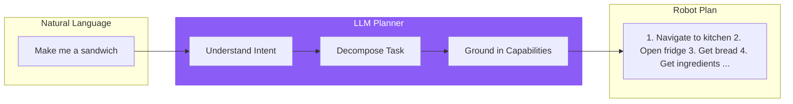
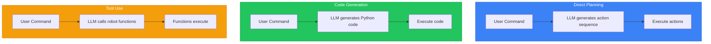
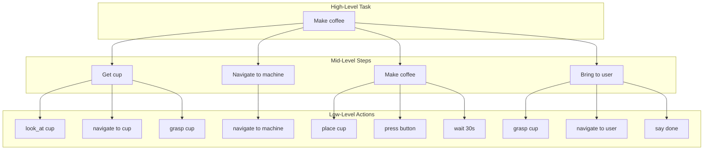
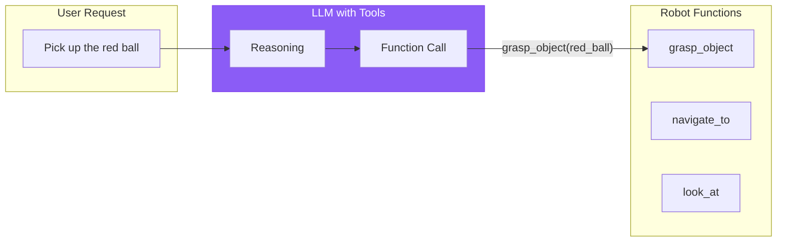
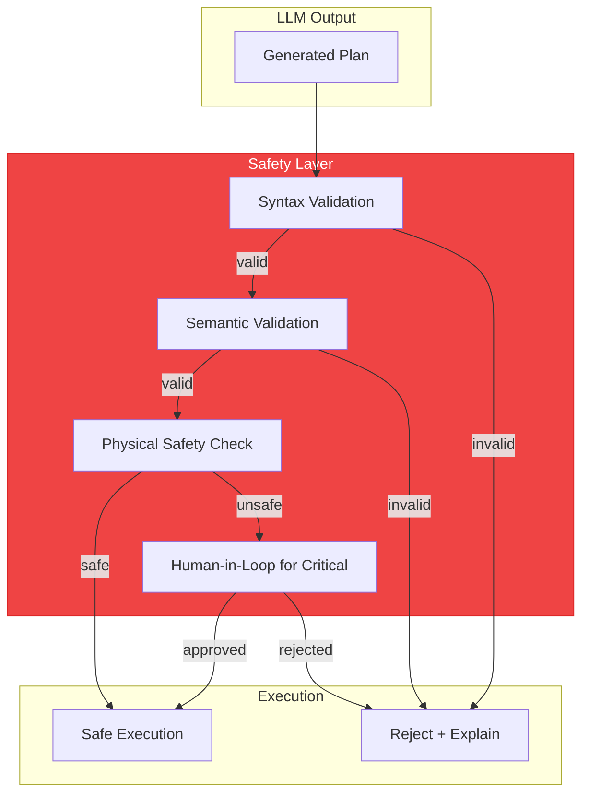

# Chapter 15: LLM-Based Task Planning for Robots

## Learning Objectives

By the end of this chapter, you will be able to:

- Understand how LLMs can be used for robot task planning
- Design prompts that ground LLM outputs in robot capabilities
- Implement task decomposition for complex multi-step instructions
- Configure tool use and function calling for robot actions
- Apply safety constraints to LLM-generated commands
- Handle LLM limitations (hallucination, grounding errors)

## Prerequisites

- Completed Chapter 14 (Speech Recognition)
- API access to LLM service (OpenAI, Anthropic, or local)
- Understanding of ROS 2 action servers

---

## 15.1 LLMs for Robot Planning

**Large Language Models (LLMs)** can translate natural language into structured robot commands.



### Why LLMs for Robot Planning?

| Capability | Benefit for Robotics |
|------------|---------------------|
| **Language Understanding** | Parse complex, ambiguous instructions |
| **World Knowledge** | Understand object properties and common sense |
| **Reasoning** | Break tasks into logical steps |
| **Flexibility** | Handle novel requests without reprogramming |

### LLM Planning Approaches



### Limitations to Address

| Limitation | Risk | Mitigation |
|------------|------|------------|
| **Hallucination** | LLM invents nonexistent actions | Constrain to known primitives |
| **Grounding Errors** | References objects not present | Verify against scene understanding |
| **Safety Blindness** | Generates unsafe commands | Explicit safety validation layer |
| **Temporal Confusion** | Wrong action ordering | Structured output format |

---

## 15.2 Prompt Engineering for Robotics

Effective prompts ground the LLM in robot reality.

### System Prompt Structure

```python
ROBOT_PLANNER_SYSTEM_PROMPT = """You are a robot task planner for a humanoid robot.

## Robot Capabilities
The robot can perform these actions:
- navigate(location): Move to a location. Locations: kitchen, living_room, bedroom, bathroom
- grasp(object): Pick up an object. Requires: object is visible and reachable
- place(object, location): Put held object somewhere
- look_at(target): Turn head to look at target
- say(message): Speak to the user
- wait(seconds): Pause execution

## Current State
{current_state}

## Scene Objects
{visible_objects}

## Rules
1. Only use actions from the capabilities list
2. Check that objects exist before trying to grasp them
3. Navigate to objects that are not reachable
4. Always confirm task completion by speaking to user
5. If a task is impossible, explain why instead of attempting it

## Output Format
Return a JSON array of actions:
[
  {"action": "navigate", "params": {"location": "kitchen"}},
  {"action": "grasp", "params": {"object": "cup"}},
  ...
]
"""
```

### Capability Grounding

Define what the robot can actually do:

```python
# File: robot_capabilities.py
from dataclasses import dataclass
from typing import List, Dict, Any, Optional

@dataclass
class RobotCapability:
    """Definition of a robot capability."""
    name: str
    description: str
    parameters: Dict[str, str]
    preconditions: List[str]
    effects: List[str]

HUMANOID_CAPABILITIES = [
    RobotCapability(
        name="navigate",
        description="Move the robot to a specified location",
        parameters={"location": "Target location name"},
        preconditions=["location must be known"],
        effects=["robot is at location"]
    ),
    RobotCapability(
        name="grasp",
        description="Pick up an object with the robot's hand",
        parameters={"object": "Name of object to grasp"},
        preconditions=[
            "object must be visible",
            "object must be reachable",
            "hand must be empty"
        ],
        effects=["robot is holding object"]
    ),
    RobotCapability(
        name="place",
        description="Put the held object at a location",
        parameters={
            "object": "Object being held",
            "surface": "Where to place it"
        },
        preconditions=[
            "robot must be holding object",
            "surface must be reachable"
        ],
        effects=["object is on surface", "hand is empty"]
    ),
    RobotCapability(
        name="look_at",
        description="Turn head to look at a target",
        parameters={"target": "What to look at"},
        preconditions=[],
        effects=["robot is looking at target"]
    ),
    RobotCapability(
        name="say",
        description="Speak a message to the user",
        parameters={"message": "Text to speak"},
        preconditions=[],
        effects=["user heard message"]
    ),
    RobotCapability(
        name="wait",
        description="Pause for specified duration",
        parameters={"seconds": "Duration to wait"},
        preconditions=[],
        effects=["time has passed"]
    ),
]

def format_capabilities_for_prompt(capabilities: List[RobotCapability]) -> str:
    """Format capabilities for inclusion in LLM prompt."""
    lines = []
    for cap in capabilities:
        params = ", ".join(f"{k}: {v}" for k, v in cap.parameters.items())
        lines.append(f"- {cap.name}({params}): {cap.description}")
        if cap.preconditions:
            lines.append(f"  Requires: {', '.join(cap.preconditions)}")
    return "\n".join(lines)
```

### State Injection

Provide current robot and scene state:

```python
class StateFormatter:
    """Format robot state for LLM prompts."""

    def format_robot_state(self, state: dict) -> str:
        """Format current robot state."""
        return f"""Robot State:
- Location: {state['location']}
- Holding: {state.get('holding', 'nothing')}
- Battery: {state.get('battery', 100)}%
- Status: {state.get('status', 'idle')}"""

    def format_scene(self, objects: List[dict]) -> str:
        """Format visible objects."""
        if not objects:
            return "No objects currently visible."

        lines = ["Visible Objects:"]
        for obj in objects:
            location = obj.get('location', 'unknown location')
            reachable = "reachable" if obj.get('reachable') else "not reachable"
            lines.append(f"- {obj['name']}: at {location}, {reachable}")
        return "\n".join(lines)
```

---

## 15.3 Task Decomposition Strategies

Break complex tasks into executable steps.

### Chain-of-Thought Prompting

```python
COT_PROMPT = """Think through this task step by step:

Task: {user_request}

Current State:
{robot_state}

Think about:
1. What is the goal state?
2. What actions are needed to reach it?
3. What order must they happen?
4. Are there any obstacles or requirements?

Then provide the action sequence.
"""

class ChainOfThoughtPlanner:
    """Use chain-of-thought for task decomposition."""

    def __init__(self, llm_client):
        self.llm = llm_client

    def plan(self, request: str, state: dict) -> dict:
        """Generate plan using chain-of-thought."""
        prompt = COT_PROMPT.format(
            user_request=request,
            robot_state=self.format_state(state)
        )

        response = self.llm.chat.completions.create(
            model="gpt-4o",
            messages=[
                {"role": "system", "content": ROBOT_PLANNER_SYSTEM_PROMPT},
                {"role": "user", "content": prompt}
            ]
        )

        # Parse reasoning and extract plan
        return self.parse_response(response.choices[0].message.content)
```

### Hierarchical Task Decomposition



```python
class HierarchicalPlanner:
    """Two-level hierarchical task planner."""

    def __init__(self, llm_client):
        self.llm = llm_client

    def plan(self, request: str, state: dict) -> List[dict]:
        """Generate hierarchical plan."""
        # Level 1: High-level decomposition
        high_level = self.decompose_high_level(request, state)

        # Level 2: Expand each step to primitives
        full_plan = []
        for step in high_level:
            primitives = self.expand_to_primitives(step, state)
            full_plan.extend(primitives)

        return full_plan

    def decompose_high_level(self, request: str, state: dict) -> List[str]:
        """Break task into high-level steps."""
        prompt = f"""Break this task into 3-7 high-level steps:
Task: {request}

Return as a numbered list of steps."""

        response = self.llm.chat.completions.create(
            model="gpt-4o",
            messages=[{"role": "user", "content": prompt}]
        )

        # Parse numbered list
        return self.parse_steps(response.choices[0].message.content)

    def expand_to_primitives(self, step: str, state: dict) -> List[dict]:
        """Expand high-level step to robot primitives."""
        prompt = f"""Convert this step to robot actions:
Step: {step}

Available actions: navigate, grasp, place, look_at, say, wait

Return as JSON array of actions."""

        response = self.llm.chat.completions.create(
            model="gpt-4o",
            messages=[
                {"role": "system", "content": ROBOT_PLANNER_SYSTEM_PROMPT},
                {"role": "user", "content": prompt}
            ],
            response_format={"type": "json_object"}
        )

        return json.loads(response.choices[0].message.content)["actions"]
```

---

## 15.4 Tool Use and Function Calling

Modern LLMs can call functions directly.



### Defining Robot Tools

```python
# File: robot_tools.py
ROBOT_TOOLS = [
    {
        "type": "function",
        "function": {
            "name": "navigate_to",
            "description": "Move the robot to a specified location",
            "parameters": {
                "type": "object",
                "properties": {
                    "location": {
                        "type": "string",
                        "description": "Target location (kitchen, living_room, bedroom)"
                    }
                },
                "required": ["location"]
            }
        }
    },
    {
        "type": "function",
        "function": {
            "name": "grasp_object",
            "description": "Pick up an object. Object must be visible and reachable.",
            "parameters": {
                "type": "object",
                "properties": {
                    "object_name": {
                        "type": "string",
                        "description": "Name of the object to grasp"
                    },
                    "grasp_type": {
                        "type": "string",
                        "enum": ["power", "precision", "gentle"],
                        "description": "Type of grasp to use"
                    }
                },
                "required": ["object_name"]
            }
        }
    },
    {
        "type": "function",
        "function": {
            "name": "place_object",
            "description": "Place the currently held object at a location",
            "parameters": {
                "type": "object",
                "properties": {
                    "surface": {
                        "type": "string",
                        "description": "Surface to place object on"
                    },
                    "position": {
                        "type": "string",
                        "enum": ["left", "center", "right"],
                        "description": "Position on the surface"
                    }
                },
                "required": ["surface"]
            }
        }
    },
    {
        "type": "function",
        "function": {
            "name": "speak",
            "description": "Say something to the user",
            "parameters": {
                "type": "object",
                "properties": {
                    "message": {
                        "type": "string",
                        "description": "Message to speak"
                    }
                },
                "required": ["message"]
            }
        }
    },
    {
        "type": "function",
        "function": {
            "name": "look_at",
            "description": "Turn head to look at something",
            "parameters": {
                "type": "object",
                "properties": {
                    "target": {
                        "type": "string",
                        "description": "What to look at"
                    }
                },
                "required": ["target"]
            }
        }
    },
    {
        "type": "function",
        "function": {
            "name": "wait",
            "description": "Wait for a specified duration",
            "parameters": {
                "type": "object",
                "properties": {
                    "seconds": {
                        "type": "number",
                        "description": "Seconds to wait"
                    }
                },
                "required": ["seconds"]
            }
        }
    },
    {
        "type": "function",
        "function": {
            "name": "request_clarification",
            "description": "Ask the user for clarification when instruction is ambiguous",
            "parameters": {
                "type": "object",
                "properties": {
                    "question": {
                        "type": "string",
                        "description": "Clarifying question to ask"
                    }
                },
                "required": ["question"]
            }
        }
    }
]
```

### Tool-Based Planner

```python
# File: tool_planner.py
from openai import OpenAI
import json

class ToolBasedPlanner:
    """LLM planner using function calling."""

    def __init__(self, api_key: str):
        self.client = OpenAI(api_key=api_key)
        self.tools = ROBOT_TOOLS

    def plan(self, request: str, state: dict, scene: dict) -> List[dict]:
        """Generate plan using tool calls."""
        system_prompt = self.build_system_prompt(state, scene)

        messages = [
            {"role": "system", "content": system_prompt},
            {"role": "user", "content": request}
        ]

        # Collect tool calls until done
        actions = []
        max_iterations = 20

        for _ in range(max_iterations):
            response = self.client.chat.completions.create(
                model="gpt-4o",
                messages=messages,
                tools=self.tools,
                tool_choice="auto"
            )

            message = response.choices[0].message

            if message.tool_calls:
                # Process each tool call
                for tool_call in message.tool_calls:
                    action = {
                        "action": tool_call.function.name,
                        "params": json.loads(tool_call.function.arguments)
                    }
                    actions.append(action)

                    # Add tool response to conversation
                    messages.append(message)
                    messages.append({
                        "role": "tool",
                        "tool_call_id": tool_call.id,
                        "content": f"Action {action['action']} queued successfully"
                    })

            if response.choices[0].finish_reason == "stop":
                break

        return actions

    def build_system_prompt(self, state: dict, scene: dict) -> str:
        """Build system prompt with current context."""
        return f"""You are a robot task planner. Use the available tools to
create a plan that accomplishes the user's request.

Current robot state:
- Location: {state.get('location', 'unknown')}
- Holding: {state.get('holding', 'nothing')}

Visible objects:
{self.format_objects(scene.get('objects', []))}

Rules:
1. Only interact with objects that are visible
2. Navigate to objects that are not reachable
3. Always confirm completion with the speak tool
4. Use request_clarification if the instruction is ambiguous
"""

    def format_objects(self, objects: list) -> str:
        """Format visible objects for prompt."""
        if not objects:
            return "No objects visible"
        return "\n".join(f"- {obj['name']} at {obj['location']}" for obj in objects)
```

---

## 15.5 Safety Constraints and Command Validation

Prevent unsafe LLM-generated commands.



### Validation Pipeline

```python
# File: safety_validator.py
from dataclasses import dataclass
from typing import List, Optional
from enum import Enum

class ValidationResult(Enum):
    VALID = "valid"
    INVALID_SYNTAX = "invalid_syntax"
    UNKNOWN_ACTION = "unknown_action"
    MISSING_PRECONDITION = "missing_precondition"
    SAFETY_VIOLATION = "safety_violation"
    REQUIRES_CONFIRMATION = "requires_confirmation"

@dataclass
class ValidationReport:
    result: ValidationResult
    message: str
    action_index: Optional[int] = None
    suggestion: Optional[str] = None

class SafetyValidator:
    """Validate LLM-generated plans for safety."""

    KNOWN_ACTIONS = {"navigate", "grasp", "place", "look_at", "say", "wait"}

    FORBIDDEN_ACTIONS = {
        "throw": "Throwing objects is not allowed",
        "push_person": "Physical contact with humans is not allowed",
        "run": "Running is not safe for bipedal robots",
        "jump": "Jumping is not safe for bipedal robots",
    }

    DANGEROUS_OBJECTS = {
        "knife", "scissors", "glass", "hot_item", "electrical"
    }

    MAX_SPEED = 0.5  # m/s
    MAX_REACH = 0.8  # meters

    def validate_plan(
        self,
        plan: List[dict],
        state: dict,
        scene: dict
    ) -> List[ValidationReport]:
        """Validate entire plan."""
        reports = []

        for i, action in enumerate(plan):
            # Syntax validation
            syntax_result = self.validate_syntax(action)
            if syntax_result.result != ValidationResult.VALID:
                reports.append(syntax_result)
                continue

            # Semantic validation
            semantic_result = self.validate_semantics(action, state, scene)
            if semantic_result.result != ValidationResult.VALID:
                reports.append(semantic_result)
                continue

            # Safety validation
            safety_result = self.validate_safety(action, state, scene)
            reports.append(safety_result)

            # Update simulated state for next action
            state = self.simulate_action(action, state)

        return reports

    def validate_syntax(self, action: dict) -> ValidationReport:
        """Check action has valid structure."""
        if "action" not in action:
            return ValidationReport(
                result=ValidationResult.INVALID_SYNTAX,
                message="Action missing 'action' field"
            )

        action_name = action["action"]

        if action_name not in self.KNOWN_ACTIONS:
            if action_name in self.FORBIDDEN_ACTIONS:
                return ValidationReport(
                    result=ValidationResult.SAFETY_VIOLATION,
                    message=self.FORBIDDEN_ACTIONS[action_name]
                )
            return ValidationReport(
                result=ValidationResult.UNKNOWN_ACTION,
                message=f"Unknown action: {action_name}",
                suggestion=f"Known actions: {self.KNOWN_ACTIONS}"
            )

        return ValidationReport(
            result=ValidationResult.VALID,
            message="Syntax valid"
        )

    def validate_semantics(
        self,
        action: dict,
        state: dict,
        scene: dict
    ) -> ValidationReport:
        """Check action makes sense in current context."""
        action_name = action["action"]
        params = action.get("params", {})

        if action_name == "grasp":
            obj_name = params.get("object_name", params.get("object"))

            # Check object exists in scene
            visible_objects = [o["name"] for o in scene.get("objects", [])]
            if obj_name not in visible_objects:
                return ValidationReport(
                    result=ValidationResult.MISSING_PRECONDITION,
                    message=f"Object '{obj_name}' is not visible",
                    suggestion="Navigate to where the object might be, or look around"
                )

            # Check hands are free
            if state.get("holding"):
                return ValidationReport(
                    result=ValidationResult.MISSING_PRECONDITION,
                    message=f"Already holding {state['holding']}",
                    suggestion="Place current object first"
                )

        elif action_name == "place":
            if not state.get("holding"):
                return ValidationReport(
                    result=ValidationResult.MISSING_PRECONDITION,
                    message="Not holding any object to place",
                    suggestion="Grasp an object first"
                )

        return ValidationReport(
            result=ValidationResult.VALID,
            message="Semantics valid"
        )

    def validate_safety(
        self,
        action: dict,
        state: dict,
        scene: dict
    ) -> ValidationReport:
        """Check action is safe to execute."""
        action_name = action["action"]
        params = action.get("params", {})

        if action_name == "grasp":
            obj_name = params.get("object_name", params.get("object"))

            # Check if object is dangerous
            if any(danger in obj_name.lower() for danger in self.DANGEROUS_OBJECTS):
                return ValidationReport(
                    result=ValidationResult.REQUIRES_CONFIRMATION,
                    message=f"Handling '{obj_name}' requires confirmation",
                    suggestion="Ask user to confirm this action"
                )

        elif action_name == "navigate":
            location = params.get("location")

            # Check if humans are in path (from scene understanding)
            humans_in_scene = [o for o in scene.get("objects", [])
                             if o.get("type") == "human"]
            if humans_in_scene:
                return ValidationReport(
                    result=ValidationResult.REQUIRES_CONFIRMATION,
                    message="Humans detected in environment",
                    suggestion="Proceed with caution, reduced speed"
                )

        return ValidationReport(
            result=ValidationResult.VALID,
            message="Safety check passed"
        )

    def simulate_action(self, action: dict, state: dict) -> dict:
        """Simulate action effect on state."""
        new_state = state.copy()

        if action["action"] == "grasp":
            new_state["holding"] = action["params"].get("object_name")
        elif action["action"] == "place":
            new_state["holding"] = None
        elif action["action"] == "navigate":
            new_state["location"] = action["params"].get("location")

        return new_state
```

### Safety-Wrapped Planner

```python
class SafeRobotPlanner:
    """LLM planner with safety validation."""

    def __init__(self, llm_client, validator: SafetyValidator):
        self.planner = ToolBasedPlanner(llm_client)
        self.validator = validator

    def plan_safely(
        self,
        request: str,
        state: dict,
        scene: dict
    ) -> dict:
        """Generate and validate plan."""
        # Generate initial plan
        plan = self.planner.plan(request, state, scene)

        # Validate
        reports = self.validator.validate_plan(plan, state, scene)

        # Check for issues
        issues = [r for r in reports if r.result != ValidationResult.VALID]

        if not issues:
            return {
                "success": True,
                "plan": plan
            }

        # Handle issues
        critical = [r for r in issues
                   if r.result == ValidationResult.SAFETY_VIOLATION]
        if critical:
            return {
                "success": False,
                "error": "Safety violation",
                "details": [r.message for r in critical]
            }

        confirmation_needed = [r for r in issues
                             if r.result == ValidationResult.REQUIRES_CONFIRMATION]
        if confirmation_needed:
            return {
                "success": True,
                "plan": plan,
                "requires_confirmation": True,
                "confirmation_reasons": [r.message for r in confirmation_needed]
            }

        # Try to fix other issues
        fixed_plan = self.attempt_fix(plan, issues, state, scene)
        if fixed_plan:
            return {
                "success": True,
                "plan": fixed_plan,
                "was_modified": True
            }

        return {
            "success": False,
            "error": "Could not generate valid plan",
            "details": [r.message for r in issues]
        }
```

---

## 15.6 Handling LLM Errors

### Hallucination Detection

```python
class HallucinationDetector:
    """Detect when LLM hallucinates capabilities or objects."""

    def __init__(self, known_objects: set, known_locations: set):
        self.known_objects = known_objects
        self.known_locations = known_locations

    def check_plan(self, plan: List[dict], scene: dict) -> List[dict]:
        """Find hallucinated references in plan."""
        issues = []
        visible_objects = {o["name"] for o in scene.get("objects", [])}

        for i, action in enumerate(plan):
            params = action.get("params", {})

            # Check object references
            obj = params.get("object_name") or params.get("object")
            if obj and obj not in visible_objects:
                # Could be hallucination or just not visible
                issues.append({
                    "action_index": i,
                    "issue": "object_not_visible",
                    "object": obj,
                    "suggestion": f"Object '{obj}' not currently visible. Navigate to find it?"
                })

            # Check location references
            loc = params.get("location")
            if loc and loc not in self.known_locations:
                issues.append({
                    "action_index": i,
                    "issue": "unknown_location",
                    "location": loc,
                    "suggestion": f"Unknown location '{loc}'. Known: {self.known_locations}"
                })

        return issues
```

### Fallback Strategies

```python
class PlannerWithFallback:
    """Planner with graceful degradation."""

    def __init__(self, primary_planner, fallback_planner=None):
        self.primary = primary_planner
        self.fallback = fallback_planner or SimpleRulePlanner()

    def plan(self, request: str, state: dict, scene: dict) -> dict:
        """Attempt planning with fallback."""
        try:
            # Try LLM planner
            result = self.primary.plan_safely(request, state, scene)

            if result["success"]:
                return result

            # LLM failed, try simpler approach
            self.log("LLM planner failed, trying fallback")

        except Exception as e:
            self.log(f"LLM error: {e}, using fallback")

        # Fallback to rule-based for simple commands
        fallback_result = self.fallback.plan(request, state, scene)
        if fallback_result:
            return {
                "success": True,
                "plan": fallback_result,
                "source": "fallback"
            }

        # Complete failure
        return {
            "success": False,
            "error": "Could not plan this task",
            "suggestion": "Please try a simpler command"
        }

class SimpleRulePlanner:
    """Simple rule-based fallback planner."""

    SIMPLE_PATTERNS = {
        "pick up": lambda obj: [
            {"action": "look_at", "params": {"target": obj}},
            {"action": "grasp", "params": {"object_name": obj}}
        ],
        "go to": lambda loc: [
            {"action": "navigate", "params": {"location": loc}}
        ],
        "put down": lambda _: [
            {"action": "place", "params": {"surface": "nearest_surface"}}
        ],
    }

    def plan(self, request: str, state: dict, scene: dict) -> Optional[List[dict]]:
        """Try to match simple patterns."""
        request_lower = request.lower()

        for pattern, plan_fn in self.SIMPLE_PATTERNS.items():
            if pattern in request_lower:
                # Extract target from request
                target = self.extract_target(request_lower, pattern)
                if target:
                    return plan_fn(target)

        return None

    def extract_target(self, request: str, pattern: str) -> Optional[str]:
        """Extract target object/location from request."""
        after_pattern = request.split(pattern)[-1].strip()
        words = after_pattern.split()
        if words:
            # Simple: take first few words as target
            return " ".join(words[:3]).strip(".,!?")
        return None
```

---

## 15.7 Local vs. Cloud LLMs

### Cost and Latency Comparison

| Factor | Cloud (GPT-4o) | Local (Llama 3) |
|--------|----------------|-----------------|
| **Latency** | 1-3 seconds | 0.5-2 seconds |
| **Cost** | $0.01-0.03/request | Hardware only |
| **Privacy** | Data leaves device | Fully private |
| **Quality** | Highest | Good for simple tasks |
| **Availability** | Requires internet | Always available |

### Local LLM Setup

```python
# File: local_llm_planner.py
from llama_cpp import Llama

class LocalLLMPlanner:
    """Task planner using local LLM."""

    def __init__(self, model_path: str, n_gpu_layers: int = -1):
        self.llm = Llama(
            model_path=model_path,
            n_gpu_layers=n_gpu_layers,  # -1 = all layers on GPU
            n_ctx=4096,
            chat_format="llama-3"
        )

    def plan(self, request: str, state: dict, scene: dict) -> List[dict]:
        """Generate plan using local model."""
        system_prompt = self.build_prompt(state, scene)

        response = self.llm.create_chat_completion(
            messages=[
                {"role": "system", "content": system_prompt},
                {"role": "user", "content": request}
            ],
            max_tokens=1024,
            temperature=0.1,  # Low temperature for deterministic output
        )

        return self.parse_plan(response["choices"][0]["message"]["content"])

    def build_prompt(self, state: dict, scene: dict) -> str:
        """Build prompt for local model (simpler than cloud)."""
        return f"""You are a robot planner. Output only a JSON array of actions.
Actions: navigate, grasp, place, look_at, say, wait
State: {json.dumps(state)}
Objects: {json.dumps(scene.get('objects', []))}
Output format: [{{"action": "...", "params": {{...}}}}]"""
```

### Hybrid Approach

```python
class HybridPlanner:
    """Use local for simple tasks, cloud for complex."""

    def __init__(self, local_planner, cloud_planner):
        self.local = local_planner
        self.cloud = cloud_planner
        self.complexity_threshold = 3  # words

    def plan(self, request: str, state: dict, scene: dict) -> dict:
        """Route to appropriate planner."""
        complexity = self.estimate_complexity(request)

        if complexity <= self.complexity_threshold:
            # Simple task - use local
            try:
                plan = self.local.plan(request, state, scene)
                return {"success": True, "plan": plan, "source": "local"}
            except Exception:
                pass  # Fall through to cloud

        # Complex task or local failed - use cloud
        return self.cloud.plan_safely(request, state, scene)

    def estimate_complexity(self, request: str) -> int:
        """Estimate task complexity."""
        # Simple heuristic: count action verbs
        action_words = ["pick", "place", "go", "bring", "find", "get",
                       "put", "move", "take", "give", "make", "clean"]
        words = request.lower().split()
        return sum(1 for w in words if w in action_words)
```

---

## 15.8 Hands-on: Building an LLM-Powered Task Planner

Complete implementation:

```python
# File: llm_task_planner.py
"""Complete LLM-powered task planner for humanoid robot."""

import rclpy
from rclpy.node import Node
from rclpy.action import ActionClient
from std_msgs.msg import String
from humanoid_interfaces.msg import VoiceCommand
from humanoid_interfaces.action import ExecuteBehavior
from humanoid_interfaces.srv import GetSceneObjects
import json

class LLMTaskPlannerNode(Node):
    """ROS 2 node for LLM-based task planning."""

    def __init__(self):
        super().__init__('llm_task_planner')

        # Parameters
        self.declare_parameter('use_local_llm', False)
        self.declare_parameter('api_key', '')
        self.declare_parameter('model', 'gpt-4o')

        # Initialize planner
        if self.get_parameter('use_local_llm').value:
            self.planner = LocalLLMPlanner('/models/llama-3-8b.gguf')
        else:
            api_key = self.get_parameter('api_key').value
            self.planner = SafeRobotPlanner(
                OpenAI(api_key=api_key),
                SafetyValidator()
            )

        # Robot state
        self.robot_state = {
            "location": "living_room",
            "holding": None
        }

        # Subscribers
        self.command_sub = self.create_subscription(
            VoiceCommand, 'speech/command',
            self.on_voice_command, 10
        )

        # Service clients
        self.scene_client = self.create_client(
            GetSceneObjects, 'perception/get_scene'
        )

        # Action client
        self.behavior_client = ActionClient(
            self, ExecuteBehavior, 'execute_behavior'
        )

        # Publishers
        self.plan_pub = self.create_publisher(
            String, 'planner/current_plan', 10
        )

        self.get_logger().info('LLM Task Planner ready')

    def on_voice_command(self, msg: VoiceCommand):
        """Handle incoming voice command."""
        self.get_logger().info(f'Planning for: {msg.text}')

        # Get current scene
        scene = self.get_scene()

        # Generate plan
        result = self.planner.plan_safely(
            msg.text,
            self.robot_state,
            scene
        )

        if not result["success"]:
            self.handle_planning_failure(result)
            return

        # Check for confirmation
        if result.get("requires_confirmation"):
            self.request_confirmation(result)
            return

        # Execute plan
        self.execute_plan(result["plan"])

    def get_scene(self) -> dict:
        """Get current scene from perception."""
        if not self.scene_client.wait_for_service(timeout_sec=1.0):
            return {"objects": []}

        request = GetSceneObjects.Request()
        future = self.scene_client.call_async(request)
        rclpy.spin_until_future_complete(self, future, timeout_sec=2.0)

        if future.result():
            return {
                "objects": [
                    {"name": obj.name, "location": obj.location}
                    for obj in future.result().objects
                ]
            }
        return {"objects": []}

    def execute_plan(self, plan: List[dict]):
        """Execute plan actions sequentially."""
        self.get_logger().info(f'Executing plan with {len(plan)} actions')

        # Publish plan for visualization
        plan_msg = String()
        plan_msg.data = json.dumps(plan)
        self.plan_pub.publish(plan_msg)

        # Execute each action
        for i, action in enumerate(plan):
            self.get_logger().info(
                f'Action {i+1}/{len(plan)}: {action["action"]}'
            )

            success = self.execute_action(action)

            if not success:
                self.get_logger().error(f'Action failed: {action}')
                self.speak(f"I couldn't complete step {i+1}")
                break

            # Update state
            self.update_state(action)

    def execute_action(self, action: dict) -> bool:
        """Execute single action via behavior server."""
        goal = ExecuteBehavior.Goal()
        goal.behavior_name = action["action"]
        goal.parameters = json.dumps(action.get("params", {}))

        self.behavior_client.wait_for_server()
        future = self.behavior_client.send_goal_async(goal)
        rclpy.spin_until_future_complete(self, future)

        goal_handle = future.result()
        if not goal_handle.accepted:
            return False

        result_future = goal_handle.get_result_async()
        rclpy.spin_until_future_complete(self, result_future)

        return result_future.result().result.success

    def update_state(self, action: dict):
        """Update robot state after action."""
        if action["action"] == "grasp":
            self.robot_state["holding"] = action["params"].get("object_name")
        elif action["action"] == "place":
            self.robot_state["holding"] = None
        elif action["action"] == "navigate":
            self.robot_state["location"] = action["params"].get("location")

    def handle_planning_failure(self, result: dict):
        """Handle failed planning."""
        error = result.get("error", "Unknown error")
        self.get_logger().error(f'Planning failed: {error}')
        self.speak(f"I couldn't plan that task. {error}")

    def request_confirmation(self, result: dict):
        """Request user confirmation for risky actions."""
        reasons = result.get("confirmation_reasons", [])
        message = f"This action requires confirmation: {reasons[0]}. Should I proceed?"
        self.speak(message)
        # Would need to wait for voice response here

    def speak(self, message: str):
        """Text-to-speech output."""
        # Publish to TTS node
        self.get_logger().info(f'Robot: {message}')

def main():
    rclpy.init()
    node = LLMTaskPlannerNode()
    rclpy.spin(node)
    rclpy.shutdown()

if __name__ == '__main__':
    main()
```

---

## 15.9 Common Errors and Solutions

### Error: LLM Generates Unknown Actions

**Symptom**: Plan contains actions not in capability set.

**Solution**: Stronger capability grounding:

```python
# Add explicit constraints to prompt
CONSTRAINT_PROMPT = """
IMPORTANT: You can ONLY use these exact actions:
- navigate(location)
- grasp(object_name)
- place(surface)
- look_at(target)
- say(message)
- wait(seconds)

Do NOT use any other action names. If you need an action not listed,
use say() to explain what you cannot do.
"""
```

### Error: Plans Reference Non-Existent Objects

**Symptom**: LLM plans to grasp objects not in scene.

**Solution**: Scene verification:

```python
def verify_objects_exist(plan, scene):
    """Verify all referenced objects exist."""
    visible = {o["name"] for o in scene["objects"]}

    for action in plan:
        obj = action.get("params", {}).get("object_name")
        if obj and obj not in visible:
            # Ask LLM to replan with explicit constraint
            return replan_with_constraint(
                f"Object '{obj}' is not visible. Only these objects are available: {visible}"
            )
```

### Error: High Latency

**Symptom**: Planning takes > 5 seconds.

**Solutions**:
1. Use smaller/faster model (GPT-4o-mini)
2. Use local LLM for simple tasks
3. Cache common plans
4. Stream responses for user feedback

```python
# Streaming response
for chunk in client.chat.completions.create(
    model="gpt-4o",
    messages=messages,
    stream=True
):
    # Show progress to user
    print(chunk.choices[0].delta.content, end="")
```

### Error: Unsafe Commands Generated

**Symptom**: LLM generates potentially dangerous actions.

**Solution**: Multi-layer safety validation (as shown in Section 15.5).

---

## Exercises

### Exercise 15.1: Design Robot Capability Prompt (Basic)

Create a system prompt for an LLM that plans for a kitchen robot with these capabilities:
- Open/close fridge, cabinet, microwave
- Pick up food items
- Place items on counter, in microwave
- Turn on/off microwave

### Exercise 15.2: Implement Task Decomposition (Intermediate)

Write a function that uses an LLM to decompose "Clean up the living room" into a list of specific actions for a humanoid robot.

### Exercise 15.3: Add Safety Validation (Intermediate)

Extend the SafetyValidator class to check for:
- Actions that would exceed robot's reach
- Commands involving liquids (special handling)
- Time-critical sequences (must complete within deadline)

### Exercise 15.4: Build Hybrid Planner (Advanced)

Implement a complete hybrid planner that:
- Uses local LLM for single-step commands
- Uses cloud LLM for multi-step tasks
- Falls back gracefully on errors
- Tracks planning latency and success rates

---

## Summary

- **LLMs** can translate natural language to robot task plans
- **Prompt engineering** grounds LLM output in robot capabilities
- **Task decomposition** breaks complex instructions into primitives
- **Tool/function calling** provides structured action output
- **Safety validation** prevents dangerous commands
- **Hallucination detection** catches non-existent references
- **Hybrid approaches** balance quality, cost, and latency

### Key Takeaways

1. Ground LLMs in actual robot capabilities via careful prompting
2. Always validate LLM output before execution
3. Safety constraints are non-negotiable for physical robots
4. Local LLMs work well for simple tasks
5. Fallback strategies ensure graceful degradation

### What's Next

Chapter 16 covers **Conversational Robotics** - building multi-turn dialogue interfaces with context tracking.
