# Chapter 16: Conversational Robotics

## Learning Objectives

By the end of this chapter, you will be able to:

- Design dialogue flows for robot assistants
- Implement context tracking for multi-turn conversations
- Handle reference resolution ("it", "that one", "the other")
- Create natural error recovery and clarification strategies
- Integrate speech, language, and action in conversational loops
- Prepare the complete VLA pipeline for capstone integration

## Prerequisites

- Completed Chapters 13-15 (VLA, Speech, LLM Planning)
- Understanding of state machines
- Familiarity with ROS 2 services and actions

---

## 16.1 Dialogue Management Fundamentals

Robots must maintain coherent conversations over multiple turns.


### Dialogue State Components

| Component | Purpose | Example |
|-----------|---------|---------|
| **Intent History** | Track conversation goals | `[find_object, grasp_object]` |
| **Entity Memory** | Remember mentioned objects | `{ball: red_ball_on_table}` |
| **Task Context** | Current task progress | step 2/5 of "make coffee" |
| **User Model** | User preferences/history | `prefers_verbose_responses` |

### Dialogue State Machine

```python
# File: dialogue_state_machine.py
from enum import Enum, auto
from dataclasses import dataclass, field
from typing import Dict, List, Optional, Any

class DialogueState(Enum):
    IDLE = auto()
    LISTENING = auto()
    UNDERSTANDING = auto()
    CLARIFYING = auto()
    PLANNING = auto()
    EXECUTING = auto()
    CONFIRMING = auto()
    ERROR_RECOVERY = auto()

@dataclass
class ConversationContext:
    """Full context of ongoing conversation."""
    state: DialogueState = DialogueState.IDLE
    current_intent: Optional[str] = None
    entities: Dict[str, Any] = field(default_factory=dict)
    history: List[Dict] = field(default_factory=list)
    task_progress: Optional[Dict] = None
    pending_clarification: Optional[str] = None
    error_count: int = 0

class DialogueStateMachine:
    """Manage dialogue state transitions."""

    def __init__(self):
        self.context = ConversationContext()
        self.transitions = self._define_transitions()

    def _define_transitions(self) -> Dict:
        """Define valid state transitions."""
        return {
            DialogueState.IDLE: {
                "user_speaks": DialogueState.LISTENING,
                "timeout": DialogueState.IDLE,
            },
            DialogueState.LISTENING: {
                "speech_complete": DialogueState.UNDERSTANDING,
                "silence": DialogueState.IDLE,
            },
            DialogueState.UNDERSTANDING: {
                "understood": DialogueState.PLANNING,
                "ambiguous": DialogueState.CLARIFYING,
                "not_understood": DialogueState.ERROR_RECOVERY,
            },
            DialogueState.CLARIFYING: {
                "clarification_received": DialogueState.UNDERSTANDING,
                "user_cancels": DialogueState.IDLE,
                "timeout": DialogueState.ERROR_RECOVERY,
            },
            DialogueState.PLANNING: {
                "plan_ready": DialogueState.CONFIRMING,
                "plan_failed": DialogueState.ERROR_RECOVERY,
                "simple_task": DialogueState.EXECUTING,
            },
            DialogueState.CONFIRMING: {
                "user_confirms": DialogueState.EXECUTING,
                "user_rejects": DialogueState.CLARIFYING,
                "user_modifies": DialogueState.PLANNING,
            },
            DialogueState.EXECUTING: {
                "task_complete": DialogueState.IDLE,
                "task_failed": DialogueState.ERROR_RECOVERY,
                "user_interrupts": DialogueState.LISTENING,
            },
            DialogueState.ERROR_RECOVERY: {
                "recovery_success": DialogueState.PLANNING,
                "user_helps": DialogueState.UNDERSTANDING,
                "give_up": DialogueState.IDLE,
            },
        }

    def transition(self, event: str) -> bool:
        """Attempt state transition based on event."""
        current = self.context.state
        if event in self.transitions.get(current, {}):
            new_state = self.transitions[current][event]
            self.context.state = new_state
            self._log_transition(current, new_state, event)
            return True
        return False

    def _log_transition(self, old: DialogueState, new: DialogueState, event: str):
        """Log state transition for debugging."""
        self.context.history.append({
            "from": old.name,
            "to": new.name,
            "event": event,
            "timestamp": self._get_timestamp()
        })
```

### Slot Filling Pattern

```python
@dataclass
class TaskSlots:
    """Slots to fill for a task."""
    action: Optional[str] = None
    target_object: Optional[str] = None
    target_location: Optional[str] = None
    modifiers: List[str] = field(default_factory=list)

    def is_complete(self) -> bool:
        """Check if required slots are filled."""
        return self.action is not None and self.target_object is not None

    def missing_slots(self) -> List[str]:
        """Return names of unfilled required slots."""
        missing = []
        if self.action is None:
            missing.append("action")
        if self.target_object is None:
            missing.append("target_object")
        return missing

class SlotFiller:
    """Fill task slots from user utterances."""

    def __init__(self, nlp_parser):
        self.parser = nlp_parser
        self.current_slots = TaskSlots()

    def process_utterance(self, text: str) -> TaskSlots:
        """Extract slot values from utterance."""
        parsed = self.parser.parse(text)

        # Update slots with new information
        if parsed.intent:
            self.current_slots.action = parsed.intent
        if parsed.target_object:
            self.current_slots.target_object = parsed.target_object
        if parsed.location:
            self.current_slots.target_location = parsed.location
        if parsed.modifiers:
            self.current_slots.modifiers.extend(parsed.modifiers)

        return self.current_slots

    def get_clarification_question(self) -> Optional[str]:
        """Generate question for missing slots."""
        missing = self.current_slots.missing_slots()

        if not missing:
            return None

        if "action" in missing:
            return "What would you like me to do?"
        if "target_object" in missing:
            return "Which object should I work with?"

        return None

    def reset(self):
        """Clear slots for new task."""
        self.current_slots = TaskSlots()
```

---

## 16.2 Context Tracking and Memory

Track information across conversation turns.

```mermaid
flowchart LR
    subgraph Turn1["Turn 1"]
        U1["Pick up the red ball"]
        R1["Picking up red ball"]
    end

    subgraph Turn2["Turn 2"]
        U2["Put it on the table"]
        R2["Placing red ball on table"]
    end

    subgraph Turn3["Turn 3"]
        U3["Now get the blue one"]
        R3["Picking up blue ball"]
    end

    subgraph Memory["Context Memory"]
        E1[red_ball: grasped → placed]
        E2[table: destination]
        E3[blue_ball: current target]
    end

    Turn1 --> Memory
    Turn2 --> Memory
    Turn3 --> Memory

    style Memory fill:#22c55e,stroke:#16a34a,color:#fff
```



### Conversation Memory

```python
# File: conversation_memory.py
from dataclasses import dataclass, field
from typing import Dict, List, Optional, Any
from datetime import datetime
import json

@dataclass
class EntityMention:
    """A mention of an entity in conversation."""
    name: str
    type: str  # object, location, person
    attributes: Dict[str, Any] = field(default_factory=dict)
    first_mentioned: datetime = field(default_factory=datetime.now)
    last_mentioned: datetime = field(default_factory=datetime.now)
    mention_count: int = 1

@dataclass
class ConversationTurn:
    """Single turn in conversation."""
    speaker: str  # "user" or "robot"
    text: str
    intent: Optional[str] = None
    entities: List[str] = field(default_factory=list)
    timestamp: datetime = field(default_factory=datetime.now)

class ConversationMemory:
    """Long-term memory for conversation context."""

    def __init__(self, max_turns: int = 50):
        self.max_turns = max_turns
        self.turns: List[ConversationTurn] = []
        self.entities: Dict[str, EntityMention] = {}
        self.current_focus: Optional[str] = None
        self.task_stack: List[Dict] = []

    def add_turn(self, speaker: str, text: str, intent: str = None,
                 entities: List[str] = None):
        """Add a conversation turn."""
        turn = ConversationTurn(
            speaker=speaker,
            text=text,
            intent=intent,
            entities=entities or []
        )
        self.turns.append(turn)

        # Update entity mentions
        for entity in (entities or []):
            self.update_entity(entity)

        # Update focus
        if entities:
            self.current_focus = entities[-1]

        # Trim old turns
        if len(self.turns) > self.max_turns:
            self.turns = self.turns[-self.max_turns:]

    def update_entity(self, entity_name: str, entity_type: str = "object",
                      attributes: Dict = None):
        """Update entity tracking."""
        if entity_name in self.entities:
            self.entities[entity_name].last_mentioned = datetime.now()
            self.entities[entity_name].mention_count += 1
            if attributes:
                self.entities[entity_name].attributes.update(attributes)
        else:
            self.entities[entity_name] = EntityMention(
                name=entity_name,
                type=entity_type,
                attributes=attributes or {}
            )

    def get_recent_entity(self, entity_type: str = None) -> Optional[str]:
        """Get most recently mentioned entity."""
        candidates = self.entities.values()
        if entity_type:
            candidates = [e for e in candidates if e.type == entity_type]

        if not candidates:
            return None

        return max(candidates, key=lambda e: e.last_mentioned).name

    def get_context_summary(self) -> str:
        """Generate summary for LLM context."""
        recent_turns = self.turns[-5:]  # Last 5 turns

        summary = "Recent conversation:\n"
        for turn in recent_turns:
            summary += f"{turn.speaker}: {turn.text}\n"

        if self.current_focus:
            summary += f"\nCurrent focus: {self.current_focus}"

        if self.task_stack:
            summary += f"\nCurrent task: {self.task_stack[-1]}"

        return summary

    def push_task(self, task: Dict):
        """Push task onto task stack."""
        self.task_stack.append(task)

    def pop_task(self) -> Optional[Dict]:
        """Pop completed task from stack."""
        return self.task_stack.pop() if self.task_stack else None

    def clear(self):
        """Clear conversation memory."""
        self.turns.clear()
        self.entities.clear()
        self.current_focus = None
        self.task_stack.clear()
```

### Short-Term Working Memory

```python
class WorkingMemory:
    """Short-term memory for current interaction."""

    def __init__(self, capacity: int = 7):  # Miller's Law
        self.capacity = capacity
        self.items: List[Dict] = []
        self.attention_focus: Optional[str] = None

    def add(self, item: Dict):
        """Add item to working memory."""
        # Check if already present
        for existing in self.items:
            if existing.get("id") == item.get("id"):
                existing.update(item)
                return

        self.items.append(item)

        # Enforce capacity limit
        if len(self.items) > self.capacity:
            # Remove least recently accessed
            self.items.pop(0)

    def focus_on(self, item_id: str):
        """Set attention focus."""
        self.attention_focus = item_id
        # Move to end (most recent)
        for i, item in enumerate(self.items):
            if item.get("id") == item_id:
                self.items.append(self.items.pop(i))
                break

    def get_focused(self) -> Optional[Dict]:
        """Get currently focused item."""
        if not self.attention_focus:
            return self.items[-1] if self.items else None

        for item in self.items:
            if item.get("id") == self.attention_focus:
                return item
        return None

    def find_by_description(self, description: str) -> Optional[Dict]:
        """Find item matching description."""
        for item in reversed(self.items):  # Most recent first
            if self._matches(item, description):
                return item
        return None

    def _matches(self, item: Dict, description: str) -> bool:
        """Check if item matches description."""
        desc_lower = description.lower()
        item_name = item.get("name", "").lower()
        item_type = item.get("type", "").lower()

        return (desc_lower in item_name or
                desc_lower in item_type or
                any(desc_lower in str(v).lower()
                    for v in item.get("attributes", {}).values()))
```

---

## 16.3 Reference Resolution

Resolve pronouns and demonstratives to actual objects.


### Reference Resolver

```python
# File: reference_resolver.py
from typing import Optional, List, Dict
from enum import Enum

class ReferenceType(Enum):
    PRONOUN = "pronoun"           # it, them
    DEMONSTRATIVE = "demonstrative"  # this, that
    DEFINITE = "definite"         # the ball
    SPATIAL = "spatial"           # the one on the left
    TEMPORAL = "temporal"         # the previous one
    CONTRASTIVE = "contrastive"   # the other one

class ReferenceResolver:
    """Resolve linguistic references to physical entities."""

    PRONOUNS = {
        "it": ReferenceType.PRONOUN,
        "them": ReferenceType.PRONOUN,
        "this": ReferenceType.DEMONSTRATIVE,
        "that": ReferenceType.DEMONSTRATIVE,
        "these": ReferenceType.DEMONSTRATIVE,
        "those": ReferenceType.DEMONSTRATIVE,
    }

    SPATIAL_MARKERS = ["left", "right", "front", "back", "near", "far",
                       "top", "bottom", "above", "below"]

    TEMPORAL_MARKERS = ["previous", "before", "last", "first", "earlier"]

    CONTRASTIVE_MARKERS = ["other", "different", "another"]

    def __init__(self, memory: ConversationMemory, scene: Dict):
        self.memory = memory
        self.scene = scene

    def resolve(self, reference: str) -> Optional[str]:
        """Resolve reference to entity name."""
        reference = reference.lower().strip()
        ref_type = self._classify_reference(reference)

        if ref_type == ReferenceType.PRONOUN:
            return self._resolve_pronoun(reference)
        elif ref_type == ReferenceType.DEMONSTRATIVE:
            return self._resolve_demonstrative(reference)
        elif ref_type == ReferenceType.SPATIAL:
            return self._resolve_spatial(reference)
        elif ref_type == ReferenceType.TEMPORAL:
            return self._resolve_temporal(reference)
        elif ref_type == ReferenceType.CONTRASTIVE:
            return self._resolve_contrastive(reference)
        else:
            return self._resolve_definite(reference)

    def _classify_reference(self, reference: str) -> ReferenceType:
        """Determine type of reference."""
        words = reference.split()

        if reference in self.PRONOUNS:
            return self.PRONOUNS[reference]

        if any(marker in reference for marker in self.SPATIAL_MARKERS):
            return ReferenceType.SPATIAL

        if any(marker in reference for marker in self.TEMPORAL_MARKERS):
            return ReferenceType.TEMPORAL

        if any(marker in reference for marker in self.CONTRASTIVE_MARKERS):
            return ReferenceType.CONTRASTIVE

        return ReferenceType.DEFINITE

    def _resolve_pronoun(self, pronoun: str) -> Optional[str]:
        """Resolve 'it', 'them' to most salient entity."""
        # Check current focus
        if self.memory.current_focus:
            return self.memory.current_focus

        # Fall back to most recently mentioned
        return self.memory.get_recent_entity("object")

    def _resolve_demonstrative(self, reference: str) -> Optional[str]:
        """Resolve 'this', 'that' based on proximity."""
        if "this" in reference:
            # Proximal - closest object
            return self._get_closest_object()
        else:
            # Distal - focused or recent object
            return self.memory.current_focus

    def _resolve_spatial(self, reference: str) -> Optional[str]:
        """Resolve spatial references like 'the one on the left'."""
        objects = self.scene.get("objects", [])

        for marker in self.SPATIAL_MARKERS:
            if marker in reference:
                return self._find_by_spatial(objects, marker)

        return None

    def _find_by_spatial(self, objects: List[Dict], direction: str) -> Optional[str]:
        """Find object by spatial relation."""
        if not objects:
            return None

        if direction == "left":
            # Sort by y coordinate (robot frame)
            sorted_objs = sorted(objects, key=lambda o: o.get("y", 0), reverse=True)
        elif direction == "right":
            sorted_objs = sorted(objects, key=lambda o: o.get("y", 0))
        elif direction in ["front", "near"]:
            sorted_objs = sorted(objects, key=lambda o: o.get("distance", float('inf')))
        elif direction in ["back", "far"]:
            sorted_objs = sorted(objects, key=lambda o: o.get("distance", 0), reverse=True)
        else:
            return None

        return sorted_objs[0]["name"] if sorted_objs else None

    def _resolve_temporal(self, reference: str) -> Optional[str]:
        """Resolve temporal references like 'the previous one'."""
        # Look at conversation history
        mentioned = []
        for turn in reversed(self.memory.turns):
            mentioned.extend(turn.entities)

        # Remove duplicates while preserving order
        seen = set()
        unique = []
        for entity in mentioned:
            if entity not in seen:
                seen.add(entity)
                unique.append(entity)

        if "previous" in reference or "before" in reference:
            # Skip current, get previous
            if len(unique) > 1:
                return unique[1]

        return unique[0] if unique else None

    def _resolve_contrastive(self, reference: str) -> Optional[str]:
        """Resolve 'the other one'."""
        current = self.memory.current_focus
        if not current:
            return None

        # Find object of same type but different instance
        current_type = self._get_object_type(current)
        for obj in self.scene.get("objects", []):
            if (self._get_object_type(obj["name"]) == current_type and
                obj["name"] != current):
                return obj["name"]

        return None

    def _resolve_definite(self, reference: str) -> Optional[str]:
        """Resolve definite description like 'the red ball'."""
        # Extract attributes from reference
        words = reference.replace("the", "").strip().split()

        for obj in self.scene.get("objects", []):
            if self._matches_description(obj, words):
                return obj["name"]

        return None

    def _matches_description(self, obj: Dict, words: List[str]) -> bool:
        """Check if object matches description words."""
        obj_str = f"{obj.get('color', '')} {obj.get('type', '')} {obj.get('name', '')}".lower()
        return all(word.lower() in obj_str for word in words)

    def _get_closest_object(self) -> Optional[str]:
        """Get closest object to robot."""
        objects = self.scene.get("objects", [])
        if not objects:
            return None
        closest = min(objects, key=lambda o: o.get("distance", float('inf')))
        return closest["name"]

    def _get_object_type(self, name: str) -> str:
        """Extract type from object name."""
        # Simple heuristic: last word is type
        return name.split("_")[-1] if "_" in name else name
```

---

## 16.4 Multi-Turn Interaction Patterns

### Confirmation Pattern

```python
class ConfirmationHandler:
    """Handle confirmation requests in dialogue."""

    def __init__(self, tts, speech_recognizer):
        self.tts = tts
        self.speech = speech_recognizer

    async def confirm_action(self, action_description: str) -> bool:
        """Request user confirmation."""
        await self.tts.say(f"I'm about to {action_description}. Is that okay?")

        response = await self.speech.listen(timeout=5.0)
        if response is None:
            await self.tts.say("I didn't hear a response. I'll wait.")
            return False

        return self._is_confirmation(response)

    async def confirm_with_options(self, question: str, options: List[str]) -> Optional[str]:
        """Present options and get selection."""
        options_str = ", ".join(options[:-1]) + f", or {options[-1]}"
        await self.tts.say(f"{question} {options_str}?")

        response = await self.speech.listen(timeout=10.0)
        if response is None:
            return None

        # Match response to options
        response_lower = response.lower()
        for option in options:
            if option.lower() in response_lower:
                return option

        return None

    def _is_confirmation(self, response: str) -> bool:
        """Check if response is affirmative."""
        affirmatives = ["yes", "yeah", "yep", "sure", "okay", "ok",
                       "go ahead", "do it", "please", "correct", "right"]
        negatives = ["no", "nope", "don't", "stop", "cancel", "wait"]

        response_lower = response.lower()

        if any(neg in response_lower for neg in negatives):
            return False
        return any(aff in response_lower for aff in affirmatives)
```

### Clarification Pattern

```python
class ClarificationHandler:
    """Handle clarification in ambiguous situations."""

    def __init__(self, tts, speech_recognizer, memory: ConversationMemory):
        self.tts = tts
        self.speech = speech_recognizer
        self.memory = memory

    async def clarify_object(self, candidates: List[Dict]) -> Optional[str]:
        """Clarify which object user means."""
        if len(candidates) == 0:
            await self.tts.say("I don't see any object matching that description.")
            return None

        if len(candidates) == 1:
            return candidates[0]["name"]

        # Multiple candidates - ask for clarification
        descriptions = [self._describe_object(c) for c in candidates]
        await self.tts.say(
            f"I see {len(candidates)} objects that might match. "
            f"Do you mean {descriptions[0]} or {descriptions[1]}?"
        )

        response = await self.speech.listen(timeout=10.0)
        if response is None:
            return None

        # Match response to candidate
        for candidate, desc in zip(candidates, descriptions):
            if self._response_matches(response, desc):
                return candidate["name"]

        # Still ambiguous
        await self.tts.say("I'm still not sure. Could you point to it?")
        return None

    async def clarify_intent(self, possible_intents: List[str]) -> Optional[str]:
        """Clarify what action user wants."""
        await self.tts.say(
            f"I'm not sure what you'd like me to do. "
            f"Would you like me to {possible_intents[0]} or {possible_intents[1]}?"
        )

        response = await self.speech.listen(timeout=10.0)
        if response is None:
            return None

        response_lower = response.lower()
        for intent in possible_intents:
            if intent in response_lower:
                return intent

        return None

    def _describe_object(self, obj: Dict) -> str:
        """Generate natural description of object."""
        parts = []
        if obj.get("color"):
            parts.append(obj["color"])
        parts.append(obj.get("type", "object"))
        if obj.get("location"):
            parts.append(f"on the {obj['location']}")
        return " ".join(parts)

    def _response_matches(self, response: str, description: str) -> bool:
        """Check if response refers to description."""
        response_words = set(response.lower().split())
        desc_words = set(description.lower().split())
        return len(response_words & desc_words) > 0
```

### Negotiation Pattern

```python
class NegotiationHandler:
    """Handle negotiation when robot cannot fully comply."""

    def __init__(self, tts, speech_recognizer):
        self.tts = tts
        self.speech = speech_recognizer

    async def negotiate_alternative(
        self,
        original_request: str,
        reason: str,
        alternatives: List[str]
    ) -> Optional[str]:
        """Propose alternatives when request cannot be fulfilled."""
        await self.tts.say(
            f"I can't {original_request} because {reason}. "
            f"Would you like me to {alternatives[0]} instead?"
        )

        response = await self.speech.listen(timeout=10.0)
        if response is None:
            return None

        if self._is_affirmative(response):
            return alternatives[0]

        if len(alternatives) > 1:
            await self.tts.say(f"How about {alternatives[1]}?")
            response = await self.speech.listen(timeout=10.0)
            if response and self._is_affirmative(response):
                return alternatives[1]

        await self.tts.say("Okay, let me know if you need anything else.")
        return None

    async def negotiate_partial(
        self,
        full_request: str,
        achievable_part: str
    ) -> bool:
        """Offer to do partial task."""
        await self.tts.say(
            f"I can't do all of that, but I can {achievable_part}. "
            "Should I do that?"
        )

        response = await self.speech.listen(timeout=10.0)
        return response and self._is_affirmative(response)
```

---

## 16.5 Error Recovery in Conversation


### Error Recovery System

```python
# File: error_recovery.py
from enum import Enum
from dataclasses import dataclass
from typing import Optional, Callable

class ErrorType(Enum):
    SPEECH_NOT_RECOGNIZED = "speech_not_recognized"
    INTENT_UNCLEAR = "intent_unclear"
    OBJECT_NOT_FOUND = "object_not_found"
    ACTION_FAILED = "action_failed"
    TIMEOUT = "timeout"
    SAFETY_VIOLATION = "safety_violation"

@dataclass
class RecoveryStrategy:
    message: str
    action: Callable
    max_attempts: int = 3

class ErrorRecoveryManager:
    """Manage error recovery in conversation."""

    def __init__(self, tts, speech_recognizer, memory: ConversationMemory):
        self.tts = tts
        self.speech = speech_recognizer
        self.memory = memory
        self.attempt_counts: Dict[ErrorType, int] = {}
        self.strategies = self._define_strategies()

    def _define_strategies(self) -> Dict[ErrorType, RecoveryStrategy]:
        """Define recovery strategies for each error type."""
        return {
            ErrorType.SPEECH_NOT_RECOGNIZED: RecoveryStrategy(
                message="I didn't catch that. Could you say it again?",
                action=self._retry_speech,
                max_attempts=3
            ),
            ErrorType.INTENT_UNCLEAR: RecoveryStrategy(
                message="I'm not sure what you'd like me to do. "
                       "Could you rephrase that?",
                action=self._retry_understanding,
                max_attempts=2
            ),
            ErrorType.OBJECT_NOT_FOUND: RecoveryStrategy(
                message="I can't find that object. "
                       "Could you tell me where it is?",
                action=self._search_for_object,
                max_attempts=2
            ),
            ErrorType.ACTION_FAILED: RecoveryStrategy(
                message="That didn't work. Let me try again.",
                action=self._retry_action,
                max_attempts=2
            ),
            ErrorType.TIMEOUT: RecoveryStrategy(
                message="I didn't hear anything. Are you still there?",
                action=self._check_presence,
                max_attempts=2
            ),
            ErrorType.SAFETY_VIOLATION: RecoveryStrategy(
                message="I can't do that safely. "
                       "Is there another way I can help?",
                action=self._offer_alternative,
                max_attempts=1
            ),
        }

    async def handle_error(
        self,
        error_type: ErrorType,
        context: Dict = None
    ) -> bool:
        """Handle error with appropriate recovery strategy."""
        # Track attempts
        self.attempt_counts[error_type] = self.attempt_counts.get(error_type, 0) + 1
        attempts = self.attempt_counts[error_type]

        strategy = self.strategies.get(error_type)
        if not strategy:
            return await self._escalate_to_user(error_type, context)

        # Check if max attempts exceeded
        if attempts > strategy.max_attempts:
            await self.tts.say(
                "I'm having trouble with this. "
                "Let's try something else."
            )
            self.attempt_counts[error_type] = 0
            return False

        # Apply recovery strategy
        await self.tts.say(strategy.message)
        success = await strategy.action(context)

        if success:
            self.attempt_counts[error_type] = 0

        return success

    async def _retry_speech(self, context: Dict) -> bool:
        """Retry speech recognition."""
        response = await self.speech.listen(timeout=10.0)
        return response is not None

    async def _retry_understanding(self, context: Dict) -> bool:
        """Retry understanding with rephrased input."""
        response = await self.speech.listen(timeout=10.0)
        if response:
            # Try to understand the rephrased input
            return True
        return False

    async def _search_for_object(self, context: Dict) -> bool:
        """Search for missing object."""
        object_name = context.get("object_name")
        await self.tts.say(f"Let me look around for the {object_name}.")

        # Would trigger a search behavior
        return False  # Placeholder

    async def _retry_action(self, context: Dict) -> bool:
        """Retry failed action."""
        # Would re-execute the action
        return False  # Placeholder

    async def _check_presence(self, context: Dict) -> bool:
        """Check if user is still present."""
        response = await self.speech.listen(timeout=5.0)
        if response:
            await self.tts.say("Good, I can hear you now.")
            return True
        return False

    async def _offer_alternative(self, context: Dict) -> bool:
        """Offer alternative action."""
        await self.tts.say("Would you like me to do something else instead?")
        response = await self.speech.listen(timeout=10.0)
        return response is not None

    async def _escalate_to_user(
        self,
        error_type: ErrorType,
        context: Dict
    ) -> bool:
        """Escalate unrecoverable error to user."""
        await self.tts.say(
            "I'm not sure how to proceed. "
            "Could you help me understand what to do?"
        )
        return False

    def reset_attempts(self):
        """Reset all attempt counters."""
        self.attempt_counts.clear()
```

---

## 16.6 Integrating VLA Components

Complete end-to-end VLA pipeline.


### Integrated VLA Node

```python
# File: integrated_vla_node.py
"""Complete integrated VLA system for humanoid robot."""

import rclpy
from rclpy.node import Node
from rclpy.action import ActionClient
import asyncio

class IntegratedVLANode(Node):
    """Complete VLA system integration."""

    def __init__(self):
        super().__init__('integrated_vla')

        # Initialize components
        self.speech_recognizer = SpeechRecognitionNode()
        self.tts = TextToSpeechNode()
        self.parser = RuleBasedCommandParser()
        self.planner = SafeRobotPlanner()
        self.memory = ConversationMemory()
        self.dialogue_manager = DialogueStateMachine()
        self.error_handler = ErrorRecoveryManager(
            self.tts, self.speech_recognizer, self.memory
        )

        # Scene understanding
        self.scene = {"objects": []}
        self.create_subscription(
            SceneObjects, '/perception/scene',
            self.scene_callback, 10
        )

        # Behavior execution
        self.behavior_client = ActionClient(
            self, ExecuteBehavior, 'execute_behavior'
        )

        # Start main loop
        self.create_timer(0.1, self.conversation_loop)

        self.get_logger().info('Integrated VLA system ready')
        asyncio.create_task(self.startup_greeting())

    async def startup_greeting(self):
        """Greet user on startup."""
        await self.tts.say("Hello! I'm ready to help. What would you like me to do?")
        self.dialogue_manager.transition("user_speaks")

    def scene_callback(self, msg):
        """Update scene understanding."""
        self.scene = {
            "objects": [
                {"name": obj.name, "type": obj.type,
                 "location": obj.location, "color": obj.color}
                for obj in msg.objects
            ]
        }

    async def conversation_loop(self):
        """Main conversation processing loop."""
        state = self.dialogue_manager.context.state

        if state == DialogueState.LISTENING:
            await self.process_listening()
        elif state == DialogueState.UNDERSTANDING:
            await self.process_understanding()
        elif state == DialogueState.CLARIFYING:
            await self.process_clarifying()
        elif state == DialogueState.PLANNING:
            await self.process_planning()
        elif state == DialogueState.EXECUTING:
            await self.process_executing()
        elif state == DialogueState.ERROR_RECOVERY:
            await self.process_error_recovery()

    async def process_listening(self):
        """Listen for user input."""
        result = await self.speech_recognizer.listen(timeout=10.0)

        if result is None:
            self.dialogue_manager.transition("silence")
            return

        # Store in memory
        self.memory.add_turn("user", result["text"])
        self.dialogue_manager.context.pending_utterance = result["text"]
        self.dialogue_manager.transition("speech_complete")

    async def process_understanding(self):
        """Process and understand user input."""
        text = self.dialogue_manager.context.pending_utterance

        # Parse command
        parsed = self.parser.parse(text)

        # Resolve references
        resolver = ReferenceResolver(self.memory, self.scene)
        if parsed.target_object:
            resolved = resolver.resolve(parsed.target_object)
            if resolved:
                parsed.target_object = resolved

        # Check understanding confidence
        if parsed.intent == "unknown":
            self.dialogue_manager.context.pending_clarification = "intent"
            self.dialogue_manager.transition("ambiguous")
            return

        if parsed.target_object is None and parsed.intent in ["grasp", "place"]:
            self.dialogue_manager.context.pending_clarification = "object"
            self.dialogue_manager.transition("ambiguous")
            return

        self.dialogue_manager.context.current_intent = parsed
        self.dialogue_manager.transition("understood")

    async def process_clarifying(self):
        """Handle clarification dialogue."""
        clarification_type = self.dialogue_manager.context.pending_clarification

        if clarification_type == "intent":
            await self.tts.say("What would you like me to do with that?")
        elif clarification_type == "object":
            await self.tts.say("Which object are you referring to?")

        response = await self.speech_recognizer.listen(timeout=10.0)

        if response is None:
            self.dialogue_manager.transition("timeout")
            return

        # Update context with clarification
        self.memory.add_turn("user", response["text"])
        self.dialogue_manager.context.pending_utterance = response["text"]
        self.dialogue_manager.transition("clarification_received")

    async def process_planning(self):
        """Generate execution plan."""
        intent = self.dialogue_manager.context.current_intent

        # Get current robot state
        robot_state = {
            "location": self.get_robot_location(),
            "holding": self.get_held_object()
        }

        # Generate plan
        result = self.planner.plan_safely(
            intent.to_natural_language(),
            robot_state,
            self.scene
        )

        if not result["success"]:
            await self.tts.say(f"I can't do that. {result.get('error', '')}")
            self.dialogue_manager.transition("plan_failed")
            return

        if result.get("requires_confirmation"):
            self.dialogue_manager.context.pending_plan = result["plan"]
            await self.tts.say(
                f"This will involve handling something delicate. Should I proceed?"
            )
            self.dialogue_manager.transition("plan_ready")
        else:
            self.dialogue_manager.context.pending_plan = result["plan"]
            self.dialogue_manager.transition("simple_task")

    async def process_executing(self):
        """Execute the planned actions."""
        plan = self.dialogue_manager.context.pending_plan

        await self.tts.say("Working on it.")

        for i, action in enumerate(plan):
            success = await self.execute_action(action)

            if not success:
                await self.tts.say(f"I ran into a problem with step {i+1}.")
                self.dialogue_manager.transition("task_failed")
                return

        await self.tts.say("All done!")
        self.memory.add_turn("robot", "Task completed successfully")
        self.dialogue_manager.transition("task_complete")

    async def execute_action(self, action: Dict) -> bool:
        """Execute single action."""
        goal = ExecuteBehavior.Goal()
        goal.behavior_name = action["action"]
        goal.parameters = json.dumps(action.get("params", {}))

        self.behavior_client.wait_for_server()
        handle = await self.behavior_client.send_goal_async(goal)

        if not handle.accepted:
            return False

        result = await handle.get_result_async()
        return result.result.success

    async def process_error_recovery(self):
        """Handle error recovery."""
        error_type = self.dialogue_manager.context.last_error
        context = self.dialogue_manager.context.error_context

        success = await self.error_handler.handle_error(error_type, context)

        if success:
            self.dialogue_manager.transition("recovery_success")
        else:
            self.dialogue_manager.transition("give_up")

def main():
    rclpy.init()
    node = IntegratedVLANode()

    executor = rclpy.executors.MultiThreadedExecutor()
    executor.add_node(node)

    try:
        executor.spin()
    except KeyboardInterrupt:
        pass
    finally:
        node.destroy_node()
        rclpy.shutdown()

if __name__ == '__main__':
    main()
```

---

## 16.7 User Experience Design for Robot Conversation

### Natural Pacing

```python
class ConversationPacer:
    """Control conversation timing for natural feel."""

    def __init__(self, tts):
        self.tts = tts
        self.speaking = False
        self.last_speech_end = 0

    async def say_with_pacing(self, message: str, urgency: str = "normal"):
        """Speak with appropriate pacing."""
        # Wait for natural pause after previous speech
        elapsed = time.time() - self.last_speech_end
        pause_time = self._get_pause_time(urgency)

        if elapsed < pause_time:
            await asyncio.sleep(pause_time - elapsed)

        # Speak
        self.speaking = True
        await self.tts.say(message)
        self.speaking = False
        self.last_speech_end = time.time()

    def _get_pause_time(self, urgency: str) -> float:
        """Get appropriate pause based on urgency."""
        pauses = {
            "urgent": 0.2,
            "normal": 0.5,
            "thoughtful": 1.0,
            "transition": 1.5
        }
        return pauses.get(urgency, 0.5)

    async def thinking_indicator(self, duration: float):
        """Show robot is thinking."""
        if duration > 2.0:
            await self.tts.say("Let me think about that...")
        elif duration > 1.0:
            await self.tts.say("Hmm...")
```

### Feedback During Execution

```python
class ExecutionFeedback:
    """Provide feedback during task execution."""

    def __init__(self, tts):
        self.tts = tts
        self.feedback_interval = 5.0  # seconds
        self.last_feedback = 0

    async def progress_update(self, current_step: int, total_steps: int, action: str):
        """Provide progress update."""
        now = time.time()

        if now - self.last_feedback < self.feedback_interval:
            return

        if total_steps > 3:
            progress = current_step / total_steps * 100
            await self.tts.say(f"About {int(progress)}% done.")
        else:
            await self.tts.say(f"Now {action}.")

        self.last_feedback = now

    async def completion_summary(self, task: str, duration: float):
        """Summarize completed task."""
        if duration < 5:
            await self.tts.say("Done!")
        elif duration < 30:
            await self.tts.say(f"Finished {task}.")
        else:
            minutes = int(duration / 60)
            await self.tts.say(f"All done with {task}. That took about {minutes} minutes.")
```

---

## 16.8 Hands-on: Building a Complete Conversational Humanoid Interface

Final capstone integration exercise:

```python
# File: conversational_humanoid.py
"""Complete conversational interface for humanoid robot."""

class ConversationalHumanoid:
    """Full conversational humanoid system."""

    def __init__(self):
        # Core components
        self.speech = SpeechRecognitionNode()
        self.tts = TextToSpeechNode()
        self.vision = VisionNode()

        # Conversation management
        self.memory = ConversationMemory()
        self.dialogue = DialogueStateMachine()
        self.slot_filler = SlotFiller(RuleBasedCommandParser())
        self.error_handler = ErrorRecoveryManager(
            self.tts, self.speech, self.memory
        )

        # Planning and execution
        self.planner = SafeRobotPlanner()
        self.executor = BehaviorExecutor()

        # UX
        self.pacer = ConversationPacer(self.tts)
        self.feedback = ExecutionFeedback(self.tts)

        # Start
        asyncio.create_task(self.main_loop())

    async def main_loop(self):
        """Main conversation loop."""
        await self.greet_user()

        while True:
            try:
                # Listen for command
                utterance = await self.listen_for_command()
                if utterance is None:
                    continue

                # Process command
                await self.process_command(utterance)

            except Exception as e:
                self.get_logger().error(f"Error in main loop: {e}")
                await self.tts.say("I encountered an error. Let's try again.")

    async def greet_user(self):
        """Initial greeting."""
        await self.pacer.say_with_pacing(
            "Hello! I'm your robot assistant. "
            "You can ask me to pick up objects, navigate around, "
            "or help with various tasks. What would you like me to do?",
            urgency="transition"
        )

    async def listen_for_command(self) -> Optional[str]:
        """Listen for user command with error handling."""
        result = await self.speech.listen(timeout=30.0)

        if result is None:
            return None

        text = result["text"].strip()

        if not text:
            return None

        # Log to memory
        self.memory.add_turn("user", text)
        return text

    async def process_command(self, utterance: str):
        """Process user command through full pipeline."""
        # Fill slots
        slots = self.slot_filler.process_utterance(utterance)

        # Check if we need clarification
        if not slots.is_complete():
            question = self.slot_filler.get_clarification_question()
            await self.pacer.say_with_pacing(question)

            clarification = await self.listen_for_command()
            if clarification:
                slots = self.slot_filler.process_utterance(clarification)

            if not slots.is_complete():
                await self.tts.say("I'm not sure what you'd like me to do. "
                                  "Could you try again?")
                self.slot_filler.reset()
                return

        # Resolve references
        scene = self.vision.get_scene()
        resolver = ReferenceResolver(self.memory, scene)

        if slots.target_object:
            resolved = resolver.resolve(slots.target_object)
            if resolved:
                slots.target_object = resolved
            else:
                # Object not found
                await self.handle_object_not_found(slots.target_object)
                return

        # Plan task
        await self.pacer.thinking_indicator(0.5)
        plan_result = self.planner.plan_safely(
            self.slots_to_request(slots),
            self.get_robot_state(),
            scene
        )

        if not plan_result["success"]:
            await self.tts.say(f"I can't do that. {plan_result.get('error', '')}")
            self.slot_filler.reset()
            return

        # Confirm if needed
        if plan_result.get("requires_confirmation"):
            confirmed = await self.confirm_action(slots)
            if not confirmed:
                await self.tts.say("Okay, I won't do that.")
                self.slot_filler.reset()
                return

        # Execute
        await self.execute_plan(plan_result["plan"])

        # Clean up
        self.slot_filler.reset()
        await self.pacer.say_with_pacing(
            "Is there anything else I can help with?",
            urgency="transition"
        )

    async def handle_object_not_found(self, object_name: str):
        """Handle case where object is not found."""
        await self.tts.say(
            f"I don't see {object_name} right now. "
            "Could you tell me where it is, or point to it?"
        )

        response = await self.listen_for_command()
        if response:
            # Try to understand location hint
            if "look" in response.lower() or "search" in response.lower():
                await self.tts.say("Let me look around.")
                # Would trigger search behavior
            else:
                await self.tts.say(
                    "I still can't find it. Let's try something else."
                )

    async def confirm_action(self, slots: TaskSlots) -> bool:
        """Get user confirmation for action."""
        description = self.describe_action(slots)
        await self.tts.say(f"I'm going to {description}. Is that okay?")

        response = await self.listen_for_command()
        if response is None:
            return False

        affirmatives = ["yes", "yeah", "okay", "sure", "go ahead", "do it"]
        return any(aff in response.lower() for aff in affirmatives)

    async def execute_plan(self, plan: List[Dict]):
        """Execute plan with progress feedback."""
        total = len(plan)

        await self.tts.say("Working on it.")

        for i, action in enumerate(plan):
            # Progress update
            await self.feedback.progress_update(
                i + 1, total, action["action"]
            )

            # Execute
            success = await self.executor.execute(action)

            if not success:
                # Try error recovery
                recovered = await self.error_handler.handle_error(
                    ErrorType.ACTION_FAILED,
                    {"action": action}
                )

                if not recovered:
                    await self.tts.say(
                        f"I couldn't complete {action['action']}. "
                        "Would you like me to try something else?"
                    )
                    return

        await self.feedback.completion_summary(
            self.slot_filler.current_slots.action,
            time.time() - self.task_start_time
        )

    def describe_action(self, slots: TaskSlots) -> str:
        """Generate natural description of planned action."""
        parts = [slots.action]
        if slots.target_object:
            if slots.modifiers:
                parts.append(f"the {' '.join(slots.modifiers)} {slots.target_object}")
            else:
                parts.append(f"the {slots.target_object}")
        if slots.target_location:
            parts.append(f"to the {slots.target_location}")
        return " ".join(parts)

    def slots_to_request(self, slots: TaskSlots) -> str:
        """Convert slots to natural language request."""
        return self.describe_action(slots)

    def get_robot_state(self) -> Dict:
        """Get current robot state."""
        return {
            "location": "living_room",  # Would get from localization
            "holding": None  # Would get from gripper state
        }
```

---

## 16.9 Common Errors and Solutions

### Error: Reference Resolution Fails

**Symptom**: "I don't know what 'it' refers to."

**Solution**: Better focus tracking:

```python
def update_focus_on_action(self, action: Dict):
    """Update focus when action involves object."""
    if action["action"] in ["grasp", "place", "look_at"]:
        target = action.get("params", {}).get("object_name")
        if target:
            self.memory.current_focus = target
```

### Error: Context Lost After Error

**Symptom**: Robot forgets conversation after recovering from error.

**Solution**: Preserve context through error handling:

```python
async def handle_error_preserving_context(self, error):
    """Handle error without losing conversation context."""
    # Save current context
    saved_context = self.dialogue.context.copy()

    # Attempt recovery
    success = await self.error_handler.handle_error(error)

    if success:
        # Restore relevant context
        self.dialogue.context.current_intent = saved_context.current_intent
        self.dialogue.context.entities = saved_context.entities
```

### Error: Multi-Turn Slot Filling Confuses Previous Values

**Symptom**: "I said the RED ball, not the blue one."

**Solution**: Explicit slot updates with confirmation:

```python
async def update_slot_with_confirmation(self, slot: str, new_value: str):
    """Update slot value and confirm with user."""
    old_value = getattr(self.slot_filler.current_slots, slot)

    if old_value and old_value != new_value:
        await self.tts.say(
            f"Got it, changing from {old_value} to {new_value}."
        )

    setattr(self.slot_filler.current_slots, slot, new_value)
```

---

## Exercises

### Exercise 16.1: Implement Basic Dialogue State Machine (Basic)

Create a simple dialogue state machine for a robot with states:
- IDLE, LISTENING, EXECUTING, DONE
- Handle transitions for: user_speaks, understood, task_complete, error

### Exercise 16.2: Build Reference Resolver (Intermediate)

Implement a reference resolver that handles:
- "it" (most recent object)
- "the other one" (contrastive)
- "the red one" (attribute matching)

Test with a mock scene and conversation history.

### Exercise 16.3: Create Error Recovery System (Intermediate)

Design error recovery for these scenarios:
- User speaks too quietly (low confidence)
- Requested object not visible
- Action fails mid-execution

Implement appropriate recovery strategies.

### Exercise 16.4: Full Conversational System (Advanced)

Build a complete conversational system that:
- Maintains context across 5+ turns
- Handles clarification requests
- Recovers from errors gracefully
- Provides execution feedback
- Supports "undo" and "stop" commands

---

## Summary

- **Dialogue management** tracks conversation state and guides interaction
- **Context tracking** remembers entities and task progress across turns
- **Reference resolution** maps pronouns and descriptions to objects
- **Error recovery** handles failures gracefully with user assistance
- **VLA integration** combines speech, language, vision, and action
- **UX design** ensures natural, helpful robot conversation

### Key Takeaways

1. State machines provide structure for conversation flow
2. Memory is essential for multi-turn interaction
3. Reference resolution requires scene understanding
4. Error recovery should be conversational, not robotic
5. Feedback builds user trust and understanding

### Module Complete!

You have now completed Module 4: VLA Systems. You've learned to:

- Design VLA architectures for humanoid robots
- Implement voice-controlled interfaces
- Use LLMs for task planning
- Build conversational robot systems

**Next**: Apply everything you've learned in the **Capstone Project** to build an autonomous humanoid assistant!
