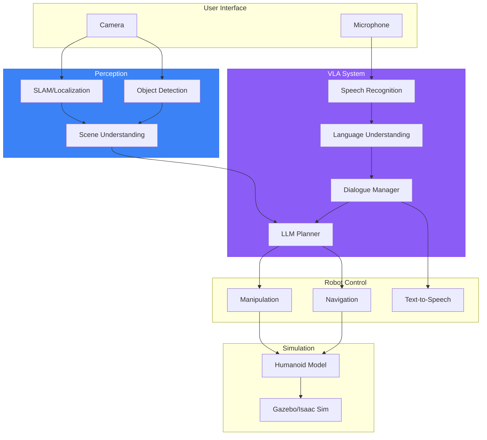

# Capstone Project: Autonomous Conversational Humanoid

The capstone project integrates everything you've learned across all four modules to build an autonomous humanoid robot capable of natural human interaction.

## Project Overview

Build a humanoid robot system that can:

1. **Understand spoken commands** using speech recognition (Module 4)
2. **See and identify objects** using perception (Module 3)
3. **Plan and execute tasks** using LLM-based planning (Module 4)
4. **Navigate safely** using Nav2 (Module 3)
5. **Maintain conversation context** across multiple turns (Module 4)
6. **Operate in simulation** using Gazebo or Isaac Sim (Modules 2-3)

## Project Requirements

### Minimum Viable Product (MVP)

Your capstone must demonstrate:

| Requirement | Description | Module |
|-------------|-------------|--------|
| Voice Control | Accept and transcribe voice commands | 4 |
| Object Detection | Identify at least 5 object types | 3 |
| Task Planning | Decompose commands into actions | 4 |
| Navigation | Navigate to specified locations | 3 |
| Manipulation | Pick and place objects | 1-3 |
| Dialogue | 3+ turn conversation with context | 4 |

### Extended Goals

For exceptional projects:

- Multi-modal interaction (speech + gesture)
- Error recovery with user clarification
- Learning from user preferences
- Real robot deployment (if hardware available)

## System Architecture



## Project Phases

### Phase 1: Foundation (Week 1)

1. Set up development environment
2. Import humanoid robot into simulation
3. Verify ROS 2 communication
4. Test basic motion control

**Deliverable**: Robot moving in simulation with working ROS 2 topics

### Phase 2: Perception (Week 2)

1. Configure camera sensors
2. Set up object detection pipeline
3. Implement localization (SLAM or known map)
4. Create scene understanding node

**Deliverable**: Robot detecting objects and localizing in environment

### Phase 3: VLA Integration (Week 3)

1. Integrate speech recognition
2. Set up LLM task planner
3. Implement dialogue manager
4. Connect perception to planning

**Deliverable**: End-to-end voice command to action

### Phase 4: Polish & Demo (Week 4)

1. Add error handling and recovery
2. Implement multi-turn dialogue
3. Test edge cases
4. Prepare demonstration

**Deliverable**: Complete working system demonstration

## Evaluation Criteria

| Criteria | Weight | Description |
|----------|--------|-------------|
| Functionality | 40% | Does the system work as specified? |
| Integration | 25% | How well do components work together? |
| Code Quality | 15% | Clean, documented, maintainable code |
| Presentation | 10% | Clear demonstration of capabilities |
| Innovation | 10% | Creative extensions beyond requirements |

## Demo Scenarios

Your demonstration should include:

### Scenario 1: Object Retrieval
> "Robot, please bring me the red cup from the kitchen"

Expected behavior:
1. Robot acknowledges command
2. Navigates to kitchen
3. Identifies red cup
4. Picks up cup
5. Returns to user
6. Hands over cup
7. Confirms completion

### Scenario 2: Multi-Turn Interaction
> User: "Find the blue ball"
> Robot: "I found it on the table"
> User: "Put it in the box"
> Robot: "Done. Anything else?"
> User: "No, thank you"

### Scenario 3: Error Recovery
> "Pick up the green cube"
> Robot: "I don't see a green cube. I see a red cube and a blue cube. Which one?"

## Getting Started

### Repository Structure

```
capstone/
├── launch/
│   └── full_system.launch.py
├── config/
│   ├── robot_config.yaml
│   ├── perception_config.yaml
│   └── dialogue_config.yaml
├── src/
│   ├── perception/
│   ├── planning/
│   ├── dialogue/
│   └── control/
├── worlds/
│   └── capstone_world.sdf
└── README.md
```

### Starter Code

Begin with the code examples from each module:

- **Speech**: `docs/code-examples/module-4/speech/`
- **Planning**: `docs/code-examples/module-4/llm-planning/`
- **Dialogue**: `docs/code-examples/module-4/dialogue/`
- **Simulation**: `docs/code-examples/module-2/`

## Resources

- [Module 1: ROS 2 Foundations](/docs/modules/module-1-ros2)
- [Module 2: Digital Twin](/docs/modules/module-2-digital-twin)
- [Module 3: NVIDIA Isaac](/docs/modules/module-3-isaac)
- [Module 4: VLA Systems](/docs/modules/module-4-vla)

## Submission

Submit your capstone project with:

1. **Code Repository**: All source code with README
2. **Video Demo**: 5-10 minute demonstration video
3. **Technical Report**: Architecture decisions and lessons learned
4. **Presentation**: 15-minute presentation of your system

---

Good luck! This project represents the culmination of your Physical AI & Humanoid Robotics journey.
