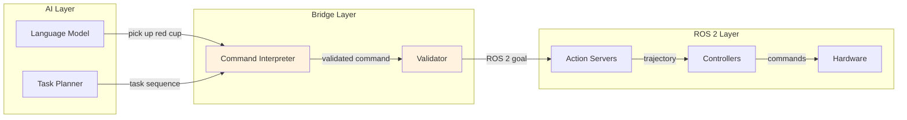
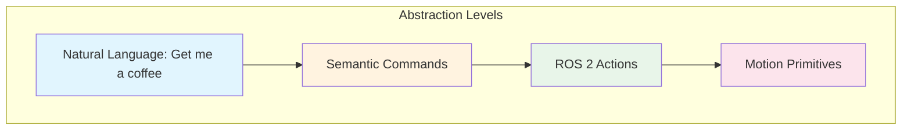
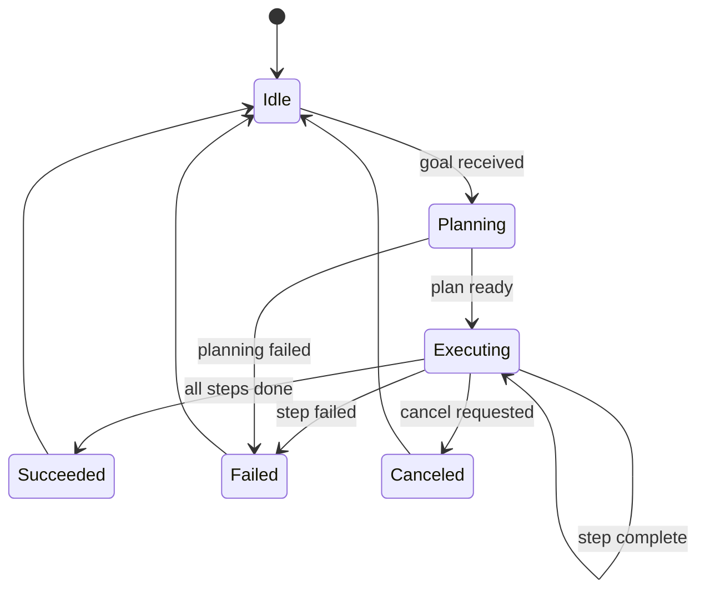
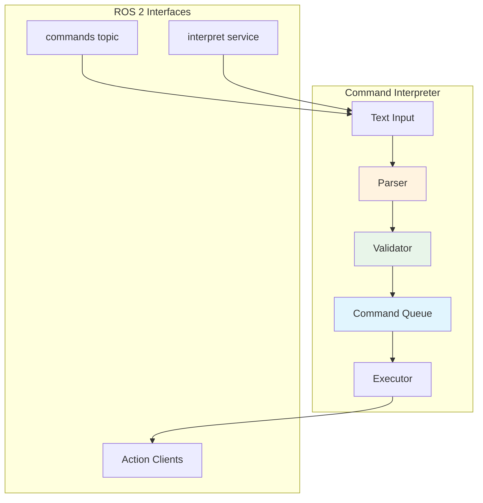
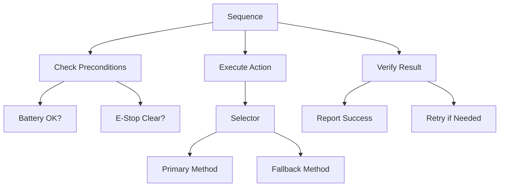
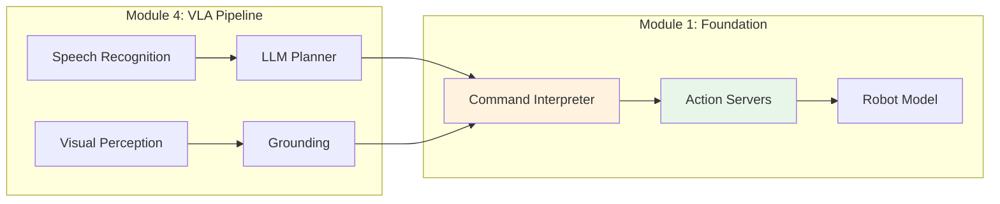

# Chapter 4: Bridging AI and ROS 2 Control

**Week 5, Part 2 of 13 | Estimated Time: 5-7 hours**

In this chapter, you will learn to bridge AI systems (like language models and planners) with ROS 2 control pipelines. By the end, you will have built a command interpreter that accepts natural language commands and executes them as robot actions.

## Learning Objectives

By the end of this chapter, you will be able to:

1. **Design** ROS 2 interfaces for AI-robot communication
2. **Implement** custom message and service definitions
3. **Create** action servers for multi-step robot behaviors
4. **Build** a command interpreter that maps text to ROS 2 actions
5. **Understand** the bridge patterns used in conversational robotics

---

## 1. The AI-Robot Interface Challenge

### Why Standard Messages Aren't Enough

ROS 2 provides many standard message types (`std_msgs`, `sensor_msgs`, `geometry_msgs`), but AI-to-robot communication often requires:

- **Semantic commands**: "Pick up the red cup" instead of joint angles
- **Multi-step behaviors**: Sequences of actions with dependencies
- **Natural language**: Commands from speech recognition or chat interfaces
- **Context**: Understanding "it", "there", "the other one"



**Figure 4.1**: AI-to-robot bridge architecture

### The Command Hierarchy



**Figure 4.2**: Command abstraction hierarchy

---

## 2. Custom Messages and Services

### When to Create Custom Types

Create custom message/service types when:

- Standard types don't capture your data semantics
- You need structured commands with multiple fields
- Type safety prevents runtime errors
- Documentation is built into the interface

### IDL Definition Syntax

ROS 2 uses Interface Definition Language (IDL) for message/service/action definitions.

**Message Definition** (`RobotCommand.msg`):

```
# RobotCommand.msg
# A semantic command for the robot to execute

# Command type
string command_type

# Target object (if applicable)
string target_object

# Target location (if applicable)
geometry_msgs/Pose target_pose

# Parameters
string[] parameters
float64[] numeric_values

# Timestamp
builtin_interfaces/Time stamp
```

**Service Definition** (`ExecuteCommand.srv`):

```
# ExecuteCommand.srv
# Execute a robot command and return result

# Request
RobotCommand command
bool wait_for_completion
---
# Response
bool success
string message
string[] executed_actions
float64 execution_time
```

**Action Definition** (`ExecuteBehavior.action`):

```
# ExecuteBehavior.action
# Execute a multi-step behavior with feedback

# Goal
string behavior_name
RobotCommand[] command_sequence
bool allow_interruption
---
# Result
bool success
string[] completed_steps
string[] failed_steps
float64 total_time
---
# Feedback
uint32 current_step
uint32 total_steps
string current_action
float64 progress_percent
```

### Building Custom Messages

```bash
# Package structure
my_interfaces/
├── CMakeLists.txt
├── package.xml
├── msg/
│   └── RobotCommand.msg
├── srv/
│   └── ExecuteCommand.srv
└── action/
    └── ExecuteBehavior.action
```

**CMakeLists.txt**:

```cmake
cmake_minimum_required(VERSION 3.8)
project(humanoid_interfaces)

find_package(ament_cmake REQUIRED)
find_package(rosidl_default_generators REQUIRED)
find_package(geometry_msgs REQUIRED)
find_package(builtin_interfaces REQUIRED)

rosidl_generate_interfaces(${PROJECT_NAME}
  "msg/RobotCommand.msg"
  "srv/ExecuteCommand.srv"
  "action/ExecuteBehavior.action"
  DEPENDENCIES geometry_msgs builtin_interfaces
)

ament_package()
```

**package.xml**:

```xml
<?xml version="1.0"?>
<package format="3">
  <name>humanoid_interfaces</name>
  <version>0.1.0</version>
  <description>Custom interfaces for humanoid robot</description>

  <buildtool_depend>ament_cmake</buildtool_depend>
  <buildtool_depend>rosidl_default_generators</buildtool_depend>

  <depend>geometry_msgs</depend>
  <depend>builtin_interfaces</depend>

  <member_of_group>rosidl_interface_packages</member_of_group>
</package>
```

### Using Custom Messages in Python

```python
# Import custom messages
from humanoid_interfaces.msg import RobotCommand
from humanoid_interfaces.srv import ExecuteCommand
from humanoid_interfaces.action import ExecuteBehavior

# Create a command message
cmd = RobotCommand()
cmd.command_type = 'pick'
cmd.target_object = 'red_cup'
cmd.parameters = ['approach_from_above']
```

---

## 3. Action Servers for Complex Behaviors

### Multi-Step Behavior Pattern



**Figure 4.3**: Behavior execution state machine

### Behavior Action Server

```python
#!/usr/bin/env python3
"""
Physical AI & Humanoid Robotics Textbook
Module 1, Chapter 4: Behavior Action Server
Description: Executes multi-step robot behaviors with feedback
"""

import time
from enum import Enum
import rclpy
from rclpy.node import Node
from rclpy.action import ActionServer, GoalResponse, CancelResponse
from rclpy.callback_groups import ReentrantCallbackGroup
from rclpy.executors import MultiThreadedExecutor

# For this example, using Fibonacci as a stand-in for custom action
from example_interfaces.action import Fibonacci


class BehaviorState(Enum):
    IDLE = 0
    PLANNING = 1
    EXECUTING = 2
    SUCCEEDED = 3
    FAILED = 4
    CANCELED = 5


class BehaviorActionServer(Node):
    """
    Action server for executing complex multi-step behaviors.

    Features:
    - Multi-step execution with per-step feedback
    - Cancellation support
    - State machine for behavior lifecycle
    - Error recovery
    """

    def __init__(self):
        super().__init__('behavior_action_server')

        self._callback_group = ReentrantCallbackGroup()
        self._state = BehaviorState.IDLE
        self._current_step = 0

        # Define available behaviors
        self.behaviors = {
            'wave': ['raise_arm', 'wave_hand', 'lower_arm'],
            'nod': ['tilt_head_down', 'tilt_head_up', 'center_head'],
            'point': ['raise_arm', 'extend_finger', 'hold', 'lower_arm'],
            'pickup': ['approach', 'open_gripper', 'grasp', 'lift', 'close_gripper'],
        }

        # Create action server
        self._action_server = ActionServer(
            self,
            Fibonacci,  # Replace with ExecuteBehavior in real implementation
            'execute_behavior',
            execute_callback=self.execute_callback,
            goal_callback=self.goal_callback,
            cancel_callback=self.cancel_callback,
            callback_group=self._callback_group
        )

        self.get_logger().info('Behavior action server ready')
        self.get_logger().info(f'Available behaviors: {list(self.behaviors.keys())}')

    def goal_callback(self, goal_request):
        """Accept or reject behavior goals."""
        self.get_logger().info(f'Received behavior goal: {goal_request.order} steps')

        # In real implementation, validate behavior name and parameters
        if self._state != BehaviorState.IDLE:
            self.get_logger().warn('Rejecting: behavior already in progress')
            return GoalResponse.REJECT

        return GoalResponse.ACCEPT

    def cancel_callback(self, goal_handle):
        """Handle cancellation requests."""
        self.get_logger().info('Cancel requested')
        return CancelResponse.ACCEPT

    async def execute_callback(self, goal_handle):
        """Execute the multi-step behavior."""
        self.get_logger().info('Starting behavior execution')

        self._state = BehaviorState.PLANNING
        feedback = Fibonacci.Feedback()
        feedback.partial_sequence = [0, 1]

        # Simulate planning phase
        self.get_logger().info('Planning behavior...')
        time.sleep(0.5)

        self._state = BehaviorState.EXECUTING
        total_steps = goal_handle.request.order
        self._current_step = 0

        # Execute each step
        for step in range(1, total_steps):
            # Check for cancellation
            if goal_handle.is_cancel_requested:
                goal_handle.canceled()
                self._state = BehaviorState.CANCELED
                self.get_logger().info('Behavior canceled')
                return Fibonacci.Result()

            self._current_step = step
            self.get_logger().info(f'Executing step {step}/{total_steps}')

            # Simulate step execution
            success = await self.execute_step(step)

            if not success:
                goal_handle.abort()
                self._state = BehaviorState.FAILED
                self.get_logger().error(f'Step {step} failed')
                return Fibonacci.Result()

            # Update feedback
            feedback.partial_sequence.append(
                feedback.partial_sequence[-1] + feedback.partial_sequence[-2]
            )
            goal_handle.publish_feedback(feedback)

        # Success!
        goal_handle.succeed()
        self._state = BehaviorState.SUCCEEDED
        self.get_logger().info('Behavior completed successfully')

        self._state = BehaviorState.IDLE

        result = Fibonacci.Result()
        result.sequence = feedback.partial_sequence
        return result

    async def execute_step(self, step_num):
        """Execute a single step of the behavior."""
        # Simulate step execution (replace with actual robot commands)
        time.sleep(0.5)

        # Simulate occasional failures (for demonstration)
        # In real code, this would execute actual robot commands
        return True  # Success


def main(args=None):
    rclpy.init(args=args)
    node = BehaviorActionServer()

    executor = MultiThreadedExecutor()
    executor.add_node(node)

    try:
        executor.spin()
    except KeyboardInterrupt:
        pass
    finally:
        node.destroy_node()
        rclpy.shutdown()


if __name__ == '__main__':
    main()
```

---

## 4. Building a Command Interpreter Node

### Architecture



**Figure 4.4**: Command interpreter architecture

### Command Interpreter Implementation

```python
#!/usr/bin/env python3
"""
Physical AI & Humanoid Robotics Textbook
Module 1, Chapter 4: Command Interpreter
Description: Interprets text commands and executes robot actions
"""

import re
from dataclasses import dataclass
from typing import List, Optional, Dict, Any
from collections import deque

import rclpy
from rclpy.node import Node
from std_msgs.msg import String
from std_srvs.srv import Trigger
from geometry_msgs.msg import Pose, Point, Quaternion


@dataclass
class ParsedCommand:
    """Represents a parsed robot command."""
    action: str
    target: Optional[str] = None
    location: Optional[str] = None
    parameters: Dict[str, Any] = None

    def __post_init__(self):
        if self.parameters is None:
            self.parameters = {}


class CommandParser:
    """
    Parses natural language commands into structured commands.

    Supported patterns:
    - "pick up [object]"
    - "put [object] on [location]"
    - "move to [location]"
    - "wave"
    - "stop"
    """

    PATTERNS = [
        # Pick up commands
        (r'pick up (?:the )?(\w+)', 'pick', ['target']),
        (r'grab (?:the )?(\w+)', 'pick', ['target']),

        # Place commands
        (r'put (?:the )?(\w+) on (?:the )?(\w+)', 'place', ['target', 'location']),
        (r'place (?:the )?(\w+) on (?:the )?(\w+)', 'place', ['target', 'location']),

        # Navigation commands
        (r'(?:go|move|navigate) to (?:the )?(\w+)', 'navigate', ['location']),
        (r'come here', 'navigate', []),

        # Gesture commands
        (r'wave(?: your hand)?', 'wave', []),
        (r'nod(?: your head)?', 'nod', []),
        (r'point at (?:the )?(\w+)', 'point', ['target']),

        # Control commands
        (r'stop', 'stop', []),
        (r'cancel', 'cancel', []),
        (r'reset', 'reset', []),
    ]

    def parse(self, text: str) -> Optional[ParsedCommand]:
        """Parse text into a command structure."""
        text = text.lower().strip()

        for pattern, action, captures in self.PATTERNS:
            match = re.match(pattern, text)
            if match:
                groups = match.groups()
                cmd = ParsedCommand(action=action)

                for i, capture_name in enumerate(captures):
                    if i < len(groups):
                        if capture_name == 'target':
                            cmd.target = groups[i]
                        elif capture_name == 'location':
                            cmd.location = groups[i]

                return cmd

        return None


class CommandValidator:
    """Validates commands against robot capabilities."""

    VALID_ACTIONS = {'pick', 'place', 'navigate', 'wave', 'nod', 'point', 'stop', 'cancel', 'reset'}
    KNOWN_OBJECTS = {'cup', 'ball', 'box', 'bottle', 'book', 'pen'}
    KNOWN_LOCATIONS = {'table', 'shelf', 'floor', 'kitchen', 'desk', 'home'}

    def validate(self, cmd: ParsedCommand) -> tuple:
        """
        Validate a command.

        Returns:
            (is_valid, error_message)
        """
        # Check action is valid
        if cmd.action not in self.VALID_ACTIONS:
            return False, f"Unknown action: {cmd.action}"

        # Check target if required
        if cmd.action in {'pick', 'place', 'point'} and not cmd.target:
            return False, f"Action '{cmd.action}' requires a target object"

        # Check location if required
        if cmd.action == 'place' and not cmd.location:
            return False, "Place action requires a location"

        # Warn about unknown objects (but allow)
        if cmd.target and cmd.target not in self.KNOWN_OBJECTS:
            # Log warning but don't fail
            pass

        return True, ""


class CommandInterpreter(Node):
    """
    ROS 2 node that interprets text commands and executes robot actions.

    Interfaces:
    - Subscribes to /voice_commands (String) for voice input
    - Provides /interpret_command service for programmatic access
    - Calls action servers to execute commands
    """

    def __init__(self):
        super().__init__('command_interpreter')

        # Components
        self.parser = CommandParser()
        self.validator = CommandValidator()
        self.command_queue = deque(maxlen=10)

        # Subscribers
        self.command_sub = self.create_subscription(
            String,
            '/voice_commands',
            self.command_callback,
            10
        )

        # Services
        self.interpret_srv = self.create_service(
            Trigger,
            '/interpret_command',
            self.interpret_service_callback
        )

        # Publishers (for command status)
        self.status_pub = self.create_publisher(
            String,
            '/command_status',
            10
        )

        # Timer to process command queue
        self.process_timer = self.create_timer(0.1, self.process_queue)

        # State
        self.is_executing = False
        self.last_command_text = ""

        self.get_logger().info('Command interpreter ready')
        self.get_logger().info('Listening on /voice_commands')
        self.get_logger().info('Service: /interpret_command')

    def command_callback(self, msg: String):
        """Handle incoming voice commands."""
        self.get_logger().info(f'Received command: "{msg.data}"')

        # Parse command
        cmd = self.parser.parse(msg.data)

        if cmd is None:
            self.publish_status(f'Could not understand: "{msg.data}"')
            self.get_logger().warn(f'Failed to parse: {msg.data}')
            return

        # Validate command
        is_valid, error = self.validator.validate(cmd)

        if not is_valid:
            self.publish_status(f'Invalid command: {error}')
            self.get_logger().warn(f'Validation failed: {error}')
            return

        # Queue command
        self.command_queue.append(cmd)
        self.publish_status(f'Queued: {cmd.action} (target={cmd.target})')

    def interpret_service_callback(self, request, response):
        """Service callback for programmatic command interpretation."""
        if self.last_command_text:
            cmd = self.parser.parse(self.last_command_text)
            if cmd:
                response.success = True
                response.message = f'Parsed: {cmd.action}'
            else:
                response.success = False
                response.message = 'Failed to parse command'
        else:
            response.success = False
            response.message = 'No command received'

        return response

    def process_queue(self):
        """Process commands from the queue."""
        if self.is_executing or not self.command_queue:
            return

        cmd = self.command_queue.popleft()
        self.execute_command(cmd)

    def execute_command(self, cmd: ParsedCommand):
        """Execute a parsed command."""
        self.is_executing = True
        self.get_logger().info(f'Executing: {cmd.action}')

        # In a real implementation, this would call action servers
        # For now, simulate execution

        if cmd.action == 'stop':
            self.publish_status('Stopping all actions')
            # Cancel all pending commands
            self.command_queue.clear()

        elif cmd.action == 'wave':
            self.publish_status('Executing wave gesture')
            # Would call: self.behavior_client.send_goal('wave')

        elif cmd.action == 'pick':
            self.publish_status(f'Picking up {cmd.target}')
            # Would call: self.pick_client.send_goal(cmd.target)

        elif cmd.action == 'navigate':
            self.publish_status(f'Navigating to {cmd.location}')
            # Would call: self.nav_client.send_goal(cmd.location)

        else:
            self.publish_status(f'Action {cmd.action} not yet implemented')

        self.is_executing = False

    def publish_status(self, message: str):
        """Publish status message."""
        msg = String()
        msg.data = message
        self.status_pub.publish(msg)
        self.get_logger().info(f'Status: {message}')


def main(args=None):
    rclpy.init(args=args)
    node = CommandInterpreter()

    try:
        rclpy.spin(node)
    except KeyboardInterrupt:
        pass
    finally:
        node.destroy_node()
        rclpy.shutdown()


if __name__ == '__main__':
    main()
```

---

## 5. Design Patterns for AI Integration

### Pattern 1: Command Queue

```python
class CommandQueue:
    """
    Thread-safe command queue with priority support.

    Features:
    - Priority ordering (high priority commands execute first)
    - Command cancellation
    - Queue size limiting
    """

    def __init__(self, max_size=100):
        self._queue = []
        self._max_size = max_size
        self._lock = threading.Lock()

    def enqueue(self, command, priority=0):
        """Add command with priority (higher = more urgent)."""
        with self._lock:
            if len(self._queue) >= self._max_size:
                raise QueueFullError()

            heapq.heappush(self._queue, (-priority, time.time(), command))

    def dequeue(self):
        """Get highest priority command."""
        with self._lock:
            if not self._queue:
                return None
            return heapq.heappop(self._queue)[2]

    def cancel_all(self):
        """Clear the queue."""
        with self._lock:
            self._queue.clear()
```

### Pattern 2: State Machine

```python
from enum import Enum, auto
from transitions import Machine


class RobotState(Enum):
    IDLE = auto()
    LISTENING = auto()
    PLANNING = auto()
    EXECUTING = auto()
    ERROR = auto()
    EMERGENCY = auto()


class RobotStateMachine:
    """State machine for robot behavior control."""

    states = [s.name for s in RobotState]

    transitions = [
        {'trigger': 'receive_command', 'source': 'IDLE', 'dest': 'PLANNING'},
        {'trigger': 'plan_ready', 'source': 'PLANNING', 'dest': 'EXECUTING'},
        {'trigger': 'plan_failed', 'source': 'PLANNING', 'dest': 'ERROR'},
        {'trigger': 'execution_complete', 'source': 'EXECUTING', 'dest': 'IDLE'},
        {'trigger': 'execution_failed', 'source': 'EXECUTING', 'dest': 'ERROR'},
        {'trigger': 'recover', 'source': 'ERROR', 'dest': 'IDLE'},
        {'trigger': 'emergency_stop', 'source': '*', 'dest': 'EMERGENCY'},
        {'trigger': 'reset', 'source': 'EMERGENCY', 'dest': 'IDLE'},
    ]

    def __init__(self):
        self.machine = Machine(
            model=self,
            states=self.states,
            transitions=self.transitions,
            initial='IDLE'
        )
```

### Pattern 3: Behavior Tree Integration



**Figure 4.5**: Behavior tree for robust action execution

---

## 6. Preparing for Vision-Language-Action Systems

### Preview: Module 4 Integration

In Module 4 (VLA Systems), you will extend these patterns to include:

1. **Speech Recognition**: Convert voice to text commands
2. **LLM Planning**: Use language models for task decomposition
3. **Visual Grounding**: Connect language to perceived objects
4. **Conversational Context**: Handle multi-turn interactions



**Figure 4.6**: How Module 1 foundations connect to Module 4 VLA systems

### Preparing Your Code

To prepare for Module 4:

1. **Keep interfaces clean**: Use well-defined message types
2. **Make actions atomic**: Each action should be self-contained
3. **Support cancellation**: All long-running actions must be cancelable
4. **Log extensively**: VLA debugging requires detailed logs
5. **Handle uncertainty**: Commands may be ambiguous or incomplete

---

## 7. Common Errors and Solutions

### Error: "Service type not found"

**Cause**: Custom message package not built or sourced.

**Solution**:
```bash
cd ~/ros2_ws
colcon build --packages-select humanoid_interfaces
source install/setup.bash
```

### Error: "Action goal timeout"

**Cause**: Action server not running or wrong namespace.

**Solution**:
```bash
# Check available actions
ros2 action list

# Check action server is running
ros2 node list | grep action_server
```

### Error: "Command not recognized"

**Cause**: Parser pattern doesn't match input.

**Solution**:
- Check pattern definitions
- Test with regex debugging tools
- Add logging to see what's being matched

### Error: "Queue full"

**Cause**: Commands arriving faster than execution.

**Solution**:
- Increase queue size
- Add rate limiting
- Implement priority-based dropping

### Error: "State machine stuck"

**Cause**: Missing transition or unhandled state.

**Solution**:
- Add error recovery transitions
- Implement timeout handling
- Add emergency reset capability

---

## 8. Exercises

### Exercise 4.1: Define Custom Message (Difficulty: Basic)

**Objective**: Create a custom message type for robot commands.

**Instructions**:
1. Create a new package `humanoid_interfaces`
2. Define `RobotCommand.msg` with fields:
   - `string command_type`
   - `string target_object`
   - `float64[] parameters`
3. Build and verify with `ros2 interface show`

**Expected Outcome**: Message type visible in `ros2 interface list`.

---

### Exercise 4.2: Build Multi-Step Behavior Server (Difficulty: Intermediate)

**Objective**: Create an action server that executes a "greeting" behavior.

**Instructions**:
1. Define steps: wave, nod, return to neutral
2. Implement action server with step-by-step feedback
3. Support cancellation at any step
4. Log execution time for each step

**Expected Outcome**: Client receives feedback for each step.

---

### Exercise 4.3: Command Interpreter with Queue (Difficulty: Advanced)

**Objective**: Build a command interpreter with priority queue.

**Instructions**:
1. Implement priority queue (stop/cancel = high, gestures = medium, navigation = low)
2. Add service to query queue status
3. Support "urgent" prefix for high-priority commands
4. Implement queue size limiting with graceful rejection

**Expected Outcome**: "urgent stop" interrupts pending "wave" command.

---

## Summary

In this chapter, you learned:

- **Custom messages/services/actions** enable semantic AI-robot communication
- **IDL definitions** provide type safety and documentation
- **Action servers** handle multi-step behaviors with feedback and cancellation
- **Command interpreters** bridge natural language to ROS 2 actions
- **Design patterns** (queues, state machines, behavior trees) make systems robust
- **Module 4 preparation** connects these foundations to VLA systems

### Key Terms

| Term | Definition |
|------|------------|
| **IDL** | Interface Definition Language for ROS 2 messages/services/actions |
| **Custom Message** | User-defined message type beyond standard `std_msgs` |
| **Command Interpreter** | Node that parses text commands and triggers robot actions |
| **Behavior** | Multi-step action sequence with defined start/end states |
| **State Machine** | Model of system states and valid transitions |
| **Grounding** | Connecting language concepts to physical robot capabilities |

### What's Next

Congratulations! You have completed **Module 1: ROS 2 Foundations**.

In **Module 2: The Digital Twin**, you will learn to simulate your humanoid robot in Gazebo and Unity. The URDF you created in Chapter 3 will come alive with physics, sensors, and realistic environments.

---

*Physical AI & Humanoid Robotics Textbook - Module 1, Chapter 4*
*ROS 2 Jazzy | Ubuntu 22.04 | Python 3.10+*
