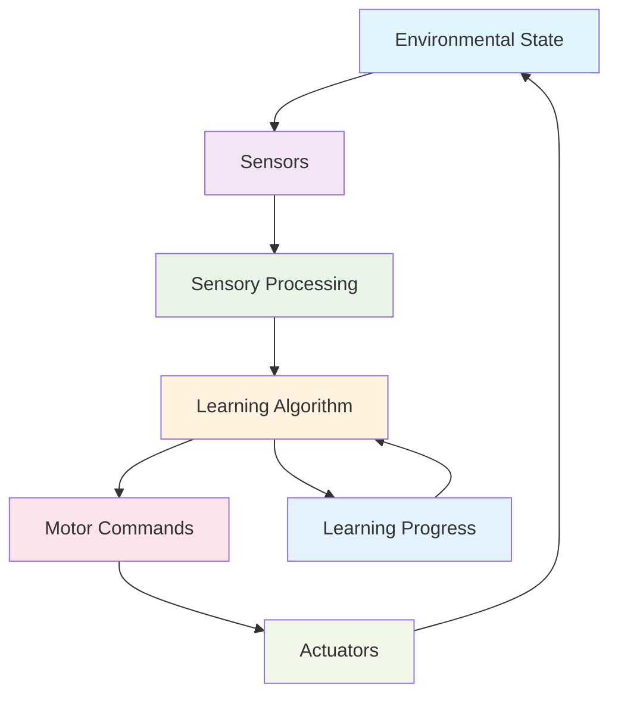
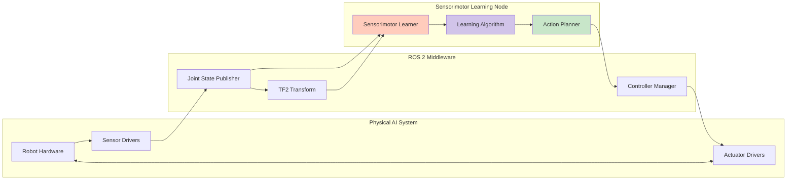
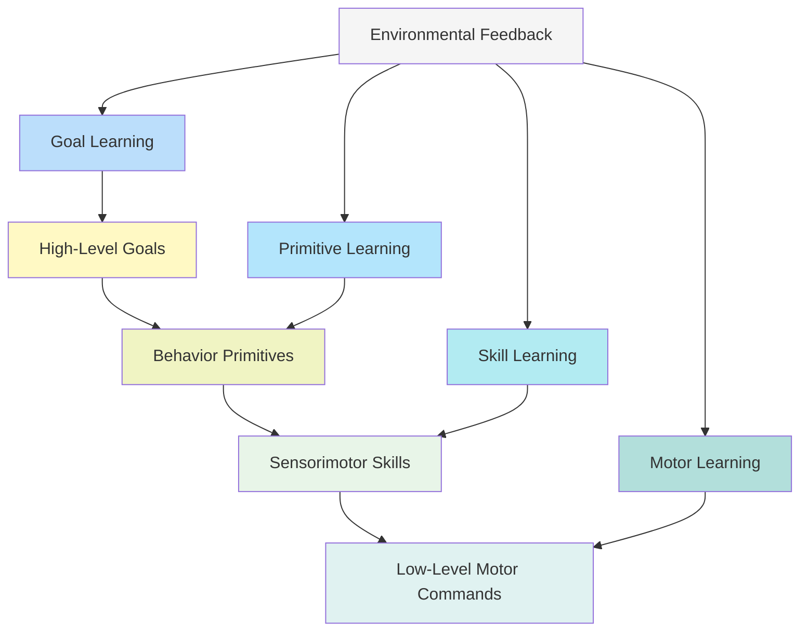
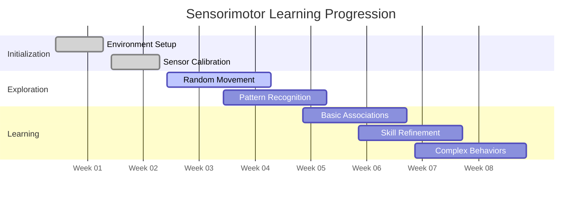
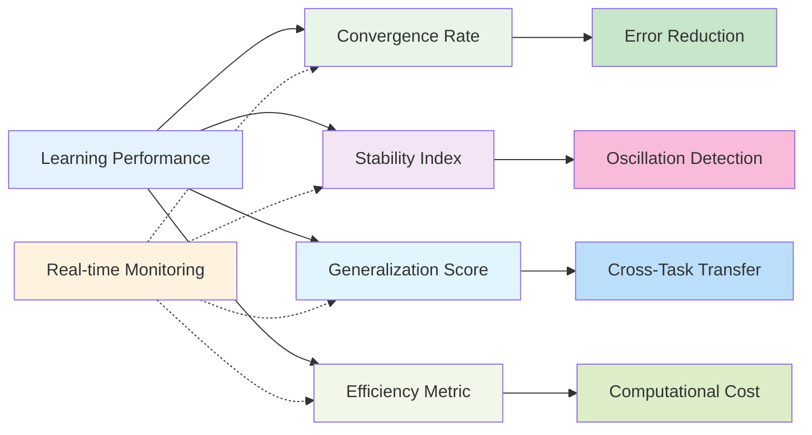

# Diagrams: Sensorimotor Learning

## The Sensorimotor Loop Architecture

## ROS 2 Implementation Architecture

## Hierarchical Learning Structure

## Learning Progression Timeline

## Performance Metrics Dashboard

## Summary

These diagrams illustrate the key concepts and architectures in sensorimotor learning for Physical AI:

1. **The Sensorimotor Loop Architecture** - Shows the continuous cycle of sensing, processing, acting, and receiving feedback
2. **ROS 2 Implementation Architecture** - Demonstrates how the learning system integrates with ROS 2 infrastructure
3. **Hierarchical Learning Structure** - Illustrates the multi-level organization of learning from high-level goals to low-level motor commands
4. **Learning Progression Timeline** - Shows the expected progression from exploration to complex behavior acquisition
5. **Performance Metrics Dashboard** - Visualizes the key metrics for monitoring learning performance

These diagrams were created using the diagram-generator.skill from the Claude Code skills system, specifically designed to support the Physical AI & Humanoid Robotics textbook content.

---
*These diagrams were created using the diagram-generator.skill from the Claude Code skills system.*