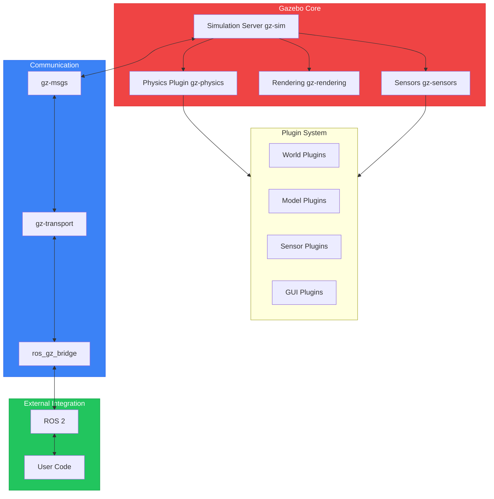
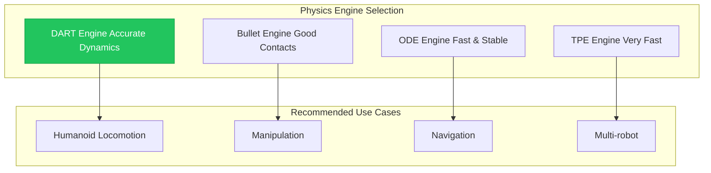
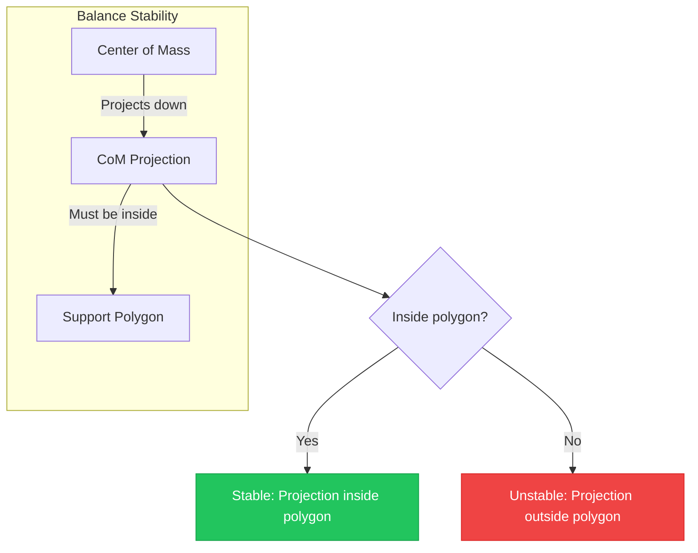
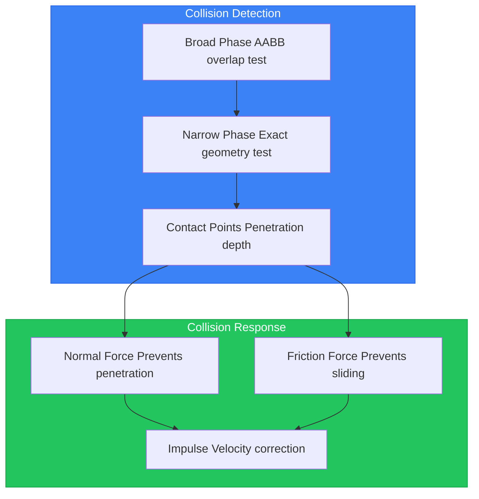

# Chapter 6: Physics Simulation with Gazebo

## Learning Objectives

By the end of this chapter, you will be able to:

- Load URDF/SDF models into Gazebo Harmonic
- Configure physics engine parameters (timestep, solver iterations)
- Simulate gravity and understand its effect on bipedal balance
- Model friction and surface interactions for walking
- Implement and debug collision detection for humanoid limbs
- Create simulation worlds with obstacles and terrain

## Prerequisites

- Completed Chapter 5 (Digital Twin Introduction)
- Working humanoid URDF from Module 1, Chapter 3
- Gazebo Harmonic installed (`ros-jazzy-ros-gz`)

---

## 6.1 Gazebo Harmonic Architecture

**Gazebo** (formerly Ignition Gazebo) is a modern robotics simulator built on a modular architecture. Gazebo Harmonic is the latest Long-Term Support (LTS) release, designed to work seamlessly with ROS 2 Jazzy.



### Core Components

| Component | Library | Purpose |
|-----------|---------|---------|
| **Simulation** | gz-sim | Main simulation loop and world management |
| **Physics** | gz-physics | Physics engine abstraction (ODE, Bullet, DART) |
| **Rendering** | gz-rendering | 3D visualization (OGRE2) |
| **Sensors** | gz-sensors | Sensor simulation (cameras, LiDAR, IMU) |
| **Transport** | gz-transport | Internal message passing |
| **Messages** | gz-msgs | Message type definitions |

### Plugin Architecture

Gazebo's power comes from its plugin system:

- **System Plugins**: Loaded at startup, modify core behavior
- **World Plugins**: Operate on entire simulation world
- **Model Plugins**: Attach to specific robot models
- **Sensor Plugins**: Generate sensor data

---

## 6.2 Loading Your Humanoid Model

### URDF to SDF Conversion

Gazebo uses **SDF (Simulation Description Format)** natively, which offers more features than URDF. However, Gazebo can load URDF files and convert them automatically.


### Key Differences: URDF vs SDF

| Feature | URDF | SDF |
|---------|------|-----|
| Multiple robots | No | Yes |
| World description | No | Yes |
| Nested models | No | Yes |
| Sensors | Limited | Comprehensive |
| Physics plugins | No | Yes |
| Lights | No | Yes |

### Spawning the Humanoid in Gazebo

Create a launch file to spawn your humanoid:

```python
# File: humanoid_gazebo/launch/spawn_humanoid.launch.py
#!/usr/bin/env python3
"""
Spawn humanoid robot in Gazebo Harmonic.
"""

import os
from launch import LaunchDescription
from launch.actions import DeclareLaunchArgument, IncludeLaunchDescription
from launch.substitutions import LaunchConfiguration, PathJoinSubstitution
from launch.launch_description_sources import PythonLaunchDescriptionSource
from launch_ros.actions import Node
from launch_ros.substitutions import FindPackageShare
from ament_index_python.packages import get_package_share_directory


def generate_launch_description():
    # Paths
    pkg_humanoid = get_package_share_directory('humanoid_description')
    pkg_ros_gz_sim = get_package_share_directory('ros_gz_sim')

    # URDF file
    urdf_file = os.path.join(pkg_humanoid, 'urdf', 'humanoid.urdf')

    # Read URDF
    with open(urdf_file, 'r') as f:
        robot_description = f.read()

    # Launch arguments
    world_arg = DeclareLaunchArgument(
        'world',
        default_value='empty.sdf',
        description='World file to load'
    )

    # Start Gazebo
    gazebo = IncludeLaunchDescription(
        PythonLaunchDescriptionSource([
            os.path.join(pkg_ros_gz_sim, 'launch', 'gz_sim.launch.py')
        ]),
        launch_arguments={'gz_args': '-r empty.sdf'}.items()
    )

    # Robot state publisher
    robot_state_pub = Node(
        package='robot_state_publisher',
        executable='robot_state_publisher',
        parameters=[{'robot_description': robot_description}],
        output='screen'
    )

    # Spawn robot
    spawn_robot = Node(
        package='ros_gz_sim',
        executable='create',
        arguments=[
            '-name', 'humanoid',
            '-topic', 'robot_description',
            '-x', '0.0',
            '-y', '0.0',
            '-z', '1.0',  # Spawn above ground
        ],
        output='screen'
    )

    # Bridge for joint states
    bridge = Node(
        package='ros_gz_bridge',
        executable='parameter_bridge',
        arguments=[
            '/world/empty/model/humanoid/joint_state@sensor_msgs/msg/JointState@gz.msgs.Model',
            '/clock@rosgraph_msgs/msg/Clock@gz.msgs.Clock',
        ],
        output='screen'
    )

    return LaunchDescription([
        world_arg,
        gazebo,
        robot_state_pub,
        spawn_robot,
        bridge,
    ])
```

### Running the Simulation

```bash
# Build the workspace
cd ~/humanoid_simulation_ws
colcon build --packages-select humanoid_description humanoid_gazebo

# Source and launch
source install/setup.bash
ros2 launch humanoid_gazebo spawn_humanoid.launch.py
```

---

## 6.3 Physics Engine Configuration

Gazebo supports multiple physics engines, each with different characteristics:

| Engine | Strengths | Weaknesses | Use Case |
|--------|-----------|------------|----------|
| **ODE** | Fast, stable | Less accurate contacts | General robotics |
| **Bullet** | Good contacts, constraints | Memory usage | Manipulation |
| **DART** | Accurate dynamics | Slower | Research, humanoids |
| **TPE** | Very fast | Simplified physics | Large-scale sims |



### Configuring Physics in SDF

Create a world file with physics configuration:

```xml
<!-- File: worlds/humanoid_physics.sdf -->
<?xml version="1.0"?>
<sdf version="1.9">
  <world name="humanoid_world">

    <!-- Physics configuration -->
    <physics name="1ms_physics" type="dart">
      <max_step_size>0.001</max_step_size>
      <real_time_factor>1.0</real_time_factor>
      <real_time_update_rate>1000</real_time_update_rate>

      <!-- DART-specific settings -->
      <dart>
        <collision_detector>fcl</collision_detector>
        <solver>
          <solver_type>dantzig</solver_type>
        </solver>
      </dart>
    </physics>

    <!-- Ground plane -->
    <model name="ground_plane">
      <static>true</static>
      <link name="ground">
        <collision name="collision">
          <geometry>
            <plane>
              <normal>0 0 1</normal>
              <size>100 100</size>
            </plane>
          </geometry>
          <surface>
            <friction>
              <ode>
                <mu>0.8</mu>
                <mu2>0.8</mu2>
              </ode>
            </friction>
          </surface>
        </collision>
        <visual name="visual">
          <geometry>
            <plane>
              <normal>0 0 1</normal>
              <size>100 100</size>
            </plane>
          </geometry>
          <material>
            <ambient>0.8 0.8 0.8 1</ambient>
          </material>
        </visual>
      </link>
    </model>

    <!-- Lighting -->
    <light type="directional" name="sun">
      <cast_shadows>true</cast_shadows>
      <pose>0 0 10 0 0 0</pose>
      <diffuse>0.8 0.8 0.8 1</diffuse>
      <specular>0.2 0.2 0.2 1</specular>
      <direction>-0.5 0.1 -0.9</direction>
    </light>

  </world>
</sdf>
```

### Key Physics Parameters

| Parameter | Description | Typical Value | Effect |
|-----------|-------------|---------------|--------|
| `max_step_size` | Simulation timestep | 0.001s (1ms) | Smaller = more accurate, slower |
| `real_time_factor` | Speed multiplier | 1.0 | Higher = faster than real-time |
| `solver_iterations` | Constraint iterations | 50-100 | Higher = more accurate contacts |
| `friction (mu)` | Friction coefficient | 0.5-1.0 | Higher = less slipping |

### Timestep Selection for Humanoids

Humanoid robots require careful timestep selection:

```
Recommended timesteps:
- Standing/slow motion: 0.002s (2ms) - 500 Hz
- Walking: 0.001s (1ms) - 1000 Hz
- Running/jumping: 0.0005s (0.5ms) - 2000 Hz

Rule of thumb: timestep < (smallest_link_natural_period / 10)
```

---

## 6.4 Gravity and Rigid-Body Dynamics

Understanding how gravity affects your humanoid is crucial for balance and locomotion.

### Center of Mass

The **Center of Mass (CoM)** is the average position of mass in the robot. For stable standing, the CoM projection must stay within the **support polygon** (the area enclosed by the feet).



### Inertial Properties in URDF

Each link needs accurate inertial properties:

```xml
<link name="torso">
  <inertial>
    <!-- Mass in kg -->
    <mass value="15.0"/>

    <!-- Center of mass relative to link origin -->
    <origin xyz="0 0 0.1" rpy="0 0 0"/>

    <!-- Inertia tensor (kg*m^2) -->
    <inertia
      ixx="0.5" ixy="0" ixz="0"
      iyy="0.4" iyz="0"
      izz="0.3"/>
  </inertial>
</link>
```

### Calculating Inertia for Simple Shapes

For prototyping, use these formulas:

**Box (width w, height h, depth d, mass m):**
```
Ixx = (1/12) * m * (h² + d²)
Iyy = (1/12) * m * (w² + d²)
Izz = (1/12) * m * (w² + h²)
```

**Cylinder (radius r, length l, mass m):**
```
Ixx = Iyy = (1/12) * m * (3r² + l²)
Izz = (1/2) * m * r²
```

### Gravity Effects on Humanoids

```python
# Understanding gravity's effect on humanoid stability
# Simplified 2D sagittal plane analysis

import numpy as np

def check_stability(com_x: float, left_foot_x: float, right_foot_x: float) -> bool:
    """
    Check if humanoid is statically stable.

    Args:
        com_x: Center of mass X position
        left_foot_x: Left foot X position
        right_foot_x: Right foot X position

    Returns:
        True if stable (CoM between feet)
    """
    support_min = min(left_foot_x, right_foot_x)
    support_max = max(left_foot_x, right_foot_x)

    return support_min <= com_x <= support_max

# Example: Standing with feet 0.3m apart
left_foot = -0.15  # meters
right_foot = 0.15  # meters
com = 0.02  # Slightly forward

is_stable = check_stability(com, left_foot, right_foot)
print(f"Robot is {'stable' if is_stable else 'unstable'}")
```

---

## 6.5 Friction and Contact Modeling

Friction is critical for walking—without it, the robot would slip with every step.

### Coulomb Friction Model

Gazebo uses the **Coulomb friction model**:

```
F_friction ≤ μ × F_normal

Where:
- F_friction: Maximum friction force
- μ: Friction coefficient (mu)
- F_normal: Normal force (perpendicular to surface)
```

### Friction Parameters in SDF

```xml
<collision name="foot_collision">
  <geometry>
    <box><size>0.15 0.08 0.02</size></box>
  </geometry>
  <surface>
    <friction>
      <ode>
        <!-- Primary friction coefficient -->
        <mu>0.9</mu>
        <!-- Secondary friction coefficient -->
        <mu2>0.9</mu2>
        <!-- Friction direction (0 = use default) -->
        <fdir1>0 0 0</fdir1>
        <!-- Slip parameters for stability -->
        <slip1>0.0</slip1>
        <slip2>0.0</slip2>
      </ode>
      <torsional>
        <!-- Torsional friction coefficient -->
        <coefficient>0.5</coefficient>
        <!-- Use patch radius for torsional friction -->
        <use_patch_radius>true</use_patch_radius>
        <patch_radius>0.05</patch_radius>
      </torsional>
    </friction>
    <contact>
      <!-- Soft contact parameters -->
      <ode>
        <soft_cfm>0.0</soft_cfm>
        <soft_erp>0.2</soft_erp>
        <kp>1e8</kp>
        <kd>1.0</kd>
      </ode>
    </contact>
  </surface>
</collision>
```

### Friction Coefficients for Common Surfaces

| Surface Pair | μ (static) | μ (kinetic) |
|--------------|------------|-------------|
| Rubber on concrete | 0.9-1.0 | 0.7-0.8 |
| Rubber on wood | 0.7-0.9 | 0.6-0.7 |
| Rubber on tile | 0.5-0.7 | 0.4-0.5 |
| Metal on metal | 0.3-0.5 | 0.2-0.4 |
| Rubber on ice | 0.1-0.2 | 0.05-0.1 |

### Contact Stiffness and Damping

Contact parameters affect how "bouncy" or "soft" collisions feel:

- **kp (stiffness)**: Higher = harder contact, less penetration
- **kd (damping)**: Higher = more energy absorbed, less bouncing
- **soft_cfm**: Constraint force mixing (softness)
- **soft_erp**: Error reduction parameter (correction speed)

---

## 6.6 Collision Detection and Response

Collision detection ensures the robot interacts properly with the environment.



### Collision Geometry Types

| Type | Accuracy | Performance | Use Case |
|------|----------|-------------|----------|
| **Box** | Low | Fastest | Torso, simple shapes |
| **Cylinder** | Medium | Fast | Arms, legs |
| **Sphere** | Low | Fastest | Joints, rounded parts |
| **Capsule** | Medium | Fast | Limbs |
| **Mesh** | Highest | Slowest | Complex shapes (avoid for dynamics) |
| **Convex Hull** | High | Medium | Simplified mesh |

### Collision Geometry Best Practices

```xml
<!-- Good: Simple collision, detailed visual -->
<link name="upper_arm">
  <visual name="visual">
    <geometry>
      <!-- Detailed mesh for appearance -->
      <mesh><uri>meshes/upper_arm_detailed.dae</uri></mesh>
    </geometry>
  </visual>
  <collision name="collision">
    <geometry>
      <!-- Simple capsule for physics -->
      <capsule>
        <radius>0.04</radius>
        <length>0.25</length>
      </capsule>
    </geometry>
  </collision>
</link>
```

### Self-Collision Prevention

Humanoids need careful self-collision configuration:

```xml
<!-- In the model SDF -->
<model name="humanoid">
  <!-- Disable collisions between adjacent links -->
  <self_collide>false</self_collide>

  <!-- Or selectively enable -->
  <collision_filter>
    <disable_collisions>
      <link1>upper_arm_left</link1>
      <link2>torso</link2>
    </disable_collisions>
    <!-- Enable collision between hands and torso -->
    <enable_collisions>
      <link1>hand_left</link1>
      <link2>torso</link2>
    </enable_collisions>
  </collision_filter>
</model>
```

---

## 6.7 Building Simulation Worlds

A good test world helps validate robot behavior in various scenarios.

### Empty World Template

```xml
<!-- File: worlds/empty_world.sdf -->
<?xml version="1.0"?>
<sdf version="1.9">
  <world name="empty_world">

    <!-- Physics -->
    <physics name="1ms" type="dart">
      <max_step_size>0.001</max_step_size>
      <real_time_factor>1.0</real_time_factor>
    </physics>

    <!-- Plugins -->
    <plugin
      filename="gz-sim-physics-system"
      name="gz::sim::systems::Physics">
    </plugin>
    <plugin
      filename="gz-sim-scene-broadcaster-system"
      name="gz::sim::systems::SceneBroadcaster">
    </plugin>
    <plugin
      filename="gz-sim-user-commands-system"
      name="gz::sim::systems::UserCommands">
    </plugin>

    <!-- Environment -->
    <gravity>0 0 -9.81</gravity>

    <!-- Ground -->
    <model name="ground_plane">
      <static>true</static>
      <link name="link">
        <collision name="collision">
          <geometry>
            <plane><normal>0 0 1</normal></plane>
          </geometry>
        </collision>
        <visual name="visual">
          <geometry>
            <plane><normal>0 0 1</normal><size>50 50</size></plane>
          </geometry>
          <material>
            <ambient>0.5 0.5 0.5 1</ambient>
          </material>
        </visual>
      </link>
    </model>

    <!-- Lighting -->
    <light type="directional" name="sun">
      <cast_shadows>true</cast_shadows>
      <pose>0 0 10 0 0 0</pose>
      <diffuse>0.9 0.9 0.9 1</diffuse>
      <direction>-0.5 0.1 -0.9</direction>
    </light>

  </world>
</sdf>
```

### Obstacle Course World

```xml
<!-- File: worlds/obstacle_world.sdf -->
<?xml version="1.0"?>
<sdf version="1.9">
  <world name="obstacle_world">
    <!-- Include physics and plugins from empty_world... -->

    <!-- Stepping stones -->
    <model name="stone_1">
      <static>true</static>
      <pose>1.0 0 0.1 0 0 0</pose>
      <link name="link">
        <collision name="collision">
          <geometry><box><size>0.3 0.3 0.2</size></box></geometry>
        </collision>
        <visual name="visual">
          <geometry><box><size>0.3 0.3 0.2</size></box></geometry>
          <material><ambient>0.6 0.6 0.6 1</ambient></material>
        </visual>
      </link>
    </model>

    <!-- Ramp -->
    <model name="ramp">
      <static>true</static>
      <pose>3.0 0 0.25 0 0.2 0</pose>
      <link name="link">
        <collision name="collision">
          <geometry><box><size>1.0 0.5 0.05</size></box></geometry>
        </collision>
        <visual name="visual">
          <geometry><box><size>1.0 0.5 0.05</size></box></geometry>
          <material><ambient>0.4 0.3 0.2 1</ambient></material>
        </visual>
      </link>
    </model>

    <!-- Narrow passage walls -->
    <model name="wall_left">
      <static>true</static>
      <pose>5.0 -0.3 0.5 0 0 0</pose>
      <link name="link">
        <collision name="collision">
          <geometry><box><size>0.1 0.05 1.0</size></box></geometry>
        </collision>
        <visual name="visual">
          <geometry><box><size>0.1 0.05 1.0</size></box></geometry>
          <material><ambient>0.8 0.2 0.2 1</ambient></material>
        </visual>
      </link>
    </model>

  </world>
</sdf>
```

---

## 6.8 Hands-on: Simulating Humanoid Standing

Let's put it all together and simulate our humanoid standing in Gazebo.

### Step 1: Prepare the URDF

Ensure your humanoid URDF has proper inertial and collision properties:

```bash
# Check URDF validity
check_urdf humanoid.urdf

# View in RViz first
ros2 launch humanoid_description display.launch.py
```

### Step 2: Create the Launch File

```python
# File: launch/humanoid_standing.launch.py
#!/usr/bin/env python3
"""Launch humanoid for standing test in Gazebo."""

import os
from launch import LaunchDescription
from launch.actions import IncludeLaunchDescription, ExecuteProcess
from launch.launch_description_sources import PythonLaunchDescriptionSource
from launch_ros.actions import Node
from ament_index_python.packages import get_package_share_directory


def generate_launch_description():
    pkg_humanoid = get_package_share_directory('humanoid_description')
    pkg_gazebo = get_package_share_directory('humanoid_gazebo')
    pkg_ros_gz = get_package_share_directory('ros_gz_sim')

    # World file
    world_file = os.path.join(pkg_gazebo, 'worlds', 'empty_world.sdf')

    # URDF
    urdf_file = os.path.join(pkg_humanoid, 'urdf', 'humanoid.urdf')
    with open(urdf_file, 'r') as f:
        robot_description = f.read()

    return LaunchDescription([
        # Start Gazebo with empty world
        IncludeLaunchDescription(
            PythonLaunchDescriptionSource([
                os.path.join(pkg_ros_gz, 'launch', 'gz_sim.launch.py')
            ]),
            launch_arguments={
                'gz_args': f'-r {world_file}'
            }.items()
        ),

        # Robot state publisher
        Node(
            package='robot_state_publisher',
            executable='robot_state_publisher',
            parameters=[{
                'robot_description': robot_description,
                'use_sim_time': True
            }],
        ),

        # Spawn robot at standing height
        Node(
            package='ros_gz_sim',
            executable='create',
            arguments=[
                '-name', 'humanoid',
                '-topic', 'robot_description',
                '-z', '0.85',  # Standing height
            ],
            output='screen'
        ),

        # Joint state bridge
        Node(
            package='ros_gz_bridge',
            executable='parameter_bridge',
            arguments=[
                '/clock@rosgraph_msgs/msg/Clock@gz.msgs.Clock',
            ],
        ),
    ])
```

### Step 3: Run and Observe

```bash
# Launch the simulation
ros2 launch humanoid_gazebo humanoid_standing.launch.py

# In another terminal, check topics
ros2 topic list
ros2 topic echo /joint_states
```

### Expected Behavior

When spawned correctly:
1. The humanoid appears above the ground
2. Gravity pulls it down until feet contact ground
3. Robot settles into standing pose (may wobble initially)
4. Without active control, robot may slowly fall over

### Troubleshooting Standing Issues

| Issue | Cause | Solution |
|-------|-------|----------|
| Robot falls through ground | Missing collision geometry | Add collision to all links |
| Robot explodes on spawn | Interpenetrating geometry | Spawn higher, check collisions |
| Robot slides on ground | Low friction | Increase mu values |
| Robot bounces | High kp, low kd | Tune contact parameters |
| Robot tips over | Wrong inertial properties | Verify mass/CoM/inertia |

---

## 6.9 Common Errors and Solutions

### Error: Model Spawns Underground

```
[spawn_entity]: Robot spawned at z=0 but ground is at z=0
```

**Solution**: Spawn above ground level:
```python
arguments=['-z', '1.0']  # Spawn 1m above ground
```

### Error: Physics Instability (Exploding Joints)

```
[gz-physics] Joint velocity exceeded limit
```

**Solution**: Reduce timestep and/or increase solver iterations:
```xml
<max_step_size>0.0005</max_step_size>
<dart>
  <solver>
    <solver_type>pgs</solver_type>
  </solver>
</dart>
```

### Error: Missing Inertia Warnings

```
[WARN] Link [arm] has no inertia. Using default.
```

**Solution**: Add inertial properties to all non-fixed links:
```xml
<inertial>
  <mass value="0.5"/>
  <inertia ixx="0.001" iyy="0.001" izz="0.001"
           ixy="0" ixz="0" iyz="0"/>
</inertial>
```

### Error: Mesh Not Found

```
[Err] Unable to find file meshes/torso.stl
```

**Solution**: Use package:// URI or absolute path:
```xml
<uri>package://humanoid_description/meshes/torso.stl</uri>
```

### Error: Bridge Topics Not Working

```
[WARN] No publishers on /joint_states
```

**Solution**: Check bridge configuration matches Gazebo topic names:
```bash
# List Gazebo topics
gz topic -l

# Find correct topic name and update bridge
ros2 run ros_gz_bridge parameter_bridge \
  /world/empty_world/model/humanoid/joint_state@sensor_msgs/msg/JointState@gz.msgs.Model
```

---

## Exercises

### Exercise 6.1: Load Humanoid into Empty World (Basic)

**Objective**: Successfully spawn your humanoid URDF in Gazebo.

**Tasks**:
1. Copy your Module 1 humanoid URDF to the simulation workspace
2. Create a launch file to spawn it in Gazebo
3. Verify the robot appears and responds to gravity

**Success Criteria**:
- Robot spawns without errors
- Robot falls to ground and settles
- Joint states are published

---

### Exercise 6.2: Modify Physics Parameters (Basic)

**Objective**: Understand how physics parameters affect simulation.

**Tasks**:
1. Create three world files with different friction values (0.1, 0.5, 0.9)
2. Spawn the humanoid in each and apply a horizontal force
3. Observe and document the sliding behavior

**Questions to Answer**:
- At what friction coefficient does the robot stop sliding?
- How does friction affect standing stability?

---

### Exercise 6.3: Build an Obstacle Course (Intermediate)

**Objective**: Create a test environment for humanoid navigation.

**Tasks**:
1. Create a world with:
   - A 10° ramp
   - Three stepping stones at different heights
   - A narrow corridor (0.5m wide)
2. Manually spawn the humanoid at different positions
3. Document which obstacles present challenges

**Deliverable**: SDF world file and analysis document.

---

### Exercise 6.4: Tune Contact Parameters for Walking (Advanced)

**Objective**: Optimize contact parameters for stable walking.

**Tasks**:
1. Research contact parameter effects (kp, kd, mu, soft_cfm, soft_erp)
2. Create a test that applies cyclic forces to the foot
3. Tune parameters to achieve:
   - Minimal ground penetration
   - No bouncing
   - Realistic friction behavior
4. Document optimal parameters

**Deliverable**: Tuned URDF/SDF and parameter justification document.

---

## Summary

In this chapter, you learned:

- **Gazebo Harmonic architecture**: Modular design with physics, rendering, and sensor plugins
- **URDF/SDF loading**: How to spawn robots in Gazebo from ROS 2
- **Physics configuration**: Engine selection, timestep, and solver settings
- **Gravity and dynamics**: Center of mass, inertia, and balance concepts
- **Friction modeling**: Coulomb friction and contact parameters
- **Collision detection**: Geometry types and self-collision handling
- **World building**: Creating test environments with obstacles

### Key Takeaways

1. Use **DART** physics for accurate humanoid dynamics
2. Set timestep to **1ms or smaller** for stable walking
3. Always define **inertial properties** for all links
4. Use **simple collision geometry** (boxes, cylinders) for performance
5. **Tune friction carefully**—it critically affects locomotion

### What's Next

In Chapter 7, we'll add **sensors** to our humanoid—LiDAR, depth cameras, and IMUs. You'll learn to configure sensor parameters, add realistic noise, and visualize sensor data in RViz2.

---

## Further Reading

- [Gazebo Harmonic Documentation](https://gazebosim.org/docs/harmonic)
- [SDF Specification](http://sdformat.org/spec)
- [ROS 2 Gazebo Integration](https://github.com/gazebosim/ros_gz)
- Featherstone, R. (2008). "Rigid Body Dynamics Algorithms"
- Siciliano, B. et al. (2010). "Robotics: Modelling, Planning and Control"
