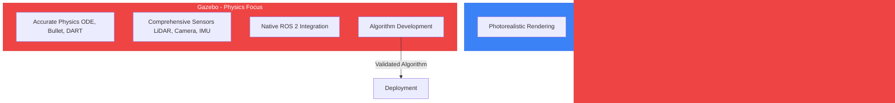
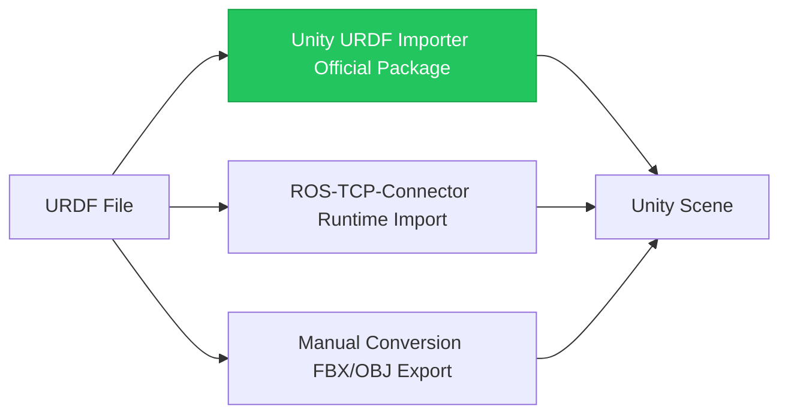
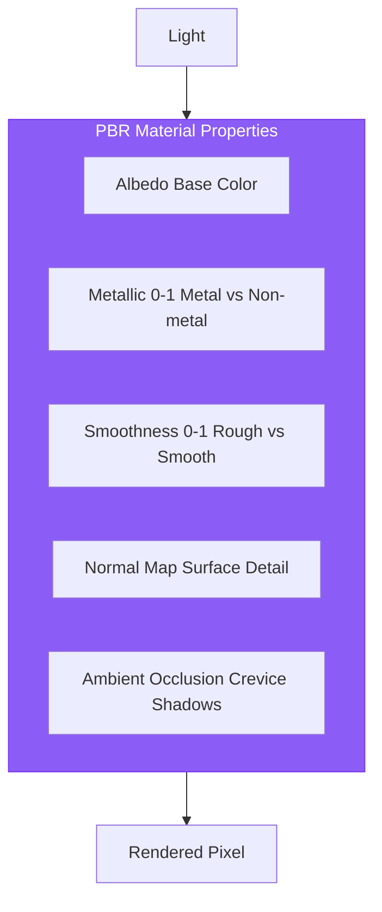
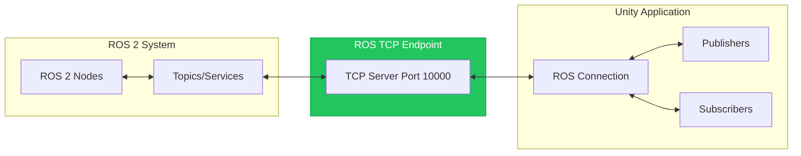

# Chapter 8: Unity for Visualization and Interaction

## Learning Objectives

By the end of this chapter, you will be able to:

- Import robot models into Unity and configure materials
- Create realistic lighting and rendering for robot visualization
- Build interactive scenes for human-robot interaction research
- Implement basic UI controls for robot manipulation
- Understand Unity-ROS integration patterns (overview for future reference)
- Design demonstration environments for stakeholder presentations

## Prerequisites

- Completed Chapters 5-7 (Digital Twin fundamentals and Gazebo)
- Unity 2022 LTS installed
- Basic familiarity with 3D graphics concepts

---

## 8.1 Unity for Robotics: When and Why

**Unity** is a powerful game engine that has found increasing use in robotics for visualization, synthetic data generation, and human-robot interaction studies.

### Unity vs. Gazebo: Complementary Roles



### When to Choose Unity

| Use Case | Why Unity | Alternative |
|----------|-----------|-------------|
| **Stakeholder demos** | Photorealistic visuals impress | Gazebo (functional) |
| **Synthetic data** | Render variety, domain randomization | Gazebo (limited) |
| **VR/AR experiences** | Native XR support | WebXR (limited) |
| **User studies** | Interactive UI, easy to modify | Custom apps |
| **Training environments** | GPU-accelerated, ML-Agents | Isaac Sim |

### When NOT to Use Unity

- **Physics-critical testing**: Use Gazebo or Isaac Sim
- **Sensor algorithm development**: Use Gazebo (more accurate models)
- **ROS 2 integration testing**: Use Gazebo (native support)
- **Reproducible experiments**: Use Gazebo (deterministic)

---

## 8.2 Importing Robot Models

Unity can import robot models from various formats. The most common workflow is URDF → Unity.

### URDF Importer Options



### Using Unity URDF Importer

1. **Install the Package**

```
Window → Package Manager → + → Add package from git URL
https://github.com/Unity-Technologies/URDF-Importer.git
```

2. **Import URDF**

```
Assets → Import Robot from URDF → Select humanoid.urdf
```

3. **Configure Import Settings**

```csharp
// Import settings (configured in GUI)
// - Mesh Decomposer: VHACD (for convex colliders)
// - Axis Type: Z-up to Y-up conversion
// - Create collision meshes: true
// - Use gravity: true (for physics testing)
```

### Manual Model Import

For finer control, export meshes from your CAD tool:

```
1. Export each link as .fbx or .obj
2. Import into Unity: Assets → Import New Asset
3. Create hierarchy matching URDF structure
4. Add ArticulationBody components for physics
5. Configure joints manually
```

### Fixing Common Import Issues

| Issue | Cause | Solution |
|-------|-------|----------|
| Model too small | Unit mismatch | Scale by 1000 (mm to m) |
| Upside down | Axis convention | Rotate X by -90° |
| Missing textures | Path not found | Re-link in Materials |
| Joints not working | Missing colliders | Add colliders to all links |

---

## 8.3 Materials and Rendering

Unity's strength is visual quality. Properly configured materials transform functional models into impressive visualizations.

### Physically Based Rendering (PBR)

Unity uses PBR materials for realistic appearance:



### Creating Robot Materials

```csharp
// C# script to configure materials programmatically
using UnityEngine;

public class RobotMaterialSetup : MonoBehaviour
{
    public void SetupMetalParts()
    {
        // Find all metal parts (by naming convention)
        var metalParts = GetComponentsInChildren<Renderer>()
            .Where(r => r.name.Contains("metal") || r.name.Contains("joint"));

        foreach (var renderer in metalParts)
        {
            Material mat = new Material(Shader.Find("Standard"));

            // Brushed aluminum appearance
            mat.color = new Color(0.8f, 0.8f, 0.85f);
            mat.SetFloat("_Metallic", 0.9f);
            mat.SetFloat("_Glossiness", 0.6f);

            renderer.material = mat;
        }
    }

    public void SetupPlasticParts()
    {
        var plasticParts = GetComponentsInChildren<Renderer>()
            .Where(r => r.name.Contains("cover") || r.name.Contains("shell"));

        foreach (var renderer in plasticParts)
        {
            Material mat = new Material(Shader.Find("Standard"));

            // White plastic appearance
            mat.color = Color.white;
            mat.SetFloat("_Metallic", 0.0f);
            mat.SetFloat("_Glossiness", 0.7f);

            renderer.material = mat;
        }
    }
}
```

### Lighting Setup for Robotics

Professional visualization lighting typically uses a three-point setup:

```
Scene Hierarchy:
├── Lights
│   ├── Key Light (Directional, intensity 1.0, soft shadows)
│   ├── Fill Light (Directional, intensity 0.3, no shadows)
│   ├── Rim Light (Directional, intensity 0.5, from behind)
│   └── Ambient (Skybox or gradient)
```

**Unity Lighting Settings:**
```
Window → Rendering → Lighting
- Environment Lighting: Skybox
- Ambient Mode: Baked
- Realtime Global Illumination: Off (for performance)
- Baked Global Illumination: On (for quality)
```

### Post-Processing Effects

Add cinematic quality with post-processing:

1. **Install Post Processing Package**
```
Package Manager → Post Processing
```

2. **Add Post Process Volume**
```csharp
// Recommended effects for robot visualization
// - Ambient Occlusion: Subtle depth
// - Bloom: Highlight reflections
// - Color Grading: Professional color
// - Anti-aliasing: Smooth edges
// - Depth of Field: Focus attention (optional)
```

---

## 8.4 Building Interactive Scenes

Unity excels at creating interactive experiences for demonstrations and user studies.

### Camera Controller

```csharp
// File: Scripts/OrbitCamera.cs
using UnityEngine;

/// <summary>
/// Orbit camera controller for robot inspection.
/// Supports orbit, pan, and zoom with mouse/touch.
/// </summary>
public class OrbitCamera : MonoBehaviour
{
    [Header("Target")]
    public Transform target;
    public Vector3 targetOffset = Vector3.up * 0.5f;

    [Header("Orbit Settings")]
    public float orbitSpeed = 5f;
    public float minVerticalAngle = -20f;
    public float maxVerticalAngle = 80f;

    [Header("Zoom Settings")]
    public float zoomSpeed = 2f;
    public float minDistance = 1f;
    public float maxDistance = 10f;

    [Header("Pan Settings")]
    public float panSpeed = 0.5f;

    // State
    private float distance = 3f;
    private float horizontalAngle = 0f;
    private float verticalAngle = 30f;
    private Vector3 panOffset = Vector3.zero;

    void Update()
    {
        HandleInput();
        UpdateCameraPosition();
    }

    void HandleInput()
    {
        // Orbit (Left mouse or single touch drag)
        if (Input.GetMouseButton(0) && !Input.GetKey(KeyCode.LeftShift))
        {
            horizontalAngle += Input.GetAxis("Mouse X") * orbitSpeed;
            verticalAngle -= Input.GetAxis("Mouse Y") * orbitSpeed;
            verticalAngle = Mathf.Clamp(verticalAngle, minVerticalAngle, maxVerticalAngle);
        }

        // Pan (Middle mouse or Shift + Left mouse)
        if (Input.GetMouseButton(2) ||
            (Input.GetMouseButton(0) && Input.GetKey(KeyCode.LeftShift)))
        {
            panOffset -= transform.right * Input.GetAxis("Mouse X") * panSpeed;
            panOffset -= transform.up * Input.GetAxis("Mouse Y") * panSpeed;
        }

        // Zoom (Scroll wheel or pinch)
        float scroll = Input.GetAxis("Mouse ScrollWheel");
        if (Mathf.Abs(scroll) > 0.01f)
        {
            distance -= scroll * zoomSpeed * distance;
            distance = Mathf.Clamp(distance, minDistance, maxDistance);
        }

        // Reset view (R key)
        if (Input.GetKeyDown(KeyCode.R))
        {
            ResetView();
        }
    }

    void UpdateCameraPosition()
    {
        if (target == null) return;

        // Calculate orbit position
        Quaternion rotation = Quaternion.Euler(verticalAngle, horizontalAngle, 0);
        Vector3 position = target.position + targetOffset + panOffset;
        position += rotation * (Vector3.back * distance);

        transform.position = position;
        transform.LookAt(target.position + targetOffset + panOffset);
    }

    public void ResetView()
    {
        horizontalAngle = 0f;
        verticalAngle = 30f;
        distance = 3f;
        panOffset = Vector3.zero;
    }

    public void FocusOnTarget(Transform newTarget)
    {
        target = newTarget;
        ResetView();
    }
}
```

### Joint Control UI

```csharp
// File: Scripts/JointControlPanel.cs
using UnityEngine;
using UnityEngine.UI;
using System.Collections.Generic;

/// <summary>
/// UI panel for controlling robot joints via sliders.
/// </summary>
public class JointControlPanel : MonoBehaviour
{
    [Header("References")]
    public Transform robotRoot;
    public GameObject sliderPrefab;
    public Transform sliderContainer;

    private Dictionary<string, ArticulationBody> joints;
    private Dictionary<string, Slider> sliders;

    void Start()
    {
        joints = new Dictionary<string, ArticulationBody>();
        sliders = new Dictionary<string, Slider>();

        DiscoverJoints();
        CreateSliders();
    }

    void DiscoverJoints()
    {
        // Find all articulation bodies (joints)
        var articulationBodies = robotRoot.GetComponentsInChildren<ArticulationBody>();

        foreach (var ab in articulationBodies)
        {
            // Only include revolute/prismatic joints
            if (ab.jointType == ArticulationJointType.RevoluteJoint ||
                ab.jointType == ArticulationJointType.PrismaticJoint)
            {
                joints[ab.name] = ab;
            }
        }

        Debug.Log($"Discovered {joints.Count} controllable joints");
    }

    void CreateSliders()
    {
        foreach (var kvp in joints)
        {
            string jointName = kvp.Key;
            ArticulationBody ab = kvp.Value;

            // Instantiate slider
            GameObject sliderObj = Instantiate(sliderPrefab, sliderContainer);
            sliderObj.name = $"Slider_{jointName}";

            // Configure slider
            Slider slider = sliderObj.GetComponentInChildren<Slider>();
            Text label = sliderObj.GetComponentInChildren<Text>();

            if (label != null)
                label.text = jointName;

            // Set range based on joint limits
            var drive = ab.xDrive;
            slider.minValue = drive.lowerLimit * Mathf.Rad2Deg;
            slider.maxValue = drive.upperLimit * Mathf.Rad2Deg;
            slider.value = 0;

            // Add listener
            string capturedName = jointName;
            slider.onValueChanged.AddListener((value) => SetJointPosition(capturedName, value));

            sliders[jointName] = slider;
        }
    }

    void SetJointPosition(string jointName, float angleDegrees)
    {
        if (!joints.ContainsKey(jointName)) return;

        ArticulationBody ab = joints[jointName];

        // Set target position
        var drive = ab.xDrive;
        drive.target = angleDegrees * Mathf.Deg2Rad;
        ab.xDrive = drive;
    }

    public void ResetAllJoints()
    {
        foreach (var slider in sliders.Values)
        {
            slider.value = 0;
        }
    }
}
```

### Animation Playback

```csharp
// File: Scripts/RobotAnimator.cs
using UnityEngine;
using System.Collections;
using System.Collections.Generic;

/// <summary>
/// Play predefined animations on robot joints.
/// </summary>
public class RobotAnimator : MonoBehaviour
{
    [System.Serializable]
    public class JointKeyframe
    {
        public string jointName;
        public float angle;
    }

    [System.Serializable]
    public class AnimationFrame
    {
        public float time;
        public List<JointKeyframe> keyframes;
    }

    [System.Serializable]
    public class RobotAnimation
    {
        public string name;
        public List<AnimationFrame> frames;
        public bool loop;
    }

    public List<RobotAnimation> animations;
    private Dictionary<string, ArticulationBody> joints;
    private Coroutine currentAnimation;

    void Start()
    {
        // Cache joint references
        joints = new Dictionary<string, ArticulationBody>();
        foreach (var ab in GetComponentsInChildren<ArticulationBody>())
        {
            joints[ab.name] = ab;
        }
    }

    public void PlayAnimation(string animationName)
    {
        var anim = animations.Find(a => a.name == animationName);
        if (anim == null)
        {
            Debug.LogWarning($"Animation '{animationName}' not found");
            return;
        }

        if (currentAnimation != null)
            StopCoroutine(currentAnimation);

        currentAnimation = StartCoroutine(PlayAnimationCoroutine(anim));
    }

    IEnumerator PlayAnimationCoroutine(RobotAnimation anim)
    {
        do
        {
            for (int i = 0; i < anim.frames.Count - 1; i++)
            {
                var fromFrame = anim.frames[i];
                var toFrame = anim.frames[i + 1];
                float duration = toFrame.time - fromFrame.time;

                float elapsed = 0;
                while (elapsed < duration)
                {
                    float t = elapsed / duration;

                    // Interpolate all joints
                    foreach (var toKf in toFrame.keyframes)
                    {
                        var fromKf = fromFrame.keyframes.Find(k => k.jointName == toKf.jointName);
                        if (fromKf != null && joints.ContainsKey(toKf.jointName))
                        {
                            float angle = Mathf.Lerp(fromKf.angle, toKf.angle, t);
                            SetJointAngle(toKf.jointName, angle);
                        }
                    }

                    elapsed += Time.deltaTime;
                    yield return null;
                }
            }
        } while (anim.loop);

        currentAnimation = null;
    }

    void SetJointAngle(string jointName, float angle)
    {
        if (!joints.ContainsKey(jointName)) return;

        var ab = joints[jointName];
        var drive = ab.xDrive;
        drive.target = angle * Mathf.Deg2Rad;
        ab.xDrive = drive;
    }

    public void StopAnimation()
    {
        if (currentAnimation != null)
        {
            StopCoroutine(currentAnimation);
            currentAnimation = null;
        }
    }
}
```

---

## 8.5 Human-Robot Interaction Scenarios

Unity is ideal for building HRI (Human-Robot Interaction) scenarios.

### Proximity Detection

```csharp
// File: Scripts/ProximityZone.cs
using UnityEngine;
using UnityEngine.Events;

/// <summary>
/// Detects when humans enter robot's proximity zones.
/// </summary>
public class ProximityZone : MonoBehaviour
{
    [Header("Zone Configuration")]
    public float warningRadius = 2.0f;
    public float dangerRadius = 1.0f;
    public Color warningColor = Color.yellow;
    public Color dangerColor = Color.red;

    [Header("Events")]
    public UnityEvent onEnterWarningZone;
    public UnityEvent onEnterDangerZone;
    public UnityEvent onExitAllZones;

    [Header("Visualization")]
    public bool showZones = true;

    private bool inWarningZone = false;
    private bool inDangerZone = false;

    void Update()
    {
        // Check for human (player) position
        // In real scenario, this would come from perception
        GameObject player = GameObject.FindGameObjectWithTag("Player");
        if (player == null) return;

        float distance = Vector3.Distance(transform.position, player.transform.position);

        // Check danger zone
        if (distance < dangerRadius && !inDangerZone)
        {
            inDangerZone = true;
            onEnterDangerZone?.Invoke();
            Debug.Log("DANGER: Human in close proximity!");
        }
        else if (distance >= dangerRadius && inDangerZone)
        {
            inDangerZone = false;
        }

        // Check warning zone
        if (distance < warningRadius && !inWarningZone)
        {
            inWarningZone = true;
            onEnterWarningZone?.Invoke();
            Debug.Log("WARNING: Human approaching");
        }
        else if (distance >= warningRadius && inWarningZone)
        {
            inWarningZone = false;
            if (!inDangerZone)
            {
                onExitAllZones?.Invoke();
            }
        }
    }

    void OnDrawGizmos()
    {
        if (!showZones) return;

        // Warning zone
        Gizmos.color = new Color(warningColor.r, warningColor.g, warningColor.b, 0.2f);
        Gizmos.DrawSphere(transform.position, warningRadius);

        // Danger zone
        Gizmos.color = new Color(dangerColor.r, dangerColor.g, dangerColor.b, 0.3f);
        Gizmos.DrawSphere(transform.position, dangerRadius);
    }
}
```

### Gaze Tracking Simulation

```csharp
// File: Scripts/GazeSimulator.cs
using UnityEngine;

/// <summary>
/// Simulates robot following human gaze.
/// Useful for HRI studies.
/// </summary>
public class GazeSimulator : MonoBehaviour
{
    [Header("References")]
    public Transform robotHead;
    public Transform humanHead;

    [Header("Gaze Parameters")]
    public float trackingSpeed = 2f;
    public float maxYaw = 45f;
    public float maxPitch = 30f;

    [Header("Behavior")]
    public bool enableTracking = true;
    public float attentionDelay = 0.5f;

    private Vector3 targetDirection;
    private float lastGazeTime;

    void Update()
    {
        if (!enableTracking || humanHead == null) return;

        // Calculate direction to human
        Vector3 toHuman = humanHead.position - robotHead.position;
        targetDirection = Vector3.Lerp(targetDirection, toHuman.normalized,
            Time.deltaTime * trackingSpeed);

        // Apply rotation with limits
        Quaternion targetRotation = Quaternion.LookRotation(targetDirection);
        Vector3 euler = targetRotation.eulerAngles;

        // Clamp angles
        euler.y = ClampAngle(euler.y, -maxYaw, maxYaw);
        euler.x = ClampAngle(euler.x, -maxPitch, maxPitch);
        euler.z = 0;

        robotHead.localRotation = Quaternion.Euler(euler);
    }

    float ClampAngle(float angle, float min, float max)
    {
        if (angle > 180) angle -= 360;
        return Mathf.Clamp(angle, min, max);
    }
}
```

---

## 8.6 Unity-ROS Bridge Concepts

While detailed Unity-ROS integration is covered in Module 4, here's an overview.

### ROS-TCP-Connector Architecture



### Setting Up the Bridge

1. **ROS 2 Side**:
```bash
# Install ROS-TCP-Endpoint
sudo apt install ros-jazzy-ros-tcp-endpoint

# Launch endpoint
ros2 run ros_tcp_endpoint default_server_endpoint --ros-args -p ROS_IP:=0.0.0.0
```

2. **Unity Side**:
```
Package Manager → + → Add package from git URL
https://github.com/Unity-Technologies/ROS-TCP-Connector.git?path=/com.unity.robotics.ros-tcp-connector
```

3. **Configure Connection**:
```
Robotics → ROS Settings
- ROS IP Address: 127.0.0.1 (or ROS machine IP)
- ROS Port: 10000
- Protocol: ROS2
```

### Example: Subscribe to Joint States

```csharp
// File: Scripts/JointStateSubscriber.cs
using UnityEngine;
using Unity.Robotics.ROSTCPConnector;
using RosMessageTypes.Sensor;

public class JointStateSubscriber : MonoBehaviour
{
    public string topicName = "/joint_states";

    void Start()
    {
        ROSConnection.GetOrCreateInstance().Subscribe<JointStateMsg>(
            topicName, OnJointStateReceived);
    }

    void OnJointStateReceived(JointStateMsg msg)
    {
        // Update robot visualization based on joint states
        for (int i = 0; i < msg.name.Length; i++)
        {
            string jointName = msg.name[i];
            double position = msg.position[i];

            // Apply to Unity model
            UpdateJoint(jointName, (float)position);
        }
    }

    void UpdateJoint(string name, float position)
    {
        // Implementation depends on your robot setup
        Debug.Log($"Joint {name}: {position}");
    }
}
```

---

## 8.7 Creating Demonstration Environments

Build impressive demo scenes for stakeholders.

### Showroom Scene Setup

```
Scene Hierarchy:
├── Environment
│   ├── Floor (reflective material)
│   ├── Backdrop (gradient or image)
│   ├── Props (furniture, equipment)
│   └── Boundary (invisible colliders)
├── Lighting
│   ├── Key Light
│   ├── Fill Lights
│   └── Accent Lights
├── Robot
│   ├── Humanoid Model
│   └── Proximity Zones
├── Cameras
│   ├── Main Camera (orbit)
│   ├── Detail Camera (fixed)
│   └── Overview Camera (wide)
├── UI
│   ├── Info Panel
│   ├── Control Panel
│   └── Camera Switcher
└── Audio
    ├── Ambient Sound
    └── Robot Sounds
```

### Building the Demo Scene

```csharp
// File: Scripts/DemoSceneManager.cs
using UnityEngine;
using UnityEngine.UI;

public class DemoSceneManager : MonoBehaviour
{
    [Header("Cameras")]
    public Camera[] cameras;
    public string[] cameraNames;
    private int currentCameraIndex = 0;

    [Header("UI")]
    public Text cameraNameText;
    public Text robotInfoText;

    [Header("Robot")]
    public RobotAnimator robotAnimator;
    public JointControlPanel jointPanel;

    [Header("Demo Sequences")]
    public string[] demoAnimations;
    private int currentDemoIndex = 0;

    void Start()
    {
        // Initialize
        SetActiveCamera(0);
        UpdateUI();
    }

    void Update()
    {
        // Camera switching (1-9 keys)
        for (int i = 0; i < Mathf.Min(9, cameras.Length); i++)
        {
            if (Input.GetKeyDown(KeyCode.Alpha1 + i))
            {
                SetActiveCamera(i);
            }
        }

        // Demo sequence (Space to advance)
        if (Input.GetKeyDown(KeyCode.Space))
        {
            PlayNextDemo();
        }

        // Toggle UI (H key)
        if (Input.GetKeyDown(KeyCode.H))
        {
            ToggleUI();
        }
    }

    void SetActiveCamera(int index)
    {
        if (index < 0 || index >= cameras.Length) return;

        for (int i = 0; i < cameras.Length; i++)
        {
            cameras[i].gameObject.SetActive(i == index);
        }

        currentCameraIndex = index;
        UpdateUI();
    }

    void PlayNextDemo()
    {
        if (demoAnimations.Length == 0) return;

        robotAnimator.PlayAnimation(demoAnimations[currentDemoIndex]);
        currentDemoIndex = (currentDemoIndex + 1) % demoAnimations.Length;
        UpdateUI();
    }

    void UpdateUI()
    {
        if (cameraNameText != null && currentCameraIndex < cameraNames.Length)
        {
            cameraNameText.text = $"Camera: {cameraNames[currentCameraIndex]}";
        }

        if (robotInfoText != null)
        {
            robotInfoText.text = $"Demo: {currentDemoIndex + 1}/{demoAnimations.Length}";
        }
    }

    void ToggleUI()
    {
        // Toggle all UI canvas visibility
        Canvas[] canvases = FindObjectsOfType<Canvas>();
        foreach (var canvas in canvases)
        {
            canvas.enabled = !canvas.enabled;
        }
    }
}
```

---

## 8.8 Hands-on: Building a Humanoid Visualization Demo

Let's create a complete demonstration scene.

### Step 1: Create Unity Project

```
1. Open Unity Hub
2. New Project → 3D (URP) → "HumanoidDemo"
3. Install packages:
   - URDF Importer
   - Post Processing
   - TextMeshPro
```

### Step 2: Import Robot

```
1. Assets → Import Robot from URDF
2. Select humanoid.urdf from Module 1
3. Configure:
   - Axis Type: Z Up
   - Mesh Decomposer: VHACD
4. Click Import
```

### Step 3: Create Environment

```
1. Create floor:
   - GameObject → 3D Object → Plane
   - Scale: (10, 1, 10)
   - Apply reflective material

2. Create backdrop:
   - GameObject → 3D Object → Quad
   - Position behind robot
   - Apply gradient material

3. Add lighting:
   - Key light: Intensity 1.0, soft shadows
   - Fill light: Intensity 0.3, no shadows
   - Add Reflection Probe for metal materials
```

### Step 4: Add Interactivity

```
1. Attach OrbitCamera script to Main Camera
2. Set robot as camera target
3. Create UI Canvas with:
   - Info panel (robot name, status)
   - Camera buttons
   - Animation buttons
```

### Step 5: Test and Export

```
1. Enter Play mode
2. Test camera controls (orbit, zoom, pan)
3. Test joint sliders
4. Test animations (if configured)
5. Build: File → Build Settings → Build
```

---

## 8.9 Common Errors and Solutions

### Error: URDF Import Fails

```
NullReferenceException in UrdfRobotExtensions
```

**Solution**: Check URDF validity and mesh paths:
```bash
# Verify URDF before import
check_urdf humanoid.urdf
```

### Error: Robot Falls Through Floor

**Solution**: Ensure all links have colliders and ArticulationBody:
```
1. Select each link in hierarchy
2. Check for Collider component
3. Add if missing: Component → Physics → Box/Mesh Collider
```

### Error: Joints Don't Move

**Solution**: Check ArticulationBody configuration:
```
1. Joint Type must be Revolute or Prismatic
2. X Drive must have non-zero stiffness
3. Damping should be > 0
```

### Error: Materials Look Wrong

**Solution**: Check shader compatibility:
```
1. Edit → Render Pipeline → Universal Render Pipeline
2. Edit → Rendering → Materials → Convert
```

### Error: Performance Issues

**Solution**: Optimize settings:
```
1. Reduce mesh complexity (LODs)
2. Bake lighting instead of realtime
3. Reduce post-processing effects
4. Lower shadow resolution
```

---

## Exercises

### Exercise 8.1: Import Humanoid into Unity (Basic)

**Objective**: Successfully import and display humanoid robot.

**Tasks**:
1. Create new Unity project
2. Install URDF Importer package
3. Import humanoid.urdf
4. Fix any import issues
5. Verify robot displays correctly

**Success Criteria**:
- Robot visible in Scene view
- All joints present in hierarchy
- No console errors

---

### Exercise 8.2: Configure PBR Materials (Basic)

**Objective**: Create realistic materials for robot parts.

**Tasks**:
1. Create materials for:
   - Metal parts (high metallic, medium smoothness)
   - Plastic covers (no metallic, high smoothness)
   - Rubber feet (no metallic, low smoothness)
2. Apply materials to appropriate meshes
3. Configure lighting for best appearance

**Deliverable**: Screenshot of rendered robot.

---

### Exercise 8.3: Add Interactive Camera Controls (Intermediate)

**Objective**: Implement orbit camera for robot inspection.

**Tasks**:
1. Create OrbitCamera script (or use provided)
2. Configure camera parameters
3. Add zoom limits appropriate for robot size
4. Add reset view functionality
5. Test all controls

**Deliverable**: Working demo with smooth camera controls.

---

### Exercise 8.4: Build Demonstration Scene (Advanced)

**Objective**: Create a complete demonstration environment.

**Tasks**:
1. Design showroom environment with:
   - Professional lighting
   - Clean backdrop
   - Info displays
2. Implement:
   - Multiple camera views
   - Joint control panel
   - At least 2 preset animations (wave, bow)
3. Add UI for:
   - Camera switching
   - Animation playback
   - Robot information display
4. Build standalone executable

**Deliverable**: Runnable demo application with documentation.

---

## Summary

In this chapter, you learned:

- **When to use Unity**: Visualization, demos, VR/AR, synthetic data
- **URDF import**: Using Unity URDF Importer package
- **PBR materials**: Creating realistic robot appearance
- **Interactive scenes**: Camera controls, UI panels, animations
- **HRI scenarios**: Proximity zones, gaze tracking
- **Unity-ROS bridge**: Overview of ROS-TCP-Connector
- **Demo environments**: Building professional presentations

### Key Takeaways

1. **Unity complements Gazebo**—use both for complete robotics development
2. **Visual quality matters** for stakeholder communication
3. **Interactive demos** help communicate robot capabilities
4. **Unity-ROS integration** enables live robot visualization
5. **Plan for performance** when building complex scenes

### What's Next

This completes **Module 2: The Digital Twin**. You've learned to:
- Understand digital twin concepts and simulation-first development
- Simulate physics accurately in Gazebo
- Configure realistic sensors (LiDAR, cameras, IMU)
- Create impressive visualizations in Unity

In **Module 3: NVIDIA Isaac**, you'll take simulation to the next level with GPU-accelerated physics, domain randomization for ML training, and advanced perception pipelines.

---

## Further Reading

- [Unity Robotics Hub](https://github.com/Unity-Technologies/Unity-Robotics-Hub)
- [Unity URDF Importer](https://github.com/Unity-Technologies/URDF-Importer)
- [ROS-TCP-Connector Documentation](https://github.com/Unity-Technologies/ROS-TCP-Connector)
- [Unity Manual: Universal Render Pipeline](https://docs.unity3d.com/Packages/com.unity.render-pipelines.universal@latest)
- Murphy, R.R. (2019). "Introduction to AI Robotics" - Chapter on Human-Robot Interaction
