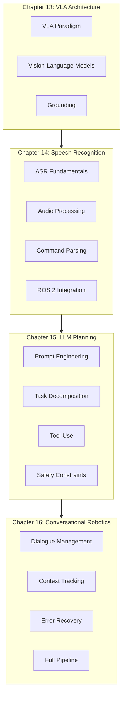
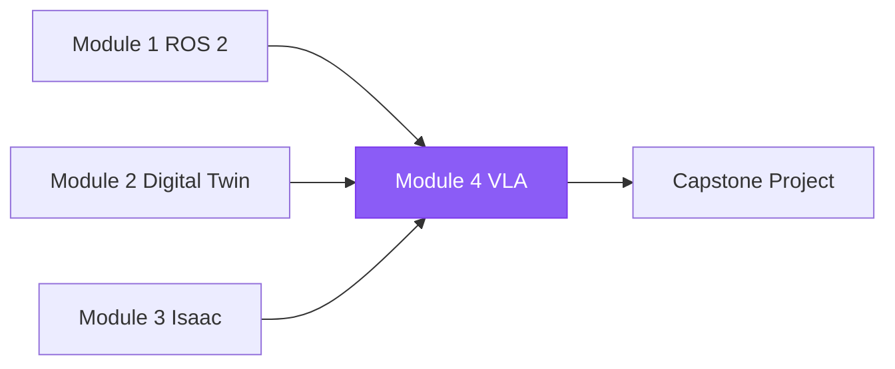

# Module 4: The Intelligent Interface (VLA Systems)

Welcome to Module 4 of the Physical AI & Humanoid Robotics curriculum. This module teaches you to build robots that understand and respond to natural human communication through Vision-Language-Action (VLA) systems.

## Module Overview

By the end of this module, you will be able to:

- Understand VLA architecture and how vision, language, and action integrate
- Implement voice-controlled robot interfaces with speech recognition
- Use LLMs for natural language task planning and command generation
- Build conversational interfaces with context tracking and error recovery
- Create end-to-end pipelines from spoken commands to robot actions

## Prerequisites

Before starting this module, you should have:

- **Completed Modules 1-3**: ROS 2, Digital Twin, and Isaac fundamentals
- **Hardware**: Microphone for speech recognition exercises
- **API Access**: OpenAI/Anthropic API key or local LLM setup
- **Software**: Python 3.10+, ROS 2 Jazzy

## Module Structure

## Chapters

### [Chapter 13: Vision-Language-Action Systems Architecture](./chapter-13-vla-intro)

Introduction to the VLA paradigm that unifies perception, language, and robot control.

**Key Topics:**
- The VLA paradigm and foundation models
- Vision-language models in robotics
- Grounding language in physical reality
- Modular vs. end-to-end architectures

**Time Estimate:** 5-6 hours

---

### [Chapter 14: Voice-to-Action with Speech Recognition](./chapter-14-speech)

Implement voice-controlled robot interfaces with real-time speech recognition.

**Key Topics:**
- Speech recognition fundamentals (ASR)
- Audio capture and processing
- Command parsing and intent recognition
- ROS 2 speech-to-action integration

**Time Estimate:** 5-7 hours

---

### [Chapter 15: LLM-Based Task Planning](./chapter-15-llm-planning)

Leverage large language models for natural language robot task planning.

**Key Topics:**
- Prompt engineering for robotics
- Task decomposition strategies
- Tool use and function calling
- Safety constraints and validation

**Time Estimate:** 5-7 hours

---

### [Chapter 16: Conversational Robotics](./chapter-16-conversation)

Build conversational interfaces with dialogue management and context tracking.

**Key Topics:**
- Dialogue management fundamentals
- Context tracking and memory
- Reference resolution
- Error recovery in conversation

**Time Estimate:** 5-7 hours

---

## Connection to Other Modules

## Key Technologies

| Technology | Purpose | Chapter |
|------------|---------|---------|
| **Whisper** | Speech recognition | 14 |
| **GPT-4/Claude** | Task planning | 15 |
| **LangChain** | LLM orchestration | 15, 16 |
| **Vosk** | Offline speech recognition | 14 |
| **ROS 2 Actions** | Robot execution | 13, 14, 15, 16 |
| **Dialogue State** | Context tracking | 16 |

## Assessment

After completing this module, you should be able to:

| Skill | Assessment Criteria |
|-------|---------------------|
| VLA Architecture | Explain components and design VLA pipelines |
| Speech Recognition | Configure ASR and parse voice commands |
| LLM Planning | Design prompts that generate valid robot actions |
| Conversational UI | Build multi-turn dialogue with context |

## Next Steps

After completing Module 4:

1. **Review**: Ensure all VLA components are working
2. **Integrate**: Combine with perception and navigation from Modules 2-3
3. **Proceed**: Begin the Capstone Project for autonomous humanoid system

---

Ready to begin? Start with [Chapter 13: VLA Systems Architecture](./chapter-13-vla-intro)!
